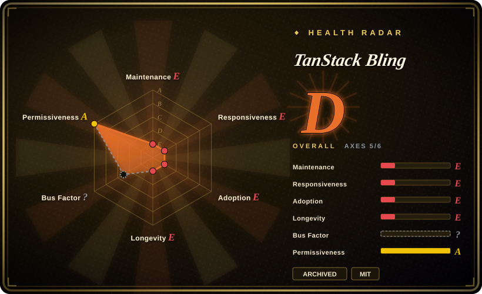
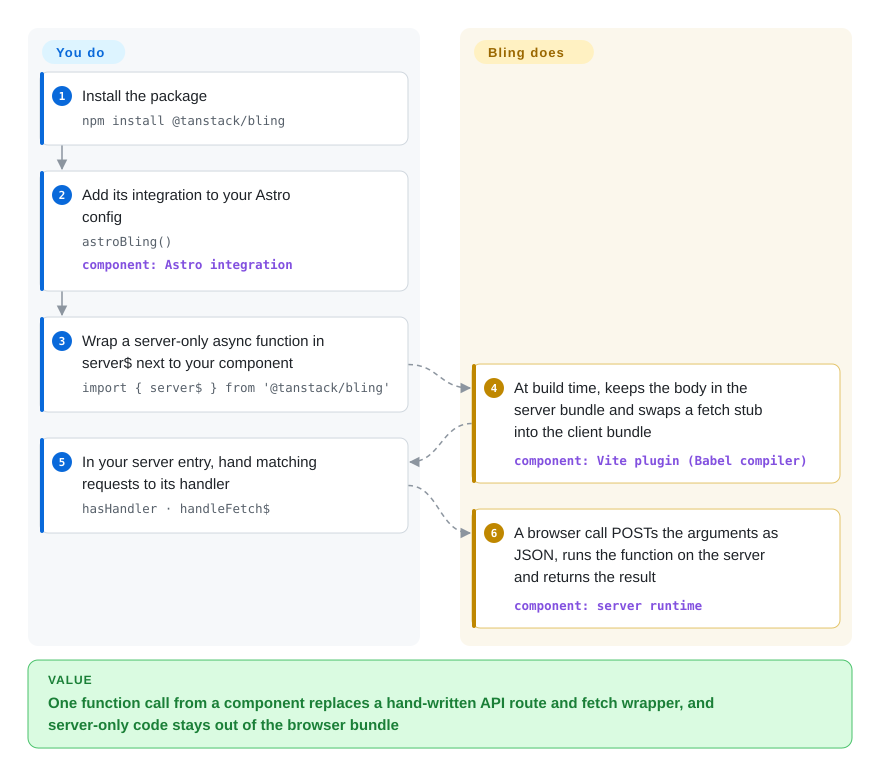

# TanStack Bling

A component that needs one server-only thing — a database read, a secret API key — usually drags in a hand-written API route, a `fetch` wrapper and a guess about whether the key leaked into the browser bundle. Bling was an early Vite compiler plugin that rewrites `server$(fn)` into a server endpoint plus a client-side fetch stub, and strips `secret$(…)` values out of the client build; it was archived after a four-week burst of releases in 2023, so today it is a pattern source, not a dependency.

## When to use

You are building (or studying) a Vite- or Astro-based full-stack setup of your own — no Next.js, no SolidStart — and you want the "server function" ergonomics those frameworks have: write `const getUser = server$(async (id) => db.users.find(id))` next to the component, call `getUser(42)` from a click handler, and never write `app.post('/api/get-user', …)` plus a matching `fetch('/api/get-user', { method: 'POST', body: JSON.stringify({ id: 42 }) })` by hand. You also want the build to guarantee that `process.env.STRIPE_KEY` never appears in the shipped JS.

Reach for Bling today only in one of two narrow cases: **you are reading how a framework-agnostic server-function compiler is built** (about 300 lines of server runtime plus Babel transforms, small enough to read in an afternoon), **or you are maintaining an existing 2023-era codebase that already depends on `@tanstack/bling` 0.5.0** and need to understand what it does before migrating off. Against the maintained substitutes the deciding tradeoff is that Bling is framework- and router-agnostic (you bring your own server entry and UI library) but frozen: the same idea now ships, maintained, as `createServerFn` in TanStack Start (inside the [TanStack Router](tanstack-router.md) repo), as `"use server"` in SolidStart, and as Server Actions in [Next.js](nextjs.md).

## How it works

Bling is a build-time source rewriter ("transpilation" — your code is rewritten before it is bundled), shipped as a Vite plugin plus an Astro integration that registers that plugin. Vite builds your app twice, once for the server and once for the browser, and Bling edits each copy differently. In the server copy, the function you wrapped in `server$` stays intact and is registered under a generated URL such as `/_m/<hash>/<name>`; in the browser copy the function body is cut out and replaced with a stub that POSTs the arguments as JSON to that URL. `secret$(value)` becomes `undefined` in the browser copy, files named `*.secret$.*` export `undefined` for every name on the client, and `import$(…)` moves an inline expression into its own lazily loaded chunk. Think of a mail room: your function stays in the back office, and the front desk only gets a pre-addressed envelope. What Bling does *not* do is run a server — you install the plugin, and in your own server entry you check each request with `hasHandler(...)` and pass matching ones to `handleFetch$(...)`; routing, rendering, deployment and security headers stay yours.

<!-- flow-steps:begin (generated from flows/tanstack-bling.json by tools/flow_card.py — do not edit) -->

Text version of the flow

1. **You**: Install the package — `npm install @tanstack/bling`
2. **You**: Add its integration to your Astro config — `astroBling()` — component: `Astro integration`
3. **You**: Wrap a server-only async function in server$ next to your component — `import { server$ } from '@tanstack/bling'`
4. **TanStack Bling**: At build time, keeps the body in the server bundle and swaps a fetch stub into the client bundle — component: `Vite plugin (Babel compiler)`
5. **You**: In your server entry, hand matching requests to its handler — `hasHandler · handleFetch$`
6. **TanStack Bling**: A browser call POSTs the arguments as JSON, runs the function on the server and returns the result — component: `server runtime`

**Value**: One function call from a component replaces a hand-written API route and fetch wrapper, and server-only code stays out of the browser bundle

<!-- flow-steps:end -->

## When NOT to use

- **Any new project that will ship to production.** The repo is archived, the last default-branch commit is `release: 0.5.0` on 2023-03-18, and PRs opened since (#13 GET-method fix, #15 compile-detection fix) were never merged. Pick TanStack Start's `createServerFn` (maintained in the [TanStack Router](tanstack-router.md) repo), SolidStart's `"use server"`, or [Next.js](nextjs.md) Server Actions — they deliver the same call-a-server-function-from-a-component experience with active fixes.
- **Arguments or results that are not plain JSON.** The wire format defaults to `JSON.stringify`/`JSON.parse`; `addSerializer`/`addDeserializer` hooks exist in the source but are undocumented. Issue #9 (open since 2023-03-08) shows the sharper problem: during server rendering the function is called directly, so a `Date` stays a `Date`, while the same call from the browser crosses JSON and arrives as a string — code that works in SSR crashes on click. If `Date`/`Map`/`Set` must survive the wire, use tRPC with its superjson data transformer, or SolidStart (which depends on the `seroval` serializer).
- **Endpoints that must resist cross-site requests.** Reading `packages/bling/src/server.ts`, the handler dispatches any request whose path matches a registered function; the only header it inspects is an internal client/server marker, not an origin or CSRF check. TanStack Start's server-function docs install a `createCsrfMiddleware()` by default — pick it, or add your own origin check before `handleFetch$` if you keep Bling.
- **Build pipelines other than Vite (or Astro on Vite).** The package exports only `server`, `client`, `vite`, `astro` and raw `compilers`; there is no webpack/Rspack/Next integration. Use Telefunc (examples for Next.js, SvelteKit, Vike, Cloudflare Workers) or tRPC (bundler-agnostic, no compile step).
- **Current Vite and Astro majors.** Its dependencies pin the early-2023 toolchain (`@vitejs/plugin-react ^3.1.0`, `esbuild ^0.16.17`, a `vite ^4.1.4` workspace, and an Astro dev snapshot `0.0.0-ssr-manifest-20230306183729` in the examples), and the Astro integration hard-codes `src/app/entry-client.tsx` and prints the whole Astro config on every SSR build. Expect to fork it; a maintained framework is cheaper.
- **The "islands", `worker$` or `websocket$` features the README advertises.** The README lists `worker$` under "Proposed APIs … not yet implemented", `websocket$` and `interactive$`/`island$` are bare anchor links with no section, and the source exports only `server$`/`fetch$`, `secret$`, `import$`, `split$` and `lazy$`. For islands, choose [Astro](../site-frameworks/astro.md).

## Comparison

| Alternative | In index | Our verdict | Tradeoff |
|---|---|---|---|
| [TanStack Router](tanstack-router.md) (TanStack Start's `createServerFn`) | ✅ | For a new React or Solid app that wants typed server functions without a hand-written API layer, pick TanStack Start; read Bling only to see the stripped-down idea it grew from. | Start gains maintained serialization, CSRF middleware, `createServerOnlyFn` and import protection; it costs adopting Start's router and build conventions, whereas Bling was router-agnostic. |
| SolidStart | not indexed | On Solid, pick SolidStart's `"use server"` functions over Bling: same co-located server-function model, maintained, with a real serializer. | SolidStart gains an active 2.x release line and `seroval` serialization; it pays by being a whole framework, not a plugin you drop into a custom Vite/Astro setup. Not added in this tab-intake batch. |
| [Next.js](nextjs.md) (Server Actions) | ✅ | When the app is already on React and you accept a server-first framework, pick Next.js Server Actions; Bling is not a reason to avoid it, since Bling itself is frozen. | Next.js gains a huge user base and platform integration; it pays with App Router/RSC complexity and Vercel's roadmap influence, where Bling only touched one function at a time. |
| tRPC | not indexed | When you need type-safe client/server calls on any bundler, or `Date`/`Map` values across the wire, pick tRPC; choose the Bling-style compiler model only if co-locating the function in the component file matters more. | tRPC gains no build-step magic, explicit routers and superjson transformers; it pays with a separate router definition instead of a one-line `server$` wrapper. Not added in this tab-intake batch. |
| Telefunc | not indexed | When you want Bling's "just call the remote function" feel on Next.js, SvelteKit or Vike and a maintained codebase, pick Telefunc's `*.telefunc.ts` files. | Telefunc gains active releases and cross-framework examples; it pays with a file-convention boundary (functions live in `.telefunc.ts` files) rather than inline wrappers, and a smaller user base than tRPC. Not added in this tab-intake batch. |

## Tech stack

- **Language:** TypeScript, pnpm workspace with one published package (`packages/bling`) and six Astro examples (React and Solid flavours: basic, router, TodoMVC, Hacker News).
- **Compiler:** Babel (`@babel/traverse`, `@babel/template`, `@babel/generator`, `@babel/types`) rewrites `server$`, `secret$`, `import$`/`split$` call sites; the Vite plugin runs these through `@vitejs/plugin-react`'s transform with fast refresh disabled.
- **Runtime:** `server.ts` keeps a registry of handlers keyed by URL path and answers standard `Request`/`Response` objects; `client.ts` is the fetch stub side. Each entry is bundled with esbuild.
- **Integrations:** `@tanstack/bling/vite` (`bling()`), `@tanstack/bling/astro` (`astroBling()`); nothing else.

## Dependencies

- **Vite 4-era toolchain** — the plugin depends on `@vitejs/plugin-react ^3.1.0` and `esbuild ^0.16.17`; the examples run on an Astro SSR-manifest dev snapshot rather than a stable Astro release.
- **A server you write** — Bling registers handlers but serves nothing; your server entry must call `hasHandler`/`handleFetch$` (the examples use `@astrojs/node` in standalone mode).
- **A Web `fetch`/`Request`/`Response` runtime** on both sides.
- No database, no hosted service, no account.

## Ops difficulty

**Low to install, high to live with.** Adding the Astro integration is one line, and there is nothing to deploy beyond your own server. The cost is ownership: the code is archived with no tests (`"test": "exit 0"` in the root `package.json`, no test files in the tree), its dependency floor is 2023, and known bugs (SSR-vs-browser serialization mismatch, the compile-detection expression that PR #15 tried to fix) are yours to patch. Running it in production means maintaining a private fork.

## Health & viability

- **Maintenance — archived, effectively frozen since March 2023 (checked 2026-09-28).** GitHub marks the repo archived; the default branch ends at `release: 0.5.0` (2023-03-18) and npm's latest is 0.5.0 (2023-03-19). The API's `pushed_at` of 2024-06-14 coincides with PR #15 being opened, not with a merge [推断: `pushed_at` also moves on PR ref pushes; no default-branch commit after 2023-03-18 exists].
- **Governance / bus factor — two people.** Contributions: `tannerlinsley` 74, `nksaraf` 27, three drive-by contributors with 1–2 each; `package.json` names Nikhil Saraf as author. `CONTRIBUTING.md` is four lines. The TanStack org owns the repo but put no maintenance behind it after the burst.
- **Age / Lindy — fails the prior.** Created 2023-02-21, active for about four weeks (v0.1.1 on 2023-02-24 to v0.5.0 on 2023-03-19), then stopped. Young *and* abandoned: the Lindy prior gives it nothing.
- **Adoption — brand-driven stars, tiny usage.** ~1.5k stars against 1,374 npm downloads for 2026-08-29..2026-09-27 (224 in the last week); the star count reflects the TanStack name and the 2023 announcement, not current use.
- **Risk flags — no license risk, real security and correctness gaps.** MIT, no relicense. No CSRF/origin check in the handler, the SSR-vs-browser serialization mismatch open since 2023, README documents a file pattern (`.secret.` / `.server$.`) that disagrees with the compiler's actual check (`.secret$.`). The ideas continued elsewhere: TanStack Start ships `createServerFn`, `createServerOnlyFn` and `*.server.*` import protection, and co-author Nikhil Saraf went on to publish Vinxi [推断: lineage read from authorship and API similarity, not from a stated migration notice].

## Caveats (unverified)

- `[未验证]` **Archive date** — GitHub's API reports `archived: true` but not when the repo was archived; the page only knows that no default-branch commit exists after 2023-03-18.
- `[推断]` **`pushed_at` 2024-06-14 reflects PR #15**, not maintainer activity — inferred from the matching PR creation timestamp.
- `[推断]` **Lineage to TanStack Start and Vinxi** — based on shared author (Nikhil Saraf is Bling's `package.json` author and the owner of `nksaraf/vinxi`) and similar APIs; no upstream note says "Bling became X".
- `[未验证]` **Incompatibility with current Vite/Astro majors** — inferred from pinned 2023 dependencies; not tested by building an example on a current toolchain.
- `[未验证]` **Cross-site exploitability** — the missing origin/CSRF check was read from `server.ts`; no exploit was attempted, and a deployment behind its own origin-checking middleware would not be exposed.
- `[未验证]` **npm download counts** include CI and mirror installs; they bound usage from above.
