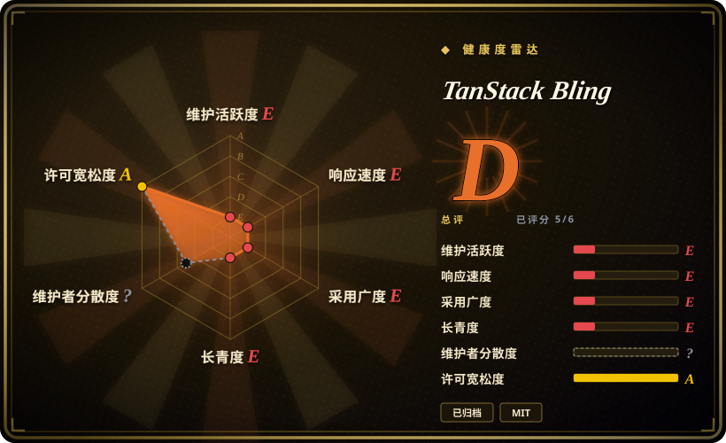
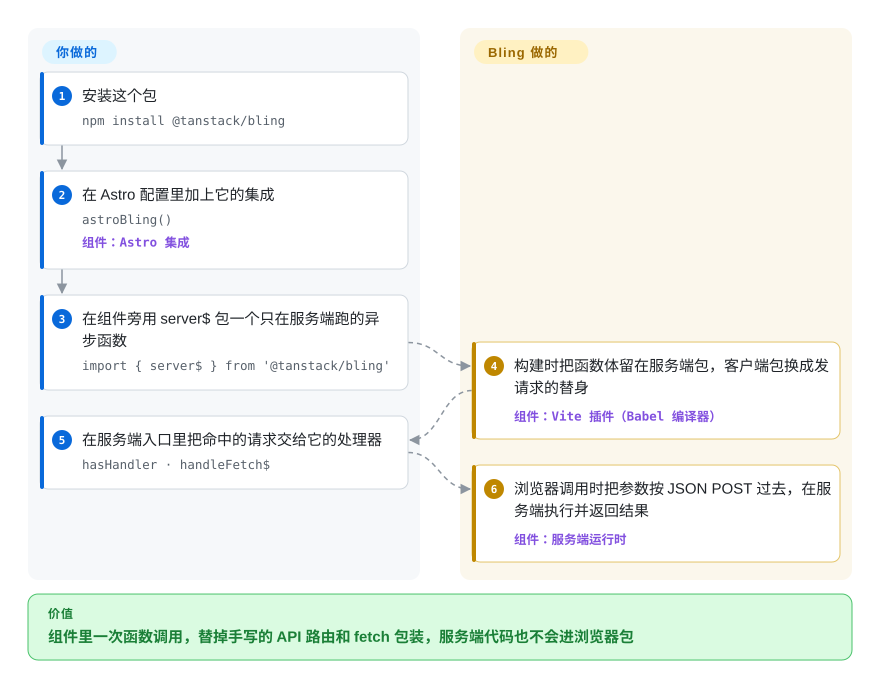

# TanStack Bling

组件里只要碰一件“只能在服务端做”的事——查一次数据库、用一把密钥——你就得手写一个 API 路由、再写一个 `fetch` 包装，还要提心吊胆那把密钥有没有被打进浏览器的包里。Bling 是 2023 年的一个 Vite 编译插件：它在构建时把 `server$(fn)` 改写成“服务端一个接口＋浏览器端一个发请求的替身”，并把 `secret$(…)` 的值从浏览器包里删掉；它只活跃了四周就归档了，今天只适合当设计参考，不适合当依赖。

## 何时使用

你在自己拼一套基于 Vite 或 Astro 的全栈方案——不用 Next.js，也不用 SolidStart——却想要那些框架里“服务端函数”的手感：在组件旁边写 `const getUser = server$(async (id) => db.users.find(id))`，在点击事件里直接 `getUser(42)`，再也不用手写 `app.post('/api/get-user', …)` 和一段对应的 `fetch('/api/get-user', { method: 'POST', body: JSON.stringify({ id: 42 }) })`。你还希望构建流程保证 `process.env.STRIPE_KEY` 永远不会出现在发出去的 JS 里。

今天只有两种窄场景值得碰 Bling：**你想读懂一个与框架无关的“服务端函数编译器”是怎么做出来的**（服务端运行时约 300 行，外加几段 Babel 改写，一个下午读得完）；**或者你在维护一个 2023 年的老项目，它已经依赖了 `@tanstack/bling` 0.5.0**，迁走之前得先弄明白它到底做了什么。和仍在维护的替代品相比，决定性的取舍是：Bling 与框架、路由都无关（服务端入口和 UI 库都由你自己带），但它已经冻结。同样的想法如今有人在维护：TanStack Start 的 `createServerFn`（在 [TanStack Router](tanstack-router.zh.md) 仓库里）、SolidStart 的 `"use server"`、[Next.js](nextjs.zh.md) 的 Server Actions。

## 怎么用起来

Bling 是一个构建期的源码改写器（“转译”——代码在打包之前先被改写一遍），以 Vite 插件的形式发布，另附一个替你注册该插件的 Astro 集成。Vite 会把应用构建两次：一次给服务端，一次给浏览器；Bling 对两份副本做不同的修改。服务端那份里，你用 `server$` 包起来的函数原样保留，并登记到一个生成的 URL 上，比如 `/_m/<hash>/<name>`；浏览器那份里，函数体被整个挖掉，换成一个把参数序列化成 JSON、POST 到那个 URL 的替身。`secret$(value)` 在浏览器那份里变成 `undefined`；文件名带 `*.secret$.*` 的文件，在客户端导出的每个名字都是 `undefined`；`import$(…)` 则把一段内联表达式拆成单独按需加载的代码块。可以把它想成收发室：函数本人留在后台办公室，前台只拿到一个写好地址的信封。Bling **不**替你跑服务器——你装好插件后，要在自己的服务端入口里用 `hasHandler(...)` 检查每个请求，命中的交给 `handleFetch$(...)`；路由、渲染、部署和安全响应头仍然是你的事。

<!-- flow-steps:begin (generated from flows/tanstack-bling.json by tools/flow_card.py — do not edit) -->

流程文字版

1. **你**：安装这个包 — `npm install @tanstack/bling`
2. **你**：在 Astro 配置里加上它的集成 — `astroBling()` — 组件：`Astro 集成`
3. **你**：在组件旁用 server$ 包一个只在服务端跑的异步函数 — `import { server$ } from '@tanstack/bling'`
4. **TanStack Bling**：构建时把函数体留在服务端包，客户端包换成发请求的替身 — 组件：`Vite 插件（Babel 编译器）`
5. **你**：在服务端入口里把命中的请求交给它的处理器 — `hasHandler · handleFetch$`
6. **TanStack Bling**：浏览器调用时把参数按 JSON POST 过去，在服务端执行并返回结果 — 组件：`服务端运行时`

**价值**：组件里一次函数调用，替掉手写的 API 路由和 fetch 包装，服务端代码也不会进浏览器包

<!-- flow-steps:end -->

## 何时不用

- **任何要上生产的新项目。** 仓库已归档，默认分支最后一次提交是 2023-03-18 的 `release: 0.5.0`，之后提的 PR（#13 修 GET 方法、#15 修“是否需要编译”的判断）都没有合并。选 TanStack Start 的 `createServerFn`（在 [TanStack Router](tanstack-router.zh.md) 仓库里维护）、SolidStart 的 `"use server"`，或 [Next.js](nextjs.zh.md) 的 Server Actions——它们提供同样“在组件里直接调服务端函数”的体验，而且有人修 bug。
- **参数或返回值不是纯 JSON。** 线上格式默认是 `JSON.stringify`/`JSON.parse`；源码里有 `addSerializer`/`addDeserializer` 钩子，但文档没写。更要命的是 issue #9（2023-03-08 开到现在）：服务端渲染时函数是被直接调用的，`Date` 还是 `Date`；同一个调用从浏览器发起时要过一遍 JSON，到服务端就成了字符串——SSR 时好好的代码，一点按钮就崩。如果 `Date`/`Map`/`Set` 必须完整过网，选带 superjson 数据转换器的 tRPC，或者 SolidStart（它依赖 `seroval` 序列化库）。
- **接口必须防跨站请求。** 读 `packages/bling/src/server.ts` 可见，处理器只要路径命中已登记的函数就执行；它检查的唯一请求头是内部用来区分客户端／服务端的标记，不是来源校验，也不是 CSRF 校验。TanStack Start 的服务端函数文档默认装上 `createCsrfMiddleware()`——选它；如果坚持用 Bling，就在 `handleFetch$` 之前自己加来源校验。
- **构建工具不是 Vite（或跑在 Vite 上的 Astro）。** 包只导出 `server`、`client`、`vite`、`astro` 和裸的 `compilers`，没有 webpack／Rspack／Next 集成。改用 Telefunc（有 Next.js、SvelteKit、Vike、Cloudflare Workers 示例）或 tRPC（与打包工具无关，也不需要编译步骤）。
- **当前主版本的 Vite 和 Astro。** 依赖钉在 2023 年初的工具链上（`@vitejs/plugin-react ^3.1.0`、`esbuild ^0.16.17`、工作区的 `vite ^4.1.4`，示例用的是 Astro 开发快照 `0.0.0-ssr-manifest-20230306183729`）；Astro 集成还把 `src/app/entry-client.tsx` 写死在代码里，每次 SSR 构建都把整个 Astro 配置打印出来。做好自己 fork 的准备；换一个有人维护的框架更省事。
- **README 宣传的“islands”、`worker$`、`websocket$`。** README 把 `worker$` 列在“Proposed APIs … not yet implemented”下，`websocket$` 和 `interactive$`/`island$` 只是没有对应章节的锚点链接；源码实际导出的只有 `server$`/`fetch$`、`secret$`、`import$`、`split$` 和 `lazy$`。要 islands，选 [Astro](../site-frameworks/astro.zh.md)。

## 横向对比

| 替代品 | 是否收录 | 我们的评价 | 取舍 |
|---|---|---|---|
| [TanStack Router](tanstack-router.zh.md)（TanStack Start 的 `createServerFn`） | ✅ | 新的 React 或 Solid 应用想要带类型的服务端函数、又不想手写 API 层，选 TanStack Start；Bling 只用来看这个想法最初的精简版本。 | Start 得到有人维护的序列化、CSRF 中间件、`createServerOnlyFn` 和导入保护；代价是要接受 Start 的路由与构建约定，而 Bling 与路由无关。 |
| SolidStart | 未收录 | 在 Solid 上，选 SolidStart 的 `"use server"` 函数而不是 Bling：同样是就近写服务端函数，但有人维护，还有真正的序列化库。 | SolidStart 得到活跃的 2.x 版本线和 `seroval` 序列化；代价是它是一整个框架，不是能塞进自建 Vite／Astro 方案的插件。本次 tab-intake 批次未收录。 |
| [Next.js](nextjs.zh.md)（Server Actions） | ✅ | 应用已经在 React 上、也接受服务端优先的框架时，选 Next.js 的 Server Actions；Bling 不构成回避它的理由，因为 Bling 自己已经冻结。 | Next.js 得到庞大的用户群和平台集成；代价是 App Router／RSC 的复杂度和 Vercel 对路线图的影响，而 Bling 一次只动一个函数。 |
| tRPC | 未收录 | 需要在任意打包工具上做类型安全的前后端调用，或者要让 `Date`/`Map` 完整过网时，选 tRPC；只有“函数和组件写在同一个文件里”比这些更重要时，才考虑 Bling 这种编译器模式。 | tRPC 得到零构建魔法、显式路由定义和 superjson 转换器；代价是要单独定义路由，而不是一行 `server$` 包装。本次 tab-intake 批次未收录。 |
| Telefunc | 未收录 | 想在 Next.js、SvelteKit 或 Vike 上获得 Bling 那种“直接调远程函数”的手感、又要有人维护，选 Telefunc 的 `*.telefunc.ts` 文件。 | Telefunc 得到持续发版和跨框架示例；代价是边界靠文件约定（函数必须写在 `.telefunc.ts` 里）而不是内联包装，用户群也比 tRPC 小。本次 tab-intake 批次未收录。 |

## 技术栈

- **语言：** TypeScript，pnpm 工作区，只发布一个包（`packages/bling`），附六个 Astro 示例（React 与 Solid 两种口味：基础版、路由、TodoMVC、Hacker News）。
- **编译器：** 用 Babel（`@babel/traverse`、`@babel/template`、`@babel/generator`、`@babel/types`）改写 `server$`、`secret$`、`import$`/`split$` 的调用点；Vite 插件借用 `@vitejs/plugin-react` 的转换流程执行这些改写，并关闭了快速刷新。
- **运行时：** `server.ts` 维护一张按 URL 路径索引的处理器表，处理标准的 `Request`/`Response` 对象；`client.ts` 是发请求的替身那一侧。各入口都用 esbuild 打包。
- **集成：** `@tanstack/bling/vite`（`bling()`）、`@tanstack/bling/astro`（`astroBling()`），没有别的。

## 依赖

- **Vite 4 时代的工具链**——插件依赖 `@vitejs/plugin-react ^3.1.0` 和 `esbuild ^0.16.17`；示例跑在 Astro 的 SSR-manifest 开发快照上，不是稳定版。
- **一个你自己写的服务端**——Bling 只登记处理器，不负责对外服务；你的服务端入口必须调用 `hasHandler`/`handleFetch$`（示例用的是 standalone 模式的 `@astrojs/node`）。
- **两端都要有 Web 标准的 `fetch`/`Request`/`Response` 运行时。**
- 不需要数据库、托管服务或账号。

## 运维难度

**装上很轻，养着很重。** 加 Astro 集成只要一行，除了你自己的服务端也没有别的要部署。成本在于“归你所有”：代码已归档且没有测试（根 `package.json` 里是 `"test": "exit 0"`，仓库里也没有测试文件），依赖停在 2023 年，已知 bug（SSR 与浏览器调用的序列化不一致、PR #15 想修却没合并的编译判断表达式）只能你自己补。上生产就意味着维护一个私有 fork。

## 健康度与可持续性

- **维护——已归档，自 2023 年 3 月起实际冻结（2026-09-28 核对）。** GitHub 标记仓库已归档；默认分支停在 `release: 0.5.0`（2023-03-18），npm 最新版是 0.5.0（2023-03-19）。API 里 `pushed_at` 为 2024-06-14，与 PR #15 的创建时间吻合，不是合并 [推断：`pushed_at` 也会随 PR 引用推送而变化；2023-03-18 之后默认分支没有任何提交]。
- **治理／巴士系数——两个人。** 贡献数：`tannerlinsley` 74、`nksaraf` 27，另有三位路过的贡献者各 1–2 次；`package.json` 的作者写的是 Nikhil Saraf。`CONTRIBUTING.md` 只有四行。仓库归 TanStack 组织，但那一轮冲刺之后没有人继续维护。
- **年龄／Lindy——不及格。** 2023-02-21 创建，活跃约四周（2023-02-24 的 v0.1.1 到 2023-03-19 的 v0.5.0），然后停了。年轻**且**被弃，Lindy 先验给不了它任何加分。
- **采用度——星标靠品牌，用量很小。** 约 1.5k 星，而 npm 在 2026-08-29 至 2026-09-27 只有 1,374 次下载（最近一周 224 次）；星数反映的是 TanStack 的名气和 2023 年的发布热度，不是当前使用。
- **风险信号——许可证没问题，安全与正确性有真缺口。** MIT，没有改过许可证。处理器没有 CSRF／来源校验；SSR 与浏览器调用的序列化不一致问题从 2023 年开到现在；README 写的文件命名规则（`.secret.` / `.server$.`）和编译器实际检查的（`.secret$.`）对不上。这些想法在别处延续了：TanStack Start 提供 `createServerFn`、`createServerOnlyFn` 和 `*.server.*` 导入保护，合著者 Nikhil Saraf 后来发布了 Vinxi [推断：依据是作者关系与 API 相似度，没有找到上游“Bling 迁移到 X”的声明]。

## 存疑（未验证）

- `[未验证]` **归档日期**——GitHub API 只返回 `archived: true`，不给归档时间；本页只能确认 2023-03-18 之后默认分支没有提交。
- `[推断]` **`pushed_at` 2024-06-14 来自 PR #15**，不是维护者活动——依据是它与该 PR 创建时间一致。
- `[推断]` **与 TanStack Start、Vinxi 的传承关系**——依据是同一作者（Nikhil Saraf 是 Bling `package.json` 的作者，也是 `nksaraf/vinxi` 的所有者）和相似的 API；上游没有“Bling 变成了 X”的说明。
- `[未验证]` **与当前主版本 Vite／Astro 不兼容**——由 2023 年钉死的依赖推断，没有在当前工具链上实际构建示例。
- `[未验证]` **跨站可利用性**——缺少来源／CSRF 校验是读 `server.ts` 得出的；没有做利用尝试，部署在自带来源校验中间件之后的应用不会暴露。
- `[未验证]` **npm 下载量**包含 CI 与镜像安装，只是用量的上限。
