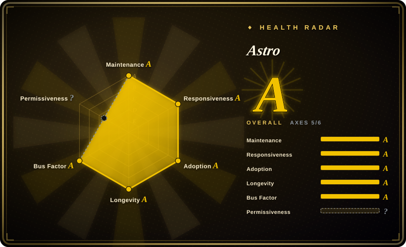
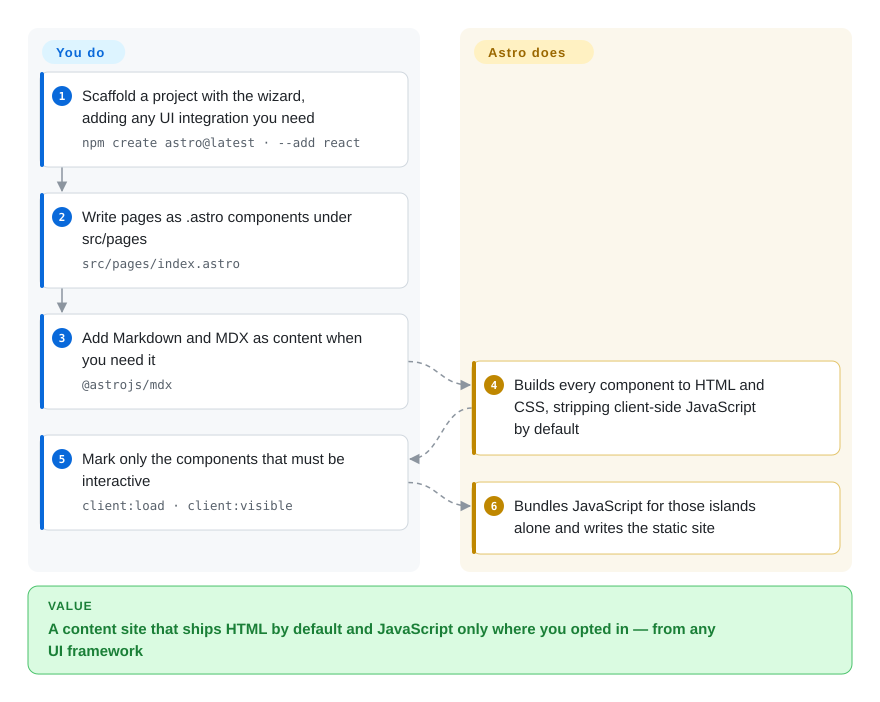

# Astro

A website build tool for content-driven sites: pages are HTML-first `.astro` components, Markdown/MDX joins them as content collections, and interactive components from React, Vue, Svelte, Solid or Preact are hydrated individually as "islands" instead of shipping an app-wide bundle.

## When to use

You are building a site whose value is its content — documentation, a blog, a product site, a marketing site with a long tail of pages — and the obvious options all ask you to ship a JavaScript application to render text. The site needs a handful of interactive pieces (a search box, a carousel, a pricing toggle) and nothing else; the rest is HTML that a CDN should serve instantly.

Reach for Astro when **content-first and JS-minimal are the requirements, and you want to pick a UI framework per component rather than per project**. Its defining mechanism is the island: a component is static HTML by default, and only components you explicitly mark with a `client:*` directive ship JavaScript, each hydrating independently. That is the tradeoff against [Docusaurus](docusaurus.md) and [Nextra](nextra.md) — both hand you a documentation preset or a Next.js integration with the runtime baked in, while Astro gives you a general site framework and a near-empty client bundle, and leaves docs versioning or a docs sidebar for you to add. Choose Astro when the site is broader than docs; choose Docusaurus when the site *is* docs and you want the preset.

## How it works

`npm create astro@latest` runs a wizard that scaffolds a project; the manual path is `npm install astro` plus three scripts — `astro dev`, `astro build`, `astro preview`. **You then write pages as `.astro` components** in `src/pages/`: a file is a page, its top frontmatter runs at build time (never in the browser), and the template below it is HTML with expressions — so a page can loop over data, render Markdown, and stay static. Configuration lives in `astro.config.mjs` (`defineConfig`), which is also where integrations are registered: `npm create astro@latest -- --add react` adds a UI framework, and `@astrojs/mdx` adds MDX as a first-party integration. **Astro does the rest: it builds every component to HTML and CSS, strips all client-side JavaScript by default, and only bundles JavaScript for the components you explicitly opt in with a directive such as `client:load`, `client:idle` or `client:visible`.** `npm run build` writes the static site; `server:defer` is available when a component must render per-request instead.

<!-- flow-steps:begin (generated from flows/astro.json by tools/flow_card.py — do not edit) -->

Text version of the flow

1. **You**: Scaffold a project with the wizard, adding any UI integration you need — `npm create astro@latest · --add react`
2. **You**: Write pages as .astro components under src/pages — `src/pages/index.astro`
3. **You**: Add Markdown and MDX as content when you need it — `@astrojs/mdx`
4. **Astro**: Builds every component to HTML and CSS, stripping client-side JavaScript by default
5. **You**: Mark only the components that must be interactive — `client:load · client:visible`
6. **Astro**: Bundles JavaScript for those islands alone and writes the static site

**Value**: A content site that ships HTML by default and JavaScript only where you opted in — from any UI framework

<!-- flow-steps:end -->

## When NOT to use

- **Your site is a versioned documentation set and you want the versioning, sidebar and i18n to exist already.** Use [Docusaurus](docusaurus.md): Astro can build a docs site, but the docs information architecture is a template you assemble, not a preset you configure.
- **Your team is committed to Next.js and the site must share its runtime, routing and dependencies.** Use [Next.js](nextjs.md) directly — see also [Nextra](nextra.md), which adds a Markdown/MDX layer to it. Astro is a different runtime and framework model, and splitting a Next.js codebase's site away from it has a cost.
- **You want a Vue-shaped, Markdown-first docs tool with the least possible configuration.** VitePress is the natural pick; it is not indexed here, so treat this as a pointer rather than a comparison this atlas has verified.
- **You want the largest theme ecosystem and the fastest builds without a Node toolchain.** Hugo is the mature option; not indexed here either. Astro's advantage is component flexibility, not battery count.
- **You largely need to syndicate Markdown notes, not build a site.** A static-site framework is infrastructure you then maintain; [Quarkdown](../../typesetting/quarkdown.md) or [Asciidoctor](../../typesetting/asciidoctor.md) produce a documentation site from a plain-text source with no JS build in the loop.
- **Your runtime is pinned below Node 22.12.0, or you use an odd-numbered Node release.** Astro's prerequisites state Node `v22.12.0` or higher and explicitly exclude odd-numbered versions such as v23 — check that against your CI image before adopting it.
- **The deliverable is a document rather than a site.** For PDF, print or e-book output, look at [LaTeX](../../typesetting/latex.md), [Typst](../../typesetting/typst.md) or [Quarkdown](../../typesetting/quarkdown.md); Astro's output is a website.

## Comparison

| Alternative | In index | Our verdict | Tradeoff |
|---|---|---|---|
| [Docusaurus](docusaurus.md) | ✅ | Choose Astro when the site is content-driven and documentation is one section of it; choose Docusaurus when the deliverable is a versioned documentation site and you want that infrastructure pre-built. | Astro gains a general framework with any UI framework per component and near-zero JS by default; it pays with no docs versioning or docs sidebar — a docs-only project rebuilds what Docusaurus presets. |
| [Nextra](nextra.md) | ✅ | Choose Astro when you want content-first output and the freedom to mix UI frameworks; choose Nextra when the docs must live inside an existing Next.js application. | Astro gains a lighter client bundle and framework independence; it pays with a different runtime from a Next.js monorepo and no Next.js ecosystem alignment. |
| [Next.js](nextjs.md) | ✅ | Choose Next.js when the site is an application that happens to serve pages — dashboards, personalization, server actions, an existing app-router codebase; choose Astro when the site is a document collection that happens to need a few interactive widgets. | Next.js gains a full-stack runtime, RSC and the largest React ecosystem; it pays with shipping more JavaScript by default and a heavier mental model for what is ultimately a content site. |
| VitePress | 未收录 | Choose VitePress when you are on Vue and want Markdown-first docs with minimal setup; choose Astro when the site needs real components, multiple frameworks or content collections beyond docs. | VitePress gains simplicity and a small runtime inside the Vue ecosystem; it pays with a narrower scope — it is a docs generator, not a general site framework. |
| Hugo | 未收录 | Choose Hugo when you want the fastest builds, a mature theme ecosystem and Go-template templating; choose Astro when you want component-based authoring and per-component interactivity. | Hugo gains build speed, a decade of themes and a single binary with no Node toolchain; it pays with Go templates instead of components and no islands model. |

## Tech stack

- **Language:** TypeScript. Astro's own packages are `astro` (core), `create-astro` (the wizard), `markdown`, a set of `@astrojs/*` integrations and adapters, plus tooling packages such as `language-tools` and `telemetry`.
- **Build engine:** built on Vite, so bundling, dev server and plugin behaviour follow Vite's model; browser support targets Vite's defaults.
- **Rendering model:** HTML-first components (`.astro`) with an optional frontmatter script block, plus SSR/on-demand rendering through adapters (`@astrojs/node`, `@astrojs/vercel`, `@astrojs/netlify`, `@astrojs/cloudflare`).
- **Content:** Markdown and MDX pages, content collections for typed content queries, and data fetching inside components.
- **UI integrations:** first-party integrations exist for React, Preact, SolidJS, Svelte, Vue and Alpine.js — several can coexist in one project, each hydrated independently.
- **Official integrations relevant to docs:** `@astrojs/mdx`, `@astrojs/sitemap`, `@astrojs/partytown`, `@astrojs/markdoc`.

## Dependencies

- **Node.js `v22.12.0` or higher**, with odd-numbered releases explicitly unsupported.
- **A local install of `astro`** — the docs state it must not be installed globally (`npm install -g astro` and equivalents are called out as wrong).
- **A UI framework package only if you use one.** Astro itself is framework-agnostic; React/Vue/Svelte/etc. are added as integrations and their components are optional.
- **An adapter if you render on demand.** Static builds need no adapter or server; server islands and SSR require the adapter for your host.
- **No database, no service, no account.** Telemetry is a package in the repo (`packages/telemetry`), so anonymous usage data is a thing you may want to disable; the docs also point to Open Collective for sponsorship.

## Ops difficulty

**Low for a static site, medium once rendering moves to a server.** A static build is `npm run build` and a directory to upload — no runtime, no state, easily cached. Two things raise the effort: choosing an adapter and then operating on-demand rendering (at which point you have a deployed server or serverless function, not just files), and maintaining the dependency tree of a Vite-based build plus whichever UI framework integrations you enabled. Astro's own cost is mostly conceptual: understanding that nothing is interactive unless you say so, which is unusual enough to surprise developers who expect React's default.

## Health & viability

- **Maintenance and responsiveness — the strongest readings on the card (as of 2026-09-20).** `pushed_at` 2026-09-19T23:24:37Z, releases through `astro@7.3.3` on 2026-09-16 with integrations released in lockstep, a 2-day-old commit on the default branch, **13 of the last 13 weeks active**, and a median first response of **0.0 h across 16 qualifying issues**. Both axes grade `A`.
- **Governance and bus factor — an organization with a broad contributor core.** The repo belongs to the `withastro` organization, and contribution totals spread across `matthewp` (2,114), `ematipico` (1,190), `FredKSchott` (1,084), `Princesseuh` (986) and `natemoo-re` (848) — with one account (`astrobot-houston`, 1,638) that is automation. The trailing-12-month window confirms it rather than contradicting it: **top-1 share 0.203 and top-3 share 0.469**, the most evenly spread of the three frameworks on this page. Governance grades `A`.
- **Backing and Lindy — young by age, strong by activity, with a commercial ecosystem around it.** Created 2021-03-15, about 5.5 years old as of 2026-09. That is young enough that the Lindy prior does not yet protect you, and the counter-signal is real: ~66 open issues against ~62.7k stars and a daily release cadence are the numbers of a healthy, triaged project. Sponsorship runs through Open Collective rather than a foundation.
- **Adoption and ecosystem — very large and corroborated by distribution.** The scorer resolves adoption to `@astrojs/internal-helpers` on npm with **8,268 dependent repositories and 24,300,104 monthly downloads**; the repository itself shows ~62.7k stars and ~3.8k forks, a themes/starter showcase, official adapters for the major hosts, and documented migration guides from Docusaurus, Hugo, Jekyll and Next.js — which is itself a signal of how much traffic is moving in this direction.
- **Risk flags — a fast-moving major-version line, a large surface, and one unscored axis.** The docs maintain upgrade guides for v1 through v7, which is honest but also tells you majors arrive often; a content site built on Astro should expect periodic upgrade work. The license axis reads `?` because the scorer resolves licenses from GitHub's SPDX field, which returns `NOASSERTION` for this repository — not because the license is unclear: the `LICENSE` file reads MIT (copyright Fred K. Schott) and no relicense history was found, so treat the `?` as a tooling gap rather than an open question.

## Caveats (unverified)

- `[未验证]` **Major-version cadence cost.** Upgrade guides exist for every major through v7, but how much a real site changes between majors was not measured.
- `[未验证]` **The `NOASSERTION` discrepancy.** GitHub's license API does not recognise this repository's license while the `LICENSE` file reads MIT ("Copyright (c) 2021 Fred K. Schott"); the dual reading is recorded rather than resolved, and the frontmatter follows the license file.
- `[未验证]` **The commercial structure around Astro** (which company employs the core maintainers, and how sponsorship relates to it) was not established; the docs link to Open Collective and the repo carries no governance file describing it.
- `[推断]` **A 66-open-issue count on a 62.7k-star repository indicates active triage rather than low usage**, but issue counts alone cannot distinguish the two — the daily release cadence is the stronger half of that reading.
- `[未验证]` **Telemetry defaults.** A `packages/telemetry` package exists and the CLI may send anonymous usage data; the exact default and opt-out were not read.
- `[未验证]` **Performance claims for large content collections** were not measured; Astro's "fast by default" framing is about client JavaScript weight, not build times.
- `[未验证]` **Content collections' typed-schema ergonomics and migration stability** across versions were not assessed.
