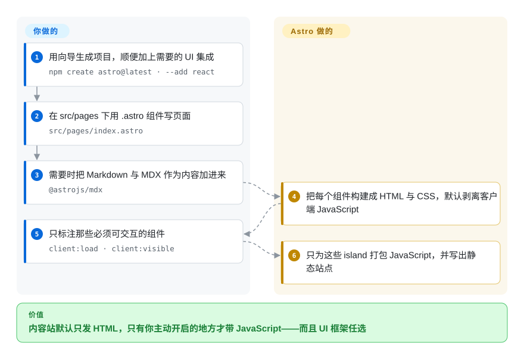

# Astro

面向内容驱动网站的构建工具：页面是 HTML 优先的 `.astro` 组件，Markdown／MDX 以 content collections 的形式并入，来自 React、Vue、Svelte、Solid 或 Preact 的交互组件以「islands」为单位各自 hydrate，而不是把整个应用打成一个包。

## 何时使用

你要建的站，价值在内容——文档、博客、产品站、有大量长尾页面的营销站——而显而易见的那些方案都要求你为了渲染文字而发送一个 JavaScript 应用。站点真正需要交互的只有少数几处（一个搜索框、一个轮播、一个价格切换），其余都是应该由 CDN 瞬时吐出的 HTML。

当**内容优先与 JS 最小化是硬要求、且你希望按组件而不是按项目选择 UI 框架**时，选 Astro。它的定义性机制就是 island：组件默认是静态 HTML，只有你用 `client:*` 指令显式标注的组件才会带上 JavaScript，且各自独立 hydrate。这正是它相对 [Docusaurus](docusaurus.zh.md) 与 [Nextra](nextra.zh.md) 的取舍——那两者交付的是文档预设或深度绑定运行时的 Next.js 集成，而 Astro 给的是一个通用站点框架与近乎为空的客户端包，文档版本管理或文档侧边栏要你自己加。站点比文档更宽时选 Astro；站点**就是**文档、且你想要现成预设时选 Docusaurus。

## 怎么用起来

`npm create astro@latest` 会跑一个脚手架向导；手动路径是 `npm install astro` 加三条脚本——`astro dev`、`astro build`、`astro preview`。**然后你在 `src/pages/` 下用 `.astro` 组件写页面**：一个文件就是一个页面，顶部 frontmatter 在构建期运行（从不在浏览器里跑），下面的模板是带表达式的 HTML——所以一个页面可以遍历数据、渲染 Markdown，同时保持静态。配置在 `astro.config.mjs`（`defineConfig`），集成也在这里注册：`npm create astro@latest -- --add react` 添加 UI 框架，`@astrojs/mdx` 以一等集成的方式加入 MDX。**其余由 Astro 完成：把每个组件构建成 HTML 与 CSS，默认剥离所有客户端 JavaScript，只为那些你用指令显式开启的组件打包 JS，例如 `client:load`、`client:idle` 或 `client:visible`。** `npm run build` 写出静态站点；当某个组件必须按请求渲染时，还有 `server:defer` 可用。

<!-- flow-steps:begin (generated from flows/astro.json by tools/flow_card.py — do not edit) -->

流程文字版

1. **你**：用向导生成项目，顺便加上需要的 UI 集成 — `npm create astro@latest · --add react`
2. **你**：在 src/pages 下用 .astro 组件写页面 — `src/pages/index.astro`
3. **你**：需要时把 Markdown 与 MDX 作为内容加进来 — `@astrojs/mdx`
4. **Astro**：把每个组件构建成 HTML 与 CSS，默认剥离客户端 JavaScript
5. **你**：只标注那些必须可交互的组件 — `client:load · client:visible`
6. **Astro**：只为这些 island 打包 JavaScript，并写出静态站点

**价值**：内容站默认只发 HTML，只有你主动开启的地方才带 JavaScript——而且 UI 框架任选

<!-- flow-steps:end -->

## 何时不用

- **你的站点是带版本的文档集，且你希望版本、侧边栏与 i18n 已经存在。** 改用 [Docusaurus](docusaurus.zh.md)：Astro 能建文档站，但那套文档信息架构是要你拼装的模板，不是配置一下就有的预设。
- **团队已押注 Next.js，且站点必须共享它的运行时、路由与依赖。** 直接用 [Next.js](nextjs.zh.md)——另见 [Nextra](nextra.zh.md)，它在 Next.js 之上补了一层 Markdown／MDX。Astro 是另一套运行时与框架模型，把 Next.js 代码库的站点从它里面拆出来是有代价的。
- **你想要 Vue 形态、Markdown 优先、配置最少的文档工具。** VitePress 是自然选择；它在本索引里未收录，所以这一条只是指路，不是本 atlas 核实过的对比。
- **你想要最大的主题生态与不带 Node 工具链的最快构建。** Hugo 是成熟选项；同样未收录。Astro 的长处是组件灵活性，不是电池数量。
- **你主要的需求是把 Markdown 笔记发布出去，而不是建一个站。** 静态站点框架是你要持续维护的基础设施；[Quarkdown](../../typesetting/quarkdown.zh.md) 或 [Asciidoctor](../../typesetting/asciidoctor.zh.md) 能从纯文本源产出文档站，链路上没有 JS 构建。
- **你的运行时低于 Node 22.12.0，或用的是奇数版 Node。** Astro 的前置条件写着 Node `v22.12.0` 或更高，并明确排除 v23 这类奇数版本——采用前先对照你的 CI 镜像。
- **交付物是文档而不是站点。** PDF、印刷或电子书输出请看 [LaTeX](../../typesetting/latex.zh.md)、[Typst](../../typesetting/typst.zh.md) 或 [Quarkdown](../../typesetting/quarkdown.zh.md)；Astro 的产物是网站。

## 横向对比

| 替代品 | 是否收录 | 我们的评价 | 取舍 |
|---|---|---|---|
| [Docusaurus](docusaurus.zh.md) | ✅ | 当站点是内容驱动、文档只是其中一节时选 Astro；当交付物就是带版本的文档站、且你希望这套基础设施预先建好时选 Docusaurus。 | Astro 换来一个通用框架、可按组件任选 UI 框架、以及默认近乎零 JS；代价是没有文档版本管理与文档侧边栏——纯文档项目得把 Docusaurus 预设的东西重做。 |
| [Nextra](nextra.zh.md) | ✅ | 当你想要内容优先的产物、以及自由混用 UI 框架时选 Astro；当文档必须活在既有的 Next.js 应用里时选 Nextra。 | Astro 换来更轻的客户端包与不绑框架；代价是运行时与 Next.js 单体仓不同，也拿不到 Next.js 生态的对齐。 |
| [Next.js](nextjs.zh.md) | ✅ | 当站点本质是「顺便提供页面的应用」——控制台、个性化、server actions、既有的 app-router 代码库——时选 Next.js；当站点本质是「顺便需要几个交互组件的内容集合」时选 Astro。 | Next.js 换来全栈运行时、RSC 与最大的 React 生态；代价是默认发更多 JavaScript，以及为一个内容站背上更重的心智模型。 |
| VitePress | 未收录 | 当你用 Vue、想要几乎零配置的 Markdown 优先文档时选 VitePress；当站点需要真正的组件、多种框架或文档之外的 content collections 时选 Astro。 | VitePress 换来简单性与 Vue 生态内的小运行时；代价是范围更窄——它是文档生成器，不是通用站点框架。 |
| Hugo | 未收录 | 当你想要最快的构建、成熟的主题生态与 Go 模板时选 Hugo；当你想要基于组件的写作与按组件控制交互时选 Astro。 | Hugo 换来构建速度、十年的主题积累与一个不需要 Node 工具链的二进制；代价是用 Go 模板而不是组件，也没有 islands 模型。 |

## 技术栈

- **语言：** TypeScript。Astro 自家的包包括 `astro`（核心）、`create-astro`（向导）、`markdown`，一组 `@astrojs/*` 集成与适配器，以及 `language-tools`、`telemetry` 这类工具包。
- **构建引擎：** 建立在 Vite 之上，因此打包、开发服务器与插件行为遵循 Vite 的模型；浏览器支持目标即 Vite 的默认值。
- **渲染模型：** HTML 优先的组件（`.astro`）配一段可选的 frontmatter 脚本，另有通过适配器实现的 SSR／按需渲染（`@astrojs/node`、`@astrojs/vercel`、`@astrojs/netlify`、`@astrojs/cloudflare`）。
- **内容：** Markdown 与 MDX 页面、用于类型化内容查询的 content collections，以及组件内的数据获取。
- **UI 集成：** 一等集成覆盖 React、Preact、SolidJS、Svelte、Vue 与 Alpine.js——同一个项目里可以共存多个，各自独立 hydrate。
- **与文档相关的官方集成：** `@astrojs/mdx`、`@astrojs/sitemap`、`@astrojs/partytown`、`@astrojs/markdoc`。

## 依赖

- **Node.js `v22.12.0` 或更高**，并且明确不支持奇数版本。
- **本地安装 `astro`**——文档写明不可全局安装（`npm install -g astro` 及同类写法被点名为错误做法）。
- **只有用到 UI 框架时才装对应的包。** Astro 本身不绑框架；React／Vue／Svelte 等以集成方式加入，其组件是可选的。
- **按需渲染时需要适配器。** 静态构建不需要适配器或服务端；server islands 与 SSR 需要与你托管目标匹配的适配器。
- **无数据库、无服务、无账号。** 遥测是仓库里的一个包（`packages/telemetry`），也就是说匿名使用数据是你可能想关掉的东西；文档还把赞助指向 Open Collective。

## 运维难度

**静态站是低，一旦把渲染挪到服务端就变成中。** 静态构建就是 `npm run build` 加一个待上传的目录——没有运行时、没有状态、容易缓存。有两件事会抬高投入：选适配器并真正运维按需渲染（此时你手上是部署好的服务或 serverless 函数，而不只是一堆文件），以及维护一棵基于 Vite 的构建依赖树、外加你启用的那些 UI 框架集成。Astro 自身的成本主要是概念上的：要理解「你没说它交互，它就不交互」，这对期待 React 默认行为的开发者来说足够反直觉。

## 健康度与可持续性

- **维护与响应——卡片上最强的两项读数（截至 2026-09-20）。** `pushed_at` 为 2026-09-19T23:24:37Z，发布到 2026-09-16 的 `astro@7.3.3`，各集成同步发版，默认分支上的提交距今 2 天，**最近 13 周 13 周活跃**，并且在 16 个合格 issue 上的首次响应中位数为 **0.0 小时**。两轴均评为 `A`。
- **治理与维护者分散度——组织主导，贡献核心面很宽。** 仓库属于 `withastro` 组织，贡献数分散在 `matthewp`（2,114）、`ematipico`（1,190）、`FredKSchott`（1,084）、`Princesseuh`（986）、`natemoo-re`（848）身上——其中 `astrobot-houston`（1,638）是自动化账号。最近 12 个月的窗口是印证而非反驳：**top1 占比 0.203、top3 占比 0.469**，是本页三个框架里分布最均匀的。治理一轴评为 `A`。
- **背书与寿命——年龄上年轻，活跃度上强，周围有商业生态。** 创建于 2021-03-15，截至 2026-09 约 5.5 年。这年轻到 Lindy 先验还护不住你，但反向信号是真实的：约 66 个未关闭 issue 对约 62.7k star、加上每日发布节奏，是一个健康且分诊及时的项目才有的数字。赞助走 Open Collective，而不是基金会。
- **采用与生态——规模很大，且有分发证据佐证。** 评分器把采用广度解析到 npm 上的 `@astrojs/internal-helpers`：**8,268 个依赖仓库、月下载 24,300,104**；仓库本身约 62.7k star、约 3.8k fork，另有主题与起始模板展示库、覆盖主流托管的官方适配器，以及从 Docusaurus、Hugo、Jekyll、Next.js 迁移的成文路径——后者本身就说明有多少流量在往这个方向走。
- **风险旗标——快速推进的大版本线、很大的表面积，以及一个未评分的轴。** 文档为 v1 到 v7 都维护了升级指南，这很诚实，但也说明大版本来得频繁；基于 Astro 的内容站应当预期周期性的升级工作。许可这一轴显示 `?`，因为评分器从 GitHub 的 SPDX 字段取许可，而本仓库该字段为 `NOASSERTION`——并不是许可本身不清楚：`LICENSE` 文件读起来是 MIT（版权归 Fred K. Schott），也未发现换证历史，所以请把这个 `?` 当作工具缺口，而不是悬而未决的问题。

## 存疑（未验证）

- `[未验证]` **大版本节奏的成本。** 直到 v7 的每个大版本都有升级指南，但一个真实站点在两个大版本之间实际要改多少，没有测量。
- `[未验证]` **`NOASSERTION` 的差异。** GitHub 的 license API 识别不了本仓库的许可，而 `LICENSE` 文件读起来是 MIT（「Copyright (c) 2021 Fred K. Schott」）；本文只记录两种读法，没有判定谁对，frontmatter 以许可文件为准。
- `[未验证]` **Astro 周围的商业结构**（核心维护者受雇于哪家公司、赞助与之是什么关系）没有确认；文档只链到 Open Collective，仓库里也没有描述这点的治理文件。
- `[推断]` **62.7k star 的仓库上只有 66 个未关闭 issue，说明分诊积极而不是使用量低**；但仅凭 issue 数量无法区分这两种解释，这个判断更强的依据是每日发布节奏。
- `[未验证]` **遥测默认值。** 仓库里有 `packages/telemetry`，CLI 可能上报匿名使用数据；具体默认与关闭方式没有读取。
- `[未验证]` **大内容集合下的性能说法**没有测量；Astro 的「默认快」讲的是客户端 JavaScript 体积，不是构建耗时。
- `[未验证]` **content collections 的类型 schema 易用性与跨版本稳定性**没有评估。
