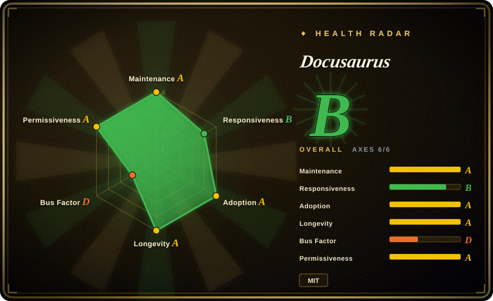
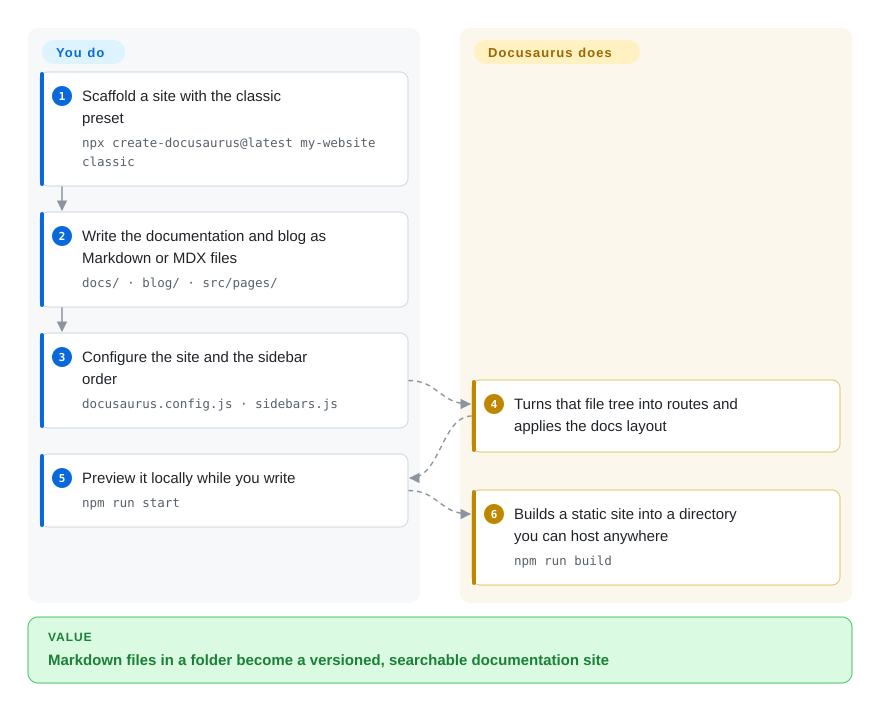

# Docusaurus

A React-based framework for building, versioning and deploying project documentation sites from Markdown/MDX — one command scaffolds docs, a blog, custom pages, i18n and a static build.

## When to use

You maintain an open-source project or a product with a documentation set that has grown past a README: multiple versions, a sidebar that needs an order, translations, a search box, and a blog for release notes. You want to write content in Markdown, drop in React components where the docs need them, and ship a static site you can host anywhere — without building and maintaining the site's plumbing yourself.

Reach for Docusaurus when **documentation is the whole job and versioning plus i18n are requirements, not nice-to-haves**: the classic preset generates the docs sidebar, versioned copies of the docs, an i18n workflow and a blog out of one scaffold, which is the part you would otherwise hand-roll. Against [Nextra](nextra.md) the tradeoff is batteries versus minimalism — Docusaurus ships the docs information architecture and a versioning model, Nextra gives you a thin MDX layer over Next.js and leaves structure to you. Against [Astro](astro.md) it is docs-first versus site-first: Docusaurus cannot easily be a general marketing site with 40 pages of content collections, and Astro's docs story is a template you assemble rather than a preset you configure. Against a hand-rolled Next.js site, Docusaurus costs you control over routing and pays you back in versioned docs, i18n and a maintained theme.

## How it works

The scaffold is the entry point: `npx create-docusaurus@latest my-website classic` writes a project with `/docs`, `/blog`, `/src/pages`, `/static`, `docusaurus.config.js` and `sidebars.js`. **You write Markdown or MDX files into those directories** — anything in `/src/pages` becomes a page, `/docs` plus `sidebars.js` becomes the documentation section, `/blog` becomes dated posts — and you configure the site in `docusaurus.config.js`. **Docusaurus does the rest: it turns the file tree into routes, renders MDX through React, applies the preset's docs layout, and `npm run build` emits a directory of static files for any static host.** Development runs on `npm run start` with a live server at localhost:3000; the content stays plain files, so the site's structure is reviewable in a diff.

<!-- flow-steps:begin (generated from flows/docusaurus.json by tools/flow_card.py — do not edit) -->

Text version of the flow

1. **You**: Scaffold a site with the classic preset — `npx create-docusaurus@latest my-website classic`
2. **You**: Write the documentation and blog as Markdown or MDX files — `docs/ · blog/ · src/pages/`
3. **You**: Configure the site and the sidebar order — `docusaurus.config.js · sidebars.js`
4. **Docusaurus**: Turns that file tree into routes and applies the docs layout
5. **You**: Preview it locally while you write — `npm run start`
6. **Docusaurus**: Builds a static site into a directory you can host anywhere — `npm run build`

**Value**: Markdown files in a folder become a versioned, searchable documentation site

<!-- flow-steps:end -->

## When NOT to use

- **Your site is mostly marketing pages, landing screens and content collections, with docs as one section.** Use [Astro](astro.md): its content collections and component model fit that shape, and Docusaurus's value (versioned docs, docs sidebar, blog) is dead weight when there is little documentation.
- **You want a minimal MDX layer and prefer to own the routing and layout yourself.** Use [Nextra](nextra.md) — it is a thinner layer over Next.js, at the cost of assembling the docs furniture yourself.
- **You are on Vue or Svelte rather than React.** Docusaurus is a React application; a Vue team should look at VitePress or a Vue-based docs framework instead, and a Svelte team at the SvelteKit docs templates. Neither is indexed here.
- **Nobody on the team can maintain a React application.** The scaffold only takes you so far — customizing beyond the preset means writing React components, MDX providers and plugin code. A Markdown-only toolchain such as [Quarkdown](../../typesetting/quarkdown.md) or [Asciidoctor](../../typesetting/asciidoctor.md) produces a documentation site without a JS framework in the loop.
- **You need a PDF or a printed book out of the same source.** Docusaurus emits a website; for a typeset artifact look at [Quarkdown](../../typesetting/quarkdown.md) (PDF, slides and docs from one Markdown-superset source) or [LaTeX](../../typesetting/latex.md).
- **You need your content to render in place, unbuilt.** Docusaurus's MDX files are not rendered by GitHub; the site only exists after a build. If in-place preview matters more than a site, keep plain Markdown.
- **Your Node version is old, or your CI image is pinned to an older runtime.** Docusaurus 3 requires Node 20.0 or above; check that against your build image before committing to it.

## Comparison

| Alternative | In index | Our verdict | Tradeoff |
|---|---|---|---|
| [Nextra](nextra.md) | ✅ | Choose Docusaurus when versioned docs, i18n and a docs sidebar must exist on day one and you would rather configure them than build them; choose Nextra when you want a thin MDX layer on Next.js and will assemble the rest yourself. | Docusaurus gains the full docs information architecture out of the box plus an explicit versioning model; it pays with a heavier preset and a React app you may not fully control. Nextra is the inverse: less furniture, less magic, more assembly. |
| [Astro](astro.md) | ✅ | Choose Docusaurus when the deliverable is a versioned documentation site; choose Astro when the deliverable is a content-driven website whose docs are one section among many. | Astro gains a general site framework (content collections, islands, any UI framework, near-zero JS by default); it pays with no built-in docs versioning, so a docs-only project re-implements what Docusaurus presets. |
| VitePress | 未收录 | Choose VitePress when the team is on Vue and wants a fast, minimal docs generator with Markdown-first configuration; choose Docusaurus when you need React components in the docs or the versioning and i18n workflows it ships. | VitePress gains a much smaller runtime, Vue alignment and simplicity; it pays with no React and a thinner plugin story than a Docusaurus preset. |
| [Next.js](nextjs.md) with MDX wired by hand | ✅ | Choose hand-wired Next.js only when the site's requirements genuinely differ from every docs preset and you accept owning routing, layout, search, versioning and i18n; otherwise choose Docusaurus and delete what you do not need. | Next.js gains total control and no framework constraints; it pays with re-implementing documentation infrastructure — versioned sidebars, i18n routing, search — that a Docusaurus preset treats as baseline. |

## Tech stack

- **Language:** TypeScript. The framework ships as a set of `@docusaurus/*` npm packages that must be kept on the same version.
- **Core:** React application with an MDX pipeline; the `classic` preset bundles `@docusaurus/preset-classic`, which brings the docs plugin, the blog plugin, custom pages and a CSS framework with dark mode.
- **Build:** a Node toolchain (Node 20+) using its own bundler; `npm run build` writes a static site to `/build`, deployable to GitHub Pages, Vercel, Netlify or any static host.
- **Content model:** files in `/docs` (with ordering declared in `sidebars.js`), dated files in `/blog`, and JSX/TSX/MDX under `/src/pages` that become routes.
- **i18n:** first-class localization support, historically wired to Crowdin for community translations.

## Dependencies

- **Node.js 20.0 or above** for the site's own build; this is the requirement the docs state explicitly.
- **A package manager and a Node build toolchain** — a Docusaurus site *is* a React app, so any npm package can be added to it, and any dependency you add becomes part of the build.
- **No server and no database at runtime.** The output is static files; hosting can be a CDN, GitHub Pages or object storage. Search is either the preset's local search or a hosted search service you configure yourself.
- **No account required.** The scaffolding, build and dev server are entirely local; deployment targets (Vercel, Netlify, GitHub Pages) are separate services.

## Ops difficulty

**Low to medium — the build is simple, the upgrade path is the real work.** Scaffolding, writing and deploying are all one command each, and the output is static files with no runtime to operate. The medium part is version discipline: all `@docusaurus/*` packages must move together, major versions have needed migration guides historically, and a site with custom plugins and swizzled components accumulates code that upgrades can break. The docs also note that `npm install` reports vulnerabilities that are typically harmless, which is a judgement call you inherit rather than a task you can complete.

## Health & viability

- **Maintenance — active, with a slower support lane (as of 2026-09-20).** `pushed_at` 2026-09-18T20:35:06Z; latest releases v3.10.2 (2026-07-10), v3.10.1 (2026-04-30), v3.10.0 (2026-04-07); 12 of the last 13 weeks active, and a documented version-support matrix with archived older docs. Not archived. The scorer grades maintenance `A` but responsiveness `B`, with a **median first response of 56.6 h across 25 qualifying issues** — the project ships steadily while issues wait a couple of days.
- **Governance and bus factor — the card and the contributor list disagree, and the card is measuring the more recent thing.** All-time contribution totals spread across `slorber` (1,258), `lex111` (644), `endiliey` (628), `Josh-Cena` (615) and `yangshun` (361), which is the shape of a mature multi-maintainer project. The trailing-12-month window says something different: **top-1 share 0.958 and top-3 share 0.979**, i.e. one account is doing nearly all of the recent work — which is why governance grades `D`, the weakest axis on this page. Read it as "a long-lived project currently carried by one person", not as a broad active team. The README states Meta released it because it helps the company scale its own OSS project sites, so there is an owner with a reason to keep it alive, but the day-to-day bus factor is thin right now.
- **Backing and Lindy — old enough to have survived two major rewrites.** Created 2017-06-20, about nine years old as of 2026-09 (repo age 3,379 days), with a maintained v3 line, a canary channel and a community of sites built on it. Age plus continued activity is the useful part of the Lindy prior here.
- **Adoption and ecosystem — very large for a docs framework, and corroborated by distribution.** The scorer resolves adoption to an npm package with **14,304 dependent repositories and 6,061,802 monthly downloads**; the repository shows ~66.3k stars and ~10.0k forks, adopters ranging from small projects to large vendor documentation sites, plus a plugin ecosystem and community swizzle patterns. Stars are attention, but here the attention is corroborated by a decade of releases.
- **Risk flags — Meta ownership and npm-supply-chain surface.** MIT licensed with no relicense history found. Two things to price in: the roadmap is ultimately Meta's, and a docs site pulls a large npm dependency tree maintained by third parties, so `npm audit` output is noise you must learn to triage.

## Caveats (unverified)

- `[未验证]` **Meta's continued investment.** The README says Docusaurus supports Meta's own OSS projects; whether that commitment outlives current staffing was not assessed.
- `[未验证]` **Upgrade cost between major versions.** Migration guides exist, but how much a customized site actually has to change between majors was not measured.
- `[未验证]` **Search behaviour.** The preset's local search and any hosted alternative were not evaluated for quality or index size limits.
- `[未验证]` **Whether the preset really saves work over hand-wired MDX in Next.js for a small docs site.** The comparison row asserts it does for sites that need versioning and i18n; that was reasoned from the two products' documented features, not benchmarked.
- `[未验证]` **Performance of large documentation sets.** Build times and bundle sizes at thousands of pages were not measured; a very large docs site may hit build-time limits that this page does not describe.
- `[未验证]` **The security posture of the npm dependency tree.** The docs' own note that reported vulnerabilities are typically harmless was read but not independently verified.
- `[未验证]` **Whether the classic preset's blog is wanted by most docs sites** — it is a preset choice, and this page describes it as shipped rather than as required.
