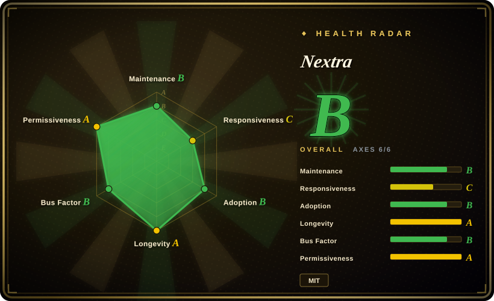
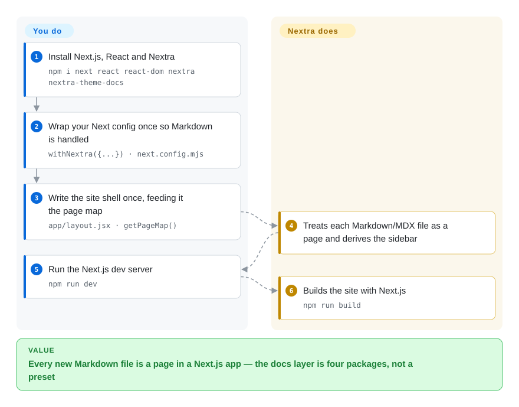

# Nextra

A thin site-generation layer on top of Next.js: you add the packages, wrap your Next config once, and Markdown/MDX files become a documentation or blog site with almost no framework of its own.

## When to use

Your team already builds with Next.js, and the docs need to live in that world — same router, same deployment target, same `npm` dependencies — rather than in a separate React application with its own conventions. You want the sidebar, TOC and search to exist, but you also want to decide the page structure yourself instead of adopting someone's preset and then fighting it.

Reach for Nextra when **the thinness is the feature**: it is a handful of packages (`nextra`, `nextra-theme-docs`) plus a config wrapper, so what you learn is mostly Next.js, and the escape hatch — writing your own layout or dropping to a component — is small. Against [Docusaurus](docusaurus.md) the tradeoff is explicit: Docusaurus ships versioned docs, i18n and a docs information architecture as a preset, Nextra hands you the MDX plumbing and leaves versioning, ordering and translation to you. Against [Astro](astro.md) you are choosing the Next.js runtime and its App Router/RSC model over Astro's islands model — the right call if the site is already a Next.js app, the wrong one if the site is mostly content and you want near-zero client JavaScript.

## How it works

You install the stack — `npm i next react react-dom nextra nextra-theme-docs` — add `dev`/`build`/`start` scripts that call the Next.js CLI, and create a `next.config.mjs` that wraps your config: `import nextra from 'nextra'`, `const withNextra = nextra({...})`, `export default withNextra({...})`. That wrapper is what teaches Next.js to treat Markdown/MDX as pages. **You then write the site's shell once** — in `app/layout.jsx` you compose `Layout`, `Navbar` and `Footer` from `nextra-theme-docs`, pass `await getPageMap()` for the sidebar navigation, and import `nextra-theme-docs/style.css` — and after that **each new page is just a Markdown or MDX file** following the file conventions (`page.mdx`, or the `content` directory). `npm run dev` starts Next.js in development; `npm run build` runs the production Next.js build.

<!-- flow-steps:begin (generated from flows/nextra.json by tools/flow_card.py — do not edit) -->

Text version of the flow

1. **You**: Install Next.js, React and Nextra — `npm i next react react-dom nextra nextra-theme-docs`
2. **You**: Wrap your Next config once so Markdown is handled — `withNextra({...}) · next.config.mjs`
3. **You**: Write the site shell once, feeding it the page map — `app/layout.jsx · getPageMap()`
4. **Nextra**: Treats each Markdown/MDX file as a page and derives the sidebar
5. **You**: Run the Next.js dev server — `npm run dev`
6. **Nextra**: Builds the site with Next.js — `npm run build`

**Value**: Every new Markdown file is a page in a Next.js app — the docs layer is four packages, not a preset

<!-- flow-steps:end -->

## When NOT to use

- **You want versioned docs, i18n routing and a docs sidebar without building them.** Use [Docusaurus](docusaurus.md): its classic preset ships those as configuration, whereas in Nextra they are code you write and maintain.
- **You are not on Next.js, or you do not want the App Router and React Server Components in the loop.** Use [Astro](astro.md) for a content site, or [Docusaurus](docusaurus.md) if you want React but not Next.js's framework opinions.
- **The site is mostly brochure content with a small docs section.** Use [Astro](astro.md) — a general content framework fits that shape better than a docs theme you then have to hollow out.
- **You need a project with a staffing and release guarantee.** Nextra's repository lives under a personal GitHub account, contributes concentrate in a few people (`shuding` 509, `dimaMachina` 203 among humans, behind a renovation bot at 746), the last tagged release is from 2025-12-04, and there are ~333 open issues. If a documentation platform is long-lived infrastructure for you, weigh that against Docusaurus's team and release history.
- **You want the smallest possible dependency tree.** Nextra is Next.js plus React plus the MDX pipeline; a Markdown-only generator such as [Quarkdown](../../typesetting/quarkdown.md) or [Asciidoctor](../../typesetting/asciidoctor.md) removes the whole JS build from the critical path of publishing docs.
- **You need a PDF or a printed manual from the same source.** Nextra emits a website; look at [Quarkdown](../../typesetting/quarkdown.md) or [LaTeX](../../typesetting/latex.md) for typeset output.
- **You want a generated site you can host as plain files without a Node runtime decision.** Next.js can statically export, and Nextra documents that path, but you are still building with Next.js; a static-first framework makes that the default rather than a mode.

## Comparison

| Alternative | In index | Our verdict | Tradeoff |
|---|---|---|---|
| [Docusaurus](docusaurus.md) | ✅ | Choose Nextra when the team is already on Next.js and prefers a thin layer to a preset; choose Docusaurus when versioned docs, i18n and a docs sidebar must exist without you writing them. | Nextra gains alignment with an existing Next.js codebase and a small learning surface; it pays with docs infrastructure you must build — versioning, ordering, translation — plus a slower, smaller-maintained project. |
| [Astro](astro.md) | ✅ | Choose Nextra when the docs site should share a Next.js runtime and dependencies with the product; choose Astro when the site is content-first and shipping less JavaScript by default matters more than framework alignment. | Astro gains islands, near-zero JS by default and framework-agnostic components; it pays with a different runtime and deployment model than a Next.js monorepo. |
| VitePress | 未收录 | Choose VitePress when the team is on Vue and wants a Markdown-first docs generator with minimal configuration; choose Nextra when you are on React/Next.js and want Markdown handled inside a Next.js app. | VitePress gains a small runtime and Vue alignment; it pays with no React and a different integration story inside a Next.js product. |
| Wiring MDX into your own Next.js app by hand | 未收录 | Choose hand-wiring when you need only a few MDX pages and want no theme at all; choose Nextra once you want a sidebar, page map, TOC and search that you would otherwise write yourself. | Hand-wiring gains zero extra framework layers; it pays with rebuilding the file-convention routing, page map and theme that Nextra provides. |

## Tech stack

- **Language:** TypeScript; a package set rather than a single package — `nextra` (the Next.js integration and MDX pipeline), `nextra-theme-docs`, `nextra-theme-blog`, plus `nextra/components` and `nextra/page-map`.
- **Runtime:** Next.js on React, targeting the App Router. Nextra 4 is the current line and is built around `app/`-directory conventions.
- **Build tooling:** the repository is a pnpm workspace managed with Turborepo; the relevant point for users is that the consumer side is ordinary Next.js tooling.
- **Content model:** MDX files resolved by file convention (`page.mdx`) or from a `content` directory, with the sidebar derived from the page map.
- **Packaging:** npm packages under the `nextra` and `nextra-theme-*` names.

## Dependencies

- **Node.js plus Next.js, React and React DOM** — four runtime packages before Nextra itself; `npm i next react react-dom nextra nextra-theme-docs` is the documented install.
- **A Next.js deployment target.** Either a Node-capable host or Next.js's static export; Nextra documents the static-export path rather than assuming it.
- **No database, no service, no account.** The site is files plus a build; hosting is whatever Next.js supports.
- **The Next.js upgrade treadmill is inherited.** A Next.js major release is a Nextra release's problem to track, so your upgrade cadence is coupled to Next.js's.

## Ops difficulty

**Low, with a framework-shaped tail.** Daily work is authoring MDX and running `npm run dev` / `npm run build`, and a docs site has no runtime state to operate. The tail is that you own a Next.js application: App Router conventions, server-versus-client component boundaries and the React Server Components model are all skills the site requires, and Next.js's own upgrade cadence becomes yours. Setting search up is documented but is a step you take, not something that works out of the box.

## Health & viability

- **Maintenance — slowing, and quieter than `pushed_at` suggests (as of 2026-09-20).** `pushed_at` is 2026-07-31T20:39:04Z, but that field moves for activity on any branch: the measured last commit on the **default branch is 89 days old** and only **1 of the last 13 weeks** showed activity, which is why maintenance grades `B`. The most recent tagged releases are all `4.6.1` from 2025-12-04 — roughly nine months earlier. Set against ~333 open issues, this is a project that has slowed down.
- **Responsiveness — issues wait (grades `C`).** The scorer's median first response is **526.6 h (about 22 days) across 20 qualifying issues**. That is not abandonment, but it is the difference between a project you file a bug against and one you file a bug against and then work around.
- **Governance and bus factor — a personal repository behind a project brand.** The repo is owned by the `shuding` **User** account (not an organization), while the project presents itself at nextra.site under "The Nextra Project" with Nextra 4 announced on the-guild.dev and the site sponsored by Inkeep and xyflow. Contribution totals are dominated by automation (`renovate[bot]` 746, `github-actions[bot]` 195); among humans, `shuding` (509), `dimaMachina` (203) and `promer94` (59) carry it, and the trailing-12-month window is **top-1 0.55 / top-3 0.65** (`B`). That is a small core with a brand around it, not a team with a foundation behind the repository. `[推断]`
- **Backing and Lindy — new enough to be a bet, old enough to have shipped a major rewrite.** Created 2020-06-15, about six years old as of 2026-09 (repo age 2,288 days), with v4 as a significant rewrite; continuous but slowing activity. This is the middle of the Lindy range: not a flash in the pan, not a decade-proven dependency.
- **Adoption and ecosystem — substantial but concentrated in the Next.js world.** The scorer resolves adoption to an npm package with **2,302 dependent repositories and 817,763 monthly downloads** (`B`) — an order of magnitude behind Docusaurus on both counts — plus ~13.9k stars and ~1.4k forks. Adoption here is real but narrower, and it depends on the Next.js ecosystem staying where it is.
- **Risk flags — 333 open issues, a slow release line, and a personal-account repository.** MIT licensed with no relicense history found. None of these is fatal on its own; together they mean you should price in slower fixes than Docusaurus would give you.

## Caveats (unverified)

- `[未验证]` **Whether the slow release line reflects maintenance mode, a v5 in progress, or volunteer bandwidth.** The pattern is measured; the cause was not established from project communications.
- `[推断]` **The relationship between the personal `shuding/nextra` repository and the "Nextra Project" brand (and The Guild's involvement in Nextra 4)** is read from the documentation site's footer, the v4 announcement URL and the sponsor list — not from a governance document.
- `[未验证]` **Static export completeness.** Nextra documents a static-export path, but which features degrade when exporting without a Node server was not assessed.
- `[未验证]` **Search quality and setup cost** were not evaluated; the docs treat search as a configuration step.
- `[未验证]` **Node/Next.js version compatibility** beyond the current line was not read from a maintained support matrix.
- `[推断]` **"Used as the docs layer for Next.js-ecosystem projects"** is a general characterisation of adoption; no specific dependent project was audited.
- `[未验证]` **The 333 open issues' composition** (bugs versus feature requests versus stale) was not analysed.
