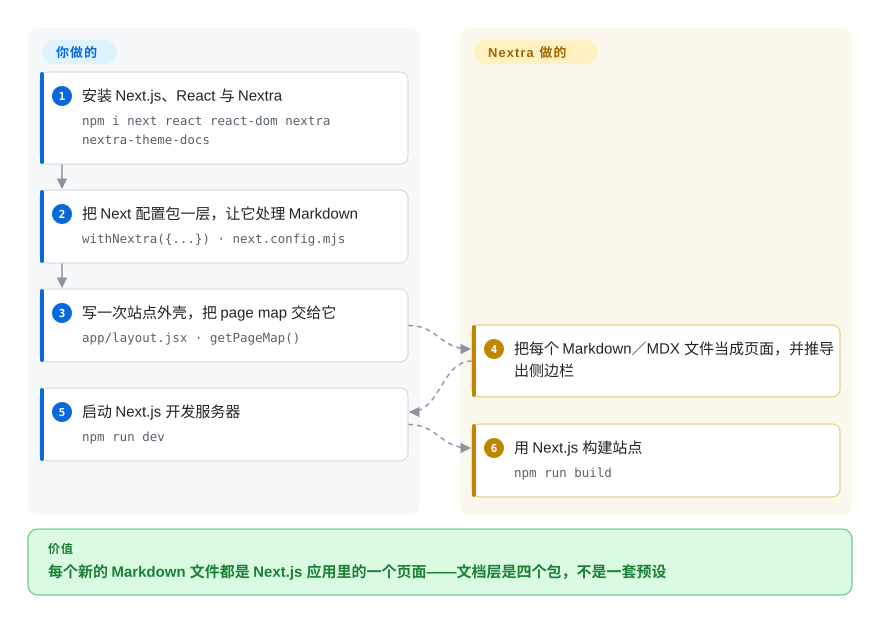

# Nextra

Next.js 之上的一层薄薄的站点生成方案：装上几个包、把 Next 配置包一层，Markdown／MDX 文件就成了文档站或博客站，几乎没有属于它自己的框架。

## 何时使用

你的团队本来就在用 Next.js 构建，而文档需要活在那个世界里——同一套路由、同一个部署目标、同一批 `npm` 依赖——而不是另起一个带自己约定的 React 应用。你希望侧边栏、目录和搜索都存在，但也希望页面的结构由你决定，而不是先接受别人的预设、再回头跟它较劲。

当**「薄」本身就是价值**时，选 Nextra：它就是几个包（`nextra`、`nextra-theme-docs`）加一层配置包装，所以你学到的东西主要是 Next.js，而逃生出口很小——自己写布局或直接降到一个组件即可。相对 [Docusaurus](docusaurus.zh.md)，取舍是明摆着的：Docusaurus 用预设交付版本化文档、i18n 与文档信息架构，Nextra 只把 MDX 管线交给你，版本、排序与翻译都归你。相对 [Astro](astro.zh.md)，你是在选择 Next.js 运行时及其 App Router／RSC 模型，而不是 Astro 的 islands 模型——如果站点本来就是 Next.js 应用，这是对的；如果站点主要是内容、且你希望默认几乎没有客户端 JavaScript，那就选错了。

## 怎么用起来

你装上整栈——`npm i next react react-dom nextra nextra-theme-docs`——加上调用 Next.js CLI 的 `dev`／`build`／`start` 脚本，再建一个 `next.config.mjs` 把配置包起来：`import nextra from 'nextra'`、`const withNextra = nextra({...})`、`export default withNextra({...})`。正是这层包装让 Next.js 把 Markdown／MDX 当成页面。**然后你只需要写一次站点外壳**——在 `app/layout.jsx` 里组合 `nextra-theme-docs` 的 `Layout`、`Navbar`、`Footer`，把 `await getPageMap()` 传进去做侧边栏导航，并 `import 'nextra-theme-docs/style.css'`——之后**每加一个页面就只是一个 Markdown 或 MDX 文件**，按文件约定（`page.mdx`，或 `content` 目录）放置。`npm run dev` 启动 Next.js 开发模式；`npm run build` 跑生产构建。

<!-- flow-steps:begin (generated from flows/nextra.json by tools/flow_card.py — do not edit) -->

流程文字版

1. **你**：安装 Next.js、React 与 Nextra — `npm i next react react-dom nextra nextra-theme-docs`
2. **你**：把 Next 配置包一层，让它处理 Markdown — `withNextra({...}) · next.config.mjs`
3. **你**：写一次站点外壳，把 page map 交给它 — `app/layout.jsx · getPageMap()`
4. **Nextra**：把每个 Markdown／MDX 文件当成页面，并推导出侧边栏
5. **你**：启动 Next.js 开发服务器 — `npm run dev`
6. **Nextra**：用 Next.js 构建站点 — `npm run build`

**价值**：每个新的 Markdown 文件都是 Next.js 应用里的一个页面——文档层是四个包，不是一套预设

<!-- flow-steps:end -->

## 何时不用

- **你想要开箱即用的版本化文档、i18n 路由与文档侧边栏，不想自己造。** 改用 [Docusaurus](docusaurus.zh.md)：它的 classic 预设把这些作为配置项提供，而在 Nextra 里它们是你写出来并要维护的代码。
- **你不用 Next.js，或者不想把 App Router 与 React Server Components 引入链路。** 内容站改用 [Astro](astro.zh.md)；想要 React 但不想背 Next.js 的框架主张，则用 [Docusaurus](docusaurus.zh.md)。
- **站点主要是宣传内容，文档只占一小块。** 改用 [Astro](astro.zh.md)——通用内容框架比一个你还得掏空的文档主题更贴合这种形态。
- **你需要一个有人员与发布保证的项目。** Nextra 的仓库挂在一个个人 GitHub 账号下，贡献集中在少数几个人（人类贡献者里 `shuding` 509、`dimaMachina` 203，前面还有个 746 的重构机器人），最近一个带标签的版本是 2025-12-04，未关闭 issue 约 333 个。如果文档平台对你是长期基础设施，请把这一点与 Docusaurus 的团队和发布历史一起权衡。
- **你想要尽可能小的依赖树。** Nextra 等于 Next.js 加 React 加 MDX 管线；纯 Markdown 生成器如 [Quarkdown](../../typesetting/quarkdown.zh.md) 或 [Asciidoctor](../../typesetting/asciidoctor.zh.md) 能把整套 JS 构建从「发布文档」的关键路径上拿掉。
- **你需要从同一份源得到 PDF 或纸质手册。** Nextra 只产出网站；排版成品请看 [Quarkdown](../../typesetting/quarkdown.zh.md) 或 [LaTeX](../../typesetting/latex.zh.md)。
- **你希望生成的站点能当纯文件托管、不必先做「要不要 Node 运行时」的决定。** Next.js 可以静态导出，Nextra 也记录了这条路径，但你终究还是在用 Next.js 构建；静态优先的框架会把这件事变成默认而不是一种模式。

## 横向对比

| 替代品 | 是否收录 | 我们的评价 | 取舍 |
|---|---|---|---|
| [Docusaurus](docusaurus.zh.md) | ✅ | 当团队本来就在 Next.js 上、且比起预设更偏好一层薄的封装时选 Nextra；当版本化文档、i18n 与文档侧边栏必须存在、而且你不打算自己写时选 Docusaurus。 | Nextra 换来与既有 Next.js 代码库的对齐和很小的学习面；代价是文档基础设施得自建——版本、排序、翻译——以及一个更慢、维护人手更小的项目。 |
| [Astro](astro.zh.md) | ✅ | 当文档站应当与产品共享同一个 Next.js 运行时与依赖时选 Nextra；当站点内容优先、且「默认少发 JavaScript」比框架对齐更重要时选 Astro。 | Astro 换来 islands、默认近乎零 JS 与不绑框架的组件；代价是运行时与部署模型跟 Next.js 单体仓不同。 |
| VitePress | 未收录 | 当团队用 Vue、想要以 Markdown 为主要配置方式、几乎不用配置的文档生成器时选 VitePress；当你用 React／Next.js、想把 Markdown 处理放进一个 Next.js 应用里时选 Nextra。 | VitePress 换来小运行时与与 Vue 的对齐；代价是没有 React，且在一个 Next.js 产品内部的集成方式完全不同。 |
| 自己把 MDX 接进 Next.js 应用 | 未收录 | 当你只需要少数几个 MDX 页面、完全不要主题时选自接；当你想要侧边栏、page map、目录与搜索、而这些否则要自己写时选 Nextra。 | 自接换来零额外框架层；代价是把 Nextra 提供的文件约定路由、page map 与主题重新实现一遍。 |

## 技术栈

- **语言：** TypeScript；它是一组包而不是单个包——`nextra`（Next.js 集成与 MDX 管线）、`nextra-theme-docs`、`nextra-theme-blog`，外加 `nextra/components` 与 `nextra/page-map`。
- **运行时：** React 之上的 Next.js，面向 App Router。Nextra 4 是当前主线，围绕 `app/` 目录约定构建。
- **构建工具：** 仓库本身是用 Turborepo 管理的 pnpm workspace；对使用者重要的是消费侧就是普通的 Next.js 工具链。
- **内容模型：** 按文件约定解析的 MDX 文件（`page.mdx`），或放在 `content` 目录里；侧边栏由 page map 推导。
- **打包：** 以 `nextra` 与 `nextra-theme-*` 命名发布的 npm 包。

## 依赖

- **Node.js，加上 Next.js、React 与 React DOM**——在 Nextra 本身之前已有四个运行时包；官方记录的安装命令是 `npm i next react react-dom nextra nextra-theme-docs`。
- **一个 Next.js 部署目标。** 要么能跑 Node 的托管，要么用 Next.js 的静态导出；Nextra 记录的是静态导出这条路径，而不是默认假设。
- **无数据库、无服务、无账号。** 站点就是文件加一次构建；托管交给 Next.js 支持的任何方式。
- **继承 Next.js 的升级跑步机。** Next.js 的一个大版本就是 Nextra 要跟的一个版本，你的升级节奏因此与 Next.js 绑定。

## 运维难度

**低，但拖着一条框架形状的尾巴。** 日常就是写 MDX 加跑 `npm run dev`／`npm run build`，文档站没有运行时要运维。尾巴在于你拥有的是一个 Next.js 应用：App Router 约定、服务端与客户端组件的边界、React Server Components 模型都是站点要求你会的东西，而 Next.js 自身的升级节奏也就成了你的。搜索按文档可以配起来，但那是一步你要做的操作，不是开箱即得。

## 健康度与可持续性

- **维护活跃度——在放缓，而且比 `pushed_at` 显示的更安静（截至 2026-09-20）。** `pushed_at` 为 2026-07-31T20:39:04Z，但该字段会因任意分支上的活动而变动：实测**默认分支上最后一次提交距今 89 天**，最近 13 周里只有 **1 周**有活动，这也是维护一轴评为 `B` 的原因。最近带标签的版本全是 2025-12-04 的 `4.6.1`——大约早了九个月。对照约 333 个未关闭 issue，这是一个已经慢下来的项目。
- **响应速度——issue 要等（评为 `C`）。** 评分器给出的首次响应中位数是 **526.6 小时（约 22 天），覆盖 20 个合格 issue**。这不是被放弃，但这就是「你愿意给它提 bug 的项目」与「提完 bug 还得自己绕过去」之间的差别。
- **治理与维护者分散度——品牌之下的个人仓库。** 仓库属于 `shuding` 这个 **User** 账号（不是组织），而项目在 nextra.site 上以「The Nextra Project」示人，Nextra 4 的发布公告挂在 the-guild.dev，站点由 Inkeep 与 xyflow 赞助。贡献数被自动化主导（`renovate[bot]` 746、`github-actions[bot]` 195）；人类贡献者中由 `shuding`（509）、`dimaMachina`（203）、`promer94`（59）扛着，最近 12 个月窗口为 **top1 0.55／top3 0.65**（`B`）。这是「一个小核心 + 一个品牌」，而不是「一个团队 + 一个基金会」。`[推断]`
- **背书与寿命——新到算一次下注，老到已经交付过一次大重写。** 创建于 2020-06-15，截至 2026-09 约六年（仓库年龄 2,288 天），v4 是一次显著重写；活动持续但在放缓。这处于 Lindy 区间的中段：既不是一闪而过的项目，也不是十年验证过的依赖。
- **采用与生态——规模可观，但集中在 Next.js 世界。** 评分器把采用广度解析到 npm 上的包：**1,715 个依赖仓库、月下载 809,687**（`B`）——两项都比 Docusaurus 低一个数量级——另有约 13.9k star、约 1.4k fork。这里的采用是真实的，但更窄，且依赖 Next.js 生态维持现状。
- **风险旗标——333 个未关闭 issue、较慢的发布线，以及挂在个人账号下的仓库。** MIT 许可，未发现换证历史。单看每一条都不致命；合起来意味着你应当预期修复速度慢于 Docusaurus。

## 存疑（未验证）

- `[未验证]` **发布线变慢是出于维护模式、正在做 v5，还是志愿精力有限。** 现象是测量到的，原因没有从项目沟通中确认。
- `[推断]` **个人仓库 `shuding/nextra` 与「Nextra Project」品牌（以及 The Guild 在 Nextra 4 中的参与）之间的关系**，是依据文档站页脚、v4 公告链接与赞助列表读出来的，不是来自任何治理文件。
- `[未验证]` **静态导出的完整度。** Nextra 记录了静态导出路径，但导出为无 Node 服务端时哪些功能会退化，没有评估。
- `[未验证]` **搜索质量与配置成本**没有评估；文档把搜索当作一个配置步骤。
- `[未验证]` **除当前主线之外的 Node／Next.js 版本兼容性**没有从一份受维护的支持矩阵中读取。
- `[推断]` **「被 Next.js 生态项目用作文档层」是总体描述**；没有审计某个具体依赖方。
- `[未验证]` **333 个未关闭 issue 的构成**（bug、功能请求、陈旧条目）没有分析。
