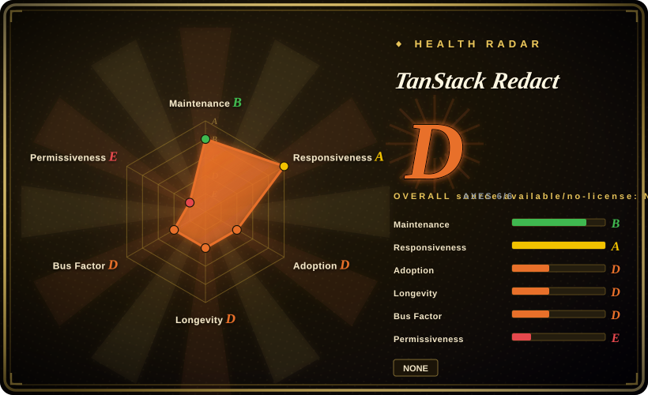
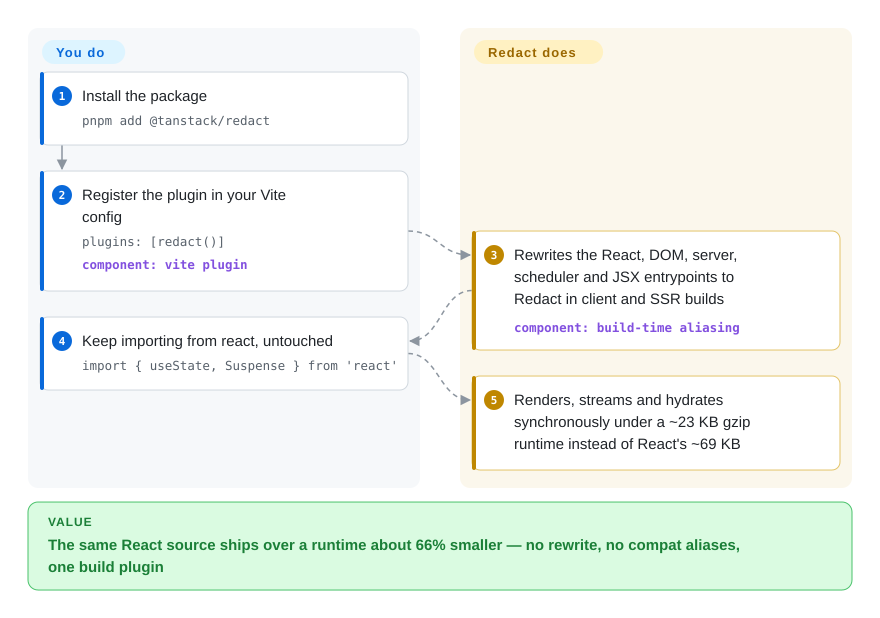

# TanStack Redact

Your Vite + React site carries about 69 KB of gzip runtime before the first line of your own code ships, and most of that weight pays for concurrent scheduling your pages never use. TanStack Redact swaps the runtime under your app — one Vite plugin redirects every `react` / `react-dom` / JSX import to a synchronous re-implementation measured at 23 KB gzip — but it has no concurrent scheduler, and as of 2026-09 the repo ships with no license at all.

## When to use

You maintain a content-heavy site built on Vite and React — docs, marketing, a blog with islands of interactivity. The bundle budget fails on the React runtime alone, yet the pages never lean on concurrency: no transitions, no optimistic forms, no `useDeferredValue` juggling. Rewriting in another framework is off the table; the codebase is years of idiomatic React.

Reach for Redact here: `pnpm add @tanstack/redact`, put `redact()` in `vite.config.ts`, and every `import ... from 'react'` resolves to Redact's synchronous runtime — hooks, context, Suspense with streaming SSR, portals and hydration included — at roughly a third of the runtime size (23.3 KB vs 69.2 KB gzip, the project's own Sept 2026 measurement against pinned React 19.3.0). Pick it over **Preact** when you want a runtime that tracks React 19.3's current API surface — `Activity`, Fragment refs, `ViewTransition`, `use` — without maintaining a compat layer and per-bundler alias config; pick it over **React** itself when the bundle budget matters more than concurrent features, React DevTools and a decade of ecosystem hardening. Read When NOT to use first: the synchronous downgrades and the missing license decide this choice more than the size does.

## How it works

You change the build, not the code. The Vite plugin re-points the module specifiers `react`, `react/jsx-runtime`, `react-dom`, `react-dom/client`, `react-dom/server` and the scheduler package at Redact's own compiled entries, in both client and SSR builds — the same alias trick `preact/compat` uses, but covering the whole React surface in one plugin. Redact then renders **synchronously**: a state update flushes immediately, with none of React's time slicing, interruptible rendering or priority lanes. The APIs that exist to drive concurrency still exist so imports don't break, but several are downgraded — `useTransition`'s pending flag stays false, `useDeferredValue` returns its input, and `useActionState` returns the initial state without running the action. The RSC environment is deliberately left on real React, so Server Components keep working through `@vitejs/plugin-rsc`. Feature flags (`redact({ features: { ... } })`) and the `nano` preset strip behavior you don't need — down to 12.5 KB gzip for a DOM client without context, Suspense or memo.

<!-- flow-steps:begin (generated from flows/tanstack-redact.json by tools/flow_card.py — do not edit) -->

Text version of the flow

1. **You**: Install the package — `pnpm add @tanstack/redact`
2. **You**: Register the plugin in your Vite config — `plugins: [redact()]` — component: `vite plugin`
3. **TanStack Redact**: Rewrites the React, DOM, server, scheduler and JSX entrypoints to Redact in client and SSR builds — component: `build-time aliasing`
4. **You**: Keep importing from react, untouched — `import { useState, Suspense } from 'react'`
5. **TanStack Redact**: Renders, streams and hydrates synchronously under a ~23 KB gzip runtime instead of React's ~69 KB

**Value**: The same React source ships over a runtime about 66% smaller — no rewrite, no compat aliases, one build plugin

<!-- flow-steps:end -->

## When NOT to use

- **If your organization needs legal clearance to ship, stay on [React](react.md) or Preact (both MIT).** As of 2026-09-28 the repo has no LICENSE file anywhere (recursive tree search), `packages/redact/package.json` declares no license, and the npm tarball carries none — default copyright applies, so no right to copy or redistribute is granted until TanStack adds one.
- **If your app leans on concurrent features, stay on React.** Transitions run synchronously (pending never turns true), `useDeferredValue` is the identity function, `useActionState` never runs the action, and `useOptimistic` / `useFormStatus` are no-ops — code that compiled fine will silently behave differently.
- **If you build with webpack, Rspack, Next.js or anything that is not Vite, use Preact + `preact/compat` or React instead**, because the only integration Redact ships is a Vite plugin (`vite >= 5` is the sole peer dependency).
- **If the React Profiler, DevTools or StrictMode double-rendering are part of your debugging workflow, stay on React** — Redact implements none of the DevTools / Fast Refresh internals, and `StrictMode` renders children without double invocation.
- **If the app is RSC-heavy, measure where the win lands before adopting** — the RSC environment stays on real React, so the size and performance gains apply only to the client and DOM-server runtime.
- **If you target React Native or any non-DOM surface, stay on React** — Redact implements DOM and SSR rendering only.
- **For production-critical surfaces today, prefer React or Preact.** Redact is five months old with 0.x churn (0.0.20 → 0.1.2 inside September 2026), about 1.5k weekly npm downloads, and an open four-bug hydration report (issue #17, filed 2026-07-04, unanswered as of 2026-09-28); its own benchmark shows hydration 21% slower and Suspense retry cycles +124.8% (about 0.15 ms per cycle in absolute terms).

## Comparison

| Alternative | In index | Our verdict | Tradeoff |
| --- | --- | --- | --- |
| React (`facebook/react`) | ✅ [react](react.md) | Pick React when the app uses transitions, actions or optimistic UI, or when DevTools, StrictMode and React Native matter; pick Redact when the bundle budget of a Vite app dominates and the UI never leans on concurrent scheduling. | React 19.3's runtime measured 69.2 KB gzip but carries the full concurrent renderer, MIT licensing, 203.2M weekly downloads and 12+ years of hardening; Redact's own benchmark puts it at 23.3 KB with synchronous downgrades, 0.x churn and no license. |
| Preact (`preactjs/preact`) | not indexed | For the smallest battle-tested React-compatible runtime under a permissive license, pick Preact + `preact/compat`; pick Redact when you want React 19.3's newest APIs (`Activity`, `ViewTransition`, `use`) covered by one Vite plugin without maintaining compat aliases per bundler. | Preact's core is ~4 KB with MIT and 39.2M weekly downloads since 2015, but its compat layer lags new React APIs and alias config is on you; Redact covers the 19.3 surface in-plugin yet is five months old, Vite-only and unlicensed. Not added in this tab-intake batch. |
| Solid (`solidjs/solid`) | not indexed | Pick Solid only when rewriting components in its signals API is on the table — fine-grained updates with no virtual DOM; pick Redact when the existing React source must stay untouched. | Solid (6.4M weekly downloads, MIT) changes the programming model, so it is a rewrite rather than a swap; Redact keeps the React API and re-implements what runs beneath it, at the cost of a young runtime. Not added in this tab-intake batch. |
| Svelte (`sveltejs/svelte`) | ✅ [svelte](svelte.md) | Pick Svelte for a greenfield app that wants a compiler framework with no virtual-DOM runtime at all; pick Redact for an existing React codebase where only the runtime beneath the code may change. | Svelte compiles components to imperative code and shrinks the whole model, at the price of new syntax and a migration; Redact asks for one build-plugin line but inherits none of the compiler optimizations. |

The repo's own manifest calls it "a minimal React-compatible runtime for TanStack Start apps" [推断] — the sibling [TanStack Router](tanstack-router.md) / Start stack is the intended first home, and other TanStack libraries such as [TanStack Query](../data-fetching/tanstack-query.md) and [TanStack Table](../component-libraries/tanstack-table.md) consume React's public API surface, which Redact covers; their behavior under the swap is inferred from that, not tested by the repo.

## Tech stack

- **TypeScript** monorepo: pnpm workspaces, changesets for releases, Vitest + Playwright, esbuild-based build scripts.
- One published package, `@tanstack/redact`, with subpath exports: `.` (the React API), `/jsx-runtime`, `/dom`, `/dom-client`, `/dom-test-utils`, `/server`, `/scheduler`, `/compiler-runtime`, `/vite`, `/features/*`.
- Benchmarks are checked into the repo (`benchmarks/` — results, measurements and an independent audit file) against pinned React 19.3.0.

## Dependencies

- **Runtime:** nothing but your app — the only peer dependency is `vite >= 5` (optional, for the plugin).
- The RSC environment deliberately keeps real `react` installed (Server Components via `@vitejs/plugin-rsc`).
- No server, no database, no hosted service.

## Ops difficulty

**Low to run, medium to keep current.** It is a front-end build dependency with nothing to operate. The real burden is change management:

- 0.x with rapid churn — re-read the compatibility table at every release, because behavior (not just API names) is still moving.
- Trial cheaply: the plugin is a one-line toggle, so keep CI running the same suite against real React and Redact — the project's own Chrome gate runs 1,266 case executions across both renderers.
- Watch the repo for a LICENSE appearing before any redistribution or productization.

## Health & viability

- **Maintenance (2026-09-28).** Active: six releases between 2026-09-07 and 2026-09-12 (0.0.20 → 0.1.2), last push to `main` 2026-09-12. CI runs 1,569 tests, type checks, a built-package verifier, 19 size budgets and a browser gate; the self-benchmarking discipline is unusually rigorous for a 0.x.
- **Governance / bus factor.** Single dominant author: Tanner Linsley holds 56 of the ~69 commits GitHub counts; it sits under the TanStack organization with sponsorship and release infrastructure, but no second maintainer is visible on this repo [推断].
- **Backing & longevity.** Five months old (created 2026-04-20), so the Lindy prior gives no support; the counterweight is TanStack's multi-year record of maintaining Query, Table and Router. The stated intent is to become the runtime of TanStack Start [推断] — a bet, not a shipped default.
- **Adoption & ecosystem.** 318 stars, 8 forks; npm reports about 1.5k downloads for the week of 2026-09-21, and the health scorer counted 5,952 in its last-month window — plus two author-run site verifications: tannerlinsley.com upgraded in production, tanstack.com passing in preview pending review. Documentation is the README plus the `docs/` and `benchmarks/` directories — no docs site yet.
- **Risk flags.** **No license anywhere** (repo tree, package manifest, npm) as of 2026-09-28 — the decisive adoption blocker until it changes; 0.x churn; an open external hydration-bug report (#17) unanswered since 2026-07-04.

## Caveats (unverified)

- [未验证] All size and performance figures (23.3 KB vs 69.2 KB gzip; hydration +21.4%; Suspense retries +124.8% ≈ 0.15 ms/cycle) come from the project's own `benchmarks/` files (September 2026, Apple M5 Pro / Chrome 152), not reproduced here; the README notes the timings used a frozen pre-release snapshot.
- [未验证] License absence was checked on 2026-09-28 (GitHub API `license: null`; recursive tree search found no LICENSE/COPYING/NOTICE; npm `license` field empty) — TanStack can add one in any release, so re-check before relying on this page's license claims.
- [推断] "A minimal React-compatible runtime for TanStack Start apps" is the private root manifest's description; no public TanStack Start release note confirms Redact ships in Start by default.
- [推断] TanStack Query / Table / Router compatibility under Redact is inferred from their use of React's public API surface; the repo verifies only tanstack.com and tannerlinsley.com.
- [未验证] Issue #17's four hydration bugs were reported against 0.0.17; whether 0.1.2 fixes them is not stated anywhere in the repo.
- [未验证] The comparison cells for Preact, Solid and Svelte rest on their GitHub/npm metadata (download counts week of 2026-09-28), not on a full reading of those repositories in this batch.
