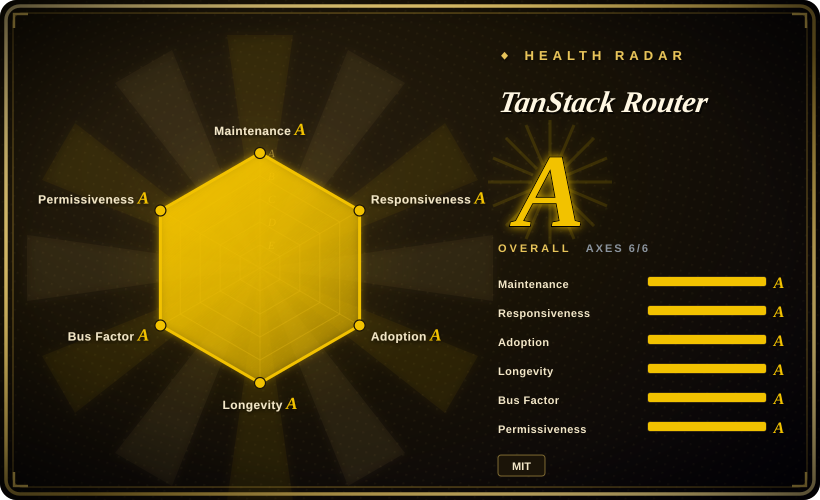
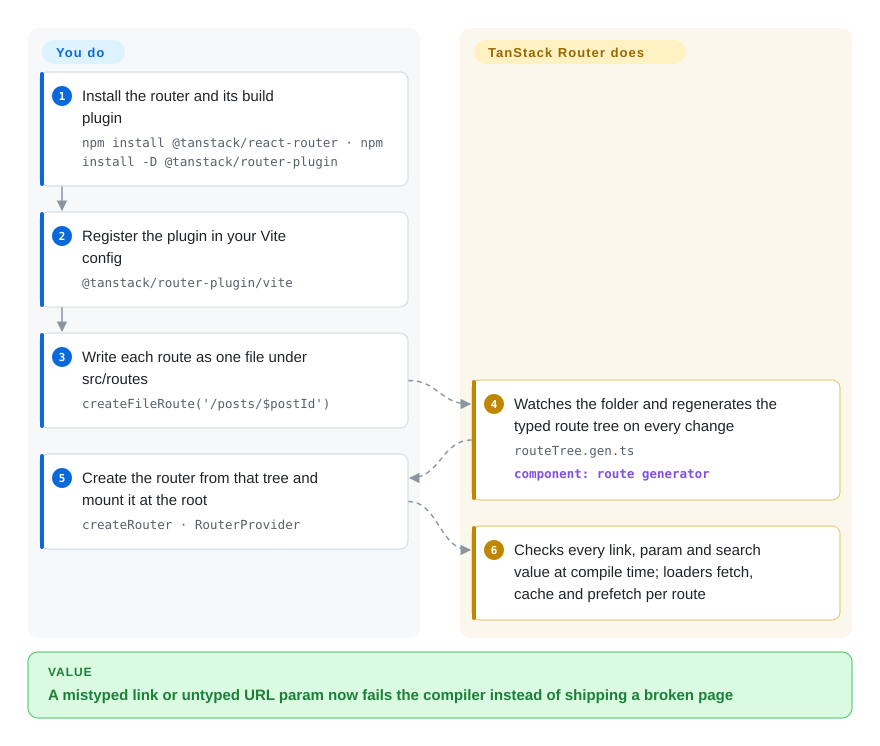

# TanStack Router

A link whose route doesn't exist, an `id` param that arrives as an untyped string, a query key renamed in one component while every shared link still carries the old one — routing mistakes like these normally surface at runtime, in front of users. TanStack Router makes the URL compiled code: it generates a typed route tree from your route files, so `<Link to>`, path params and search params are checked by TypeScript before the app can build, and per-route data loading (fetch, cache, prefetch) is built in rather than assembled from helpers.

## When to use

You are shipping a React app in which the URL is a state container — tabs, filters and pagination live in search params, deep links are a feature, and each route fetches its own data. Today every one of those URLs is a string: `useLocation().search` is parsed by hand, a link to a deleted route type-checks fine, and a stale filter key breaks the page silently for whoever shares it.

Reach for TanStack Router when **compile-time URL safety plus a built-in data layer is the requirement, and you want the routing to stay client-first**. The route tree is code — the file convention plus a codegen plugin produce `routeTree.gen.ts`, and anything the tree knows your app may not break: the `basic-file-based` example ships a literal `<Link to="/this-route-does-not-exist">` marked `@ts-expect-error`, because that is the point. Params arrive typed from the path segment, loaders run on navigation with SWR-style caching, invalidation and `preload: 'intent'`, and search params are structured JSON validated through optional schema adapters. Against React Router the deciding tradeoff is that type safety and first-class search-param state (the repo's own [comparison page](https://github.com/TanStack/router/blob/main/docs/router/comparison.md) rates React Router's typesafety partial and its search-param schema validation as unsupported — the maintainer's table, dated 2026-09-28, not a neutral benchmark). Against [Next.js](nextjs.md) the tradeoff is orientation: Next.js is server-first (RSC, ISR, platform-coupled optimizations), while Router is client-first and treats SSR as an upgrade path — the same router powers TanStack Start when you later want full-document SSR, streaming and typed server functions, though Start itself is at Release Candidate stage, not yet v1, per its docs note (2026-09-28).

## How it works

You describe routes as files: `posts.$postId.tsx` under `src/routes` declares `/posts/:postId`, and inside it `createFileRoute('/posts/$postId')({ loader, component, errorComponent })` pairs data fetching with a plain React component. Between your files and runtime sit two moving parts. A build plugin (`tanstackRouter()` from `@tanstack/router-plugin/vite`, also offered for Rspack/webpack/esbuild) watches the routes folder and regenerates `routeTree.gen.ts` — a plain TypeScript description of the whole tree, committed to the repo. Then `createRouter({ routeTree })` + `<RouterProvider>` consume it, and the router does the rest on its own: path params arrive typed, loaders fetch per match with stale-while-revalidate caching (serve the cached result immediately, refresh in the background) and prefetching you get by setting `defaultPreload: 'intent'`, search params are serialized as structured values, and `<Link>`/`useNavigate` accept only destinations the tree contains. You write route files, a loader and components; the types, the orchestration and the caching come from the generated tree. Code-based routes (`createRoute`) work without the plugin if you dislike codegen, but file-based is the mainline. TanStack Start layers full-document SSR, streaming, server functions and middleware over the same router when the client-first model stops being enough.

<!-- flow-steps:begin (generated from flows/tanstack-router.json by tools/flow_card.py — do not edit) -->

Text version of the flow

1. **You**: Install the router and its build plugin — `npm install @tanstack/react-router · npm install -D @tanstack/router-plugin`
2. **You**: Register the plugin in your Vite config — `@tanstack/router-plugin/vite`
3. **You**: Write each route as one file under src/routes — `createFileRoute('/posts/$postId')`
4. **TanStack Router**: Watches the folder and regenerates the typed route tree on every change — `routeTree.gen.ts` — component: `route generator`
5. **You**: Create the router from that tree and mount it at the root — `createRouter · RouterProvider`
6. **TanStack Router**: Checks every link, param and search value at compile time; loaders fetch, cache and prefetch per route

**Value**: A mistyped link or untyped URL param now fails the compiler instead of shipping a broken page

<!-- flow-steps:end -->

## When NOT to use

- **The app has a handful of static routes and no per-route data story.** The plugin-plus-generated-tree apparatus is real tooling you then maintain; plain React Router covers simple URL-to-component mapping without it (not indexed here, and not added in this intake batch — treat as a pointer, not a verified comparison).
- **You need React Server Components as a production default today.** Router's own comparison table lists RSC as supported only via its server-function layer and marks it experimental for Start, while [Next.js](nextjs.md) treats RSC as first-class — pick Next.js for a server-first architecture.
- **You want the Start full-stack framework but cannot accept Release-Candidate risk.** As of 2026-09-28 the Start docs call it "Release Candidate… considered feature-complete", not v1; teams that need a framework with years of majors behind it should pick [Next.js](nextjs.md), [Nuxt](nuxt.md) or [SvelteKit](sveltekit.md) and revisit later.
- **Routes must be registered at runtime** — module federation, fog-of-war route trees, plugins that add pages after boot. The repo's own comparison marks runtime route manipulation as not officially supported (`🛑`) while Next.js and React Router support it; parallel routes are also listed unsupported and the guide page is a placeholder ("We haven't covered this yet"). Use a framework whose route tree can change after startup.
- **The team is on Angular or Svelte.** There is no binding for either — the repo ships React, Vue and Solid packages; on those stacks the built-in [Angular](angular.md) router or [SvelteKit](sveltekit.md) is the coherent choice.
- **You must avoid committed generated files and a strict TS floor.** `routeTree.gen.ts` lives in the repo (merge conflicts included) and the install docs want React 18/19 with TypeScript 5.3+; if neither is acceptable, code-based routing keeps the plugin out but gives up the file-convention ergonomics that motivate the pick.

## Comparison

| Alternative | In index | Our verdict | Tradeoff |
|---|---|---|---|
| [Next.js](nextjs.md) | ✅ | When the app is client-first and the URL itself is the state you care to type, pick TanStack Router (optionally via Start); pick Next.js when RSC, ISR and Vercel-platform optimizations are the architecture, not an add-on. | Router gains full compile-time URL typing, a plain Vite build deployable anywhere, and SWR-style loader caching; it pays with a codegen dependency and a server story (Start) that is Release Candidate, not v1. |
| React Router | 未收录 | When you need typed links, typed params and schema-validated search params as the core feature, pick TanStack Router; when the routing need is plain nesting plus navigation without a codegen step, React Router is the lighter pick. | Router gains type safety and a built-in data layer; it pays plugin + generated-tree tooling. React Router was not added in this tab-intake batch, so this row is a pointer, not a verified comparison. |
| [SvelteKit](sveltekit.md) | ✅ | When you are on React and want its ecosystem plus typed routing you can adopt file-by-file, pick TanStack Router; on Svelte, pick SvelteKit — Router has no Svelte binding, and its generated tree would fight Svelte's compiler. | Router gains framework-agnostic core with React/Vue/Solid bindings and the richest search-param model; SvelteKit gains a runtime that needs no router add-on at all. |
| [Angular](angular.md) | ✅ | Treat this page as out of scope on Angular: the framework ships its own DI-driven, guard-equipped router as the coherent default; reach for TanStack Router only if the team has already chosen React/Vue/Solid. | Angular gains a decade-integrated official router; TanStack Router gains cross-framework typings and data-loading ergonomics that do not exist for Angular. |

## Tech stack

- **Language:** TypeScript monorepo (pnpm workspaces + Nx). Framework-agnostic core (`router-core`, `@tanstack/history`) with per-framework bindings: `@tanstack/react-router` (built on `@tanstack/react-store`), `@tanstack/vue-router`, `@tanstack/solid-router` — all published from this one repo.
- **Codegen & build integration:** `router-generator` / `router-cli` power the file-based route tree; `@tanstack/router-plugin` (and `router-vite-plugin`) wire it into Vite, with examples for Rspack, webpack and esbuild.
- **Search-param validation adapters:** `zod-adapter`, `valibot-adapter` and `arktype-adapter` ship in the same repo, published under `@tanstack/*`.
- **TanStack Start (same repo):** client/server split (`react-start-client`, `react-start-server`, `start-server-core`, …) built on Vite or Rsbuild, plus `nitro-v2-vite-plugin`, with example deployments for Netlify and Cloudflare.
- **Auxiliary packages:** `react-router-devtools`, `solid-router-devtools`, `eslint-plugin-router`, `react-router-ssr-query` (React Query bridge), `router-utils`.

## Dependencies

- **React 18.x or 19.x** (`peerDependencies: react >=18.0.0 || >=19.0.0` in `@tanstack/react-router`), ReactDOM with `createRoot`; install docs also state TypeScript 5.3+ is required-recommended, and the package's `engines` say Node `>=20.19`.
- **A supported bundler** for the file-based experience — the plugin runs inside Vite (or Rspack/webpack/esbuild via their plugins).
- **No database, service or account.** As a library it inherits your app's runtime; only the SSR/Start path adds a server process you deploy, and nothing in the repo requires a specific one.
- **Optional:** zod/valibot/arktype if you want schema-validated search params; `@tanstack/react-query` only if you use the SSR-query bridge.

## Ops difficulty

**Low as a router inside an existing app, medium as a full-stack framework.** In SPA mode you add a plugin, write route files, and merge the generated `routeTree.gen.ts` like any dependency — no service, no state, deploy is your existing frontend deploy. Two things raise the cost: the release cadence is fast (943 stable npm releases since 1.0.0, published near-daily through changesets, latest 1.170.40 on 2026-09-27), so pin and test upgrades; and TanStack Start moves you into server builds, streaming SSR and host-specific deployment (Vite or Rsbuild output to Netlify/Cloudflare/etc.), which is ordinary meta-framework ops but new weight compared to the SPA-only path.

## Health & viability

- **Maintenance — very active (verified 2026-09-28).** `pushed_at` 2026-09-28T09:38:57Z; release tag `release-2026-09-27-1408` with per-package tags the same day; `@tanstack/react-router` 1.170.40 published 2026-09-27. Cadence is changeset-driven, near-daily, 943 stable releases since 1.0.0 (2023-12-23).
- **Governance / bus factor — founder-led org with a small deep core.** The repo belongs to the `TanStack` organization; all-time contributions concentrate on `tannerlinsley` (3,271) and `schiller-manuel` (823), then a band around 300 (SeanCassiere, Sheraff, birkskyum). Roadmap influence sits with TanStack's founder; `CONTRIBUTING.md` requires maintainer sign-off for API changes.
- **Backing & Lindy — split signal, be precise about which "age" counts.** The repo was created 2019-01-14 (~7.7 years), but the current v1 line of the router dates from 2023-12 — a rewrite, not the same codebase as the 2019 `react-location` era [推断: version history read from npm (first stable 1.0.0 2023-12-23) and the repo's own release tags; the rename lineage is widely described but was not traced commit-by-commit]. Backing is bootstrapped: docs state TanStack is "100% open source… TanStack LLC… privately held, 100% bootstrapped and self-funded", funded via GitHub Sponsors and tanstack.com partners (README shows CodeRabbit, Cloudflare, Netlify).
- **Adoption — large and still climbing.** The health scorer resolves the registry signal to `@tanstack/router-core` at **85,508,552 downloads in the last month**; my own npm query put `@tanstack/react-router` at 81,399,975 in the 2026-08-29..2026-09-27 window [未验证: registry counts include CI mirrors/caching, so treat both as upper bounds]. GitHub shows ~15.1k stars / ~1.9k forks — an order of magnitude below Next.js; strong, not dominant.
- **Risk flags — Start is not v1 yet, churn is real, and the comparison is self-graded.** Start is Release Candidate per its docs (2026-09-28); near-daily micro releases over a large API surface mean upgrades are never "done"; the repo's `comparison.md` is maintainer-written, so read it as their claims; the README opens with a `static.scarf.sh` tracking pixel (render-time analytics, not a library runtime dependency). GitHub's 686 open-issue count [推断: GitHub's counter includes open pull requests, so it overstates open bugs] is a triage-lag question, not an abandonment signal, given the same-day release activity.

## Caveats (unverified)

- `[未验证]` **npm download figures (81.4M/94-day-window month for the router package)** are registry-reported and include CI mirrors and cached installs; no independent install-rate source was checked.
- `[未验证]` **The lineage claim that today's router is a rewrite of the 2019 `react-location` repo** rests on npm version history and repo tags, not on a traced rename record.
- `[推断]` **686 "open issues" overstates open bugs** because GitHub's `open_issues_count` includes open PRs; the responsiveness grade from `health.py` is the better signal.
- `[未验证]` **Runtime route manipulation / parallel-route support** is read from the repo's own `docs/router/comparison.md` (dated 2026-09-28); no code-level confirmation was attempted.
- `[未验证]` **React Server Components status** ("experimental") comes from the same maintainer table and the Start docs; the actual capability level was not tested.
- `[未验证]` **Bundle-size superiority** over React Router is asserted by the README/comparison badges (bundlephobia links) and was not independently measured.
- `[未验证]` **Deployment parity for Start across hosts** (Netlify/Cloudflare/Vercel) is evidenced only by in-repo examples, not by a production reference survey.
