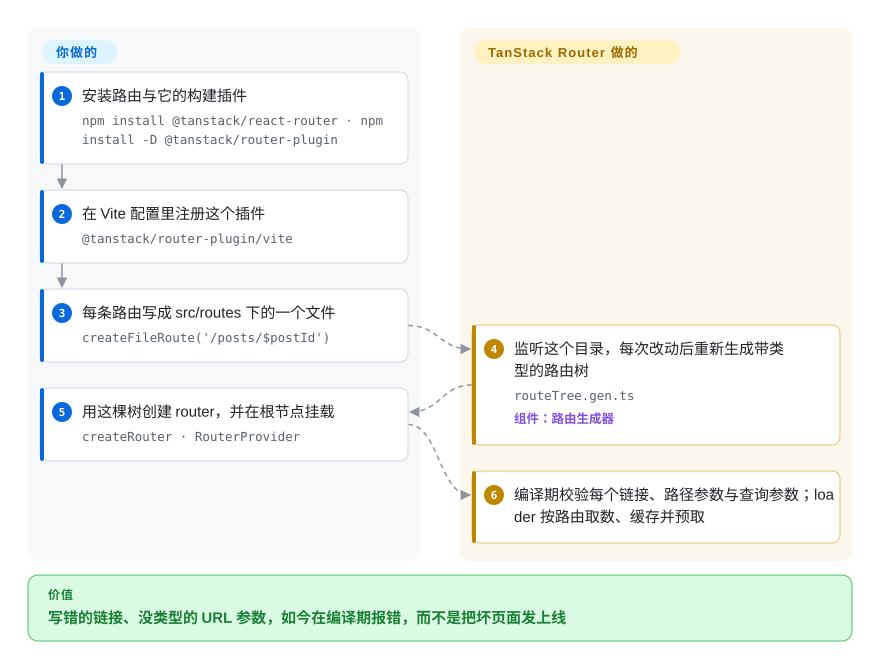

# TanStack Router

指向不存在路由的链接、到手是一个无类型字符串的 `id` 参数、某个组件里改了名的查询参数键——这些路由事故通常要到运行时、在用户面前才暴露。TanStack Router 把 URL 变成参与编译的代码：它从你的路由文件生成一棵带类型的路由树，`<Link to>`、路径参数与查询参数在应用能构建成功之前就被 TypeScript 检查过；按路由取数、缓存与预取也是内置能力，而不是自己拼工具函数。

## 何时使用

你在做一个 React 应用，URL 就是状态容器——页签、筛选器、分页都放在查询参数里，深链接是功能本身，每条路由各自取数据。而今天这些 URL 全是字符串：`useLocation().search` 要手工解析，指向已删除路由的链接类型检查照样通过，某个筛选参数一改名，分享出去的旧链接就悄悄白屏。

当**编译期的 URL 安全加上内置数据层是硬需求、且你希望路由保持客户端优先**时，选 TanStack Router。路由树是代码——文件约定加一个构建插件生成 `routeTree.gen.ts`，凡是树不知道的，应用就不许出现：官方 `basic-file-based` 示例里就字面放着一个标了 `@ts-expect-error` 的 `<Link to="/this-route-does-not-exist">`，这正是它要证明的事。路径参数按 URL 段带上类型；loader 在导航时运行，自带 SWR 式缓存、失效与 `preload: 'intent'` 悬停预取；查询参数以结构化 JSON 序列化，可再经 zod／valibot／arktype 适配器做 schema 校验。相对 React Router，决定性取舍就是这层类型安全与作为一等公民的查询参数状态——仓库自己的[对比表](https://github.com/TanStack/router/blob/main/docs/router/comparison.md)把 React Router 的类型安全列为部分支持、查询参数 schema 校验列为不支持（2026-09-28 读到的维护者立场，不是中立评测）。相对 [Next.js](nextjs.zh.md)，取舍是方向：Next.js 服务器优先（RSC、ISR、与平台深度耦合的优化），而 Router 客户端优先、把 SSR 当作可选升级路径——同一套路由撑起 TanStack Start，等你真需要全文档 SSR、流式渲染与类型安全的 server functions 时再上；但按其文档标注（2026-09-28），Start 尚处 Release Candidate，不是 v1。

## 怎么用起来

你以文件描述路由：`src/routes` 下的 `posts.$postId.tsx` 声明 `/posts/:postId`，文件内用 `createFileRoute('/posts/$postId')({ loader, component, errorComponent })` 把取数与一个普通 React 组件配对。在你的文件与运行时之间有两个活动部件。构建插件（`@tanstack/router-plugin/vite` 导出的 `tanstackRouter()`，也有 Rspack／webpack／esbuild 形态）监听路由目录，重新生成 `routeTree.gen.ts`——一份对整棵树的纯 TypeScript 描述，提交进仓库。随后 `createRouter({ routeTree })` 加 `<RouterProvider>` 消费它，其余由路由自己完成：路径参数到手即带类型；loader 按匹配执行 stale-while-revalidate（先给缓存结果，后台再刷新）；设了 `defaultPreload: 'intent'` 就有悬停预取；查询参数序列化为结构化值；`<Link>`／`useNavigate` 只接受路由树里存在的目标。你写的只是路由文件、loader 和组件，类型、编排与缓存都来自生成的树。不喜欢代码生成也可以用代码式 `createRoute`，但文件约定才是主干。当客户端优先模型不再够用，TanStack Start 在同一套路由之上叠加全文档 SSR、流式、server functions 与中间件。

<!-- flow-steps:begin (generated from flows/tanstack-router.json by tools/flow_card.py — do not edit) -->

流程文字版

1. **你**：安装路由与它的构建插件 — `npm install @tanstack/react-router · npm install -D @tanstack/router-plugin`
2. **你**：在 Vite 配置里注册这个插件 — `@tanstack/router-plugin/vite`
3. **你**：每条路由写成 src/routes 下的一个文件 — `createFileRoute('/posts/$postId')`
4. **TanStack Router**：监听这个目录，每次改动后重新生成带类型的路由树 — `routeTree.gen.ts` — 组件：`路由生成器`
5. **你**：用这棵树创建 router，并在根节点挂载 — `createRouter · RouterProvider`
6. **TanStack Router**：编译期校验每个链接、路径参数与查询参数；loader 按路由取数、缓存并预取

**价值**：写错的链接、没类型的 URL 参数，如今在编译期报错，而不是把坏页面发上线

<!-- flow-steps:end -->

## 何时不用

- **应用只有寥寥几条静态路由，也没有按路由取数的需求。** 插件加生成树这套机制是你之后要持续维护的真实工具成本；简单的 URL 到组件映射用 React Router 就够（本索引未收录，本批次也未添加——当作指路，不是经过核实的对比）。
- **今天就要把 React Server Components 当生产默认。** 仓库自己的对比表把 RSC 列为仅经 server-function 层支持、对 Start 标注实验性，而 [Next.js](nextjs.zh.md) 把 RSC 作为一等功能——服务器优先的架构选 Next.js。
- **想要 Start 的全栈能力，但承受不起 Release-Candidate 风险。** 截至 2026-09-28，Start 文档自述「Release Candidate……功能完备」而非 v1；需要多年大版本背书框架的团队，选 [Next.js](nextjs.zh.md)、[Nuxt](nuxt.zh.md) 或 [SvelteKit](sveltekit.zh.md)，以后再说。
- **路由必须在运行时注册**——模块联邦、fog-of-war 动态路由树、启动后再加页面的插件。仓库对比表把运行时路由操纵列为不支持（`🛑`），而 Next.js 与 React Router 支持；并行路由同样列为不支持，且其指南页还是占位（写着「我们还没讲到这个」）。需要启动后路由树仍可变化的框架。
- **团队在 Angular 或 Svelte 上。** 两者都没有绑定——本仓库发布的是 React、Vue、Solid 三个绑定；在这些栈上，[Angular](angular.zh.md) 的内置路由或 [SvelteKit](sveltekit.zh.md) 才是自洽选择。
- **不能接受仓库里放生成文件、也不能接受严格的 TypeScript 下限。** `routeTree.gen.ts` 要提交进仓库（也就带来合并冲突），安装文档要求 React 18／19 并建议 TypeScript 5.3 起步；两者都不可接受时，代码式路由能绕开插件，但也就放弃了促成这次选型的核心文件体验。

## 横向对比

| 替代品 | 是否收录 | 我们的评价 | 取舍 |
|---|---|---|---|
| [Next.js](nextjs.zh.md) | ✅ | 应用客户端优先、你在意的是给 URL 这层状态做类型时，选 TanStack Router（必要时经 Start）；RSC、ISR 与 Vercel 平台优化就是架构本身时，选 Next.js。 | Router 换来编译期全 URL 类型、可部署任何地方的普通 Vite 构建与 SWR 式 loader 缓存；付出一个代码生成依赖，以及一个还是 Release Candidate 的服务端故事。 |
| React Router | 未收录 | 类型化链接、类型化参数与经校验的查询参数是核心诉求时，选 TanStack Router；只需要普通嵌套与导航、不想引入代码生成时，React Router 更轻。 | Router 换来类型安全与内置数据层，代价是插件加生成树的工具链。React Router 本批次未添加，此行只是指路，不是经过核实的对比。 |
| [SvelteKit](sveltekit.zh.md) | ✅ | 栈是 React、想要生态与可按文件逐个采用的类型化路由时，选 TanStack Router；栈是 Svelte 就选 SvelteKit——Router 没有 Svelte 绑定，其生成树也会与 Svelte 编译器相抵。 | Router 换来框架无关核心加 React／Vue／Solid 三绑定、以及最完整的查询参数模型；SvelteKit 换来一个根本不需要外挂路由的运行时。 |
| [Angular](angular.zh.md) | ✅ | 在 Angular 上就把本页视为范围之外：框架自带的、与 DI 和守卫深度整合的路由才是自洽默认；只有团队已经选了 React／Vue／Solid，才轮到 TanStack Router。 | Angular 换来十年一体集成的官方路由；TanStack Router 换来跨框架类型与数据加载手感——而这些在 Angular 上不存在。 |

## 技术栈

- **语言：** TypeScript 单体仓（pnpm workspaces 加 Nx）。框架无关核心（`router-core`、`@tanstack/history`）配各框架绑定：`@tanstack/react-router`（构建在 `@tanstack/react-store` 上）、`@tanstack/vue-router`、`@tanstack/solid-router`——全部由这一个仓库发布。
- **代码生成与构建集成：** `router-generator`／`router-cli` 驱动文件式路由树；`@tanstack/router-plugin`（含 `router-vite-plugin`）接入 Vite，示例覆盖 Rspack、webpack 与 esbuild。
- **查询参数校验适配器：** `zod-adapter`、`valibot-adapter`、`arktype-adapter` 与主包同仓发布（`@tanstack/*`）。
- **TanStack Start（同仓）：** 客户端／服务端分包（`react-start-client`、`react-start-server`、`start-server-core` 等），基于 Vite 或 Rsbuild，另有 `nitro-v2-vite-plugin`；示例含 Netlify 与 Cloudflare 部署。
- **周边包：** `react-router-devtools`、`solid-router-devtools`、`eslint-plugin-router`、`react-router-ssr-query`（React Query 桥）、`router-utils`。

## 依赖

- **React 18.x 或 19.x**（`@tanstack/react-router` 的 `peerDependencies: react >=18.0.0 || >=19.0.0`）、支持 `createRoot` 的 ReactDOM；安装文档同时建议 TypeScript 5.3 起步，包 `engines` 写明 Node `>=20.19`。
- **一个受支持的打包器**才有文件式体验——插件跑在 Vite 内（Rspack／webpack／esbuild 有对应形态）。
- **无数据库、无服务、无账号。** 作为库它继承你应用的运行时；只有 SSR／Start 路径会多出你要部署的服务端进程，仓库本身不指定是哪一种。
- **可选：** 想要查询参数 schema 校验才装 zod／valibot／arktype；用 SSR-query 桥才需要 `@tanstack/react-query`。

## 运维难度

**作为既有应用里的路由是低，作为全栈框架是中。** SPA 模式下你只是加一个插件、写路由文件，并把生成的 `routeTree.gen.ts` 当普通依赖合并——没有服务、没有状态，部署沿用你的前端部署。两处抬高成本：发版极快（自 1.0.0 以来 943 个 npm 稳定版、经 changesets 接近逐日发布，最新 1.170.40 发布于 2026-09-27），要锁版本并测升级；以及 TanStack Start 把你带进服务端构建、流式 SSR 与按宿主的部署（Vite 或 Rsbuild 产物发往 Netlify／Cloudflare 等）——这是元框架的日常运维，但相对纯 SPA 路径是新增的重量。

## 健康度与可持续性

- **维护——非常活跃（2026-09-28 核实）。** `pushed_at` 为 2026-09-28T09:38:57Z；发布标签 `release-2026-09-27-1408` 与同日的分包标签；`@tanstack/react-router` 1.170.40 发布于 2026-09-27。节奏是 changeset 驱动的接近逐日发布，自 1.0.0（2023-12-23）以来 943 个稳定版。
- **治理／巴士因子——创始人主导的组织，核心小而深。** 仓库属 `TanStack` 组织；历史贡献集中在 `tannerlinsley`（3,271）与 `schiller-manuel`（823），随后是 300 上下一档（SeanCassiere、Sheraff、birkskyum）。路线图话语权在 TanStack 创始人一侧；`CONTRIBUTING.md` 要求 API 变更先经维护者在 issue 上认可。
- **背书与 Lindy——信号分裂，先想清楚哪个「年龄」才算数。** 仓库创建于 2019-01-14（约 7.7 年），但当前 v1 线路由始于 2023-12——是一次重写，而非 2019 年 `react-location` 时期的同一代码库 [推断：依据是 npm 版本史（首个稳定版 1.0.0 于 2023-12-23）与仓库发布标签；改名沿革广为人知，但未逐 commit 追溯]。背书为自筹：文档自述 TanStack「100% 开源……TanStack LLC……私有、100% 自筹、无风投」，资金来自 GitHub Sponsors 与 tanstack.com 合作伙伴（README 展示 CodeRabbit、Cloudflare、Netlify）。
- **采用度——大且仍在爬。** 健康度打分器把注册表信号解析到 `@tanstack/router-core`，**上月下载 85,508,552 次**；我实测 npm 口径 `@tanstack/react-router` 在 2026-08-29 至 2026-09-27 窗口下载 81,399,975 次 [未验证：注册表计数含 CI 镜像与缓存，两个数都应视作上界]；GitHub 约 15.1k stars／1.9k forks，比 Next.js 低一个数量级——强势，但谈不上统治级。
- **风险信号——Start 未 v1、变更频繁、对比表自卖自夸。** Start 按文档（2026-09-28）仍是 Release Candidate；大 API 面配接近逐日的 micro 发版意味着升级永远「没做完」；仓库的 `comparison.md` 出自维护者之手，当他们的说法读；README 开头挂着 `static.scarf.sh` 追踪像素（渲染期统计，不是库的运行期依赖）。GitHub 的 686 条 open issues [推断：该计数含未关闭 PR，高估了未决 bug 数] 在同日仍在发版的背景下更像分诊滞后，而非弃维护信号。

## 存疑（未验证）

- `[未验证]` **npm 下载数（路由包单月 8,140 万）**为注册表口径，包含 CI 镜像与缓存安装；未找到独立安装量来源交叉验证。
- `[未验证]` **「当前路由是 2019 年 `react-location` 仓库的重写」这一沿革**只依据 npm 版本史与仓库标签，没有追溯改名记录。
- `[推断]` **686 条「open issues」高估了未决 bug**，因为 GitHub 的 `open_issues_count` 含未关闭 PR；`health.py` 的响应度分级是更好的信号。
- `[未验证]` **运行时路由操纵／并行路由的支持状态**读自仓库自己的 `docs/router/comparison.md`（2026-09-28），未做代码级确认。
- `[未验证]` **React Server Components 的「实验性」定位**同样出自维护者对比表与 Start 文档，实际能力未实测。
- `[未验证]` **相对 React Router 的包体积优势**只有 README／对比表里的 bundlephobia 徽章为据，未独立测量。
- `[未验证]` **Start 在各托管平台（Netlify／Cloudflare／Vercel）的部署一致性**只有仓内示例佐证，未做生产案例调查。
