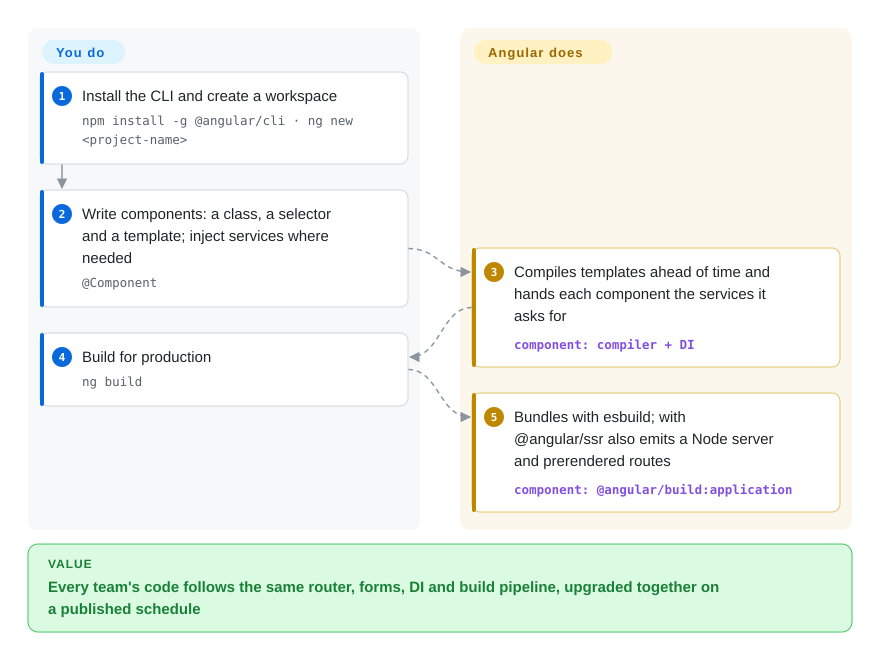

# Angular

When a large team builds a React or Vue app, each squad picks its own router, form library, HTTP wrapper and state pattern, and two years later no two parts of the codebase are wired the same way. Angular ships all of those as one versioned framework from Google, with a CLI that scaffolds, builds and upgrades them together.

## When to use

You're an enterprise team building a large, complex web application with dozens of screens, strict coding standards, and a need for long-term maintainability. You evaluate React, but its "bring your own everything" philosophy means you would spend weeks choosing and wiring together routing, state management, and form validation libraries — and then re-litigating those choices every time a squad starts a new feature. You evaluate Vue, but its gentler learning curve comes with less built-in structure for large teams. You choose Angular because it ships with what a large app needs in one box: a CLI for scaffolding and builds, a router with lazy loading, reactive and template-driven forms, an HTTP client, dependency injection, signals for fine-grained reactivity, and first-class TypeScript. Its opinionated structure means new hires recognise the patterns in any Angular codebase, and the published support policy — from v22 a major release every 12 months, each supported for 24 months — lets you plan upgrades years ahead.

## How it works

Angular is a compiler plus a runtime plus a CLI that ties them together. **You write components**: a TypeScript class with an `@Component` decorator that declares a CSS selector (the HTML tag that uses it, such as `<user-profile>`), a template in Angular's HTML syntax, and optional styles; services are plain classes that Angular's *dependency injection* (it constructs a shared instance and passes it to whoever asks for it) hands to components. **Angular does the rest**: the compiler turns each template into JavaScript instructions ahead of time, the router lazy-loads feature areas, and change detection — driven by signals and component events, without the zone.js library by default since v21 — re-renders only what changed. The CLI is the single entry point: `ng new` creates a workspace, `ng serve` runs a Vite-based dev server, and `ng build` runs the esbuild-based `@angular/build:application` builder that bundles the client and, if you added `@angular/ssr`, a Node server plus prerendered routes. Think of it as a building code: every team builds rooms differently, but the plumbing and wiring always sit in the same walls.

<!-- flow-steps:begin (generated from flows/angular.json by tools/flow_card.py — do not edit) -->

Text version of the flow

1. **You**: Install the CLI and create a workspace — `npm install -g @angular/cli · ng new <project-name>`
2. **You**: Write components: a class, a selector and a template; inject services where needed — `@Component`
3. **Angular**: Compiles templates ahead of time and hands each component the services it asks for — component: `compiler + DI`
4. **You**: Build for production — `ng build`
5. **Angular**: Bundles with esbuild; with @angular/ssr also emits a Node server and prerendered routes — component: `@angular/build:application`

**Value**: Every team's code follows the same router, forms, DI and build pipeline, upgraded together on a published schedule

<!-- flow-steps:end -->

## When NOT to use

- **If you need a small landing page, blog, or simple CRUD with fewer than 10 screens, use Vite + [React](react.md) or [Vue](vue.md) instead of Angular, because** Angular's structure and build layer are overkill for small projects. You will ship faster with a lighter stack.
- **If your team avoids TypeScript, use plain React or Vue instead of Angular, because** Angular is TypeScript-native: decorators, DI and the template type-checker all assume it. A team that prefers plain JavaScript will feel constant friction.
- **If you need rapid prototyping or a quick MVP, use [Next.js](../app-frameworks/nextjs.md) or Vue instead of Angular, because** Angular's CLI-generated structure and conventions slow down throwaway iteration. A lighter framework is better for hackathons and prototypes.
- **If the site is mostly static, SEO-critical content, use [Astro](../site-frameworks/astro.md) (or Next.js / [Nuxt](../app-frameworks/nuxt.md) for a React or Vue team) instead of Angular, because** although `@angular/ssr` now prerenders routes and supports hybrid rendering, every Angular page still boots the full framework in the browser, whereas content-first tools ship mostly HTML.
- **If you need mixed-framework micro-frontends, prefer a React- or Web-Components-based shell (for example [Lit](lit.md) for shared widgets) over Angular-in-every-slot, because** each Angular micro-frontend brings its own runtime and DI tree and must keep Angular versions aligned; zoneless-by-default (v21+) removed one historic conflict, but integration effort with non-Angular shells is still real.
- **If bundle size is critical for low-bandwidth or mobile-first markets, use [Svelte](svelte.md) or Preact instead of Angular, because** Angular's framework runtime is larger than those libraries' and the initial payload can be a concern on slow networks.

## Comparison

| Alternative | In index | Our verdict | Tradeoff |
| --- | --- | --- | --- |
| [React](react.md) | ✅ | Choose React when ecosystem breadth and hiring pool outweigh a single prescribed architecture; choose Angular when consistency across many teams matters more. | React is more flexible and has a larger job market; Angular is more opinionated and ships router, forms, HTTP and DI built in, reducing decision fatigue. |
| [Vue.js](vue.md) | ✅ | Choose Vue for incremental adoption and a gentler learning curve; choose Angular when a large team needs enforced structure from day one. | Vue is easier to adopt page by page; Angular demands all-in commitment but rewards it with a uniform enterprise structure. |
| [Svelte](svelte.md) | ✅ | Choose Svelte for small-to-medium apps where minimal runtime and simple components matter most; choose Angular for long-lived enterprise apps with many contributors. | Svelte compiles to less JavaScript and has fewer concepts; Angular has deeper enterprise tooling, more third-party integrations and a longer track record. |
| [SvelteKit](../app-frameworks/sveltekit.md) | ✅ | Choose SvelteKit when you want a lean full-stack meta-framework with server routes and adapters; choose Angular for a large client-heavy app with built-in DI and forms. | SvelteKit adds routing, SSR and server endpoints around Svelte; Angular remains more opinionated, longer-established, and keeps the backend separate. |
| [Next.js](../app-frameworks/nextjs.md) | ✅ | Choose Next.js for React-based SSR/SSG and server components; choose Angular when the app is mostly authenticated, client-heavy screens. | Next.js is the default for React SSR and SEO; Angular's `@angular/ssr` covers SSR and prerendering but has a smaller ecosystem in that niche. |
| [shadcn/ui](../../component-libraries/shadcn-ui.md) | ✅ | Not a substitute: if you are choosing React and want owned, copy-in components, pair React with shadcn/ui; with Angular, use Angular Material or another Angular kit. | shadcn/ui is a component-distribution model for React; Angular is a full application framework with its own official component library. |
| [Lit](lit.md) | ✅ | Choose Lit to build a design system that must work across frameworks; choose Angular to build the application itself. | Lit produces standard custom elements usable anywhere but has no router, DI or CLI; Angular is a complete framework whose components are Angular-only unless exported via Angular Elements. |

## Tech stack

- **TypeScript** — primary language; Angular went all-in on TypeScript early.
- **Signals** — fine-grained reactivity primitive; with zoneless change detection the default since v21, signals and template events drive re-rendering.
- **Zone.js** — the former change-detection trigger, now optional (still supported via `provideZoneChangeDetection`).
- **RxJS** — reactive streams used by HttpClient, router events and many libraries (peer dependency of `@angular/core`).
- **Ivy compiler** — ahead-of-time template compilation and rendering pipeline.
- **Angular CLI** — `@angular/build:application` (esbuild) is the default builder for new apps, with a Vite-based dev server; the webpack-based builder remains for legacy setups.
- **`@angular/ssr`** — server-side rendering, prerendering (SSG) and hybrid per-route render modes (replaces the old "Angular Universal" name).
- **Angular Material / CDK** — the official component library and behaviour primitives.

## Dependencies

- **Node.js** — for the CLI and builds; Angular 22 packages declare Node `^22.22.3 || ^24.15.0 || >=26.0.0`.
- **TypeScript** — required in practice; the framework is designed around it.
- **A modern evergreen browser** — IE11 support is long gone.
- **Optional: a Node.js server** — only if you enable SSR with `@angular/ssr`; fully prerendered or client-only builds are static files.
- **Optional: Angular Material** — pre-built Material Design components.
- **Optional: NgRx / NGXS / signal stores** — for complex state beyond services and signals.

## Ops difficulty

**Low to Medium**. Angular apps are static SPAs (or SSR apps) that deploy to any CDN or web server. The CLI handles the build pipeline, tree-shaking, and optimization. Complexity arises when:
- You still depend on custom webpack configs (e.g., for module federation) and must stay on the legacy builder or migrate to the esbuild one
- You enable SSR and must run a Node.js server
- You manage monorepos with multiple Angular apps (Nx is the common solution)
- You upgrade major versions — from v22 Angular ships one major per year, each supported for 24 months (12 active + 12 LTS), so plan one `ng update` cycle a year

## Health & viability

- **Maintenance (2026-10-08):** very active — v22.2.1 released 2026-09-30, with patches published the same day for the v21 and v20 LTS lines; weekly patch and pre-release cadence per the published release policy.
- **Governance / bus factor:** run by a dedicated Google team with a broad contributor base (about 92 active contributors in the scorer's 12-month window, top contributor about 16% of commits) — low bus-factor risk, but the roadmap is Google's.
- **Backing & longevity:** Angular (2+) has been developed in this repo since 2014 and is Google-backed; ~12 years of continuous releases plus a written support schedule (v20–v22 currently supported) make it one of the strongest Lindy bets in front-end frameworks. The 2026 switch from a 6-month to a 12-month major cadence reduces upgrade churn.
- **Adoption & ecosystem:** ~101k GitHub stars and 25,836,769 npm downloads of `@angular/core` in the last month (scorer snapshot, 2026-10-08); a mature ecosystem (Material, NgRx, Nx) concentrated in enterprise use.
- **Risk flags:** MIT, no relicensing history. The real risk is architectural churn — standalone components, signals and zoneless change detection have shifted recommended patterns across recent majors, so older codebases face migration work even though `ng update` automates much of it.

## Caveats (unverified)

- [推断] The exact proportion of Google-internal apps using Angular has not been verified.
- [未验证] The precise number of enterprise production deployments and their scale has not been independently audited.
- [未验证] Angular's market share relative to React and Vue in new project starts is inferred from job postings and community surveys, not hard data.
- [推断] Micro-frontend integration with non-Angular shells is possible but the exact friction level depends on the module-federation setup.
- [推断] The actual performance impact of Angular's bundle size compared to React or Vue varies by application and optimization strategy.
- [未验证] Download and contributor counts are point-in-time scorer snapshots (2026-10-08).
