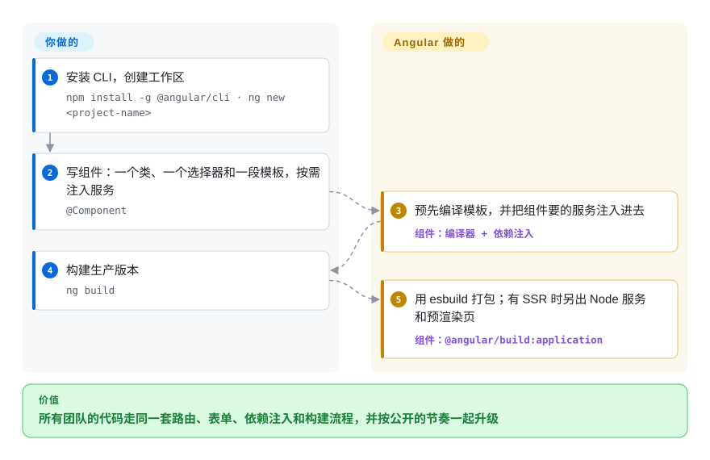

# Angular

大团队用 React 或 Vue 做应用，每个小组各挑各的路由、表单库、HTTP 封装和状态方案，两年后代码库里找不到两块接法相同的地方。Angular 把这些都放进一个由 Google 维护、统一版本的框架里，再用一个 CLI 负责生成、构建和一起升级。

## 何时使用

你是一支企业团队，正在构建一个大型、复杂的 Web 应用，包含数十个页面、严格的编码规范，并对长期可维护性有要求。你评估过 React，但它“自带一切”的哲学意味着你要花数周时间挑选并拼接路由、状态管理和表单验证库——而且每个小组开新功能时都要把这些选择重新争论一遍。你评估过 Vue，但它更温和的学习曲线对大型团队而言内置结构不足。你选择 Angular，因为大型应用要的东西它一盒全包：负责脚手架和构建的 CLI、支持懒加载的路由器、响应式表单和模板驱动表单、HTTP 客户端、依赖注入、做细粒度响应式的 Signals，以及一流的 TypeScript 体验。它的强约定结构让新人在任何 Angular 代码库里都能认出同样的模式；公开的支持策略——从 v22 起每 12 个月一个大版本、每个大版本支持 24 个月——让你能提前几年排升级计划。

## 怎么用起来

Angular 是编译器、运行时和把两者串起来的 CLI。**你写组件**：一个带 `@Component` 装饰器的 TypeScript 类，声明一个 CSS 选择器（使用它的 HTML 标签，比如 `<user-profile>`）、一段 Angular 语法的 HTML 模板和可选的样式；服务就是普通的类，由 Angular 的*依赖注入*（框架负责创建一个共享实例，谁要就递给谁）交给组件。**其余由 Angular 完成**：编译器预先把每段模板编译成 JavaScript 指令；路由器按功能区懒加载；变更检测——v21 起默认不再依赖 zone.js，而由 Signals 和组件事件驱动——只重新渲染变了的部分。CLI 是唯一入口：`ng new` 创建工作区，`ng serve` 启动基于 Vite 的开发服务器，`ng build` 调用基于 esbuild 的 `@angular/build:application` 构建器，打包客户端代码；如果加了 `@angular/ssr`，还会产出一个 Node 服务和预渲染好的页面。打个比方，它像建筑规范：每个团队的房间装修各不相同，但水管和电线永远走同样的墙。

<!-- flow-steps:begin (generated from flows/angular.json by tools/flow_card.py — do not edit) -->

流程文字版

1. **你**：安装 CLI，创建工作区 — `npm install -g @angular/cli · ng new <project-name>`
2. **你**：写组件：一个类、一个选择器和一段模板，按需注入服务 — `@Component`
3. **Angular**：预先编译模板，并把组件要的服务注入进去 — 组件：`编译器 + 依赖注入`
4. **你**：构建生产版本 — `ng build`
5. **Angular**：用 esbuild 打包；有 SSR 时另出 Node 服务和预渲染页 — 组件：`@angular/build:application`

**价值**：所有团队的代码走同一套路由、表单、依赖注入和构建流程，并按公开的节奏一起升级

<!-- flow-steps:end -->

## 何时不用

- **如果你只需要落地页、博客或不足 10 个页面的简单增删改查，用 Vite 加 [React](react.zh.md) 或 [Vue](vue.zh.md)，不要用 Angular，因为** Angular 的结构和构建层对小项目是大材小用，更轻的栈能让你更快交付。
- **如果团队回避 TypeScript，用纯 React 或 Vue，不要用 Angular，因为** Angular 原生建立在 TypeScript 上：装饰器、依赖注入和模板类型检查都默认你在用它。偏好纯 JavaScript 的团队会一直别扭。
- **如果你要快速做原型或 MVP，用 [Next.js](../app-frameworks/nextjs.zh.md) 或 Vue，不要用 Angular，因为** CLI 生成的结构和各种约定会拖慢“做完就扔”式的迭代。黑客马拉松和原型更适合轻量框架。
- **如果站点以静态、对 SEO 要求高的内容为主，用 [Astro](../site-frameworks/astro.zh.md)（React 或 Vue 团队也可以用 Next.js / [Nuxt](../app-frameworks/nuxt.zh.md)），不要用 Angular，因为** 虽然 `@angular/ssr` 现在支持预渲染和混合渲染，但每个 Angular 页面在浏览器里仍要启动整个框架，而内容优先的工具发出去的主要是 HTML。
- **如果你要做混合框架的微前端，优先用基于 React 或 Web Components 的外壳（共享小组件可以用 [Lit](lit.zh.md)），不要每个槽位都塞一个 Angular，因为** 每个 Angular 微前端都自带一份运行时和依赖注入树，还得对齐 Angular 版本；v21 起默认不用 zone.js 消除了一个历史冲突，但和非 Angular 外壳集成的工作量依然真实存在。
- **如果包体积对低带宽或移动优先市场至关重要，用 [Svelte](svelte.zh.md) 或 Preact，不要用 Angular，因为** Angular 的框架运行时比它们大，慢网络下首次加载体积可能成为问题。

## 横向对比

| 替代品 | 是否收录 | 我们的评价 | 取舍 |
| --- | --- | --- | --- |
| [React](react.zh.md) | ✅ | 生态广度和招聘池比统一架构更重要时选 React；多个团队之间的一致性更重要时选 Angular。 | React 更灵活，就业市场更大；Angular 更有主见，路由、表单、HTTP 和依赖注入都内置，减少决策疲劳。 |
| [Vue.js](vue.zh.md) | ✅ | 想逐页渐进引入、学习曲线平缓时选 Vue；大团队从第一天就需要强制结构时选 Angular。 | Vue 更容易一页一页地引入；Angular 要求全盘投入，回报是统一的企业级结构。 |
| [Svelte](svelte.zh.md) | ✅ | 中小型应用、最看重运行时小和组件简单时选 Svelte；贡献者众多、生命周期长的企业应用选 Angular。 | Svelte 编译出的 JavaScript 更少、概念更少；Angular 企业工具链更深、第三方集成更多、历史更长。 |
| [SvelteKit](../app-frameworks/sveltekit.zh.md) | ✅ | 想要带服务端接口和 adapter 的轻量全栈元框架时选 SvelteKit；客户端很重、需要内置依赖注入和表单的大型应用选 Angular。 | SvelteKit 在 Svelte 外面加了路由、SSR 和服务端接口；Angular 更有主见、历史更长，后端则保持独立。 |
| [Next.js](../app-frameworks/nextjs.zh.md) | ✅ | 要基于 React 的 SSR/SSG 和服务端组件时选 Next.js；应用主要是登录后的重客户端页面时选 Angular。 | Next.js 是 React SSR 和 SEO 的默认选择；Angular 的 `@angular/ssr` 也覆盖 SSR 和预渲染，但在这一细分领域生态更小。 |
| [shadcn/ui](../../component-libraries/shadcn-ui.zh.md) | ✅ | 不是替代品：如果你选的是 React、又想要复制进项目自己掌控的组件，React 配 shadcn/ui；用 Angular 则配 Angular Material 或其他 Angular 组件库。 | shadcn/ui 是面向 React 的组件分发方式；Angular 是自带官方组件库的完整应用框架。 |
| [Lit](lit.zh.md) | ✅ | 要做一套跨框架通用的设计系统选 Lit；要做应用本身选 Angular。 | Lit 产出的标准自定义元素在哪都能用，但没有路由、依赖注入和 CLI；Angular 是完整框架，它的组件只在 Angular 里用，除非通过 Angular Elements 导出。 |

## 技术栈

- **TypeScript**——主要语言；Angular 很早就全面拥抱 TypeScript。
- **Signals**——细粒度响应式原语；v21 起默认采用无 zone 的变更检测，由 Signals 和模板事件驱动重新渲染。
- **Zone.js**——过去的变更检测触发器，现在是可选项（仍可通过 `provideZoneChangeDetection` 启用）。
- **RxJS**——HttpClient、路由事件和许多库使用的响应式流（`@angular/core` 的 peer 依赖）。
- **Ivy 编译器**——预先编译模板的编译与渲染管线。
- **Angular CLI**——新应用默认使用 `@angular/build:application`（esbuild）构建器和基于 Vite 的开发服务器；基于 webpack 的构建器保留给遗留项目。
- **`@angular/ssr`**——服务端渲染、预渲染（SSG）和按路由选择渲染模式的混合渲染（取代旧名 “Angular Universal”）。
- **Angular Material / CDK**——官方组件库和交互行为原语。

## 依赖

- **Node.js**——CLI 和构建所需；Angular 22 的包声明 Node `^22.22.3 || ^24.15.0 || >=26.0.0`。
- **TypeScript**——实际上必需；框架围绕它设计。
- **现代 evergreen 浏览器**——早已不支持 IE11。
- **可选：Node.js 服务器**——只有用 `@angular/ssr` 开启 SSR 时才需要；完全预渲染或纯客户端构建就是静态文件。
- **可选：Angular Material**——预置的 Material Design 组件。
- **可选：NgRx / NGXS / signal store**——超出服务加 Signals 能力的复杂状态管理。

## 运维难度

**低到中**。Angular 应用是静态 SPA（或 SSR 应用），可部署到任何 CDN 或 Web 服务器。CLI 负责构建管线、Tree-shaking 和优化。复杂度来自：
- 仍依赖自定义 webpack 配置（如模块联邦），只能留在遗留构建器上或迁移到 esbuild 构建器
- 启用 SSR 后必须运行 Node.js 服务器
- 管理包含多个 Angular 应用的 monorepo（常用 Nx 解决）
- 升级大版本——从 v22 起 Angular 每年一个大版本，每个支持 24 个月（12 个月活跃期加 12 个月 LTS），所以每年要排一轮 `ng update`

## 健康度与可持续性

- **维护（2026-10-08）：** 非常活跃——v22.2.1 于 2026-09-30 发布，同一天 v21 和 v20 两条 LTS 线也发了补丁；按公开的发布策略，几乎每周都有补丁和预发布版本。
- **治理 / bus factor：** 由 Google 的专职团队主导，贡献者基础广（评分的 12 个月窗口内约 92 位活跃贡献者，头号贡献者约占 16% 提交）——bus factor 风险低，但路线图归 Google。
- **背书与长期性：** Angular（2+）自 2014 年起在这个仓库开发，由 Google 背书；约 12 年持续发版，加上书面的支持时间表（目前支持 v20–v22），是前端框架里 Lindy 押注最稳的之一。2026 年起大版本节奏从 6 个月改为 12 个月，降低了升级折腾。
- **采用与生态：** GitHub 约 10.1 万星，`@angular/core` 近一个月 npm 下载 25,836,769 次（评分快照，2026-10-08）；生态成熟（Material、NgRx、Nx），集中在企业场景。
- **风险信号：** MIT，没有改许可证的历史。真正的风险是架构层面的变动——独立组件、Signals 和无 zone 变更检测在最近几个大版本里改变了推荐写法，老代码库即使有 `ng update` 自动化大部分工作，也要做迁移。

## 存疑（未验证）

- [推断] Google 内部使用 Angular 的应用比例未经核实。
- [未验证] 企业级生产部署的确切数量及其规模未经独立审计。
- [未验证] Angular 相对于 React 和 Vue 在新项目启动中的市场份额，是从职位发布和社区调查推断的，而非硬数据。
- [推断] 与非 Angular 外壳的微前端集成是可行的，但具体摩擦程度取决于模块联邦配置。
- [推断] Angular 包体积相对于 React 或 Vue 的实际性能影响因应用和优化策略而异。
- [未验证] 下载量和贡献者数量是评分器在 2026-10-08 的快照。
