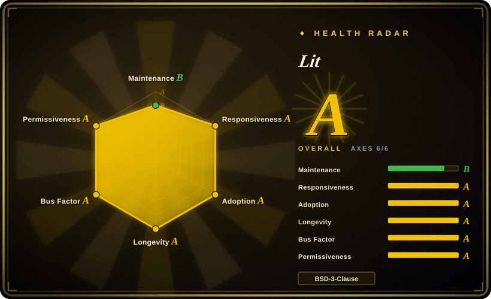
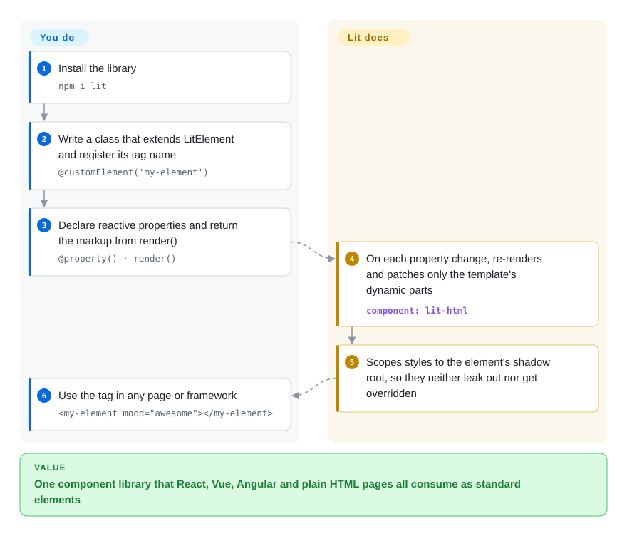

# Lit

A company with React, Vue and Angular apps ends up building the same button three times, because each framework's components only run inside that framework. Lit lets you write the button once as a standard browser *custom element* — a small class with a reactive template — so every framework, or plain HTML, uses it as an ordinary tag.

## When to use

You're a design system lead at a company whose products span multiple frontend frameworks — React for the marketing site, Vue for the admin dashboard, and Angular for a legacy internal tool. You need a shared component library (buttons, inputs, cards, dialogs) that works everywhere without forcing any team to migrate. You evaluate React-only libraries, but they lock you into React. You evaluate Vue, same problem. You choose Lit because it builds on Web Components standards — your components are standard custom elements that work in any HTML context, with any framework. Lit's templates update the DOM directly without a virtual DOM, and the runtime is small enough that shipping it inside every app is not a debate. Your components ship once and render correctly in the React site, the Vue dashboard, and the Angular app.

## How it works

Lit is a thin layer over three browser standards: *custom elements* (you register a new HTML tag backed by a JavaScript class), *shadow DOM* (a private DOM subtree whose styles don't leak in or out) and HTML templates. **You write one class per component**: extend `LitElement`, register a tag name with `@customElement('my-element')`, declare reactive properties with `@property()`, put scoped CSS in `` static styles = css`…` ``, and return the markup from `render()` as an `` html`…` `` tagged template. **Lit does the rest**: when a property changes it batches the update and re-runs `render()`, but instead of diffing a virtual DOM it remembers where each `${…}` expression landed the first time and patches only those spots; attributes set in HTML flow into properties, and styles are applied to the element's shadow root. Because the result is a real browser element, the consuming app needs no Lit knowledge — `<my-element mood="awesome"></my-element>` works in React, Vue, Angular or a static page. Think of it as making a new kind of Lego brick that fits every set, instead of a piece that only fits one manufacturer's baseplate.

<!-- flow-steps:begin (generated from flows/lit.json by tools/flow_card.py — do not edit) -->

Text version of the flow

1. **You**: Install the library — `npm i lit`
2. **You**: Write a class that extends LitElement and register its tag name — `@customElement('my-element')`
3. **You**: Declare reactive properties and return the markup from render() — `@property() · render()`
4. **Lit**: On each property change, re-renders and patches only the template's dynamic parts — component: `lit-html`
5. **Lit**: Scopes styles to the element's shadow root, so they neither leak out nor get overridden
6. **You**: Use the tag in any page or framework — `<my-element mood="awesome"></my-element>`

**Value**: One component library that React, Vue, Angular and plain HTML pages all consume as standard elements

<!-- flow-steps:end -->

## When NOT to use

- **If your team is building a full SPA and wants a batteries-included framework with routing, state management, and CLI, use [React](react.md), [Vue](vue.md), or [Angular](angular.md) instead of Lit, because** Lit is a component library, not an application framework. Its router (`@lit-labs/router`) is still a Labs package, and there is no global state manager or CLI scaffolding.
- **If your team is already deep in React and has no cross-framework interoperability needs, use React or Preact directly instead of Lit, because** adding Lit introduces an extra abstraction layer and a different mental model (Shadow DOM, slots, custom elements) for no benefit.
- **If you need a rich ecosystem of third-party UI components, charts, and plugins, use React or Vue instead of Lit, because** Lit's ecosystem is smaller; there are fewer component libraries, fewer tutorials, and fewer Stack Overflow answers — and Google's own Lit-based Material Web is in maintenance mode pending new maintainers.
- **If your team doesn't know Web Components and won't invest time to learn them, avoid Lit, because** Lit assumes you understand Custom Elements, Shadow DOM, and slots. The learning curve is real if you're coming from React's JSX-centric model.
- **If SEO and server-side rendering are critical and you need a turnkey solution, use [Next.js](../app-frameworks/nextjs.md) or [Nuxt](../app-frameworks/nuxt.md) instead of Lit, because** Lit SSR still ships as Labs packages (`@lit-labs/ssr` 4.x, as of 2026-10) and server-rendering shadow DOM depends on declarative shadow DOM support in the consuming stack.
- **If you need reactive data binding across complex nested component trees without boilerplate, use Vue or [Svelte](svelte.md) instead of Lit, because** Lit's reactivity is explicit and property-based; deep shared state needs extra patterns (`@lit/context`, or the Labs signals integrations).

## Comparison

| Alternative | In index | Our verdict | Tradeoff |
| --- | --- | --- | --- |
| [React](react.md) | ✅ | Choose React when every consumer is a React app and you want the largest component ecosystem; choose Lit when the same components must run in several frameworks. | React has a larger ecosystem and job market; Lit is framework-agnostic and based on standards, making it ideal for design systems that must work everywhere. |
| [Vue.js](vue.md) | ✅ | Choose Vue to build an application with a gentle learning curve; choose Lit to build widgets that Vue and non-Vue apps can both consume. | Vue is easier to learn and has a richer app ecosystem; Lit is smaller and more interoperable but requires Web Components knowledge. |
| [Svelte](svelte.md) | ✅ | Choose Svelte for a whole app with minimal runtime; choose Lit when the deliverable is a set of standard custom elements for other teams. | Svelte compiles its framework away and can also emit custom elements, but its main model is Svelte apps; Lit is a runtime library centred on custom elements. |
| [Angular](angular.md) | ✅ | Choose Angular to build a large opinionated application; choose Lit to build the shared component layer that Angular and other frameworks consume. | Angular gives router, DI and CLI but its components are Angular-only by default; Lit gives portable elements and nothing above the component level. |
| Stencil | 未收录 | Choose Stencil when you want a compiler that generates framework wrappers and lazy-loaded bundles for a large component library; choose Lit for a lighter runtime with no compile step required. | Stencil is a compile-time toolchain with more build machinery; Lit is a runtime library that works from plain ES modules. |
| Native `<template>` / hand-written DOM | 未收录 | Hand-write custom elements only for one or two trivial elements with no dependency budget; choose Lit as soon as elements have reactive state or non-trivial templates. | Native DOM has zero dependencies but is verbose and error-prone; Lit gives reactive templates and a component base class with minimal overhead. |
| Web Components (standards) | 非仓库 | Not a library to install: the browser standard Lit is built on; use it directly only when you accept writing the update logic yourself. | You can write custom elements by hand; Lit adds efficient templating, reactivity, and developer experience on top. |

## Health & viability

- **Maintenance (2026-10-08).** Active but slow: the core `lit` package last released 3.3.3 on 2026-05-14, and main-branch commits have been sparse since (about a dozen since June; 3 of the last 13 weeks active, maintenance grade B). Pull requests still get a first response quickly (responsiveness grade A, measured on PRs). This reads as a mature library coasting on a stable API rather than an abandoned one — re-check if no release lands by mid-2027.
- **Governance / bus factor.** Lit is now a member project of the OpenJS Foundation; in September 2026 the repo moved copyright notices to "The Lit Project Contributors" and switched from a CLA to a DCO. About 19 active contributors in the scorer's 12-month window, top contributor about 32% of commits (governance grade A). Justin Fagnani remains the top all-time committer.
- **Backing & longevity.** Created at Google (repo since 2017, successor to Polymer), BSD-3-Clause. Foundation membership lowers the "Google might drop it" risk, but it also means funding and maintainer time now depend on contributors' employers rather than one team [未验证]. Age × still-active is positive: ~9 years old and still releasing.
- **Adoption & ecosystem.** 30,096,097 npm downloads of `lit` in the last month and 16,100 dependent repositories (scorer snapshot, 2026-10-08); widely used for design systems. The flagship Google consumer, Material Web, is in maintenance mode, so do not read Google product usage as a growth signal.
- **Risk flags.** BSD-3-Clause, no relicense history. Risks: slow release cadence; SSR, router and signals integrations still in Labs; browser-level Web Components gaps (e.g. scoped custom element registries) that Lit cannot fix on its own.

## Tech stack

- **TypeScript** — primary development language; Lit has first-class TS support
- **Web Components standards** — Custom Elements, Shadow DOM, HTML templates (the browser-native foundation)
- **lit-html** — efficient HTML template rendering with direct DOM updates (no virtual DOM)
- **LitElement / `@lit/reactive-element`** — reactive base class for creating Web Components with declarative templates
- **First-party add-ons** — `@lit/context`, `@lit/task`, `@lit/localize`, `@lit/react` (React wrapper)
- **Labs** — `@lit-labs/ssr` (server rendering), `@lit-labs/router`, `@lit-labs/signals`, `@lit-labs/compiler` (template optimisation) — usable but not yet stable

## Dependencies

- **A modern browser** — Lit relies on Web Components standards (Custom Elements v1, Shadow DOM v1); evergreen browsers support these natively
- **No build tool required** — Lit works with plain ES modules in the browser, but TypeScript compilation is recommended for production
- **Optional: TypeScript compiler** — for type checking and compiling `.ts` files (decorators need a decorator-aware compile)
- **Optional: bundler** (Vite, Rollup, Webpack) — for production bundling and tree-shaking, though not strictly required
- **No framework runtime dependency** — Lit components do not depend on React, Vue, or Angular

## Ops difficulty

**Low**. Lit components are standard Web Components that deploy as static JavaScript files to any CDN or web server. There is no server-side runtime, no special hosting requirement, and no framework-specific build pipeline. Complexity arises only when:
- You integrate Lit components into an existing framework app (requires understanding framework-Web Component interop patterns; `@lit/react` exists for React)
- You enable SSR, which requires a Node.js server and the Labs SSR packages
- You need to polyfill older browsers (pre-2020 browsers may lack Custom Elements / Shadow DOM support)

## Caveats (unverified)

- [未验证] The exact bundle size of Lit's runtime in production may vary by build configuration and tree-shaking; this page no longer quotes a figure.
- [未验证] The maturity and feature completeness of Lit SSR compared to Next.js/Nuxt has not been independently verified.
- [推断] Lit's ecosystem size relative to React/Vue is inferred from community activity and package download counts, not hard data.
- [未验证] How much engineering time Google still funds for Lit after the move to the OpenJS Foundation is not stated in the repository.
- [推断] The slow 2026 release cadence is read as API stability rather than decline; that judgment should be revisited at the next sync.
