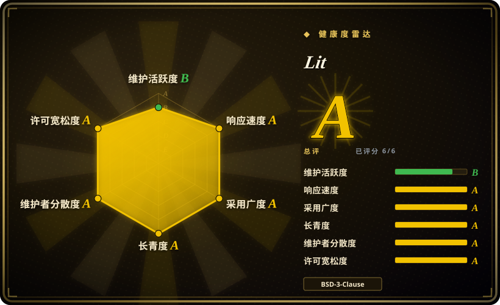
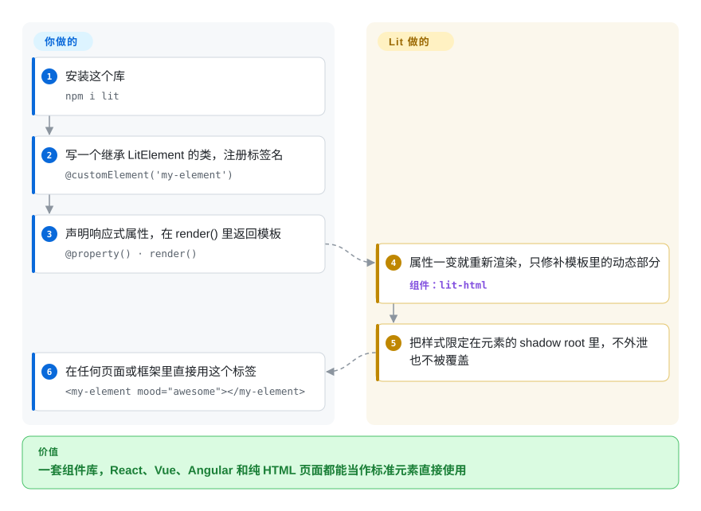

# Lit

公司里同时有 React、Vue 和 Angular 应用，同一个按钮就得写三遍，因为每个框架的组件只能在自己的框架里跑。Lit 让你把按钮按浏览器标准写成一个*自定义元素*——一个带响应式模板的小类——写一次，任何框架乃至纯 HTML 都能像普通标签一样使用它。

## 何时使用

你是一家使用多种前端框架（React、Vue、Angular）的公司的设计系统负责人，需要构建一套能在所有产品中使用的共享组件库，而不强迫各团队迁移。你评估过仅支持 React 的库，但它们把你锁死在 React 里。你评估过 Vue，同样的问题。你选择 Lit，因为它基于 Web Components 标准——你的组件就是标准的自定义元素，可在任何 HTML 环境中、与任何框架一起工作。Lit 的模板直接更新 DOM，无需虚拟 DOM，运行时又小到“每个应用都带一份”不值得争论。你的 button、input 和 card 组件只需发布一次，就能在 React 营销站点、Vue 管理后台和 Angular 遗留应用中同时工作。

## 怎么用起来

Lit 是三项浏览器标准之上的薄薄一层：*自定义元素*（注册一个由 JavaScript 类驱动的新 HTML 标签）、*Shadow DOM*（元素私有的一棵 DOM 子树，样式进不来也漏不出去）和 HTML 模板。**你为每个组件写一个类**：继承 `LitElement`，用 `@customElement('my-element')` 注册标签名，用 `@property()` 声明响应式属性，把作用域内的 CSS 放进 `` static styles = css`…` ``，在 `render()` 里用 `` html`…` `` 标签模板返回结构。**其余由 Lit 完成**：属性变化时它把更新合并成一批、重新执行 `render()`，但不去比对虚拟 DOM，而是记住每个 `${…}` 表达式第一次落在哪里，只修补这些位置；HTML 里写的属性会流进类的属性，样式挂到元素的 shadow root 上。因为产物是真正的浏览器元素，使用方完全不需要懂 Lit——`<my-element mood="awesome"></my-element>` 在 React、Vue、Angular 或静态页面里都能用。打个比方：你造的是一种所有套装都能拼的新乐高积木，而不是只能插在某一家底板上的零件。

<!-- flow-steps:begin (generated from flows/lit.json by tools/flow_card.py — do not edit) -->

流程文字版

1. **你**：安装这个库 — `npm i lit`
2. **你**：写一个继承 LitElement 的类，注册标签名 — `@customElement('my-element')`
3. **你**：声明响应式属性，在 render() 里返回模板 — `@property() · render()`
4. **Lit**：属性一变就重新渲染，只修补模板里的动态部分 — 组件：`lit-html`
5. **Lit**：把样式限定在元素的 shadow root 里，不外泄也不被覆盖
6. **你**：在任何页面或框架里直接用这个标签 — `<my-element mood="awesome"></my-element>`

**价值**：一套组件库，React、Vue、Angular 和纯 HTML 页面都能当作标准元素直接使用

<!-- flow-steps:end -->

## 何时不用

- **如果你的团队正在构建完整 SPA，想要一个带路由、状态管理和 CLI 的全家桶框架，请用 [React](react.zh.md)、[Vue](vue.zh.md) 或 [Angular](angular.zh.md)，而不是 Lit，因为** Lit 是组件库，不是应用框架。它的路由（`@lit-labs/router`）还在 Labs 阶段，也没有全局状态管理和 CLI 脚手架。
- **如果你的团队已经深度使用 React，且没有跨框架互操作需求，请直接用 React 或 Preact，而不是 Lit，因为** 引入 Lit 会增加一层抽象和一种不同的心智模型（Shadow DOM、slots、custom elements），却没有任何收益。
- **如果你需要丰富的第三方 UI 组件、图表和插件生态，请用 React 或 Vue，而不是 Lit，因为** Lit 的生态较小，组件库、教程和 Stack Overflow 答案都更少——连 Google 自己基于 Lit 的 Material Web 也已进入维护模式，等待新的维护者。
- **如果你的团队不了解 Web Components，也不愿意投入时间学习，请避免 Lit，因为** Lit 默认你理解 Custom Elements、Shadow DOM 和 slots。如果你来自 React 的 JSX 中心模型，学习曲线是真实存在的。
- **如果 SEO 和服务端渲染至关重要，且你需要开箱即用的方案，请用 [Next.js](../app-frameworks/nextjs.zh.md) 或 [Nuxt](../app-frameworks/nuxt.zh.md)，而不是 Lit，因为** Lit 的 SSR 仍以 Labs 包的形式发布（截至 2026-10 为 `@lit-labs/ssr` 4.x），而且服务端渲染 Shadow DOM 依赖使用方技术栈对声明式 Shadow DOM 的支持。
- **如果你需要跨复杂嵌套组件树的无样板响应式数据绑定，请用 Vue 或 [Svelte](svelte.zh.md)，而不是 Lit，因为** Lit 的响应式是显式的、基于属性的；深层共享状态需要额外的模式（`@lit/context`，或 Labs 里的 signals 集成）。

## 横向对比

| 替代品 | 是否收录 | 我们的评价 | 取舍 |
| --- | --- | --- | --- |
| [React](react.zh.md) | ✅ | 所有使用方都是 React 应用、又想要最大的组件生态时选 React；同一套组件要在多个框架里跑时选 Lit。 | React 生态和就业市场更大；Lit 基于标准、框架无关，适合必须在各处工作的设计系统。 |
| [Vue.js](vue.zh.md) | ✅ | 要做一个学习曲线平缓的应用选 Vue；要做 Vue 和非 Vue 应用都能用的小组件选 Lit。 | Vue 更容易上手，应用生态更丰富；Lit 更小巧、更具互操作性，但需要 Web Components 知识。 |
| [Svelte](svelte.zh.md) | ✅ | 要做运行时极小的完整应用选 Svelte；交付物是给其他团队用的一套标准自定义元素时选 Lit。 | Svelte 把框架编译掉，也能输出自定义元素，但主力模型是 Svelte 应用；Lit 是以自定义元素为中心的运行时库。 |
| [Angular](angular.zh.md) | ✅ | 要做大型、有主见的应用选 Angular；要做 Angular 和其他框架共用的组件层选 Lit。 | Angular 有路由、依赖注入和 CLI，但组件默认只在 Angular 里用；Lit 给你可移植的元素，组件层以上什么都不管。 |
| Stencil | 未收录 | 想要一个为大型组件库生成各框架包装层和按需加载包的编译器时选 Stencil；想要更轻的运行时、不需要编译步骤时选 Lit。 | Stencil 是编译期工具链，构建机制更多；Lit 是运行时库，直接用 ES 模块就能跑。 |
| 原生 `<template>` / 手写 DOM | 未收录 | 只有一两个极简元素、又不想加任何依赖时手写自定义元素；元素一旦有响应式状态或复杂模板就选 Lit。 | 原生 DOM 零依赖，但冗长且容易出错；Lit 在极小开销下提供响应式模板和组件基类。 |
| Web Components（标准） | 非仓库 | 不是要安装的库，而是 Lit 所基于的浏览器标准；只有你愿意自己写更新逻辑时才直接用它。 | 你可以手写自定义元素；Lit 在此基础上增加了高效模板、响应式能力和开发者体验。 |

## 健康度与可持续性

- **维护状态（2026-10-08）。** 活跃但缓慢：核心包 `lit` 最近一次发布是 2026-05-14 的 3.3.3，之后主分支提交稀疏（6 月以来约十几个，最近 13 周中 3 周有提交，维护评级 B）。PR 的首次响应依然很快（响应度评级 A，按 PR 计算）。这更像是一个 API 稳定、进入平稳期的成熟库，而不是被放弃——如果到 2027 年年中仍无新发布，需要复查。
- **治理与 bus factor。** Lit 现在是 OpenJS 基金会的成员项目；2026 年 9 月，仓库把版权声明改为 “The Lit Project Contributors”，并把 CLA 换成了 DCO。评分的 12 个月窗口内约 19 位活跃贡献者，头号贡献者约占 32% 提交（治理评级 A）。Justin Fagnani 仍是历史提交最多的人。
- **背书与长期性。** 诞生于 Google（仓库始于 2017 年，是 Polymer 的继任者），BSD-3-Clause 许可。加入基金会降低了“Google 可能放弃它”的风险，但也意味着资金和维护者时间现在取决于各贡献者的雇主，而不是某一个团队 [未验证]。年龄乘以仍活跃是正面的：约 9 年，仍在发版。
- **采用与生态。** `lit` 近一个月 npm 下载 30,096,097 次，依赖仓库 16,100 个（评分快照，2026-10-08）；被大量设计系统采用。Google 的标杆使用方 Material Web 已进入维护模式，所以不要把 Google 产品的使用当作增长信号。
- **风险标志。** BSD-3-Clause，无改许可证历史。风险：发布节奏慢；SSR、路由和 signals 集成仍在 Labs；有些浏览器层面的 Web Components 缺口（比如作用域化的自定义元素注册表）不是 Lit 自己能补上的。

## 技术栈

- **TypeScript** —— 主要开发语言；Lit 对 TS 有一流支持
- **Web Components 标准** —— Custom Elements、Shadow DOM、HTML 模板（浏览器原生基础）
- **lit-html** —— 高效的 HTML 模板渲染，直接更新 DOM（无虚拟 DOM）
- **LitElement / `@lit/reactive-element`** —— 创建带声明式模板的响应式 Web Components 的基类
- **官方附加包** —— `@lit/context`、`@lit/task`、`@lit/localize`、`@lit/react`（React 包装层）
- **Labs** —— `@lit-labs/ssr`（服务端渲染）、`@lit-labs/router`、`@lit-labs/signals`、`@lit-labs/compiler`（模板优化）——可用但尚未稳定

## 依赖

- **现代浏览器** —— Lit 依赖 Web Components 标准（Custom Elements v1、Shadow DOM v1）；evergreen 浏览器原生支持这些特性
- **无需构建工具** —— Lit 可直接以 ES modules 在浏览器中运行，但生产环境建议使用 TypeScript 编译
- **可选：TypeScript 编译器** —— 用于类型检查和编译 `.ts` 文件（装饰器需要支持装饰器的编译）
- **可选：打包工具**（Vite、Rollup、Webpack）—— 用于生产打包和 Tree-shaking，虽非严格必需
- **无框架运行时依赖** —— Lit 组件不依赖 React、Vue 或 Angular

## 运维难度

**低**。Lit 组件是标准 Web Components，可作为静态 JavaScript 文件部署到任何 CDN 或 Web 服务器。没有服务端运行时，没有特殊托管要求，也没有框架特定的构建管线。复杂度仅在以下情况出现：
- 将 Lit 组件集成到现有框架应用中时（需要理解框架与 Web Component 的互操作模式；React 有 `@lit/react`）
- 启用 SSR 时，需要 Node.js 服务器和 Labs 阶段的 SSR 包
- 需要为旧版浏览器提供 polyfill（2020 年前的浏览器可能缺少 Custom Elements / Shadow DOM 支持）

## 存疑（未验证）

- [未验证] Lit 运行时在生产环境中的实际体积因构建配置和 Tree-shaking 而异；本页不再给出具体数字。
- [未验证] Lit SSR 相对于 Next.js/Nuxt 的成熟度和功能完整性未经独立验证。
- [推断] Lit 相对于 React/Vue 的生态规模是从社区活跃度和包下载量推断的，而非硬数据。
- [未验证] 迁入 OpenJS 基金会之后，Google 还为 Lit 投入多少工程时间，仓库里没有说明。
- [推断] 2026 年发布节奏变慢被解读为 API 稳定而非衰退；这一判断应在下次同步时复查。
