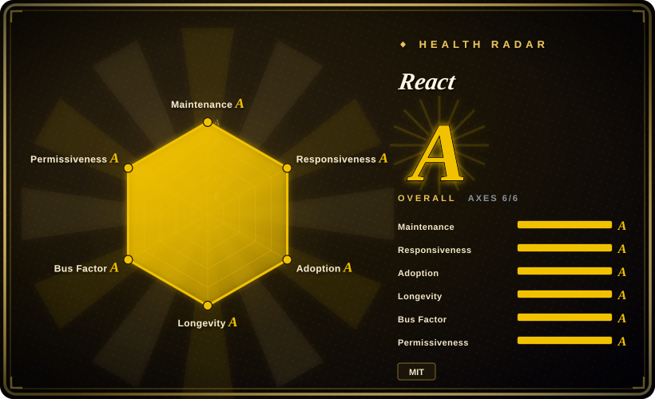
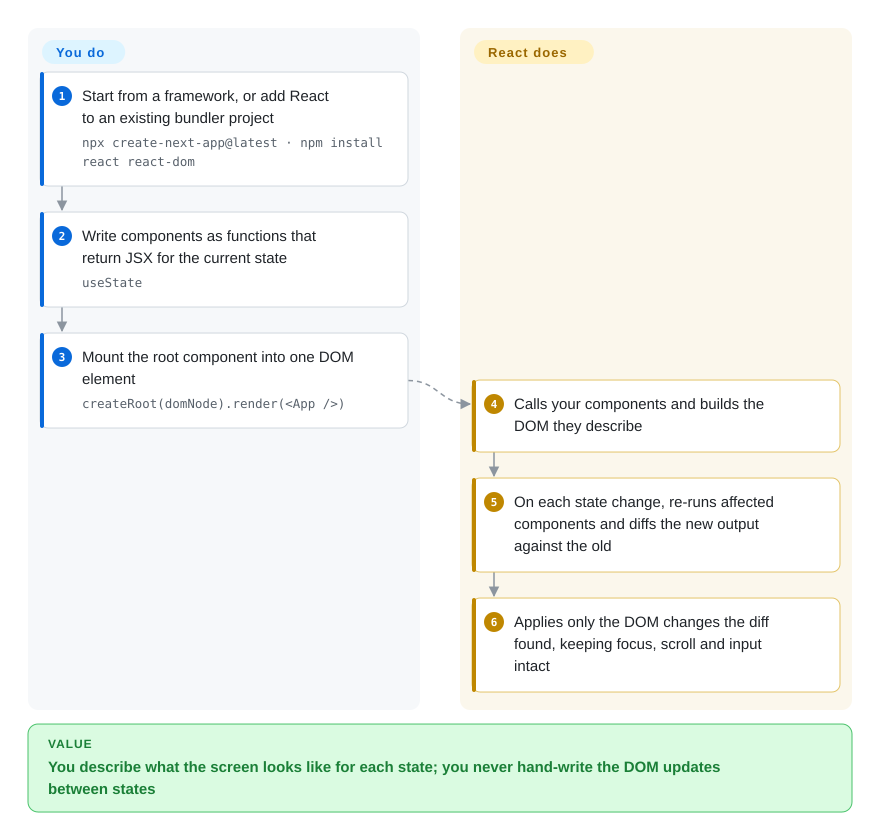

# React

Hand-written DOM code falls apart once one screen has a filter, a table, a modal and a badge that all depend on the same data — you update three of them and forget the fourth. React lets you describe what each component should look like for the current data and works out the DOM changes itself; it is only the view layer, so routing, data fetching and the build come from a framework or from you.

## When to use

You're one of six frontend engineers on a SaaS analytics product: forty-odd screens, editable data grids, multi-step forms, and a dashboard where changing one date filter has to refresh a chart, a table, a totals row and the "unsaved changes" badge. The jQuery-era code updates three of them and forgets the fourth, and every new screen re-learns that lesson. You need a component model where a screen is a function of its data, and you need it to be the safest long-term bet your company can hire for.

You pick React over Vue and Svelte not because its core is better at rendering — it isn't smaller or faster — but because of what surrounds it: the largest third-party ecosystem (grids, charts, form libraries, design systems such as Ant Design and shadcn/ui), the deepest hiring pool, React Native when mobile comes, and since February 2026 vendor-neutral ownership under the Linux Foundation's React Foundation. You pick it over Angular because you want to choose your own router, data layer and styling instead of adopting one framework's conventions — and you accept that you then have to choose them, typically by starting from Next.js or React Router as react.dev recommends.

## How it works

React is a library for turning **components** — plain JavaScript functions that take data and return a description of UI written in **JSX** (HTML-like tags inside JavaScript) — into real DOM. **You** write those functions and keep the changing data in **state** (`useState`, a value React remembers between renders); **React** calls your functions, builds the DOM, and whenever state changes re-runs the affected components, compares the new description with the previous one, and applies only the difference. It is like handing a stage crew a photo of how the set should look for each scene: you never say "move the chair left", the crew compares photos and moves what changed. React itself does not route between pages, fetch data, or bundle code; react.dev recommends starting new apps from a framework (Next.js, React Router, Expo) that adds those, or wiring them yourself on Vite. Since React Compiler 1.0 (October 2025), a build-time plugin can also insert the memoization (`useMemo` / `memo`) that you previously wrote by hand.

<!-- flow-steps:begin (generated from flows/react.json by tools/flow_card.py — do not edit) -->

Text version of the flow

1. **You**: Start from a framework, or add React to an existing bundler project — `npx create-next-app@latest · npm install react react-dom`
2. **You**: Write components as functions that return JSX for the current state — `useState`
3. **You**: Mount the root component into one DOM element — `createRoot(domNode).render(<App />)`
4. **React**: Calls your components and builds the DOM they describe
5. **React**: On each state change, re-runs affected components and diffs the new output against the old
6. **React**: Applies only the DOM changes the diff found, keeping focus, scroll and input intact

**Value**: You describe what the screen looks like for each state; you never hand-write the DOM updates between states

<!-- flow-steps:end -->

## When NOT to use

- **You want routing, data loading and SSR decided for you — use Angular (or Next.js on top of React) instead of plain React, because** React is only the view layer; on its own you assemble the router, data layer and build, and react.dev itself now tells new projects to start from a framework.
- **Your team is new to frontend and you want the gentlest path — use Vue instead, because** React's hooks rules (call order, dependency arrays) and stale-closure bugs are the classic beginner trap, while Vue's reactivity tracks dependencies automatically.
- **You are shipping a small widget or landing page where kilobytes matter — use Svelte (or Preact, not indexed) instead, because** React ships a runtime that compiles-away frameworks do not, and that fixed cost dominates a small page.
- **You want fine-grained reactivity without thinking about re-renders — use Svelte or Vue instead, because** React re-runs whole components on state change; React Compiler now automates much of the memoization, but it is an extra build step and does not change the re-render model.
- **You need SEO-friendly server rendering or static pages — use Next.js (React) or Nuxt (Vue) instead of plain React, because** React renders client-side unless a framework or your own server sets up SSR and streaming.
- **You plan to self-host React Server Components / Server Functions without a patch process — use client-only React or a framework you keep updated instead, because** CVE-2025-55182 ("React2Shell", December 2025) was an unauthenticated remote-code-execution bug in the `react-server-dom-*` packages of React 19.0–19.2.0 with public exploits; the server half of React is now attack surface you must patch promptly.

## Comparison

| Alternative | In index | Our verdict | Tradeoff |
| --- | --- | --- | --- |
| [Vue.js](vue.md) | ✅ | For a team that wants templates, automatic dependency tracking and an official router/store, pick Vue; pick React when ecosystem breadth, hiring pool and React Native outweigh a gentler learning curve. | Vue: fewer re-render pitfalls and one official stack; React: more third-party libraries and candidates, but you assemble the stack. |
| [Angular](angular.md) | ✅ | For a large enterprise team that wants one opinionated framework with DI, router, forms and HTTP built in, pick Angular; pick React when you prefer to choose each layer yourself. | Angular: consistency across teams, heavier conventions and upgrade cadence; React: flexibility, but architecture is your responsibility. |
| [Svelte](svelte.md) | ✅ | For bundle-size-sensitive apps or small teams that want less boilerplate, pick Svelte; pick React when you need its library ecosystem, mobile path and hiring depth. | Svelte: compiler output with no virtual DOM and runes-based reactivity; React: larger runtime but far more ready-made components. |
| [Next.js](../app-frameworks/nextjs.md) | ✅ | Not an either/or: for a production web app that needs routing, SSR/SSG and server code, pick Next.js on top of React; use plain React only for embedding into an existing page or a pure client SPA. | Next.js: batteries for SSR, RSC and deployment, plus Vercel-shaped conventions; plain React: full control, everything else is yours. |
| Preact | not indexed | When you want React's API in a ~3 KB runtime for widgets or constrained devices, pick Preact; pick React when you rely on the latest React features (RSC, Compiler, concurrent rendering) and full library compatibility. | Preact: tiny, mostly compatible via `preact/compat`; React: the reference implementation, larger. |
| Solid | not indexed | When you want JSX with fine-grained signals and no re-render model, pick Solid; pick React when ecosystem and hiring matter more than raw update performance. | Solid: components run once and signals update the DOM directly; React: much larger ecosystem, more re-render tuning. |

## Tech stack

- **JavaScript with Flow types** in the core repo (`packages/`); published with TypeScript definitions via DefinitelyTyped (`@types/react`). The React Compiler lives in `compiler/` and is written in TypeScript.
- **JSX** — compiled to function calls by your bundler (Babel, SWC, esbuild, TypeScript).
- **Reconciler ("Fiber")** — the core diffing engine shared by `react-dom`, `react-native` and other renderers; supports concurrent rendering, Suspense, transitions, `<Activity>` and (19.3) `<ViewTransition>`.
- **Hooks** — `useState`, `useEffect`, `useContext`, `use`, `useActionState`, `useEffectEvent` and others.
- **React Server Components / Server Functions** — `react-server-dom-*` packages that frameworks (Next.js App Router, React Router, Waku, Parcel) wire into a server.
- **React Compiler** — `babel-plugin-react-compiler`, stable since v1.0, auto-memoizes components and hooks at build time.

## Dependencies

- **`react` + `react-dom`** (web) or `react-native` (mobile); no other runtime dependencies to operate.
- **Build toolchain** — a bundler that compiles JSX: usually via a framework (Next.js, React Router, Expo) or Vite / Parcel / Rsbuild for a from-scratch setup. Create React App is no longer recommended by react.dev.
- **Node.js** — for the build; also at runtime if you use SSR or Server Components.
- **Optional, your choice:** routing (React Router, TanStack Router), state (Redux Toolkit, Zustand, Jotai), data fetching (TanStack Query), styling and component libraries.

## Ops difficulty

**Low for a client-only app, medium once you add a server.** A client-rendered React app deploys as static files. The ongoing work is assembly and upkeep: choosing and upgrading router, state and data libraries, and tuning re-renders (less manual since React Compiler). Adding SSR or Server Components means running and patching a Node.js server — the React2Shell RCE in December 2025 showed that `react-server-dom-*` and framework releases have to be tracked like any backend dependency. Major React upgrades (18→19) ship codemods but still touch third-party libraries that lag behind.

## Health & viability

- **Maintenance (2026-10).** Very active: v19.3.0 released 2026-09-09 (ViewTransition, Fragment refs, independent transitions), and the 19.0/19.1/19.2 lines still received RSC patch releases in July 2026. Commits land almost daily; the radar's maintenance and responsiveness axes are A.
- **Governance & backing — changed in 2026.** Since 2026-02-24 React, React Native and JSX are owned by the React Foundation, hosted by the Linux Foundation, with eight platinum members (Amazon, Callstack, Expo, Huawei, Meta, Microsoft, Software Mansion, Vercel). Technical direction stays with the maintainers, independent of the board; the repository has moved from `facebook/react` to `react/react` (GitHub redirects the old name; checked 2026-10-09). Contribution is broad (46 active contributors in 12 months, top contributor 21% of commits).
- **Age & Lindy.** Open-sourced 2013 (~13 years) and still the market-leading UI library — the strongest Lindy prior in this category, now no longer tied to one company's priorities.
- **Adoption.** The largest frontend ecosystem: component libraries, meta-frameworks (Next.js, React Router, Expo) and React Native all build on it. The radar's adoption axis reads B (2026-10-09) from GitHub release-asset downloads only (2,280,333): the npm `react` package is not linked to this repo in the registry index the scorer uses, so npm installs — React's real channel — are not counted, and the grade understates adoption.
- **Risk flags.** MIT, no relicense history. The main risk has shifted to the server side: RSC packages carried a critical RCE (CVE-2025-55182) in late 2025, and the RSC/framework split means server features evolve fastest inside Next.js.

## Caveats (unverified)

- [未验证] The repository moved from `facebook/react` to `react/react` by 2026-10-09 (GitHub redirect); the `react` organization's metadata names no owner, so that it is run by the React Foundation, and the final technical-governance structure, were not confirmed.
- [未验证] CVE-2025-55182 affected versions (19.0, 19.1.0, 19.1.1, 19.2.0 of `react-server-dom-webpack/parcel/turbopack`; fixed in 19.0.1, 19.1.2, 19.2.1) come from Vercel and security-vendor advisories, not re-checked against the GitHub advisory text.
- [推断] Bundle-size and update-performance gaps versus Svelte, Preact and Solid depend on the app; no benchmark was run for this page.
- [推断] How much manual memoization React Compiler removes in a real codebase varies; reports of subtle breakages exist and were not reproduced.
- [推断] Hiring-pool and ecosystem-size leadership is inferred from industry surveys and package counts, not a census.
- [未验证] ~251k GitHub stars as of 2026-10-08; star counts drift.
- [推断] The adoption grade B undercounts React: ecosyste.ms does not tie the npm `react` package to the repository (`react/react`, formerly `facebook/react`), so the scorer cannot read npm downloads and grades from release assets alone.
