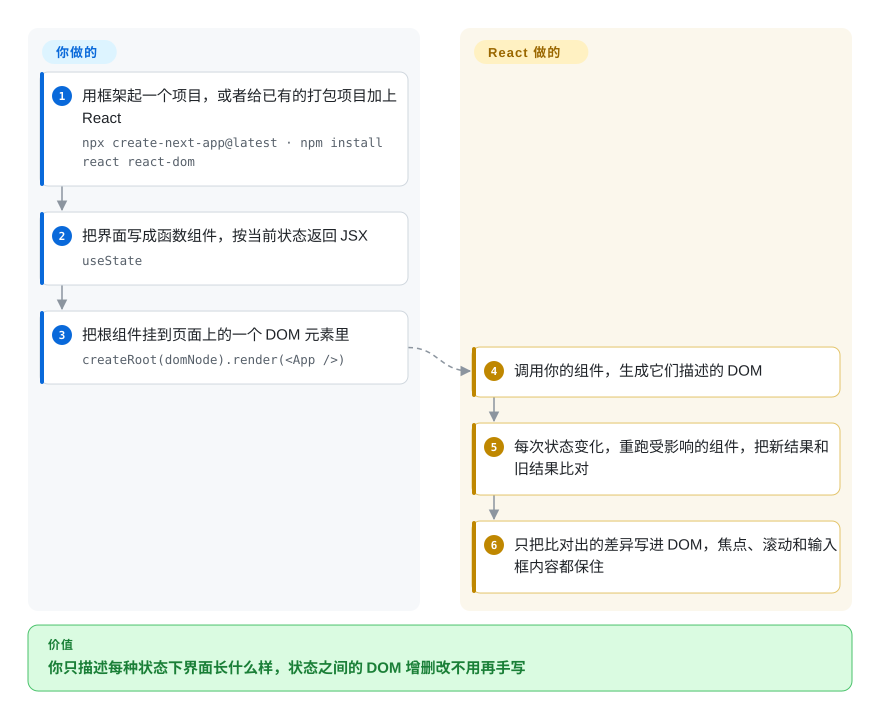

# React

手写 DOM 操作的代码，一旦同一屏上有筛选框、表格、弹窗和角标都依赖同一份数据，就会开始漏：改了三处，忘了第四处。React 让你只描述“当前数据下每个组件长什么样”，DOM 该怎么改由它算；它只管视图这一层，路由、取数和构建要靠框架或你自己补齐。

## 何时使用

你是一个 SaaS 分析产品的六名前端之一：四十多个页面、可编辑的数据表格、多步表单，还有一个仪表盘，改一下日期筛选，图表、表格、合计行和“有未保存修改”的角标都得跟着刷新。jQuery 时代留下的代码每次只改到其中三处，第四处总被忘掉，每做一个新页面都要重新踩一遍。你需要一种组件模型，让每个页面都是“数据的函数”，而且它得是公司在招聘上最稳妥的长期押注。

你选 React 而不是 Vue 或 Svelte，不是因为它的核心渲染更强（它既不更小也不更快），而是因为它周边的东西：最大的第三方生态（表格、图表、表单库，以及 Ant Design、shadcn/ui 这类设计系统）、最深的招聘池、要做移动端时有 React Native，以及从 2026 年 2 月起归属 Linux 基金会旗下 React Foundation 的中立所有权。你不选 Angular，是因为你想自己挑路由、数据层和样式方案，而不是接受一个框架的全套约定；代价是你确实得去挑，通常按 react.dev 的建议从 Next.js 或 React Router 起步。

## 怎么用起来

React 是一个把**组件**变成真实 DOM 的库。组件就是普通的 JavaScript 函数：接收数据，返回一段用 **JSX**（写在 JavaScript 里的类 HTML 标签）描述的界面。**你**写这些函数，并把会变的数据放进 **state**（`useState`，React 在多次渲染之间替你记住的值）；**React** 调用你的函数生成 DOM，每当 state 变化，就重跑受影响的组件，把新描述和上一次的描述对比，只把差异写进页面。就像给舞台工作人员每一幕的布景照片：你从不说“把椅子往左挪”，他们自己比对照片，挪动变了的东西。React 本身不负责页面间路由、不取数据、也不打包代码；react.dev 建议新项目从框架起步（Next.js、React Router、Expo），由框架补上这些，或者你自己在 Vite 上拼。React Compiler 1.0（2025 年 10 月）发布后，构建阶段的插件还能替你插入以前要手写的记忆化（`useMemo` / `memo`，即缓存计算结果、跳过没变的重渲染）。

<!-- flow-steps:begin (generated from flows/react.json by tools/flow_card.py — do not edit) -->

流程文字版

1. **你**：用框架起一个项目，或者给已有的打包项目加上 React — `npx create-next-app@latest · npm install react react-dom`
2. **你**：把界面写成函数组件，按当前状态返回 JSX — `useState`
3. **你**：把根组件挂到页面上的一个 DOM 元素里 — `createRoot(domNode).render(<App />)`
4. **React**：调用你的组件，生成它们描述的 DOM
5. **React**：每次状态变化，重跑受影响的组件，把新结果和旧结果比对
6. **React**：只把比对出的差异写进 DOM，焦点、滚动和输入框内容都保住

**价值**：你只描述每种状态下界面长什么样，状态之间的 DOM 增删改不用再手写

<!-- flow-steps:end -->

## 何时不用

- **你希望路由、数据加载和服务端渲染都替你定好：改用 Angular（或在 React 之上用 Next.js），而不是裸 React，因为** React 只是视图层，单用它就得自己拼路由、数据层和构建，react.dev 现在也直接建议新项目从框架起步。
- **团队是前端新手，想走最平缓的路：改用 Vue，因为** React 的 hooks 规则（调用顺序、依赖数组）和闭包过时（stale closure）是经典的新手坑，而 Vue 的响应式会自动追踪依赖。
- **你要发一个小组件或落地页，每 KB 都算数：改用 Svelte（或未收录的 Preact），因为** React 带着一份运行时，编译型框架没有这笔固定开销，小页面上它占了大头。
- **你想要细粒度响应式、不用操心重渲染：改用 Svelte 或 Vue，因为** React 在 state 变化时会重跑整个组件；React Compiler 现在能自动做掉大部分记忆化，但它是额外的构建步骤，也没有改变重渲染模型。
- **你需要对 SEO 友好的服务端渲染或静态页：改用 Next.js（React）或 Nuxt（Vue），而不是裸 React，因为** 不借助框架或自建服务端，React 只在浏览器里渲染。
- **你打算自托管 React Server Components / Server Functions，却没有打补丁的流程：改用纯客户端 React，或者用一个你会持续升级的框架，因为** CVE-2025-55182（“React2Shell”，2025 年 12 月）是 React 19.0 到 19.2.0 的 `react-server-dom-*` 包里一个无需认证的远程代码执行漏洞，且有公开利用代码；React 的服务端部分如今是必须及时修补的攻击面。

## 横向对比

| 替代品 | 是否收录 | 我们的评价 | 取舍 |
| --- | --- | --- | --- |
| [Vue.js](vue.zh.md) | ✅ | 团队想要模板语法、自动依赖追踪和官方路由与状态库，选 Vue；生态广度、招聘池和 React Native 比平缓的学习曲线更重要时，选 React。 | Vue：重渲染的坑更少，官方一套到底；React：第三方库和候选人更多，但技术栈要自己拼。 |
| [Angular](angular.zh.md) | ✅ | 大型企业团队想要一个内置依赖注入、路由、表单和 HTTP 的强约定框架，选 Angular；想每一层自己挑，选 React。 | Angular：跨团队一致，约定和升级节奏更重；React：灵活，但架构责任在你。 |
| [Svelte](svelte.zh.md) | ✅ | 在意包体积、或小团队想少写样板代码，选 Svelte；需要 React 的库生态、移动端路线和招聘深度，选 React。 | Svelte：编译产物，没有虚拟 DOM，用 runes 做响应式；React：运行时更大，但现成组件多得多。 |
| [Next.js](../app-frameworks/nextjs.zh.md) | ✅ | 不是二选一：要路由、SSR/SSG 和服务端代码的生产级 Web 应用，在 React 之上用 Next.js；只有嵌进现有页面或纯客户端单页应用时才用裸 React。 | Next.js：SSR、RSC 和部署都配齐，但带着 Vercel 风格的约定；裸 React：完全可控，其余都归你。 |
| Preact | 未收录 | 想用 React 的 API、但运行时只要约 3 KB（小组件或受限设备），选 Preact；依赖 React 最新特性（RSC、Compiler、并发渲染）和完整库兼容性时，选 React。 | Preact：极小，通过 `preact/compat` 基本兼容；React：参考实现，体积更大。 |
| Solid | 未收录 | 想要 JSX 加细粒度信号、没有重渲染模型，选 Solid；生态和招聘比极限更新性能更重要时，选 React。 | Solid：组件只运行一次，信号直接更新 DOM；React：生态大得多，但要花心思调重渲染。 |

## 技术栈

- **带 Flow 类型的 JavaScript**：核心仓库（`packages/`）用它编写；TypeScript 类型通过 DefinitelyTyped 发布（`@types/react`）。React Compiler 在 `compiler/` 目录，用 TypeScript 编写。
- **JSX**：由你的打包工具（Babel、SWC、esbuild、TypeScript）编译成函数调用。
- **协调器（Fiber）**：`react-dom`、`react-native` 等渲染器共用的核心比对引擎，支持并发渲染、Suspense、transition、`<Activity>`，以及 19.3 新增的 `<ViewTransition>`。
- **Hooks**：`useState`、`useEffect`、`useContext`、`use`、`useActionState`、`useEffectEvent` 等。
- **React Server Components / Server Functions**：`react-server-dom-*` 系列包，由框架（Next.js App Router、React Router、Waku、Parcel）接到服务端。
- **React Compiler**：`babel-plugin-react-compiler`，v1.0 起稳定，在构建时给组件和 hooks 自动加记忆化。

## 依赖

- **`react` + `react-dom`**（Web）或 `react-native`（移动端）；没有其他需要运维的运行时依赖。
- **构建工具链**：一个能编译 JSX 的打包器，通常经由框架（Next.js、React Router、Expo），从零搭则用 Vite、Parcel 或 Rsbuild。react.dev 已不再推荐 Create React App。
- **Node.js**：构建时需要；用 SSR 或 Server Components 时运行时也需要。
- **可选，自己选：** 路由（React Router、TanStack Router）、状态（Redux Toolkit、Zustand、Jotai）、取数（TanStack Query）、样式和组件库。

## 运维难度

**纯客户端应用低，加上服务端后中等。** 浏览器端渲染的 React 应用部署出去就是一堆静态文件。持续的工作在组装和维护：挑选并升级路由、状态和取数库，调优重渲染（有了 React Compiler 后手工活少了）。一旦加上 SSR 或 Server Components，就要运行并修补一个 Node.js 服务；2025 年 12 月的 React2Shell 远程代码执行漏洞说明，`react-server-dom-*` 和框架的版本要像后端依赖一样跟踪。React 大版本升级（18→19）有 codemod 工具，但仍会牵动跟进缓慢的第三方库。

## 健康度与可持续性

- **维护（2026-10）。** 非常活跃：v19.3.0 于 2026-09-09 发布（ViewTransition、Fragment refs、transition 独立渲染），19.0/19.1/19.2 三条线在 2026 年 7 月仍收到 RSC 补丁版本。几乎每天都有提交；雷达的维护和响应两轴都是 A。
- **治理与背书：2026 年有变化。** 自 2026-02-24 起，React、React Native 和 JSX 归 React Foundation 所有，该基金会由 Linux 基金会托管，有八家白金成员（Amazon、Callstack、Expo、Huawei、Meta、Microsoft、Software Mansion、Vercel）。技术方向仍由维护者决定，与董事会相互独立；截至 2026-10-08，仓库仍在 `facebook/react` 下，迁移尚在进行。贡献面很广（12 个月内 46 位活跃贡献者，头号贡献者占 21% 的提交）。
- **年龄与 Lindy。** 2013 年开源（约 13 年），至今仍是市场第一的 UI 库，是本类目里最强的 Lindy 先验，而且现在已不再绑在一家公司的优先级上。
- **采用度。** 最大的前端生态：组件库、元框架（Next.js、React Router、Expo）和 React Native 都建在它之上；本次重新打分后，雷达的采用度轴从 B 升到 A。
- **风险标记。** MIT 协议，没有改协议的历史。主要风险已转到服务端：RSC 相关包在 2025 年底出过一个严重的远程代码执行漏洞（CVE-2025-55182），而 RSC 与框架的分工意味着服务端特性在 Next.js 里演进得最快。

## 存疑（未验证）

- [未验证] 截至 2026-10-08，仓库尚未从 `facebook/react` 迁到 React Foundation 的组织下；迁移时间和最终的技术治理结构没有确认。
- [未验证] CVE-2025-55182 的受影响版本（`react-server-dom-webpack/parcel/turbopack` 的 19.0、19.1.0、19.1.1、19.2.0；修复于 19.0.1、19.1.2、19.2.1）来自 Vercel 和安全厂商的公告，没有对照 GitHub 安全公告原文复核。
- [推断] 与 Svelte、Preact、Solid 相比的包体积和更新性能差距取决于具体应用；本页没有跑基准测试。
- [推断] React Compiler 在真实代码库里能省掉多少手写记忆化因项目而异；有人报告过细微的行为变化，本页没有复现。
- [推断] 招聘池和生态规模领先是从行业调查和包数量推断的，不是普查结果。
- [未验证] 截至 2026-10-08 约 25.1 万 GitHub star；star 数会变。
