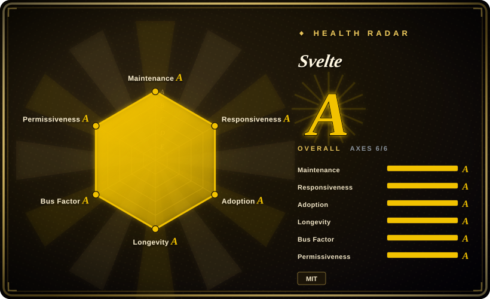
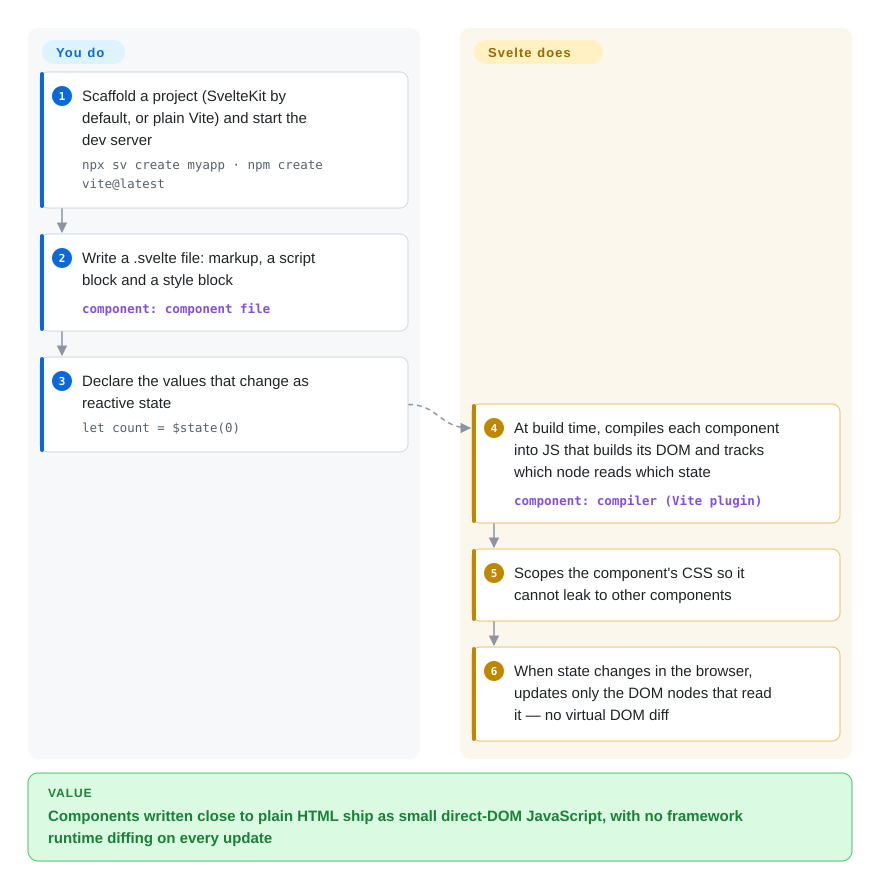

# Svelte

Your marketing site or mid-size app ships a framework runtime before it shows a single button, and every state change makes that runtime re-render and diff a whole component. Svelte moves the work to build time: a compiler turns each component into small JavaScript that updates exactly the DOM nodes that changed, so there is no framework diffing in the browser.

## When to use

You're one of three developers at a small product company building a customer portal plus its marketing pages. Half your users are on mid-range Android phones over spotty mobile data, and Lighthouse already flags "reduce unused JavaScript" on pages that are mostly forms and lists. You want components, but you don't want to pay for a framework runtime on every page, and your team writes HTML and CSS more fluently than JavaScript abstractions.

You reach for Svelte: a `.svelte` file is markup, a `<script>` block and a `<style>` block, CSS is scoped to the component by default, and the compiler outputs JavaScript that touches only the DOM nodes depending on the value that changed. You pick it over React because you don't need React's ecosystem depth and don't want to tune re-renders; over Vue because Svelte's output carries less framework runtime and its component files stay closer to plain HTML. When the portal later needs routing, server rendering and form actions, SvelteKit — Svelte's official app framework — adds them without changing how you write components.

## How it works

Svelte is a **compiler**, not just a runtime library: it reads your components at build time and writes the JavaScript that will run in the browser. **You** write `.svelte` files and mark the values that change with **runes** — compiler keywords such as `$state` (a reactive variable), `$derived` (a value computed from other state) and `$effect` (code that re-runs when what it reads changes). **Svelte** turns each component into code that creates its DOM once and wires every DOM node directly to the state it reads, so when `count` changes it updates that one text node — no virtual DOM (an in-memory copy of the page that frameworks like React compare on each update). It is like an electrician wiring each light to its own switch instead of a building manager walking every floor to check which lights should be on. Svelte stops at components: routing, server rendering, data loading and deployment adapters come from SvelteKit, which `npx sv create` sets up by default.

<!-- flow-steps:begin (generated from flows/svelte.json by tools/flow_card.py — do not edit) -->

Text version of the flow

1. **You**: Scaffold a project (SvelteKit by default, or plain Vite) and start the dev server — `npx sv create myapp · npm create vite@latest`
2. **You**: Write a .svelte file: markup, a script block and a style block — component: `component file`
3. **You**: Declare the values that change as reactive state — `let count = $state(0)`
4. **Svelte**: At build time, compiles each component into JS that builds its DOM and tracks which node reads which state — component: `compiler (Vite plugin)`
5. **Svelte**: Scopes the component's CSS so it cannot leak to other components
6. **Svelte**: When state changes in the browser, updates only the DOM nodes that read it — no virtual DOM diff

**Value**: Components written close to plain HTML ship as small direct-DOM JavaScript, with no framework runtime diffing on every update

<!-- flow-steps:end -->

## When NOT to use

- **You need a ready-made third-party library for every niche (data grids, charting suites, design systems) — use React instead, because** React's ecosystem is far larger; with Svelte you will more often build components yourself or wrap framework-agnostic libraries.
- **You must hire many frontend developers quickly — use React or Vue instead, because** the pool of developers with production Svelte experience is markedly smaller in most job markets.
- **You need the deepest SSR/hosting integration and the most third-party examples for a full-stack app — use Next.js (React) or Nuxt (Vue) instead, because** SvelteKit is capable but has fewer integrations, starters and hosting-specific guides.
- **You have a large Svelte 3/4 codebase and no budget for migration — stay on Svelte 4 deliberately or plan the upgrade, because** Svelte 5 replaced `$:` labels and `export let` with runes; legacy syntax still compiles in non-runes mode, but new docs, examples and libraries assume runes.
- **Your SSR app renders untrusted, user-controlled attributes or element names and you cannot upgrade quickly — use React or Vue with your current hardening instead, or commit to fast patching, because** Svelte published a run of SSR cross-site-scripting advisories in 2026 (spread attributes, `<svelte:element>` tag names, `<option>`, `bind:innerText`, hydration markers), fixed in 5.x releases you must actually ship.
- **You want one opinionated framework with dependency injection, forms and HTTP built in — use Angular instead, because** Svelte deliberately ships only the component layer.

## Comparison

| Alternative | In index | Our verdict | Tradeoff |
| --- | --- | --- | --- |
| [React](react.md) | ✅ | When you need the largest library ecosystem, React Native and the deepest hiring pool, pick React; pick Svelte when payload size and less boilerplate matter more than ecosystem breadth. | React: more ready-made components and candidates, but a bigger runtime and manual re-render tuning; Svelte: smaller output, fewer libraries. |
| [Vue.js](vue.md) | ✅ | For teams that want templates, an official router/store and incremental adoption inside existing pages, pick Vue; pick Svelte for the leanest compiled output with HTML-first component files. | Vue: larger ecosystem and hiring pool, a small runtime; Svelte: no virtual DOM at all, smaller community. |
| [Angular](angular.md) | ✅ | For a large enterprise team that wants DI, forms, HTTP and strict conventions out of the box, pick Angular; pick Svelte when a small team wants to ship light pages quickly. | Angular: built-in consistency at the cost of weight and ceremony; Svelte: minimal surface, you choose the rest. |
| [SvelteKit](../app-frameworks/sveltekit.md) | ✅ | Not an either/or: for any Svelte app that needs routing, SSR or server endpoints, use SvelteKit on top of Svelte; use plain Svelte (via Vite) only for widgets or client-only SPAs. | SvelteKit: file routing, SSR, form actions, deployment adapters, plus a server to run; plain Svelte: just the component compiler. |
| [Next.js](../app-frameworks/nextjs.md) | ✅ | When the full-stack app should sit in the React ecosystem with mature hosting integrations, pick Next.js; pick Svelte + SvelteKit when lighter client payloads matter more. | Next.js: biggest meta-framework ecosystem, React's runtime cost; SvelteKit: smaller output, fewer integrations. |
| Solid | not indexed | When you want fine-grained signals with JSX instead of templates, pick Solid; pick Svelte for HTML-first files, scoped CSS and a larger community with an official app framework. | Solid: comparable update granularity, JSX, smaller ecosystem; Svelte: template syntax, SvelteKit, more learning material. |

## Tech stack

- **JavaScript with JSDoc types** — the `svelte` package source is JavaScript type-checked via JSDoc, shipping TypeScript declarations; components may be written in TypeScript.
- **Compiler** — parses `.svelte` files (Acorn-based) and emits DOM-manipulating JavaScript for the client and string-rendering code for SSR; no virtual DOM.
- **Runes (Svelte 5)** — `$state`, `$derived`, `$effect`, `$props` and friends; signal-based fine-grained reactivity. Attachments (`{@attach}`) since 5.29; experimental `await` in components behind a compiler option since 5.36.
- **Scoped CSS** — component styles are scoped by a generated class unless marked `:global`.
- **Vite** — the standard build integration (`vite-plugin-svelte`); SvelteKit is built on Vite.

## Dependencies

- **Node.js ≥ 18** — for the compiler and build tooling; also at runtime if you serve SvelteKit SSR from Node.
- **Vite** (via `npx sv create` or `npm create vite@latest`) — other bundlers need community plugins.
- **Browser runtime** — only a small internal runtime ships with the compiled output; nothing else to install.
- **Optional:** SvelteKit plus a deployment adapter (Node, static, Vercel, Cloudflare, Netlify) for routing and SSR; TypeScript.

## Ops difficulty

**Low for client-only builds, medium with SvelteKit SSR.** A Svelte SPA builds to static files for any CDN. SSR via SvelteKit means running a Node or edge runtime and keeping `svelte` and `@sveltejs/kit` patched — 2026 brought several SSR XSS advisories, so the upgrade cadence matters. Migrating a Svelte 4 codebase to runes is real work (`npx sv migrate svelte-5` helps, and old- and new-syntax components can be mixed, so you can migrate gradually). Custom preprocessors (Sass, Pug) add build configuration.

## Health & viability

- **Maintenance (2026-10).** Very active: 5.57.2 released 2026-10-06, with minor releases roughly monthly and patch releases weekly. Radar maintenance and responsiveness are A (last commit 1 day before scoring).
- **Governance / bus factor.** Created by Rich Harris (employed by Vercel to work on Svelte); a core team of several maintainers handles most changes. The radar counts 59 active contributors in 12 months with the top one at 38% of commits — concentrated but not single-person. No foundation; the README describes development as volunteer-driven with Open Collective funding.
- **Backing & longevity.** Svelte dates from 2016 (~10 years) and is still shipping features — a solid Lindy prior, younger than React or Angular. Vercel's employment of the creator is strong backing, but it also owns Next.js, so priorities are a single-company decision.
- **Adoption & ecosystem.** 25,015,672 npm downloads in the last month (radar, 2026-10-08) — far behind React and Vue but well established. SvelteKit is the default app path; the third-party component ecosystem is the main gap.
- **Risk flags.** MIT, no relicense history. Security: the GitHub advisory list shows one XSS in 2024 and more than ten SSR XSS/ReDoS advisories between January and May 2026, all fixed in 5.x patch releases — not a reason to avoid Svelte, but a reason to upgrade promptly. Runes were a breaking paradigm change in 5.0 (2024).

## Caveats (unverified)

- [未验证] Bundle-size and update-speed advantages over React and Vue vary by app; no benchmark was run for this page.
- [推断] Hiring-pool size relative to React and Vue is inferred from job postings and surveys, not hard data.
- [未验证] Which core maintainers besides Rich Harris are paid by Vercel or other companies was not confirmed.
- [未验证] Whether `await` in components (`experimental.async`) has left experimental status as of 5.57 was not confirmed.
- [推断] The 2026 advisory cluster reflects concentrated SSR security review (many filed together) rather than a worsening codebase; this is an interpretation of the dates, not a statement from the maintainers.
- [未验证] ~88k GitHub stars as of 2026-10-08; star counts drift.
