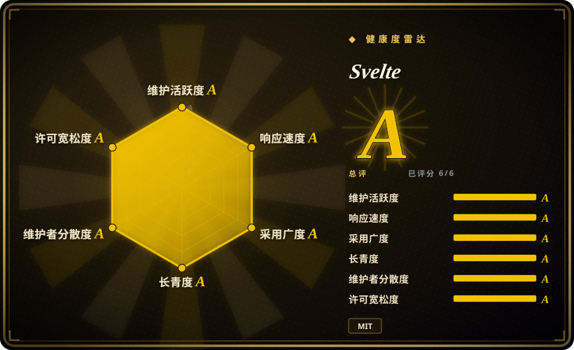
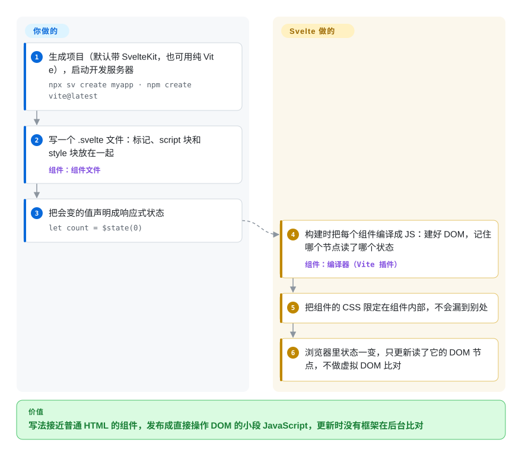

# Svelte

你的营销站或中等规模应用，还没显示出一个按钮，就先下载了一整份框架运行时；之后每次状态变化，这份运行时都要把整个组件重渲染一遍再做比对。Svelte 把这些工作挪到构建阶段：编译器把每个组件变成一小段 JavaScript，只更新真正变了的那几个 DOM 节点，浏览器里不再有框架做比对。

## 何时使用

你是一家小产品公司的三名开发之一，要做一个客户门户和配套的营销页。一半用户用的是中端安卓手机，移动网络时好时坏，Lighthouse 已经在那些主要是表单和列表的页面上标出“减少未使用的 JavaScript”。你想要组件化，但不想每个页面都背一份框架运行时，而且团队写 HTML 和 CSS 比写 JavaScript 抽象顺手得多。

于是你用 Svelte：一个 `.svelte` 文件就是标记、一个 `<script>` 块和一个 `<style>` 块，CSS 默认只作用于本组件，编译器产出的 JavaScript 只碰依赖了那个变化值的 DOM 节点。你不选 React，是因为用不到它那么深的生态，也不想花心思调重渲染；不选 Vue，是因为 Svelte 的产物带的框架运行时更少，组件文件也更接近普通 HTML。等门户以后需要路由、服务端渲染和表单提交处理时，Svelte 官方的应用框架 SvelteKit 能补上这些，你写组件的方式不用变。

## 怎么用起来

Svelte 是一个**编译器**，而不只是运行时库：它在构建时读你的组件，写出真正在浏览器里运行的 JavaScript。**你**写 `.svelte` 文件，用 **runes** 标出会变的值。runes 是编译器认识的关键字，比如 `$state`（响应式变量）、`$derived`（由其他状态算出来的值）和 `$effect`（它读到的东西一变就重跑的代码）。**Svelte** 把每个组件变成这样的代码：一次性建好 DOM，并把每个 DOM 节点直接连到它读的状态上，所以 `count` 变了，就只更新那一个文本节点，不需要虚拟 DOM（React 这类框架每次更新都要比对的一份页面内存副本）。好比电工给每盏灯单独接一个开关，而不是让物业每次挨层巡查哪些灯该亮。Svelte 只管到组件为止：路由、服务端渲染、数据加载和部署适配器由 SvelteKit 提供，`npx sv create` 默认就会把它配好。

<!-- flow-steps:begin (generated from flows/svelte.json by tools/flow_card.py — do not edit) -->

流程文字版

1. **你**：生成项目（默认带 SvelteKit，也可用纯 Vite），启动开发服务器 — `npx sv create myapp · npm create vite@latest`
2. **你**：写一个 .svelte 文件：标记、script 块和 style 块放在一起 — 组件：`组件文件`
3. **你**：把会变的值声明成响应式状态 — `let count = $state(0)`
4. **Svelte**：构建时把每个组件编译成 JS：建好 DOM，记住哪个节点读了哪个状态 — 组件：`编译器（Vite 插件）`
5. **Svelte**：把组件的 CSS 限定在组件内部，不会漏到别处
6. **Svelte**：浏览器里状态一变，只更新读了它的 DOM 节点，不做虚拟 DOM 比对

**价值**：写法接近普通 HTML 的组件，发布成直接操作 DOM 的小段 JavaScript，更新时没有框架在后台比对

<!-- flow-steps:end -->

## 何时不用

- **你需要每个细分需求都有现成的第三方库（数据表格、整套图表、设计系统）：改用 React，因为** React 的生态大得多；用 Svelte 时你会更常自己写组件，或者去包装与框架无关的库。
- **你得很快招到一批前端：改用 React 或 Vue，因为** 在大多数招聘市场里，有 Svelte 生产经验的开发者明显更少。
- **全栈应用需要最深的 SSR 与托管集成、最多的第三方示例：改用 Next.js（React）或 Nuxt（Vue），因为** SvelteKit 能力够用，但集成、模板和针对各托管平台的指南都更少。
- **你有一个大型 Svelte 3/4 代码库，又没有迁移预算：有意识地留在 Svelte 4，或者排期升级，因为** Svelte 5 用 runes 取代了 `$:` 标签和 `export let`；旧语法在非 runes 模式下仍能编译，但新文档、示例和库都默认你用 runes。
- **你的 SSR 应用会渲染用户可控的属性或元素名，而你没法快速升级：改用 React 或 Vue 并沿用现有的加固措施，或者承诺快速打补丁，因为** Svelte 在 2026 年连续发布了一批 SSR 跨站脚本（XSS）安全公告（展开属性、`<svelte:element>` 标签名、`<option>`、`bind:innerText`、水合标记），修复都在 5.x 版本里，你得真的升上去。
- **你想要一个内置依赖注入、表单和 HTTP 的强约定框架：改用 Angular，因为** Svelte 有意只提供组件这一层。

## 横向对比

| 替代品 | 是否收录 | 我们的评价 | 取舍 |
| --- | --- | --- | --- |
| [React](react.zh.md) | ✅ | 需要最大的库生态、React Native 和最深的招聘池，选 React；下载体积和少写样板代码比生态广度更重要，选 Svelte。 | React：现成组件和候选人更多，但运行时更大，要手动调重渲染；Svelte：产物更小，库更少。 |
| [Vue.js](vue.zh.md) | ✅ | 团队想要模板语法、官方路由和状态库、能嵌进现有页面渐进引入，选 Vue；想要最精简的编译产物和以 HTML 为主的组件文件，选 Svelte。 | Vue：生态和招聘池更大，运行时也小；Svelte：完全没有虚拟 DOM，社区更小。 |
| [Angular](angular.zh.md) | ✅ | 大型企业团队想要开箱即用的依赖注入、表单、HTTP 和严格约定，选 Angular；小团队想快速交付轻量页面，选 Svelte。 | Angular：内置一致性，代价是体积和繁文缛节；Svelte：表面积最小，其余自己挑。 |
| [SvelteKit](../app-frameworks/sveltekit.zh.md) | ✅ | 不是二选一：凡是需要路由、SSR 或服务端接口的 Svelte 应用，都在 Svelte 之上用 SvelteKit；只有小组件或纯客户端单页应用才用裸 Svelte（经由 Vite）。 | SvelteKit：文件路由、SSR、表单 action、部署适配器，但要多跑一个服务端；裸 Svelte：只有组件编译器。 |
| [Next.js](../app-frameworks/nextjs.zh.md) | ✅ | 全栈应用要待在 React 生态里、要成熟的托管集成，选 Next.js；客户端下载体积更要紧，选 Svelte 加 SvelteKit。 | Next.js：最大的元框架生态，背着 React 的运行时成本；SvelteKit：产物更小，集成更少。 |
| Solid | 未收录 | 想用 JSX 而不是模板、同样要细粒度信号，选 Solid；想要以 HTML 为主的文件、作用域 CSS、更大的社区和官方应用框架，选 Svelte。 | Solid：更新粒度相当，用 JSX，生态更小；Svelte：模板语法，有 SvelteKit，学习资料更多。 |

## 技术栈

- **带 JSDoc 类型的 JavaScript**：`svelte` 包的源码是用 JSDoc 做类型检查的 JavaScript，并发布 TypeScript 类型声明；组件本身可以用 TypeScript 写。
- **编译器**：解析 `.svelte` 文件（基于 Acorn），为客户端产出直接操作 DOM 的 JavaScript，为 SSR 产出拼字符串的渲染代码；没有虚拟 DOM。
- **Runes（Svelte 5）**：`$state`、`$derived`、`$effect`、`$props` 等，基于信号的细粒度响应式。5.29 起有 attachments（`{@attach}`）；5.36 起可通过编译选项试用组件内 `await`（实验性）。
- **作用域 CSS**：组件样式靠生成的 class 限定作用域，除非标成 `:global`。
- **Vite**：标准构建集成（`vite-plugin-svelte`）；SvelteKit 本身构建在 Vite 上。

## 依赖

- **Node.js ≥ 18**：编译器和构建工具需要；如果用 Node 跑 SvelteKit 的 SSR，运行时也需要。
- **Vite**（经由 `npx sv create` 或 `npm create vite@latest`）：用其他打包器要靠社区插件。
- **浏览器运行时**：编译产物里只带一份很小的内部运行时，不需要另装别的。
- **可选：** SvelteKit 加一个部署适配器（Node、静态、Vercel、Cloudflare、Netlify），提供路由和 SSR；TypeScript。

## 运维难度

**纯客户端构建低，用 SvelteKit 做 SSR 时中等。** Svelte 单页应用构建出来是静态文件，放任何 CDN 都行。通过 SvelteKit 做 SSR 就要跑一个 Node 或边缘运行时，并持续给 `svelte` 和 `@sveltejs/kit` 打补丁；2026 年出了好几条 SSR XSS 公告，升级节奏很重要。把 Svelte 4 代码库迁到 runes 是实打实的工作量（`npx sv migrate svelte-5` 能帮忙，新旧语法的组件可以混用，能逐个迁）。自定义预处理器（Sass、Pug）会增加构建配置。

## 健康度与可持续性

- **维护（2026-10）。** 非常活跃：5.57.2 于 2026-10-06 发布，小版本大约每月一个，补丁版本每周都有。雷达的维护和响应两轴都是 A（打分时最后一次提交在 1 天前）。
- **治理与 bus factor。** 由 Rich Harris 创建（Vercel 雇他全职做 Svelte）；几位核心维护者承担了大部分改动。雷达统计 12 个月内有 59 位活跃贡献者，头号贡献者占 38% 的提交：集中，但不是一个人撑着。没有基金会；README 说开发靠志愿者，资金来自 Open Collective。
- **背书与长青度。** Svelte 始于 2016 年（约 10 年），至今还在加功能，Lindy 先验扎实，只是比 React、Angular 年轻。Vercel 雇用创作者是有力的背书，但 Vercel 同时拥有 Next.js，优先级由一家公司说了算。
- **采用度与生态。** 最近一个月 npm 下载 25,015,672 次（雷达，2026-10-08），远少于 React 和 Vue，但已站稳。SvelteKit 是默认的应用路线；第三方组件生态是主要短板。
- **风险标记。** MIT 协议，没有改协议的历史。安全方面：GitHub 安全公告列表显示 2024 年有一条 XSS，2026 年 1 月到 5 月有十多条 SSR XSS 和 ReDoS 公告，都在 5.x 补丁版本里修了。这不是回避 Svelte 的理由，但是要及时升级的理由。runes 是 5.0（2024 年）带来的破坏性范式变化。

## 存疑（未验证）

- [未验证] 相对 React 和 Vue 的包体积和更新速度优势因应用而异；本页没有跑基准测试。
- [推断] 招聘池相对 React 和 Vue 的大小是从招聘信息和调查推断的，没有硬数据。
- [未验证] 除 Rich Harris 外，哪些核心维护者由 Vercel 或其他公司付薪，没有确认。
- [未验证] 截至 5.57，组件内 `await`（`experimental.async`）是否已脱离实验状态，没有确认。
- [推断] 2026 年集中出现的安全公告，更可能反映的是一轮集中的 SSR 安全审查（很多条同日发布），而不是代码质量在变差；这是对日期的解读，不是维护者的说法。
- [未验证] 截至 2026-10-08 约 8.8 万 GitHub star；star 数会变。
