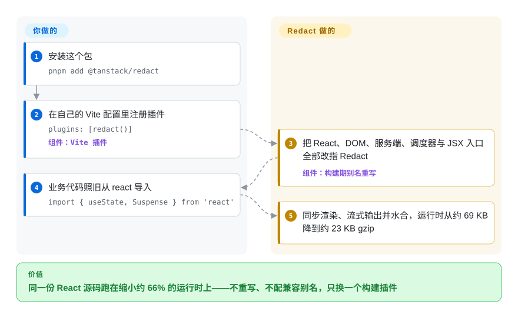

# TanStack Redact

你的 Vite＋React 站点还没发出第一行业务代码，就先背上了约 69 KB gzip 的 React 运行时，而这份体重大半花在你的页面根本用不到的并发调度上。TanStack Redact 换掉你脚下的运行时：一个 Vite 插件把所有 `react`、`react-dom`、JSX 导入重定向到一份实测 23 KB gzip 的同步重新实现——但它没有 React 的并发调度器，而且截至 2026 年 9 月，仓库连一份许可证都还没放。

## 何时使用

你维护一个用 Vite 和 React 搭的内容型站点——文档站、营销页、带几块交互的博客。包体积预算光 React 运行时一项就爆了，可页面从来没靠过并发能力：没有 transitions、没有乐观表单、没有 `useDeferredValue` 那套调优。换框架重写不在选项里，代码库是多年攒下来的地道 React。

这时就该想到 Redact：`pnpm add @tanstack/redact`，在 `vite.config.ts` 里加上 `redact()`，所有 `import ... from 'react'` 就解析到 Redact 的同步运行时——hooks、context、带流式 SSR 的 Suspense、portal、水合都在——运行时体重大约只剩三分之一（23.3 KB 对 69.2 KB gzip，项目 2026 年 9 月对锁定的 React 19.3.0 自测）。和 **Preact** 比，选它是因为要一份跟住 React 19.3 当前 API 面（`Activity`、Fragment refs、`ViewTransition`、`use`）的运行时，不用维护兼容层、不用每个打包器配一遍别名；和 **React** 本体比，选它是因为包体积预算比并发特性、DevTools 和十几年生态打磨更重要。先读「何时不用」：同步降级和缺失的许可证对这桩选择的分量，比省下的体积更大。

## 怎么用起来

你改的是构建，不是代码。Vite 插件把 `react`、`react/jsx-runtime`、`react-dom`、`react-dom/client`、`react-dom/server` 和调度器这些模块名，在客户端与 SSR 构建里统统改指 Redact 自己编译好的入口——和 `preact/compat` 用的是同一招构建期别名，但一个插件罩住整个 React API 面。之后 Redact 用**同步**方式渲染：一次状态更新立刻刷完，没有 React 的时间切片、可中断渲染或优先级通道。为并发而生的那些 API 依然存在，导入不会断，但好几个被降级了——`useTransition` 的 pending 恒为 false，`useDeferredValue` 原样返回输入，`useActionState` 只返回初始状态、不执行 action。RSC 环境被刻意留在真 React 上，Server Components 经 `@vitejs/plugin-rsc` 照常工作。特性开关（`redact({ features: { ... } })`）和 `nano` 预设还能砍掉你不需要的行为——不含 context、Suspense、memo 的 DOM 客户端最瘦到 12.5 KB gzip。

<!-- flow-steps:begin (generated from flows/tanstack-redact.json by tools/flow_card.py — do not edit) -->

流程文字版

1. **你**：安装这个包 — `pnpm add @tanstack/redact`
2. **你**：在自己的 Vite 配置里注册插件 — `plugins: [redact()]` — 组件：`Vite 插件`
3. **TanStack Redact**：把 React、DOM、服务端、调度器与 JSX 入口全部改指 Redact — 组件：`构建期别名重写`
4. **你**：业务代码照旧从 react 导入 — `import { useState, Suspense } from 'react'`
5. **TanStack Redact**：同步渲染、流式输出并水合，运行时从约 69 KB 降到约 23 KB gzip

**价值**：同一份 React 源码跑在缩小约 66% 的运行时上——不重写、不配兼容别名，只换一个构建插件

<!-- flow-steps:end -->

## 何时不用

- **组织上架需要法务放行的话，留在 [React](react.zh.md) 或 Preact（都是 MIT）。** 截至 2026-09-28，仓库全树没有 LICENSE 文件，`packages/redact/package.json` 未声明许可证，npm 包里也没有——默认版权保留所有权利，TanStack 补上之前，你连复制分发权都没拿到。
- **应用依赖并发特性的话，留在 React。** Transitions 同步执行（pending 永远不翻真）、`useDeferredValue` 是恒等函数、`useActionState` 不执行 action、`useOptimistic` 和 `useFormStatus` 是空操作——编译能过的代码，行为会悄悄变样。
- **构建工具不是 Vite（webpack、Rspack、Next.js 等）时，改用 Preact＋`preact/compat` 或 React**，因为 Redact 唯一发布的接入方式就是一个 Vite 插件（唯一的对等依赖是 `vite >= 5`）。
- **调试流程离不开 React Profiler、DevTools 或 StrictMode 双调用的话，留在 React**——Redact 没有实现 DevTools 和 Fast Refresh 内核，`StrictMode` 渲染子组件也不会双调用。
- **应用以 RSC 为主时，先量清楚收益落在哪**——RSC 环境留在真 React 上，体积和性能收益只覆盖客户端与 DOM 服务端运行时。
- **要跑 React Native 或任何非 DOM 目标时，留在 React**——Redact 只实现了 DOM 渲染和 SSR。
- **今天就要扛生产关键路径的，选 React 或 Preact。** Redact 才五个月大、0.x 快速演进（2026 年 9 月内 0.0.20 → 0.1.2）、npm 周下载约 1500 次，还有一份开着没人回的四条水合缺陷报告（issue #17，2026-07-04 提出，截至 2026-09-28 无回应）；它自己的基准里水合慢 21%，Suspense 重试周期慢 124.8%（绝对值约每周期 0.15 ms）。

## 横向对比

| 替代品 | 是否收录 | 我们的评价 | 取舍 |
| --- | --- | --- | --- |
| React（`facebook/react`） | ✅ [react](react.zh.md) | 应用用着 transitions、actions 或乐观 UI，或者 DevTools、StrictMode、React Native 是硬需求时，选 React；Vite 应用的包体积预算是头等大事、UI 从不依赖并发调度时，选 Redact。 | React 19.3 运行时实测 69.2 KB gzip，但带着完整并发渲染器、MIT 许可、每周 2.03 亿下载和十几年打磨；Redact 自测 23.3 KB，代价是同步降级、0.x 变动和没有许可证。 |
| Preact（`preactjs/preact`） | 未收录 | 要最小、久经考验、许可宽松的 React 兼容运行时，选 Preact＋`preact/compat`；想要一个 Vite 插件就罩住 React 19.3 新 API（`Activity`、`ViewTransition`、`use`）、不用逐打包器维护兼容别名时，选 Redact。 | Preact 核心约 4 KB、MIT、2015 年至今每周 3923 万下载，但兼容层跟不上新 React API，别名配置得自己背；Redact 在插件内盖住 19.3 API 面，代价是五个月大、只支持 Vite、无许可。本次 tab-intake 批次未收录。 |
| Solid（`solidjs/solid`） | 未收录 | 只有当用 signals API 重写组件也在桌上时才考虑 Solid——细粒度更新、无虚拟 DOM；现有 React 源码必须原样保留时，选 Redact。 | Solid（每周 643 万下载、MIT）换的是编程模型，是重写不是替换；Redact 保留 React API、只换底下跑的东西，代价是运行时还很年轻。本次 tab-intake 批次未收录。 |
| Svelte（`sveltejs/svelte`） | ✅ [svelte](svelte.zh.md) | 绿地项目想要一个没有虚拟 DOM 运行时的编译器框架，选 Svelte；既有 React 代码库、只允许换脚下运行时的，选 Redact。 | Svelte 把组件编译成命令式代码、整个模型都变小，但要学新语法、做迁移；Redact 只要构建配置里加一行，也拿不到 Svelte 的编译器优化。 |

仓库自己的 manifest 写着「a minimal React-compatible runtime for TanStack Start apps」[推断]——姊妹项目 [TanStack Router](../app-frameworks/tanstack-router.zh.md) 与 Start 全家桶是它预设的第一个落点；[TanStack Query](../../data-fetching/tanstack-query.zh.md)、[TanStack Table](../../component-libraries/tanstack-table.zh.md) 等其他 TanStack 库消费的是 React 公开 API 面，Redact 声称盖住这个面，它们在换 runtime 后的表现是从这点推出来的，仓库本身没有测过。

## 技术栈

- **TypeScript** monorepo：pnpm workspaces、changesets 发版、Vitest＋Playwright、基于 esbuild 的构建脚本。
- 只发布一个包 `@tanstack/redact`，按子路径导出：`.`（React API）、`/jsx-runtime`、`/dom`、`/dom-client`、`/dom-test-utils`、`/server`、`/scheduler`、`/compiler-runtime`、`/vite`、`/features/*`。
- 基准测试直接进仓库（`benchmarks/` 目录，含结果、测量记录和一份独立审计文件），对比对象是锁定的 React 19.3.0。

## 依赖

- **运行时：** 只有你的应用本身——唯一的对等依赖是 `vite >= 5`（可选，给插件用）。
- RSC 环境刻意保留真 `react`（Server Components 走 `@vitejs/plugin-rsc`）。
- 没有服务器、没有数据库、没有托管服务。

## 运维难度

**跑起来零负担，跟版本中等。** 它是纯前端构建依赖，没有任何要运维的东西。真正的成本在变更管理：

- 0.x 快速演进——每次发版重读一遍兼容性表，因为会动的不只是 API 名字，还有行为。
- 试用很便宜：插件开关就一行，让 CI 对真 React 和 Redact 各跑同一套测试——项目自己的 Chrome 门禁就在两个渲染器上跑 1,266 个用例。
- 盯着仓库什么时候出现 LICENSE 文件，任何再分发或产品化动作之前先确认。

## 健康度与可持续性

- **维护（2026-09-28）。** 活跃：2026-09-07 至 09-12 连发六个版本（0.0.20 → 0.1.2），`main` 最后推送 2026-09-12。CI 跑 1,569 个测试、类型检查、构建产物校验、19 个体积预算和一个浏览器门禁；对 0.x 项目来说，这份自基准纪律罕见地严。
- **治理／巴士系数。** 单一主导作者：Tanner Linsley 占 GitHub 统计中约 69 次提交里的 56 次；挂在 TanStack 组织下，有赞助和发版基建，但仓库里看不到第二位维护者 [推断]。
- **背书与寿命。** 五个月大（2026-04-20 建仓），Lindy 先验帮不上忙；对冲项是 TanStack 组织把 Query、Table、Router 养了多年的记录。声明的意图是成为 TanStack Start 的运行时 [推断]——这是一个押注，还不是落地默认。
- **采用与生态。** 318 star、8 fork；npm 显示 2026-09-21 那周约 1500 次下载，健康度评分器最近一个月窗口计数 5952 次——外加作者自跑的两个真实站点验证：tannerlinsley.com 已上生产，tanstack.com 预览通过、等待评审。文档就是 README 加 `docs/`、`benchmarks/` 目录，还没有文档站。
- **风险信号。** **全仓库无许可证**（仓库树、包清单、npm 三处都没有，截至 2026-09-28）——在它改变之前，这是决定性的采用阻碍；0.x 变动；一份外部水合缺陷报告（#17）自 2026-07-04 起无人回应。

## 存疑（未验证）

- [未验证] 所有体积与性能数字（23.3 KB 对 69.2 KB gzip；水合慢 21.4%；Suspense 重试慢 124.8%，约合每周期 0.15 ms）来自项目自己的 `benchmarks/` 文件（2026 年 9 月，Apple M5 Pro、Chrome 152），未在此复测；README 自己也注明计时用的是冻结的预发布快照。
- [未验证] 许可证缺失于 2026-09-28 核验（GitHub API `license: null`；递归全树搜索无 LICENSE、COPYING、NOTICE；npm `license` 字段为空）——TanStack 任何一个版本都可能补上，依赖本页许可证结论前请复查。
- [推断] 「a minimal React-compatible runtime for TanStack Start apps」出自私有根 manifest 的描述；没有公开的 TanStack Start 发布说明确认 Start 默认搭载 Redact。
- [推断] TanStack Query、Table、Router 在 Redact 下的兼容性，是从它们只消费 React 公开 API 面、而 Redact 声称盖住该面推出来的；仓库只验证过 tanstack.com 和 tannerlinsley.com。
- [未验证] Issue #17 的四条水合缺陷是对着 0.0.17 报的；0.1.2 是否修复，仓库里没有任何说明。
- [未验证] Preact、Solid、Svelte 的对比单元格依据是它们的 GitHub 与 npm 元数据（下载量为 2026-09-28 那周），本批次未完整通读这些仓库。
