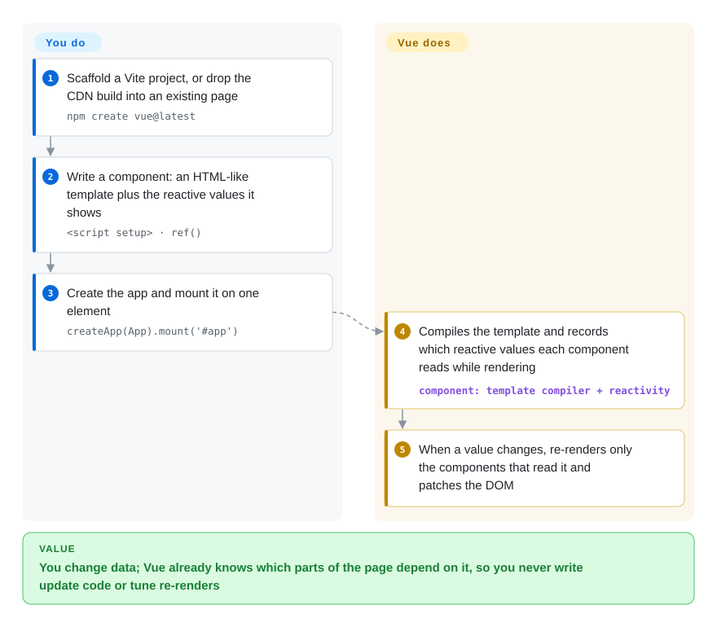

# Vue.js

Your server-rendered pages keep growing jQuery handlers until nobody knows which click updates which counter, but a full React rewrite with its own router, state library and build decisions is more than the team can absorb. Vue lets you write HTML-like templates bound to reactive data — change the data and Vue updates the parts of the page that use it — and grows from one widget on an existing page to a full app with an official router and store.

## When to use

You're two backend-leaning developers maintaining a Laravel or Django admin system. The order-editing page has grown 600 lines of jQuery: change a quantity and the subtotal updates, but the shipping estimate and the "over credit limit" warning sometimes don't, because each handler patches the DOM by hand. You want reactive components, but you can't stop to rebuild the whole frontend, and your team reads HTML templates far more easily than JSX.

You reach for Vue: drop it into that one page (CDN build, or a Vite entry), write the editor as a component whose template reads `quantity`, `subtotal` and `overLimit`, and Vue keeps all three in sync whenever the data changes. Later pages move to `.vue` single-file components, then to a full SPA with the official Vue Router and Pinia — or to Nuxt for server rendering — without rewriting the early components. You pick it over React because routing, state and tooling come from one team with one set of docs and its reactivity does not ask you to manage re-renders; over Svelte because Vue's larger ecosystem (Element Plus, Vuetify, Nuxt) and hiring pool, especially in China, matter more than the smallest bundle.

## How it works

Vue pairs a **template compiler** with a **reactivity system**. **You** write a component as an HTML-like template plus the data it shows, declared with `ref()` or `reactive()` (wrappers that let Vue notice reads and writes), usually inside `<script setup>` in a `.vue` file, then `createApp(App).mount('#app')`. **Vue** compiles the template into a render function, and while rendering it records which reactive values each component read — like a librarian noting who borrowed which book, so when a book comes back changed, only those readers get a call. When a value changes, Vue re-renders just those components through a virtual DOM (an in-memory sketch of the page it compares against the last one) and patches the real DOM. Vue 3.6, in release-candidate stage as of 2026-10, adds an opt-in **Vapor mode** (`<script setup vapor>`) that compiles components to direct DOM updates with no virtual DOM, and rebuilds reactivity on alien-signals for speed and memory. Routing (Vue Router), shared state (Pinia) and SSR (Nuxt) are separate official or ecosystem packages you add when needed.

<!-- flow-steps:begin (generated from flows/vue.json by tools/flow_card.py — do not edit) -->

Text version of the flow

1. **You**: Scaffold a Vite project, or drop the CDN build into an existing page — `npm create vue@latest`
2. **You**: Write a component: an HTML-like template plus the reactive values it shows — `<script setup> · ref()`
3. **You**: Create the app and mount it on one element — `createApp(App).mount('#app')`
4. **Vue.js**: Compiles the template and records which reactive values each component reads while rendering — component: `template compiler + reactivity`
5. **Vue.js**: When a value changes, re-renders only the components that read it and patches the DOM

**Value**: You change data; Vue already knows which parts of the page depend on it, so you never write update code or tune re-renders

<!-- flow-steps:end -->

## When NOT to use

- **You need the largest hiring pool and third-party library selection in Western markets — use React instead, because** React's ecosystem and candidate pool are larger there; Vue's lead is strongest in China and parts of Asia.
- **You want enforced architecture (dependency injection, prescribed module boundaries) across many teams — use Angular instead, because** Vue leaves project structure to you, and large organizations without strong conventions end up with divergent codebases.
- **You need SEO-friendly server rendering or static generation — use Nuxt (Vue) rather than plain Vue, because** Vue's core can server-render, but routing, data loading, payload hydration and deployment targets come from Nuxt.
- **You need React Native-level mobile reuse or are already deep in React (Next.js, custom hooks, React-only component kits) — stay on React, because** Vue's mobile story relies on third-party projects and the template-vs-JSX and reactivity mental models differ enough to make a switch costly.
- **You still run a Vue 2 codebase — budget a migration or paid extended support, because** Vue 2 reached end of life on 2023-12-31; Vue 3 has breaking changes and some Vue 2-era libraries never migrated.
- **You want the smallest possible runtime today without waiting for Vapor mode to stabilize — use Svelte instead, because** stable Vue 3.5 still ships a virtual DOM runtime; Vapor mode is only in the 3.6 release candidates as of 2026-10-08.

## Comparison

| Alternative | In index | Our verdict | Tradeoff |
| --- | --- | --- | --- |
| [React](react.md) | ✅ | When ecosystem breadth, React Native and the Western hiring pool decide, pick React; pick Vue when a small team wants templates, automatic dependency tracking and an official router/store from one source. | React: more libraries and candidates, more stack assembly and re-render tuning; Vue: integrated official stack, smaller ecosystem outside Asia. |
| [Angular](angular.md) | ✅ | For many teams that need DI, forms, HTTP and a mandated structure, pick Angular; pick Vue when you want to adopt incrementally and keep structure light. | Angular: enforced consistency, heavier concepts and upgrades; Vue: faster to start and embed, conventions are your job. |
| [Svelte](svelte.md) | ✅ | When payload size is the top constraint and the app is self-contained, pick Svelte; pick Vue for its larger ecosystem, Nuxt, and drop-in use on existing server-rendered pages. | Svelte: compiled, no virtual DOM, smaller community; Vue: small runtime plus VDOM (Vapor mode pending), broader library choice. |
| [Nuxt](../app-frameworks/nuxt.md) | ✅ | Not an either/or: for a Vue app that needs SSR, file routing or server endpoints, use Nuxt on top of Vue; use plain Vue for widgets, embedded pages or client-only SPAs. | Nuxt: SSR, payload hydration, Nitro deploy presets, plus a server and Vercel-owned roadmap; plain Vue: just the view layer and official add-ons. |
| [Next.js](../app-frameworks/nextjs.md) | ✅ | When the SSR app should live in the React ecosystem, pick Next.js; when the team prefers Vue templates, pick Nuxt rather than Next.js. | Next.js: largest meta-framework community, React only; Nuxt/Vue: comparable features, smaller footprint outside Asia. |

## Tech stack

- **TypeScript** — the `vuejs/core` monorepo (`packages/`: reactivity, runtime-core, runtime-dom, compiler-sfc, server-renderer, and in 3.6 `compiler-vapor` / `runtime-vapor`).
- **Proxy-based reactivity** — ES2015 Proxies track reads and writes; 3.6 rewrites `@vue/reactivity` on alien-signals.
- **Template compiler + virtual DOM** — templates compile to render functions with static hoisting and patch flags; Vapor mode (3.6, opt-in) compiles to direct DOM operations instead.
- **Single-file components (`.vue`)** — `<template>`, `<script setup>`, `<style scoped>` compiled by `@vitejs/plugin-vue`.
- **Official ecosystem** — Vite (build), Vue Router, Pinia (state), Vue DevTools; Nuxt as the community-run meta-framework.

## Dependencies

- **A modern browser** — ES2015+; no IE11.
- **Node.js** — for Vite and the SFC compiler (`npm create vue@latest`); not needed for the CDN global build.
- **Optional:** Vue Router (client routing), Pinia (shared state), Nuxt (SSR/SSG, needs a Node or edge runtime), a component library (Element Plus, Vuetify, Naive UI).
- **Legacy:** Vue CLI / webpack setups still work but are in maintenance; new projects use Vite.

## Ops difficulty

**Low for client apps, medium with Nuxt SSR.** A Vue SPA builds to static files for any CDN, and Vite needs little configuration. Ops grows when you add Nuxt SSR (a Node or edge runtime to run and patch), when many teams share one codebase without conventions, or when you carry a Vue 2 codebase past its end of life. Adopting Vapor mode later is per-component and opt-in, but mixing Vapor and VDOM components needs the interop plugin, which pulls the VDOM runtime back in.

## Health & viability

- **Maintenance (2026-10).** Active on two tracks: 3.5.x patch releases every two to three weeks (3.5.43 on 2026-09-17) and the 3.6 line in release candidates (rc.10 on 2026-09-30) after alpha in July 2025. The radar's maintenance axis is A, but the last commit on the default branch was 20 days before scoring because most work now lands on the `minor` branch.
- **Governance / bus factor — the weak axis.** Created and led by Evan You; the radar counts 20 active maintainers in 12 months with the top contributor at 63% of commits, so governance scores C. A small core team exists, but the roadmap rests heavily on one person.
- **Backing & longevity.** Independent of any single corporation, funded by sponsors; Evan You's company VoidZero works on Vite and related tooling rather than Vue itself. Vue dates from 2014 (this `vuejs/core` repo from 2018) and is still actively developed — a strong Lindy prior on age × activity.
- **Adoption & ecosystem.** 104,114,812 npm downloads in the last month (radar, 2026-10-08); a mature official ecosystem (Router, Pinia, DevTools) plus Nuxt, Element Plus and Vuetify; especially strong in China.
- **Risk flags.** MIT, no relicense history. The Vue 2→3 break is the cautionary precedent; 3.6 is designed as opt-in (Vapor) and API-compatible, which lowers the risk of a repeat.

## Caveats (unverified)

- [推断] Vue's market share versus React by region is inferred from job postings and surveys, not a census.
- [未验证] The share of production Vue apps still on Vue 2 is not public.
- [未验证] Vapor mode performance and bundle-size gains, and the 3.6 stable release date, were not verified beyond the changelog.
- [推断] VoidZero's relationship to Vue's funding and roadmap is inferred from public announcements; no governance document was read.
- [未验证] ~54.6k GitHub stars on `vuejs/core` as of 2026-10-08 (the legacy `vuejs/vue` repo holds the larger, older star count); star counts drift.
