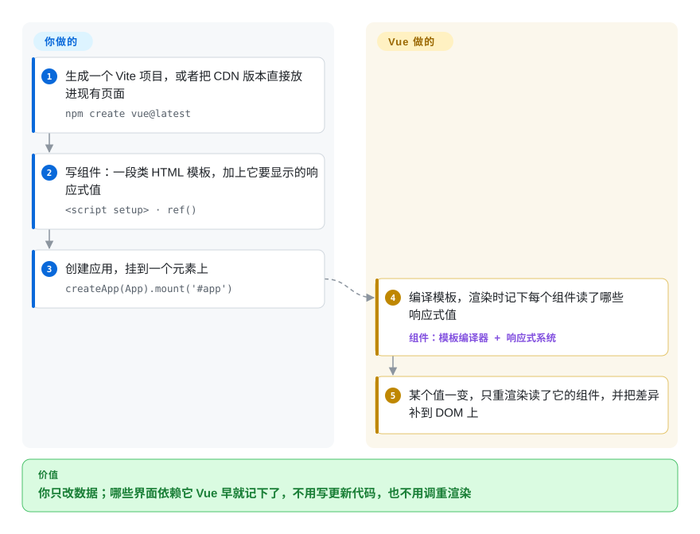

# Vue.js

服务端渲染的页面上，jQuery 事件处理越堆越多，最后没人说得清点哪个按钮会改哪个数字；可要整个换成 React，还得自己选路由、状态库和构建方案，团队吃不消。Vue 让你写绑定响应式数据的类 HTML 模板：数据一改，用到它的那部分页面自动更新；它能从现有页面里的一个小组件起步，一路长成带官方路由和状态库的完整应用。

## 何时使用

你们是两个偏后端的开发，维护一套 Laravel 或 Django 的后台。订单编辑页已经长出 600 行 jQuery：改一下数量，小计会变，但运费估算和“超出信用额度”的提示有时不变，因为每个事件处理都是手动改 DOM。你想要响应式组件，但没法停下来重写整个前端，而且团队读 HTML 模板比读 JSX 顺手得多。

于是你用 Vue：先只放进那一个页面（CDN 版本，或者一个 Vite 入口），把编辑器写成组件，模板里读 `quantity`、`subtotal` 和 `overLimit`，数据一变，Vue 让三处同时保持一致。之后的页面改用 `.vue` 单文件组件，再发展成带官方 Vue Router 和 Pinia 的完整单页应用，或者用 Nuxt 做服务端渲染，早期写的组件都不用重写。你不选 React，是因为路由、状态和工具链都出自同一个团队、一套文档，它的响应式也不要求你操心重渲染；不选 Svelte，是因为 Vue 更大的生态（Element Plus、Vuetify、Nuxt）和招聘池（尤其在国内）比最小的包体积更重要。

## 怎么用起来

Vue 由**模板编译器**和**响应式系统**两部分配合。**你**把组件写成一段类 HTML 模板加上它要显示的数据，数据用 `ref()` 或 `reactive()` 声明（这两个包装让 Vue 能察觉读和写），通常写在 `.vue` 文件的 `<script setup>` 里，然后 `createApp(App).mount('#app')`。**Vue** 把模板编译成渲染函数，渲染时记下每个组件读了哪些响应式值，就像图书管理员登记谁借了哪本书，书改版了只通知借过它的人。某个值一变，Vue 只重渲染这些组件：先在虚拟 DOM（一份页面的内存草图）上和上一次对比，再把差异补到真实 DOM。截至 2026-10 处于候选发布阶段的 Vue 3.6 新增了可选的 **Vapor 模式**（`<script setup vapor>`），把组件编译成直接操作 DOM 的代码，不再用虚拟 DOM，并基于 alien-signals 重写了响应式系统以提升速度、降低内存。路由（Vue Router）、共享状态（Pinia）和 SSR（Nuxt）是独立的官方或生态包，需要时再加。

<!-- flow-steps:begin (generated from flows/vue.json by tools/flow_card.py — do not edit) -->

流程文字版

1. **你**：生成一个 Vite 项目，或者把 CDN 版本直接放进现有页面 — `npm create vue@latest`
2. **你**：写组件：一段类 HTML 模板，加上它要显示的响应式值 — `<script setup> · ref()`
3. **你**：创建应用，挂到一个元素上 — `createApp(App).mount('#app')`
4. **Vue.js**：编译模板，渲染时记下每个组件读了哪些响应式值 — 组件：`模板编译器 + 响应式系统`
5. **Vue.js**：某个值一变，只重渲染读了它的组件，并把差异补到 DOM 上

**价值**：你只改数据；哪些界面依赖它 Vue 早就记下了，不用写更新代码，也不用调重渲染

<!-- flow-steps:end -->

## 何时不用

- **你在欧美市场需要最大的招聘池和第三方库选择：改用 React，因为** 在那里 React 的生态和候选人都更多；Vue 的优势主要在国内和亚洲部分地区。
- **你需要在多个团队间强制统一架构（依赖注入、规定好的模块边界）：改用 Angular，因为** Vue 把项目结构交给你自己定，大组织如果没有强约定，各个代码库会越走越散。
- **你需要对 SEO 友好的服务端渲染或静态生成：用 Nuxt（基于 Vue），而不是裸 Vue，因为** Vue 核心虽然能做服务端渲染，但路由、数据加载、payload 水合和各种部署目标都来自 Nuxt。
- **你需要 React Native 级别的移动端复用，或者已经深陷 React 生态（Next.js、自定义 hooks、只支持 React 的组件库）：留在 React，因为** Vue 的移动端方案靠第三方项目，模板与 JSX、两种响应式的心智模型差别也大，切换代价高。
- **你还在跑 Vue 2 代码库：要么排期迁移，要么买付费延长支持，因为** Vue 2 已于 2023-12-31 停止维护；Vue 3 有破坏性变更，部分 Vue 2 时代的库始终没迁过去。
- **你现在就要最小的运行时，等不了 Vapor 模式稳定：改用 Svelte，因为** 稳定版 Vue 3.5 仍带着虚拟 DOM 运行时；截至 2026-10-08，Vapor 模式只在 3.6 的候选版本里。

## 横向对比

| 替代品 | 是否收录 | 我们的评价 | 取舍 |
| --- | --- | --- | --- |
| [React](react.zh.md) | ✅ | 生态广度、React Native 和欧美招聘池是决定因素时，选 React；小团队想要模板语法、自动依赖追踪，以及同一来源的官方路由和状态库时，选 Vue。 | React：库和候选人更多，但要自己拼技术栈、调重渲染；Vue：官方全家桶一体化，亚洲以外生态更小。 |
| [Angular](angular.zh.md) | ✅ | 很多团队需要依赖注入、表单、HTTP 和强制结构时，选 Angular；想渐进引入、结构保持轻量时，选 Vue。 | Angular：强制一致，概念和升级都更重；Vue：起步和嵌入更快，约定要自己定。 |
| [Svelte](svelte.zh.md) | ✅ | 包体积是首要约束、应用自成一体时，选 Svelte；要更大的生态、Nuxt，以及能直接嵌进现有服务端渲染页面时，选 Vue。 | Svelte：编译型，没有虚拟 DOM，社区更小；Vue：小运行时加虚拟 DOM（Vapor 模式待稳定），库的选择更多。 |
| [Nuxt](../app-frameworks/nuxt.zh.md) | ✅ | 不是二选一：Vue 应用需要 SSR、文件路由或服务端接口时，在 Vue 之上用 Nuxt；小组件、嵌入式页面或纯客户端单页应用用裸 Vue。 | Nuxt：SSR、payload 水合、Nitro 部署预设，但要多跑一个服务端，路线图归 Vercel 旗下团队；裸 Vue：只有视图层和官方插件。 |
| [Next.js](../app-frameworks/nextjs.zh.md) | ✅ | SSR 应用要放在 React 生态里，选 Next.js；团队更喜欢 Vue 模板时，选 Nuxt 而不是 Next.js。 | Next.js：最大的元框架社区，只支持 React；Nuxt 加 Vue：功能相当，亚洲以外的影响面更小。 |

## 技术栈

- **TypeScript**：`vuejs/core` monorepo（`packages/` 下有 reactivity、runtime-core、runtime-dom、compiler-sfc、server-renderer，3.6 新增 `compiler-vapor` 和 `runtime-vapor`）。
- **基于 Proxy 的响应式**：用 ES2015 Proxy 追踪读写；3.6 基于 alien-signals 重写了 `@vue/reactivity`。
- **模板编译器加虚拟 DOM**：模板编译成渲染函数，带静态提升和 patch flag 优化；Vapor 模式（3.6，可选）改为编译成直接的 DOM 操作。
- **单文件组件（`.vue`）**：`<template>`、`<script setup>`、`<style scoped>`，由 `@vitejs/plugin-vue` 编译。
- **官方生态**：Vite（构建）、Vue Router、Pinia（状态）、Vue DevTools；Nuxt 是社区主导的元框架。

## 依赖

- **现代浏览器**：ES2015+，不支持 IE11。
- **Node.js**：Vite 和 SFC 编译器需要（`npm create vue@latest`）；用 CDN 全局构建版则不需要。
- **可选：** Vue Router（客户端路由）、Pinia（共享状态）、Nuxt（SSR/SSG，需要 Node 或边缘运行时）、组件库（Element Plus、Vuetify、Naive UI）。
- **遗留：** Vue CLI 或 webpack 的配置还能用，但已进入维护状态；新项目用 Vite。

## 运维难度

**客户端应用低，用 Nuxt 做 SSR 时中等。** Vue 单页应用构建出来是静态文件，放任何 CDN 都行，Vite 几乎不用配置。运维负担会在这几种情况下上升：加了 Nuxt SSR（多一个要运行、要打补丁的 Node 或边缘运行时）；多个团队共用一个代码库却没有约定；或者 Vue 2 代码库在停止维护后还在跑。以后引入 Vapor 模式是逐组件、可选的，但 Vapor 和虚拟 DOM 组件混用时需要互操作插件，会把虚拟 DOM 运行时重新带回来。

## 健康度与可持续性

- **维护（2026-10）。** 两条线都活跃：3.5.x 每两三周一个补丁版本（3.5.43 于 2026-09-17 发布）；3.6 从 2025 年 7 月的 alpha 一路走到候选版本（rc.10 于 2026-09-30 发布）。雷达的维护轴是 A，但打分时默认分支的最后一次提交在 20 天前，因为现在大部分工作提交在 `minor` 分支上。
- **治理与 bus factor：最弱的一轴。** 由尤雨溪（Evan You）创建并主导；雷达统计 12 个月内有 20 位活跃维护者，头号贡献者占 63% 的提交，治理轴是 C。有一个小核心团队，但路线图很大程度上压在一个人身上。
- **背书与长青度。** 不依附任何一家大公司，靠赞助维持；尤雨溪创办的 VoidZero 主要做 Vite 及相关工具链，而不是 Vue 本身。Vue 始于 2014 年（`vuejs/core` 仓库建于 2018 年），至今仍在积极开发，按“年龄 × 仍活跃”看 Lindy 先验很强。
- **采用度与生态。** 最近一个月 npm 下载 104,114,812 次（雷达，2026-10-08）；官方生态成熟（Router、Pinia、DevTools），另有 Nuxt、Element Plus、Vuetify；在国内尤其强。
- **风险标记。** MIT 协议，没有改协议的历史。Vue 2→3 的断裂是前车之鉴；3.6 设计成可选（Vapor）且 API 兼容，重演的风险更低。

## 存疑（未验证）

- [推断] Vue 与 React 在各地区的市场份额是从招聘信息和调查推断的，不是普查结果。
- [未验证] 仍跑在 Vue 2 上的生产应用占多少，没有公开数据。
- [未验证] Vapor 模式在性能和包体积上的收益、3.6 正式版的发布日期，除 changelog 外没有核实。
- [推断] VoidZero 与 Vue 资金和路线图的关系是从公开公告推断的，没有读到治理文档。
- [未验证] 截至 2026-10-08，`vuejs/core` 约 5.46 万 GitHub star（更多、更早的 star 在旧仓库 `vuejs/vue` 上）；star 数会变。
