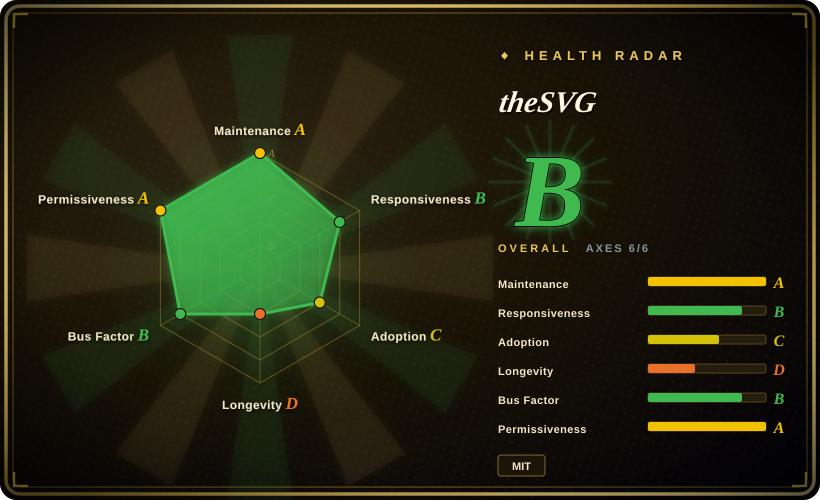
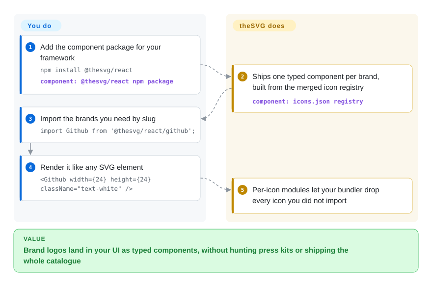

# theSVG

Your integrations page needs forty partner logos, and each one means a different press kit, a PNG where you wanted an SVG, or a Google Images copy of unknown origin. theSVG merges several open brand-icon sets plus the AWS, Azure and Google Cloud architecture icons into one 7,400-entry registry, and ships it as typed React/Vue/Svelte components, a CDN URL pattern, a CLI and an MCP server.

## When to use

You are a front-end developer on a SaaS product. The marketing site needs a "works with" grid (Slack, Notion, Linear, Stripe, OpenAI, Anthropic…), the pricing page needs a "Sign in with GitHub" button, and the docs need AWS Lambda and S3 icons for an architecture diagram. [Simple Icons](https://github.com/simple-icons/simple-icons) gives you the first set, but only as single-colour 24×24 marks — the Stripe tile renders as a grey silhouette. [svgl](https://github.com/pheralb/svgl) has colour logos and wordmarks, but about 600 of them, so half your list is missing. You `npm install @thesvg/react`, write `import Github from '@thesvg/react/github'`, and get a typed component in brand colour; the same registry also answers the AWS diagram and the AI-vendor logos that neither of the other two carry.

Pick it over Simple Icons when you need **colour and wordmark variants, AI-vendor logos, or cloud architecture icons from one package**; pick Simple Icons when you need the most stable, uniformly drawn, monochrome set with a 13-year track record. The deciding tradeoff: breadth and variants assembled in seven months by one maintainer, versus a slower, curated, CC0-only catalogue that theSVG itself imports.

## How it works

theSVG is mostly a data pipeline, not a drawing studio. Its internal source notes (`docs-local/data-sources.md`) describe merging three upstream sets by slug — Simple Icons (monochrome marks, hex colour, aliases), svgl (colour, light/dark and wordmark files) and lobe-icons (AI-vendor marks extracted from React code) — then adding official cloud icon packs and community submissions. The result is one JSON manifest, `src/data/icons.json`, where every entry carries a slug, title, categories, brand hex, variant file paths and a per-icon `license` string. A build step turns that manifest into npm packages: one ES module per icon (so your bundler keeps only what you import — "tree-shaking"), wrapped as React, Vue or Svelte components that accept normal SVG props. The same files are served as static URLs (`thesvg.org/icons/{slug}/{variant}.svg`, mirrored on jsDelivr, a free CDN that serves files straight from GitHub), and the registry is exposed to AI editors through an MCP server and a skills.sh agent skill. You pick the icon and variant and decide whether the brand's trademark rules allow your use; theSVG does the collecting, normalising into packages and hosting — it is a library shelf, not a licence office.

<!-- flow-steps:begin (generated from flows/thesvg.json by tools/flow_card.py — do not edit) -->

Text version of the flow

1. **You**: Add the component package for your framework — `npm install @thesvg/react` — component: `@thesvg/react npm package`
2. **theSVG**: Ships one typed component per brand, built from the merged icon registry — component: `icons.json registry`
3. **You**: Import the brands you need by slug — `import Github from '@thesvg/react/github';`
4. **You**: Render it like any SVG element — `<Github width={24} height={24} className="text-white" />`
5. **theSVG**: Per-icon modules let your bundler drop every icon you did not import

**Value**: Brand logos land in your UI as typed components, without hunting press kits or shipping the whole catalogue

<!-- flow-steps:end -->

## When NOT to use

- **If you need UI glyphs (arrows, menus, chevrons), use Lucide or Heroicons instead.** theSVG's own agent skill says to skip it for generic UI icons; its catalogue is named brands and services.
- **If you need a uniform icon grid, use [Simple Icons](https://github.com/simple-icons/simple-icons).** theSVG keeps each source's original geometry: sampled default variants have viewBoxes of `0 0 1024 1024` (GitHub), `0 0 512 214` (Stripe) and `0 0 2447.6 2452.5` (Slack) as of 2026-09-28, so logos render at different optical sizes unless you normalise them. Simple Icons draws every mark on the same 24×24 grid.
- **If you need a licence you can hand to legal, check each icon — or use Simple Icons, whose icons are all CC0.** The per-icon `license` field is submitter-declared and not audited at intake (`LICENSING.md` §3). Across the 7,423 entries (2026-09-28) it holds 739 `CC-BY-ND-2.0` (AWS: no derivatives, so do not recolour them), 286 `brand-use`, 78 `Trademark`, 65 `Fair Use`, 25 `Unknown`, 37 Microsoft entries marked "maintainer review required", and GPL/AGPL values on a few dozen. All 626 Azure icons are labelled `MIT`, while Microsoft's own Azure icon terms allow only architecture diagrams, training and documentation and reserve all other rights.
- **If you need Azure or AWS icons for anything but diagrams, get them from the vendor's own package instead.** Microsoft's terms and AWS's CC BY-ND licence restrict use regardless of how a redistributor tags them; theSVG does not grant rights it does not hold.
- **If you rely on the MCP server's `get_icon`, verify it on recent icons first — or point agents at the CDN URL pattern instead.** The published `@thesvg/mcp-server` 0.8.3 bundles all 7,423 registry entries but fetches SVGs from jsDelivr at the `v0.6.0` tag (2026-03-09). 3,417 entries were added after that date; two we tried return HTTP 404 at `v0.6.0` and 200 at `main` (2026-09-28).
- **If you need icons that never move under you, vendor the SVGs with `npx @thesvg/cli add` or pin an exact npm version.** The README and agent skill recommend the unpinned `@main` CDN URL, and the legal notice promises removals "within 24 hours" of a brand-owner request — an icon, or its slug, can disappear from the next build.
- **If install size matters (CI caches, serverless bundles, slow networks), use the CLI or CDN instead of the component packages.** `@thesvg/icons` unpacks to 106.6 MB and `@thesvg/react` to 84.2 MB (npm, v3.3.9); tree-shaking keeps the shipped bundle small, but every `npm install` still downloads the whole catalogue.
- **If you are drawing diagrams in Mermaid, Figma or another Iconify-aware tool, use the `thesvg` / `thesvg-color` sets on [Iconify](https://github.com/iconify/iconify)** rather than this repo's packages — same icons, one icon system for all your sets.

## Comparison

| Alternative | In index | Our verdict | Tradeoff |
| --- | --- | --- | --- |
| Simple Icons | not indexed | Pick Simple Icons for a monochrome, uniformly drawn, all-CC0 brand set you will depend on for years; pick theSVG when you need colour, wordmark or cloud-architecture variants it does not draw. | Real repository (simple-icons/simple-icons, CC0-1.0, 25.9k stars, created 2012, ~3.9M npm downloads in 2026-09) — not added in this tab-intake batch. theSVG imports its ~3,400 icons, so the overlap is total on those marks; Simple Icons trades colour and breadth for consistency and a clean licence. |
| svgl | not indexed | Pick svgl when a curated, colour-and-wordmark logo set of about 600 well-known brands covers your list; pick theSVG when you need the long tail, cloud icons, or typed framework components. | Real repository (pheralb/svgl, MIT, 6.3k stars, created 2022) — not added in this tab-intake batch. theSVG uses svgl as a source for colour and wordmark variants; svgl is smaller and older, theSVG broader and younger. |
| lobe-icons | not indexed | Pick lobe-icons when you only need AI-model and AI-vendor marks with avatar and combined-wordmark styles as React components; pick theSVG when those sit beside ordinary SaaS and cloud logos. | Real repository (lobehub/lobe-icons, MIT, 2.5k stars, created 2024) — not added in this tab-intake batch. Narrower and AI-specific, backed by the LobeHub team; theSVG extracts its paths into plain SVG files. |
| Devicon | not indexed | Pick Devicon for programming-language and developer-tool logos in plain, coloured and wordmark forms, usable as an icon font; pick theSVG for company, SaaS and cloud-service brands. | Real repository (devicons/devicon, MIT, 11.8k stars, created 2014) — not added in this tab-intake batch. Deeper on dev tooling and older, but not a general brand catalogue. |
| Iconify | not indexed | Pick Iconify when you want one API over 200+ icon sets, including theSVG's own `thesvg` and `thesvg-color` sets; pick theSVG's packages when brand logos are the only icons you need and you want per-icon imports. | Real repository (iconify/iconify, MIT, 6.3k stars, created 2017) — not added in this tab-intake batch. An aggregation layer rather than a catalogue; it adds a runtime or build plugin but unifies UI and brand icons. |

## Tech stack

- **Monorepo:** pnpm workspace in TypeScript. The root is a Next.js 16 / React 19 site (Tailwind CSS 4, shadcn, Fuse.js for client-side search, Shiki for code blocks); `packages/` holds `icons`, `thesvg`, `react`, `vue`, `svelte`, `react-native`, `cli`, `mcp` and `mcp-worker`.
- **Data:** `src/data/icons.json` is the source-of-truth manifest (slug, title, aliases, hex, categories, variant paths, `license`, `url`, `dateAdded`, `collection`); SVG files live under `public/icons/{slug}/`.
- **Packaging:** dual ESM/CJS builds with `sideEffects: false` and per-icon subpath exports (`@thesvg/react/github`); releases are driven by Changesets.
- **Build outputs:** `pnpm build` also generates the static JSON API (`/api/registry.json`, `/api/categories.json`), `llms.txt`, and draw.io and Excalidraw libraries.
- **Pipeline:** GitHub Actions for SVG validation, SVGO optimisation, icon-issue triage and auto-merge of icon PRs, releases, a Homebrew tap and the VS Code extension; editor and launcher plugins live under `extensions/`.

## Dependencies

- **Component packages:** React ≥ 18 as a peer for `@thesvg/react`; Vue 3 or Svelte for their packages; no runtime service — the SVG markup is inside the package.
- **CDN / URL use:** nothing to install, but a runtime dependency on `thesvg.org` or jsDelivr being reachable, and on the `@main` branch not changing the file you point at.
- **CLI:** Node.js for `npx @thesvg/cli`; it downloads the SVG (or a JSX/Vue wrapper) into your repo once, after which there is no dependency at all.
- **MCP server:** Node.js via `npx -y @thesvg/mcp-server`; the registry is bundled (works offline for search), SVG bodies come from jsDelivr.
- **Self-hosting the site:** clone (~30 MB per the README), `pnpm install`, Next.js build; the site as shipped includes PostHog and Vercel analytics.

## Ops difficulty

**Low.** As a component library it is a normal npm dependency with no server. The upkeep is in content drift rather than operations: slugs can be renamed or removed after takedowns, `@main` CDN URLs change without notice, the ~100 MB packages lengthen cold installs, and every release (weekly or faster in September 2026) is a chance for a logo you ship to change. Teams that care about stability should vendor the handful of SVGs they use (the CLI does this) and treat the registry as a place to find icons, not a live dependency. Licence review is the only non-trivial recurring task — it has to happen per icon, because the metadata is declarative.

## Health & viability

- **Maintenance (2026-09-28):** very active — `thesvg` npm v3.3.9 on 2026-09-27 and nine tagged releases in September; the icon-request queue is processed within days by automated triage and auto-merge workflows.
- **Governance / bus factor:** effectively one maintainer. `thegdsks` has 527 commits; the next human contributor has 46, and bots (dependabot, github-actions, Jules) account for most of the rest. The owner is the GLINCKER organization ("A GLINR STUDIOS COMPANY", created 2023), which lists paid GitHub Sponsors tiers and a planned gated API at `api.thesvg.org`.
- **Backing & Lindy:** the repo is about seven months old (created 2026-03-07), so the Lindy prior gives it little credit; the upstream sets it merges are far older (Simple Icons 2012, svgl 2022), so the icons themselves would survive the project.
- **Adoption:** 2.8k stars and 220 forks; npm downloads for `@thesvg/react` rose from 2,969 (2026-03) to 225,306 (2026-09), and `@thesvg/icons` — the package the health scorer counts — had 117,936 downloads in the 30 days to 2026-09-28. A tripling in one month on a young package is a growth signal worth watching, not yet proof of broad production use.
- **Risk flags:** licence metadata that does not match at least one vendor's terms (Azure), a mix of CC-BY-ND, "Fair Use", "Unknown" and copyleft values behind a headline MIT badge, trademark exposure that the project explicitly passes to users, and an open-core direction (paid API tier on the roadmap).
- **Verdict:** a useful, fast-moving superset for finding and dropping in brand logos; bet on the icons you vendor, not on the registry as a stable dependency, and do your own licence check per icon.

## Caveats (unverified)

- [推断] The 3,417 registry entries dated after 2026-03-09 likely all 404 through `@thesvg/mcp-server`'s `get_icon`; we confirmed two samples, not the whole set, and some older-slug files may have been renamed as well.
- [推断] The Azure collection is Microsoft's official Azure architecture icon pack (the README says "Microsoft Azure service icons (2026-Q1)"), so Microsoft's diagram-only terms apply despite the `MIT` label; we did not diff the files against Microsoft's download.
- [未验证] The Google Cloud (214) and Kubernetes (38) icons are labelled `Apache-2.0`; we did not check Google's or CNCF's own terms for those packs.
- [未验证] The September 2026 download jump may include CI or bot traffic; npm does not break downloads down by consumer.
- [未验证] Takedown and licence-correction response times ("within 24 hours", "within 72 hours") are the project's stated commitments; we found no public takedown case to check them against.
- [推断] Merging three upstream sets by slug may produce entries whose variants come from different sources and differ in drawing; we sampled viewBoxes, not variant consistency within an entry.
