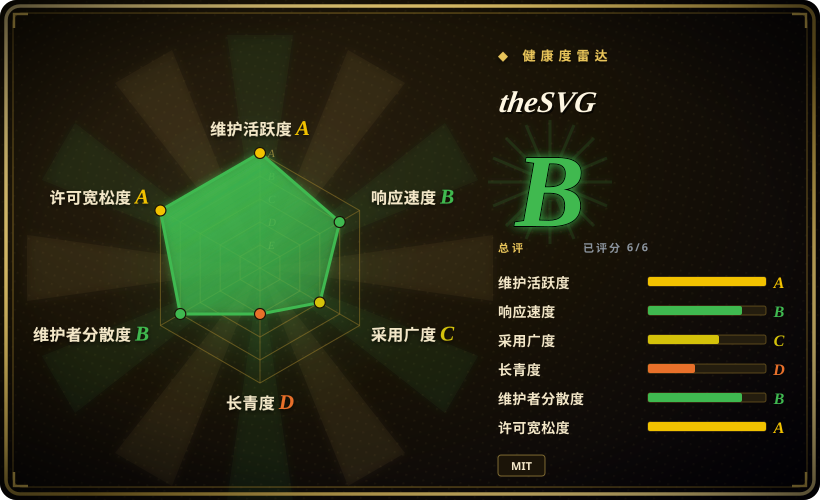
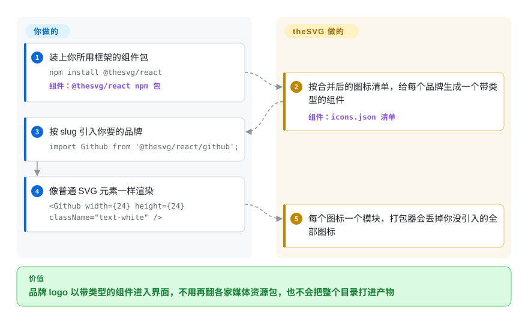

# theSVG

官网“合作伙伴”一栏要放四十个品牌 logo，每一个都得去翻不同的媒体资源包，要么只有 PNG，要么是从搜索引擎扒来、来源说不清的图。theSVG 把几套开源品牌图标库和 AWS、Azure、Google Cloud 的架构图标合并成一份 7,400 条的清单，再打包成带类型的 React／Vue／Svelte 组件、一个 CDN 地址规则、一个命令行和一个 MCP 服务。

## 何时使用

你是一家 SaaS 公司的前端。官网要一面“支持集成”的 logo 墙（Slack、Notion、Linear、Stripe、OpenAI、Anthropic……），定价页要一个“用 GitHub 登录”按钮，文档里的架构图还要 AWS Lambda 和 S3 的图标。[Simple Icons](https://github.com/simple-icons/simple-icons) 能解决第一件事，但只有单色、24×24 的图形——Stripe 那一格会变成一块灰色剪影。[svgl](https://github.com/pheralb/svgl) 有彩色 logo 和文字标，可只有六百来个，你的清单缺一半。你执行 `npm install @thesvg/react`，写一行 `import Github from '@thesvg/react/github'`，拿到一个带品牌色、带类型的组件；架构图用的 AWS 图标和各家 AI 厂商的 logo 也在同一份清单里，前两个库都没有。

需要**彩色版、文字标、AI 厂商 logo 或云架构图标都从一个包里拿**时，选它而不是 Simple Icons；需要最稳定、画法统一、单色、已经维护十三年的那一套时，选 Simple Icons。关键取舍是：一个维护者七个月里拼起来的广度和多变体，对上一个更慢、经过审核、全部 CC0 的目录——而 theSVG 自己就导入了后者。

## 怎么用起来

theSVG 主要是一条数据管线，而不是自己画图标。它的内部数据源说明（`docs-local/data-sources.md`）写明按 slug（图标的短名）合并三套上游：Simple Icons（单色图形、品牌色值、别名）、svgl（彩色、明暗版和文字标文件）、lobe-icons（从 React 代码里抽出来的 AI 厂商图形），再加上官方云图标包和社区投稿。结果是一份 JSON 清单 `src/data/icons.json`，每条记录着 slug、名称、分类、品牌色、各变体文件路径和一个逐图标的 `license` 字段。构建步骤把清单变成 npm 包：每个图标一个独立模块，所以打包器只留下你真正 import 的那几个（这叫“摇树”，tree-shaking）；外面再套成接受普通 SVG 属性的 React、Vue、Svelte 组件。同一批文件也以静态地址提供（`thesvg.org/icons/{slug}/{variant}.svg`，并镜像到 jsDelivr——一个直接从 GitHub 取文件的免费 CDN），还通过 MCP 服务和 skills.sh 上的 agent skill 暴露给 AI 编辑器。你负责挑图标、挑变体，并判断品牌的商标规则是否允许你这样用；theSVG 负责收集、打包和托管——它是一排书架，不是版权办公室。

<!-- flow-steps:begin (generated from flows/thesvg.json by tools/flow_card.py — do not edit) -->

流程文字版

1. **你**：装上你所用框架的组件包 — `npm install @thesvg/react` — 组件：`@thesvg/react npm 包`
2. **theSVG**：按合并后的图标清单，给每个品牌生成一个带类型的组件 — 组件：`icons.json 清单`
3. **你**：按 slug 引入你要的品牌 — `import Github from '@thesvg/react/github';`
4. **你**：像普通 SVG 元素一样渲染 — `<Github width={24} height={24} className="text-white" />`
5. **theSVG**：每个图标一个模块，打包器会丢掉你没引入的全部图标

**价值**：品牌 logo 以带类型的组件进入界面，不用再翻各家媒体资源包，也不会把整个目录打进产物

<!-- flow-steps:end -->

## 何时不用

- **要的是界面图标（箭头、菜单、折叠符号），用 Lucide 或 Heroicons。** theSVG 自带的 agent skill 就写明通用 UI 图标别用它；它的目录只收有名字的品牌和服务。
- **要一排大小一致的图标网格，用 [Simple Icons](https://github.com/simple-icons/simple-icons)。** theSVG 保留了各来源原本的几何尺寸：2026-09-28 抽查的默认变体里，viewBox 分别是 `0 0 1024 1024`（GitHub）、`0 0 512 214`（Stripe）、`0 0 2447.6 2452.5`（Slack），不自己做归一化的话，logo 视觉大小会参差不齐。Simple Icons 每个图形都画在同一个 24×24 网格上。
- **需要一个能直接交给法务的许可证，就逐个图标核对——或者改用全部 CC0 的 Simple Icons。** 逐图标的 `license` 字段由投稿人自报，收录时不审核（`LICENSING.md` 第 3 节）。7,423 条记录里（2026-09-28），有 739 条 `CC-BY-ND-2.0`（AWS 图标：禁止演绎，所以别改色）、286 条 `brand-use`、78 条 `Trademark`、65 条 `Fair Use`、25 条 `Unknown`、37 条标着“需要维护者审核”的微软图标，还有几十条 GPL／AGPL。626 个 Azure 图标全部标成 `MIT`，而微软自己的 Azure 图标条款只允许用于架构图、培训材料和文档，其余权利全部保留。
- **Azure 或 AWS 图标要用在架构图以外的地方，去厂商自己的下载包拿。** 不管转载方怎么打标签，微软的条款和 AWS 的 CC BY-ND 都照样约束你；theSVG 给不了它自己没有的权利。
- **要依赖 MCP 服务的 `get_icon`，先拿新图标试一遍——或者干脆让 agent 用 CDN 地址规则。** 已发布的 `@thesvg/mcp-server` 0.8.3 打包了全部 7,423 条清单，却从 jsDelivr 的 `v0.6.0` 标签（2026-03-09）取 SVG。清单里有 3,417 条是那之后加的；我们试的两条在 `v0.6.0` 返回 HTTP 404，在 `main` 返回 200（2026-09-28）。
- **要图标永远不变，用 `npx @thesvg/cli add` 把 SVG 拷进自己仓库，或者锁死 npm 版本。** README 和 agent skill 推荐的是不锁版本的 `@main` CDN 地址，法律声明又承诺品牌方要求后“24 小时内”下架——某个图标或它的 slug，下一次构建就可能消失。
- **安装体积要紧（CI 缓存、serverless 包、慢网络），用命令行或 CDN，别装组件包。** `@thesvg/icons` 解包后 106.6 MB，`@thesvg/react` 84.2 MB（npm，v3.3.9）；摇树能让最终产物很小，但每次 `npm install` 都要下完整个目录。
- **在 Mermaid、Figma 或其他支持 Iconify 的工具里画图，用 [Iconify](https://github.com/iconify/iconify) 上的 `thesvg`／`thesvg-color` 图标集**，而不是这个仓库的包——图标一样，所有图标集走同一套系统。

## 横向对比

| 替代品 | 是否收录 | 我们的评价 | 取舍 |
| --- | --- | --- | --- |
| Simple Icons | 未收录 | 要一套单色、画法统一、全部 CC0、能放心依赖多年的品牌图标，选 Simple Icons；要它不画的彩色版、文字标或云架构图标，选 theSVG。 | 真实仓库（simple-icons/simple-icons，CC0-1.0，2.59 万星，2012 年创建，2026-09 的 npm 月下载约 390 万），本次标签页收录批次未加入。theSVG 导入了它约 3,400 个图标，这部分完全重叠；Simple Icons 用色彩和广度换来了一致性和干净的许可证。 |
| svgl | 未收录 | 如果约 600 个知名品牌的精选彩色 logo 和文字标就够覆盖你的清单，选 svgl；要长尾品牌、云图标或带类型的框架组件，选 theSVG。 | 真实仓库（pheralb/svgl，MIT，6.3k 星，2022 年创建），本次标签页收录批次未加入。theSVG 的彩色版和文字标就取自 svgl；svgl 更小、更早，theSVG 更广、更年轻。 |
| lobe-icons | 未收录 | 只需要 AI 模型和 AI 厂商的图形、而且想要头像式和组合文字标的 React 组件，选 lobe-icons；这些 logo 要和普通 SaaS、云服务 logo 摆在一起，选 theSVG。 | 真实仓库（lobehub/lobe-icons，MIT，2.5k 星，2024 年创建），本次标签页收录批次未加入。范围更窄、专注 AI，由 LobeHub 团队维护；theSVG 把它的路径抽成了普通 SVG 文件。 |
| Devicon | 未收录 | 要编程语言和开发工具的 logo（普通、彩色、文字标，还能当图标字体用），选 Devicon；要公司、SaaS 和云服务品牌，选 theSVG。 | 真实仓库（devicons/devicon，MIT，1.18 万星，2014 年创建），本次标签页收录批次未加入。开发工具覆盖更深、历史更长，但不是通用品牌目录。 |
| Iconify | 未收录 | 想用一套接口管 200 多个图标集——其中就有 theSVG 自己的 `thesvg` 和 `thesvg-color`——选 Iconify；只需要品牌 logo、并且想逐个图标 import，用 theSVG 的包。 | 真实仓库（iconify/iconify，MIT，6.3k 星，2017 年创建），本次标签页收录批次未加入。它是聚合层而不是目录；多一个运行时或构建插件，换来界面图标和品牌图标统一管理。 |

## 技术栈

- **单仓多包：** TypeScript 写的 pnpm workspace。根目录是 Next.js 16／React 19 网站（Tailwind CSS 4、shadcn、用 Fuse.js 做浏览器端搜索、用 Shiki 高亮代码）；`packages/` 下有 `icons`、`thesvg`、`react`、`vue`、`svelte`、`react-native`、`cli`、`mcp` 和 `mcp-worker`。
- **数据：** `src/data/icons.json` 是唯一事实源（slug、名称、别名、品牌色、分类、变体路径、`license`、`url`、`dateAdded`、`collection`）；SVG 文件放在 `public/icons/{slug}/`。
- **打包：** ESM／CJS 双格式，`sideEffects: false`，按图标的子路径导出（`@thesvg/react/github`）；发版由 Changesets 驱动。
- **构建产物：** `pnpm build` 还会生成静态 JSON 接口（`/api/registry.json`、`/api/categories.json`）、`llms.txt`，以及 draw.io 和 Excalidraw 图库。
- **流水线：** GitHub Actions 负责 SVG 校验、SVGO 优化、图标 issue 分拣与图标 PR 自动合并、发版、Homebrew tap 和 VS Code 扩展；编辑器与启动器插件放在 `extensions/`。

## 依赖

- **组件包：** `@thesvg/react` 的 peer 依赖是 React 18 及以上；Vue、Svelte 包分别需要 Vue 3 和 Svelte；没有运行时服务——SVG 内容就在包里。
- **CDN／地址用法：** 不用安装，但运行时依赖 `thesvg.org` 或 jsDelivr 可达，也依赖 `@main` 分支不去改你指向的那个文件。
- **命令行：** `npx @thesvg/cli` 需要 Node.js；它把 SVG（或 JSX／Vue 包装）一次性下载进你的仓库，之后就没有任何依赖。
- **MCP 服务：** 通过 `npx -y @thesvg/mcp-server` 运行，需要 Node.js；清单随包附带（搜索可离线），SVG 内容从 jsDelivr 取。
- **自建网站：** 克隆仓库（README 说约 30 MB）、`pnpm install`、Next.js 构建；原样部署的网站带 PostHog 和 Vercel 统计。

## 运维难度

**低。** 作为组件库，它就是一个普通 npm 依赖，没有服务要跑。要操心的是内容漂移而不是运维：slug 可能改名，也可能因为下架而消失；`@main` 上的 CDN 地址会不打招呼地变；约 100 MB 的包拖慢冷安装；而发版频率（2026 年 9 月每周一次甚至更快）意味着你上线的 logo 随时可能换样。在意稳定的团队应该把用到的那几个 SVG 拷进自己仓库（命令行就是干这个的），把这份清单当作找图标的地方，而不是一个实时依赖。唯一持续要做的正经事是许可证审查——得逐个图标做，因为元数据只是自报。

## 健康度与可持续性

- **维护（2026-09-28）：** 非常活跃——npm 上的 `thesvg` 于 2026-09-27 发布 v3.3.9，9 月共打了九个发版标签；图标申请由自动分拣和自动合并流程在几天内处理完。
- **治理／巴士系数：** 实际上只有一个维护者。`thegdsks` 有 527 次提交，排第二的人类贡献者只有 46 次，其余大多来自机器人（dependabot、github-actions、Jules）。所有者是 GLINCKER 组织（简介为“A GLINR STUDIOS COMPANY”，2023 年创建），挂有付费的 GitHub Sponsors 档位，并计划在 `api.thesvg.org` 推出需要令牌的接口。
- **背书与林迪：** 仓库约七个月大（2026-03-07 创建），林迪先验给它的分数很少；它合并的上游要老得多（Simple Icons 2012 年、svgl 2022 年），所以就算项目停了，图标本身还在。
- **采用度：** 2.8k 星、220 个 fork；`@thesvg/react` 的 npm 月下载从 2,969（2026-03）涨到 225,306（2026-09），`@thesvg/icons`（健康度评分所用的包）截至 2026-09-28 的 30 天下载量为 117,936。年轻包一个月翻三倍，是值得关注的增长信号，还不能证明已经被广泛用于生产。
- **风险信号：** 至少有一家厂商的条款与许可证元数据对不上（Azure）；醒目的 MIT 徽章背后混着 CC-BY-ND、“Fair Use”、“Unknown” 和传染性许可证；项目明确把商标风险转给使用者；并且在往开放核心方向走（路线图上有付费接口档位）。
- **结论：** 找品牌 logo、直接拿来用，它是一个好用、迭代很快的超集；押注你拷进仓库的那些图标，别把这份清单当成稳定依赖，许可证要自己逐个核对。

## 存疑（未验证）

- [推断] 清单里 2026-03-09 之后加入的 3,417 条，通过 `@thesvg/mcp-server` 的 `get_icon` 取多半都会 404；我们只验证了两条样本，没有全量跑，而且部分旧 slug 的文件也可能改过名。
- [推断] Azure 图标集就是微软官方的 Azure 架构图标包（README 写的是“Microsoft Azure service icons (2026-Q1)”），所以尽管标成 `MIT`，微软“仅限架构图”的条款依然适用；我们没有把文件和微软的下载包逐一比对。
- [未验证] Google Cloud（214 个）和 Kubernetes（38 个）图标标的是 `Apache-2.0`；我们没有核对 Google 和 CNCF 各自对这些图标包的条款。
- [未验证] 2026 年 9 月的下载量跳涨可能包含 CI 或机器人流量；npm 不按使用方拆分下载量。
- [未验证] 下架和许可证更正的响应时限（“24 小时内”“72 小时内”）是项目自己的承诺；我们没找到可以对照的公开下架案例。
- [推断] 按 slug 合并三套上游，可能让同一条目的不同变体来自不同来源、画法不一致；我们只抽查了 viewBox，没有检查同一条目内各变体是否一致。
