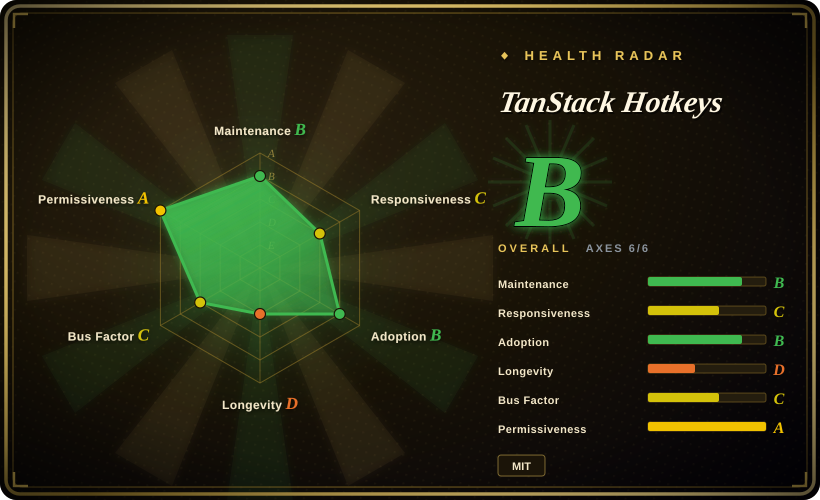
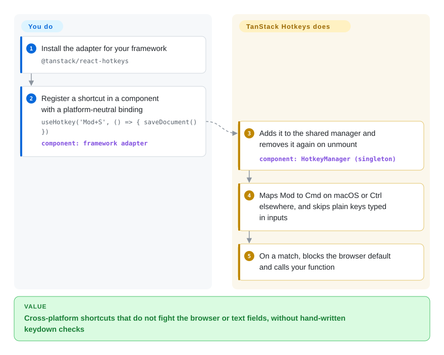

# TanStack Hotkeys

You bind `Ctrl+S` to "save" and it works on your Windows laptop, but Mac users hit `Cmd+S` and get the browser's "Save Page As" dialog; the `?` shortcut fires while someone types a question into a text box; and the settings page where users rebind keys stores strings like `"Ctrl+Shift+ß"` that never match again. TanStack Hotkeys handles those edges in one place: you write `'Mod+S'` as a type-checked string, and it resolves the platform modifier, skips typing in inputs, records new bindings and prints them back as `⌘ S`.

## When to use

You are building a keyboard-heavy web app — an editor, an admin console, an issue tracker, a design tool — and the shortcuts started as a `document.addEventListener('keydown', …)` with `if (e.ctrlKey && e.key === 's')`. Now the bug list reads: "Cmd+S opens the browser save dialog on Mac", "pressing `j` in the comment box jumps to the next issue", "`g` then `i` navigation doesn't exist", "my custom binding recorded as `Alt+ß` on a German Mac never fires", and product wants a `?` cheatsheet overlay that lists every live shortcut with `⌘`/`⇧` glyphs. You also ship a Vue widget or a Lit web component beside the React app, and want the same binding rules in both.

Reach for TanStack Hotkeys here: `useHotkey('Mod+S', save)` (or the Vue/Angular/Solid/Svelte/Preact/Lit equivalent) with autocomplete on key names, `useHotkeySequence(['G', 'G'], …)` for Vim-style chords, a recorder that captures a user's new binding and a formatter that renders it for display, all driven by one singleton manager with dev-time conflict warnings and a devtools panel. Pick it over **react-hotkeys-hook** when you need first-party adapters beyond React, typed binding strings, or recording and display helpers in the box; over **tinykeys** or **hotkeys-js** when you want those batteries instead of a tiny listener you extend yourself. If you only need three shortcuts in a React app and cannot take alpha churn, see When NOT to use first.

## How it works

At the bottom sits a single `HotkeyManager` — one shared object per page that owns the real `keydown`/`keyup` listeners, the way one switchboard operator takes every call instead of each desk running its own phone line. Your framework adapter's hook registers a binding with that manager when the component mounts, updates its options when your reactive state changes, and removes it on unmount; you only supply the binding and the callback. A binding is either *logical* (`'Mod+S'`, the character the user's layout produces) or *physical* (`'Alt+[KeyW]'`, a key's position on the keyboard regardless of layout), and `Mod` means Command on macOS and Control elsewhere. When a key is pressed, the manager matches it against every enabled registration, applies the defaults — `preventDefault` and `stopPropagation` on, and "smart" input handling that lets `Mod+S` and `Escape` fire inside a text field but ignores plain letters there — and calls your function. Around that core, the same package gives you a recorder (captures the next combination a user presses, as a string you store yourself), `formatForDisplay` (turns `Mod+S` into `⌘ S` or `Ctrl+S`), held-key tracking for hint overlays, and a devtools panel; what it does not give you is any UI — the cheatsheet, the rebinding dialog and where bindings are persisted are yours.

<!-- flow-steps:begin (generated from flows/tanstack-hotkeys.json by tools/flow_card.py — do not edit) -->

Text version of the flow

1. **You**: Install the adapter for your framework — `@tanstack/react-hotkeys`
2. **You**: Register a shortcut in a component with a platform-neutral binding — `useHotkey('Mod+S', () => { saveDocument() })` — component: `framework adapter`
3. **TanStack Hotkeys**: Adds it to the shared manager and removes it again on unmount — component: `HotkeyManager (singleton)`
4. **TanStack Hotkeys**: Maps Mod to Cmd on macOS or Ctrl elsewhere, and skips plain keys typed in inputs
5. **TanStack Hotkeys**: On a match, blocks the browser default and calls your function

**Value**: Cross-platform shortcuts that do not fight the browser or text fields, without hand-written keydown checks

<!-- flow-steps:end -->

## When NOT to use

- **If you want the most-used, stable React-only hook, use react-hotkeys-hook instead, because** it is on a 5.x API, about 5.1M weekly npm downloads (week of 2026-09-21) and has been around since 2018 with built-in scopes, whereas TanStack Hotkeys labels itself alpha and has shipped breaking changes in 0.x minors as recently as 2026-09.
- **If you cannot absorb breaking changes in minor releases, pin exact versions or pick a 1.x+ library, because** core 0.9.0 (2026-09-21) turned `ParsedHotkey`/`RawHotkey` into `key`-or-`code` unions, made recorders default to physical codes and changed clear semantics, and 0.10.0 (2026-09-24) went ESM-only with a Node.js 20 minimum and dropped CommonJS builds.
- **If your app or test runner still `require()`s dependencies, or targets pre-ES2022 browsers without a transpile step, use hotkeys-js or tinykeys instead, because** since 0.10.0 the packages ship ES2022 ESM only, with no `require` export condition.
- **If you need a keyboard shortcut in a plain page or a 1 KB budget, use tinykeys instead, because** it is a single small framework-agnostic listener with sequence support, while TanStack Hotkeys pulls in `@tanstack/store` and a manager, recorder and formatter you may never use.
- **If the key already belongs to a focused widget (Space/Enter on a button, arrow keys in a menu, tabs or listbox), test before binding it globally, because** open issues #142 and #138 (2026-07) report single-key global hotkeys overriding native button activation and double-firing inside ARIA composite widgets; fixes were in open PRs on 2026-09-28. Bind those keys with a `target` scope or keep them out of global shortcuts.
- **If you need scopes or layers that switch whole groups of shortcuts on and off (modal open ⇒ editor keys off), use react-hotkeys-hook or hotkeys-js scopes instead, because** TanStack Hotkeys scopes by element `target` and per-registration `enabled`, and has no named scope stack; you model layers in your own state.
- **If you need a command palette UI, use kbar or cmdk instead, because** this library only matches keys and provides display helpers — it ships no search box, no list, no overlay.

## Comparison

| Alternative | In index | Our verdict | Tradeoff |
| --- | --- | --- | --- |
| react-hotkeys-hook (`JohannesKlauss/react-hotkeys-hook`) | not indexed | For a React-only app that wants a proven hook with named scopes and a stable API, pick react-hotkeys-hook; pick TanStack Hotkeys when you need non-React adapters, typed binding strings, or built-in recording and display formatting. | You gain seven years of use, a 5.x API and ~5.1M weekly downloads; you give up Vue/Angular/Svelte/Solid/Lit adapters, the recorder, physical-key bindings and the devtools panel. Not added in this tab-intake batch. |
| tinykeys (`jamiebuilds/tinykeys`) | not indexed | When you want the smallest framework-agnostic listener with `$mod` and sequences and will build the rest yourself, pick tinykeys; pick TanStack Hotkeys when conflict warnings, input-aware defaults, recording and a devtools panel are worth an extra dependency. | tinykeys is a single tiny module with a 4.x API (~402k weekly downloads); you write the framework glue, recorder and display formatting. Not added in this tab-intake batch. |
| hotkeys-js (`jaywcjlove/hotkeys-js`) | not indexed | For vanilla JS or jQuery-era pages that need named scopes and a mature API with CommonJS support, pick hotkeys-js; pick TanStack Hotkeys when you are in a component framework and want typed bindings and lifecycle-managed registration. | hotkeys-js has run since 2015 (4.x, ~1.7M weekly downloads) with scope switching and filters; it has no framework adapters, no typed binding strings, no recorder. Not added in this tab-intake batch. |
| Mousetrap (`ccampbell/mousetrap`) | not indexed | Treat Mousetrap as legacy: keep it only where it already works; for new code pick a maintained library such as TanStack Hotkeys or tinykeys, because Mousetrap's last npm release is 1.6.5 and the repo was last pushed 2023-03-15. | Mousetrap still has ~1.06M weekly downloads and a familiar sequence syntax; you get no TypeScript-first API, no physical-key handling and no fixes going forward. Not added in this tab-intake batch. |
| @github/hotkey (`github/hotkey`) | not indexed | When shortcuts should be declared in HTML (`data-hotkey` on the link or button they trigger), pick @github/hotkey; pick TanStack Hotkeys when shortcuts are registered from component code and need callbacks, recording and conflict detection. | @github/hotkey keeps bindings next to the element and follows GitHub's own usage; it is attribute-driven, not a component-state API, with a smaller user base (~30k weekly downloads). Not added in this tab-intake batch. |

TanStack Hotkeys builds on [TanStack Store](../state-management/tanstack-store.md) for its reactive registry, and its devtools panel plugs into the TanStack Devtools shell; the rest of the TanStack family (Router, Query, Table, Form) are companions, not substitutes.

## Tech stack

- **TypeScript** monorepo (pnpm workspaces + Nx, changesets, Vitest, built with tsdown, `publint --strict` in the build check).
- **`@tanstack/hotkeys`** — the framework-agnostic core: `HotkeyManager` (singleton), `SequenceManager`, `KeyStateTracker`, `HotkeyRecorder` / sequence recorder, `parseHotkey`, `formatForDisplay`, validation and conflict detection. ES2022, ESM only, `sideEffects: false`; one runtime dependency, `@tanstack/store ^0.11.1`.
- **Framework adapters** — `react-hotkeys`, `preact-hotkeys`, `vue-hotkeys`, `solid-hotkeys`, `svelte-hotkeys`, `angular-hotkeys`, `lit-hotkeys`, each re-exporting the core plus hooks/primitives (`useHotkey`, `useHotkeySequence`, `useKeyHold`, `useHeldKeys`, `HotkeysProvider`).
- **Devtools** — `react-`, `preact-`, `solid-` and `vue-hotkeys-devtools` panels (Angular and Lit have none), mounted inside TanStack Devtools and excluded from production builds by default.

## Dependencies

- **Runtime:** a browser with ES2022 support (or a transpiling build), and your framework's peer: React/React DOM ≥16.8, Preact ≥10, Vue ≥3, Solid ≥1.7, Svelte ^5.25, Angular ≥19, Lit ≥3. Node.js ≥20 when imported in Node (SSR, tests).
- **Transitive:** `@tanstack/store` (and `@tanstack/react-store` etc. in adapters).
- **No server, no hosted service.** Optional: `@tanstack/react-devtools` (or the Preact/Solid shell) for the devtools panel.
- **You bring:** the cheatsheet / rebinding UI and wherever user-customized bindings are persisted.

## Ops difficulty

**Low.** It is a client-side npm dependency with nothing to deploy. The costs are upgrades and edge cases:
- Pin versions and read changesets: 0.x minors have broken types, recorder defaults and module format within one week (0.9.0 and 0.10.0).
- ESM-only since 0.10.0 — Jest-with-CommonJS setups and older bundler configs need migration before upgrading.
- Test shortcuts that reuse keys owned by focused widgets (Space, Enter, arrows) and long-held modifiers (see When NOT to use and issue #143).

## Health & viability

- **Maintenance (2026-09-28).** Very active: last push 2026-09-27, 27 published versions of `@tanstack/hotkeys` between 0.0.1 (2026-02-10) and 0.10.1 (2026-09-27), per-package releases for every adapter on 2026-09-27; bug-fix PRs for the open focus/modifier issues (#161, #163) were opened 2026-09-27.
- **Governance / bus factor.** Owned by the TanStack GitHub organization (CODEOWNERS: `@TanStack/tanstack-core` for infra paths). Commit history is concentrated: Kevin Van Cott (KevinVandy) has 60 of the listed contributions, with bots (changesets, autofix) next and every other human at 1–4 — a single-lead library inside a vendor-style org, not a foundation.
- **Backing & longevity.** The repo was created 2026-01-21 — about eight months old — and the README still says "alpha". There is no Lindy prior for this API yet; the prior that exists is TanStack's own track record of keeping libraries alive for years (Query, Table), which is organizational, not specific to Hotkeys [推断].
- **Adoption & ecosystem.** `@tanstack/react-hotkeys` rose from ~190k weekly downloads (week of 2026-06-01) to ~1.21M (week of 2026-09-21), with the core at ~1.30M; `@tanstack/vue-hotkeys` (~11k) and `@tanstack/angular-hotkeys` (~4k) are far smaller. The health scorer counted 2,485,752 `@tanstack/hotkeys` downloads in its last-month window and 0 dependent repositories on the dependency graph, so the adoption grade rests on volume alone. What drives the React number was not established — none of the TanStack devtools/router/start packages checked depend on it [未验证]. 729 stars against that download count is an anomaly worth noting, not proof of broad direct use.
- **Risk flags.** MIT, no CLA or relicense history found. Main risks: alpha API churn, single-lead development, and open focus-interaction bugs for single-key global shortcuts.

## Caveats (unverified)

- [未验证] The source of the ~1.2M weekly `@tanstack/react-hotkeys` downloads was not identified; `@tanstack/react-devtools`, `@tanstack/devtools`, `@tanstack/react-router-devtools`, `@tanstack/react-start`, `@tanstack/react-query-devtools`, `@tanstack/react-pacer` and `@tanstack/react-table-devtools` were checked and do not declare it, so it may be another package, a template, or CI traffic.
- [推断] That TanStack's history of maintaining libraries for years transfers to Hotkeys is an organizational prior, not a commitment found in this repo.
- [未验证] The focus-interaction bugs (#142 Space/Enter on focused buttons, #138 ARIA composite widgets, #143 stuck modifier after swallowed `keyup`, #116 single-key hotkey firing during a sequence) are taken from issue reports and open PRs, not reproduced; later releases may fix them.
- [未验证] "No named scope stack" is based on the documented options (`target`, `enabled`, `conflictBehavior`, `HotkeysProvider` defaults) and the `HotkeyManager` source read on 2026-09-28; a later release could add one.
- [未验证] The comparison cells for react-hotkeys-hook, tinykeys, hotkeys-js, Mousetrap, @github/hotkey, kbar and cmdk rest on their GitHub metadata, npm versions and downloads, not on a full reading of those repositories in this batch.
