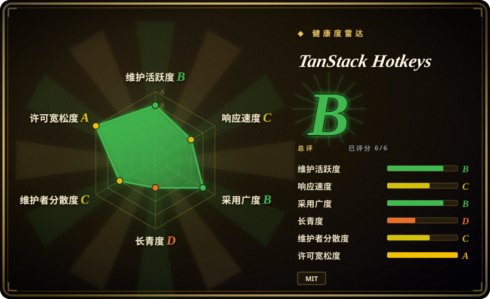
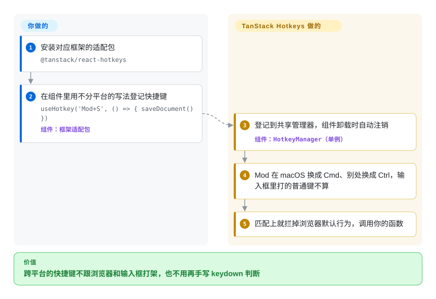

# TanStack Hotkeys

你把 `Ctrl+S` 绑成“保存”，在自己的 Windows 笔记本上好好的，Mac 用户按 `Cmd+S` 却弹出浏览器的“网页另存为”；用户在输入框里打个问号，`?` 快捷键跟着触发；让用户自定义按键的设置页存下了 `"Ctrl+Shift+ß"` 这种字符串，之后再也匹配不上。TanStack Hotkeys 把这些边角收到一处：你写一个有类型检查的 `'Mod+S'`，它负责按平台换成 Cmd 或 Ctrl、在输入框里打字时不误触发、录下用户的新组合键，再把它显示成 `⌘ S`。

## 何时使用

你在做一个重度依赖键盘的 Web 应用——编辑器、管理后台、工单系统、设计工具——快捷键一开始就是一句 `document.addEventListener('keydown', …)` 加 `if (e.ctrlKey && e.key === 's')`。现在 bug 列表里是这些：“Mac 上 Cmd+S 弹出浏览器保存框”“在评论框里按 `j` 会跳到下一条工单”“想要先按 `g` 再按 `i` 的导航，做不出来”“德语 Mac 上录的自定义快捷键存成了 `Alt+ß`，之后再也不触发”，产品还要一个按 `?` 弹出的速查面板，用 `⌘`、`⇧` 符号列出当前所有生效的快捷键。你们除了 React 应用，还发一个 Vue 小部件或 Lit Web Component，希望两边的按键规则一致。

这时就该想到 TanStack Hotkeys：`useHotkey('Mod+S', save)`（Vue、Angular、Solid、Svelte、Preact、Lit 各有对应写法），按键名有自动补全；`useHotkeySequence(['G', 'G'], …)` 做 Vim 式连按；录制器接住用户新按的组合键，格式化函数负责显示；背后是一个单例管理器，开发时会对重复绑定发警告，还有 devtools 面板。和 **react-hotkeys-hook** 比，选它是因为你需要 React 以外的官方适配、带类型的按键字符串，或者开箱即用的录制和显示工具；和 **tinykeys**、**hotkeys-js** 比，选它是因为你想要这些现成配件，而不是一个自己往上加功能的小监听器。如果你只是在 React 应用里绑三五个快捷键、又承受不了 alpha 期的变动，先看“何时不用”。

## 怎么用起来

最底下是一个 `HotkeyManager`——整个页面共用一个对象，由它挂真正的 `keydown`／`keyup` 监听，就像整栋楼只有一个总机接线员接所有电话，而不是每张桌子各拉一条线。框架适配包里的 hook 在组件挂载时把绑定登记到这个管理器，响应式状态变了就更新选项，卸载时自动删掉；你只提供按键和回调。绑定分两种：*逻辑键*（`'Mod+S'`，用户当前键盘布局打出来的那个字符）和*物理键*（`'Alt+[KeyW]'`，键在键盘上的位置，和布局无关）；`Mod` 在 macOS 上是 Command，其他系统上是 Control。按下一个键时，管理器拿它和所有启用的登记逐一匹配，套上默认行为——默认开启 `preventDefault` 和 `stopPropagation`，以及“聪明”的输入框处理：`Mod+S` 和 `Escape` 在文本框里照样触发，单个字母在文本框里被忽略——然后调用你的函数。围绕这个核心，同一个包还给你录制器（捕获用户接下来按的组合，给你一个字符串，存哪儿你定）、`formatForDisplay`（把 `Mod+S` 显示成 `⌘ S` 或 `Ctrl+S`）、按住键追踪（做提示浮层用）和 devtools 面板；它不给你任何界面——速查面板、改键对话框、用户自定义绑定存在哪里，都是你的事。

<!-- flow-steps:begin (generated from flows/tanstack-hotkeys.json by tools/flow_card.py — do not edit) -->

流程文字版

1. **你**：安装对应框架的适配包 — `@tanstack/react-hotkeys`
2. **你**：在组件里用不分平台的写法登记快捷键 — `useHotkey('Mod+S', () => { saveDocument() })` — 组件：`框架适配包`
3. **TanStack Hotkeys**：登记到共享管理器，组件卸载时自动注销 — 组件：`HotkeyManager（单例）`
4. **TanStack Hotkeys**：Mod 在 macOS 换成 Cmd、别处换成 Ctrl，输入框里打的普通键不算
5. **TanStack Hotkeys**：匹配上就拦掉浏览器默认行为，调用你的函数

**价值**：跨平台的快捷键不跟浏览器和输入框打架，也不用再手写 keydown 判断

<!-- flow-steps:end -->

## 何时不用

- **如果你只要一个用的人最多、API 稳定、只支持 React 的 hook，用 react-hotkeys-hook，因为**它的 API 在 5.x，周下载约 510 万（2026-09-21 那一周），2018 年就有了，自带作用域（scope）；TanStack Hotkeys 自称 alpha，最近在 2026-09 还在 0.x 小版本里做破坏性变更。
- **如果你承受不了小版本号里的破坏性变更，锁死精确版本，或者选 1.x 以上的库，因为**核心 0.9.0（2026-09-21）把 `ParsedHotkey`／`RawHotkey` 改成“`key` 或 `code` 二选一”的联合类型，录制器默认改录物理键，清空语义也变了；0.10.0（2026-09-24）改成只发 ESM、要求 Node.js 20，不再提供 CommonJS 构建。
- **如果你的应用或测试运行器还在用 `require()` 加载依赖，或者要支持 ES2022 之前的浏览器又没有转译步骤，用 hotkeys-js 或 tinykeys，因为**从 0.10.0 起这些包只发 ES2022 ESM，没有 `require` 导出条件。
- **如果只是在普通页面里加一个快捷键，或者体积预算只有 1 KB，用 tinykeys，因为**它就是一个很小的、不绑框架的监听器，也支持连按；TanStack Hotkeys 会带上 `@tanstack/store`，以及你可能根本用不到的管理器、录制器和格式化器。
- **如果这个键本来就归一个获得焦点的控件管（按钮上的空格、回车，菜单、标签页、列表框里的方向键），全局绑定前先测一下，因为**未关闭的 issue #142 和 #138（2026-07）报告：单键全局快捷键会盖掉按钮的原生激活，在 ARIA 组合控件里会重复触发；到 2026-09-28 修复还在未合并的 PR 里。这类键用 `target` 限定到元素，或者干脆别做成全局快捷键。
- **如果你需要成组开关快捷键的作用域或层（弹窗打开就关掉编辑器的键），用 react-hotkeys-hook 或 hotkeys-js 的 scope，因为**TanStack Hotkeys 只能按元素 `target` 和每条登记的 `enabled` 来限定，没有具名的作用域栈，层级要你自己在状态里建模。
- **如果你要的是命令面板界面，用 kbar 或 cmdk，因为**这个库只管按键匹配和显示工具，不带搜索框、列表或浮层。

## 横向对比

| 替代品 | 是否收录 | 我们的评价 | 取舍 |
| --- | --- | --- | --- |
| react-hotkeys-hook（`JohannesKlauss/react-hotkeys-hook`） | 未收录 | 只有 React、想要一个久经考验、带具名作用域、API 稳定的 hook，选 react-hotkeys-hook；需要 React 以外的适配、带类型的按键字符串，或者内置录制和显示格式化时，选 TanStack Hotkeys。 | 得到七年的使用积累、5.x API 和约 510 万周下载；失去 Vue／Angular／Svelte／Solid／Lit 适配、录制器、物理键绑定和 devtools 面板。本批标签收录未连带新增。 |
| tinykeys（`jamiebuilds/tinykeys`） | 未收录 | 想要最小的、不绑框架、支持 `$mod` 和连按的监听器，其余自己搭，选 tinykeys；重复绑定警告、懂输入框的默认行为、录制和 devtools 值得多一个依赖时，选 TanStack Hotkeys。 | tinykeys 是一个很小的单模块，API 在 4.x（周下载约 40.2 万）；框架胶水、录制器和显示格式化都得你写。本批标签收录未连带新增。 |
| hotkeys-js（`jaywcjlove/hotkeys-js`） | 未收录 | 原生 JS 或 jQuery 时代的页面，需要具名作用域、成熟 API 和 CommonJS 支持，选 hotkeys-js；在组件框架里、想要带类型的绑定和随生命周期自动登记注销时，选 TanStack Hotkeys。 | hotkeys-js 从 2015 年维护至今（4.x，周下载约 170 万），支持作用域切换和过滤；没有框架适配、没有带类型的按键字符串、没有录制器。本批标签收录未连带新增。 |
| Mousetrap（`ccampbell/mousetrap`） | 未收录 | 把 Mousetrap 当遗留依赖：已经在用、还能跑就留着；新代码选仍在维护的库，比如 TanStack Hotkeys 或 tinykeys，因为 Mousetrap 的 npm 最新版停在 1.6.5，仓库最后一次推送是 2023-03-15。 | Mousetrap 周下载仍有约 106 万，连按语法大家都熟；得不到 TypeScript 优先的 API、物理键处理，以后也不会再有修复。本批标签收录未连带新增。 |
| @github/hotkey（`github/hotkey`） | 未收录 | 快捷键想直接写在 HTML 上（在要触发的链接或按钮上加 `data-hotkey`），选 @github/hotkey；快捷键从组件代码里登记、需要回调、录制和冲突检测时，选 TanStack Hotkeys。 | @github/hotkey 让绑定挨着元素写，跟 GitHub 自己的用法一致；它由属性驱动，不是组件状态 API，用户群也小（周下载约 3 万）。本批标签收录未连带新增。 |

TanStack Hotkeys 的响应式登记表建在 [TanStack Store](../state-management/tanstack-store.zh.md) 上，devtools 面板挂进 TanStack Devtools 外壳；TanStack 家族的其他库（Router、Query、Table、Form）是搭档，不是替代品。

## 技术栈

- **TypeScript** monorepo（pnpm workspaces + Nx、changesets、Vitest，用 tsdown 构建，构建检查里跑 `publint --strict`）。
- **`@tanstack/hotkeys`**——不绑框架的核心：`HotkeyManager`（单例）、`SequenceManager`、`KeyStateTracker`、`HotkeyRecorder` 和连按录制器、`parseHotkey`、`formatForDisplay`、校验和冲突检测。ES2022、只发 ESM、`sideEffects: false`；运行时只依赖 `@tanstack/store ^0.11.1`。
- **框架适配包**——`react-hotkeys`、`preact-hotkeys`、`vue-hotkeys`、`solid-hotkeys`、`svelte-hotkeys`、`angular-hotkeys`、`lit-hotkeys`，每个都重新导出核心，再加上 hook／原语（`useHotkey`、`useHotkeySequence`、`useKeyHold`、`useHeldKeys`、`HotkeysProvider`）。
- **Devtools**——`react-`、`preact-`、`solid-`、`vue-hotkeys-devtools` 面板（Angular 和 Lit 没有），挂在 TanStack Devtools 里，默认不进生产构建。

## 依赖

- **运行时：**支持 ES2022 的浏览器（或带转译的构建），以及对应框架：React／React DOM ≥16.8、Preact ≥10、Vue ≥3、Solid ≥1.7、Svelte ^5.25、Angular ≥19、Lit ≥3。在 Node 里导入（SSR、测试）时要 Node.js ≥20。
- **间接依赖：**`@tanstack/store`（适配包里还有 `@tanstack/react-store` 等）。
- **不需要服务器或托管服务。**可选：装 `@tanstack/react-devtools`（或 Preact／Solid 的外壳）来用 devtools 面板。
- **需要你自己补：**速查面板和改键界面，以及用户自定义绑定存在哪里。

## 运维难度

**低。**它是一个前端 npm 依赖，没有东西要部署。成本在升级和边角：
- 锁版本、读 changeset：0.x 的小版本在一周内先后改了类型、录制器默认值和模块格式（0.9.0 和 0.10.0）。
- 0.10.0 起只发 ESM——用 CommonJS 的 Jest 配置和老的打包配置，升级前要先迁移。
- 复用了焦点控件自带按键（空格、回车、方向键）的快捷键，以及长时间按住修饰键的场景，要专门测（见“何时不用”和 issue #143）。

## 健康度与可持续性

- **维护（2026-09-28）。**非常活跃：最近推送 2026-09-27，`@tanstack/hotkeys` 从 0.0.1（2026-02-10）到 0.10.1（2026-09-27）一共发了 27 个版本，2026-09-27 所有适配包都各发了一版；针对未关闭的焦点、修饰键问题的修复 PR（#161、#163）在 2026-09-27 提出。
- **治理／巴士因子。**归 TanStack GitHub 组织所有（CODEOWNERS：基础设施路径归 `@TanStack/tanstack-core`）。提交高度集中：Kevin Van Cott（KevinVandy）在贡献者列表里有 60 次，其次是 changesets、autofix 等机器人，其他人每人 1–4 次——是厂商式组织里由一个人主导的库，不是基金会项目。
- **背书与存续。**仓库建于 2026-01-21，约八个月，README 仍写着 alpha。这套 API 还谈不上 Lindy 先验；现有的先验来自 TanStack 自己多年维护库（Query、Table）的记录，那是组织层面的，不专属于 Hotkeys [推断]。
- **采用与生态。**`@tanstack/react-hotkeys` 周下载从约 19 万（2026-06-01 那一周）涨到约 121 万（2026-09-21 那一周），核心包约 130 万；`@tanstack/vue-hotkeys`（约 1.1 万）和 `@tanstack/angular-hotkeys`（约 4 千）小得多。健康度评分器在最近一个月窗口里数到 `@tanstack/hotkeys` 下载 2485752 次，依赖图上的依赖仓库数为 0，所以采用度这一轴只靠下载量撑着。React 包的下载从哪来没查清——查过的 TanStack devtools／router／start 等包都不依赖它 [未验证]。729 个 star 配这个下载量，是值得记一笔的反常信号，不能证明直接使用者多。
- **风险信号。**MIT，没找到 CLA 或改许可证的历史。主要风险：alpha 期的 API 变动、单人主导的开发，以及单键全局快捷键在焦点交互上的未修 bug。

## 存疑（未验证）

- [未验证] `@tanstack/react-hotkeys` 每周约 120 万下载的来源没有查到；查过 `@tanstack/react-devtools`、`@tanstack/devtools`、`@tanstack/react-router-devtools`、`@tanstack/react-start`、`@tanstack/react-query-devtools`、`@tanstack/react-pacer` 和 `@tanstack/react-table-devtools`，都没有声明依赖它，可能来自别的包、项目模板或 CI 流量。
- [推断] “TanStack 多年维护库的记录能延续到 Hotkeys”是组织层面的先验，本仓库里没有找到对应承诺。
- [未验证] 焦点交互类 bug（#142 焦点按钮上的空格／回车，#138 ARIA 组合控件，#143 `keyup` 被吞后修饰键卡住，#116 连按过程中单键快捷键也触发）来自 issue 报告和未合并的 PR，没有复现；之后的版本可能已修复。
- [未验证] “没有具名作用域栈”依据的是文档列出的选项（`target`、`enabled`、`conflictBehavior`、`HotkeysProvider` 默认值）和 2026-09-28 读到的 `HotkeyManager` 源码；以后的版本可能会加。
- [未验证] react-hotkeys-hook、tinykeys、hotkeys-js、Mousetrap、@github/hotkey、kbar 和 cmdk 的对比依据的是它们的 GitHub 元数据、npm 版本和下载量，本批没有完整读这些仓库。
