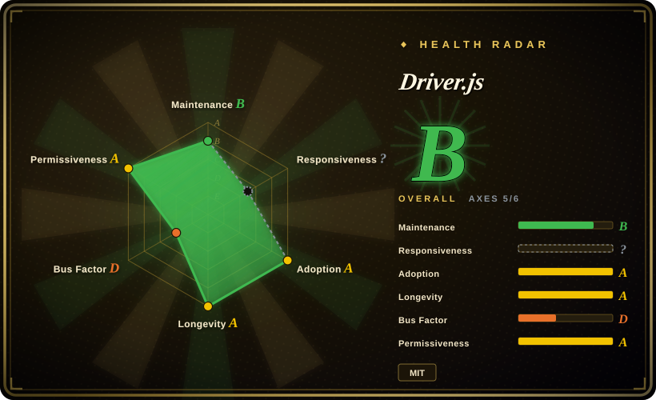
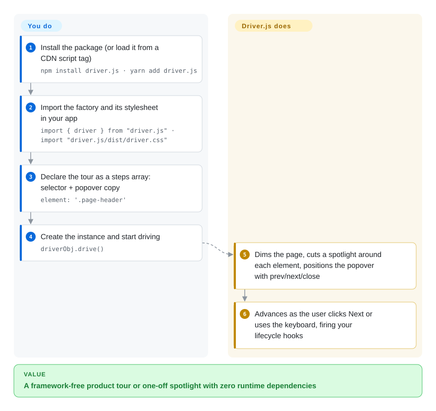

# Driver.js

You shipped a new feature and nobody clicks it, and a first-time user spends their day one lost in your dashboard — but wiring up a full onboarding SDK just to point at a few elements is overkill. Driver.js dims the page, cuts a spotlight around the element you name with a CSS selector, and pins a popover next to it, stepping through your tour with prev/next controls.

## When to use

You're a frontend engineer on a SaaS dashboard, and product wants a "first-run" walkthrough: when a new user lands, highlight the sidebar nav, then the "Create project" button, then the settings gear — each with a popover explaining what it does, a Next button, and a dimmed backdrop so the rest of the UI fades out of focus. You don't want to pull in a heavy onboarding SDK or a React-only tour kit, and the app is plain Vue with a sprinkle of vanilla JS in places. You reach for Driver.js: you `npm install driver.js`, import `driver`, hand it an array of steps (`{ element: '#sidebar', popover: { title, description } }`), call `.drive()`, and it renders the overlay, the spotlight cutout around each element, the popover, and the prev/next/close controls — no framework binding required, ~5KB-ish gzipped, zero dependencies.

You also reach for it for one-off "feature spotlight" moments — you shipped a new button and want to draw attention to it once — or for highlighting a single element programmatically (`driver().highlight({ element, popover })`) without a multi-step tour. Because it's pure DOM and framework-agnostic, it drops into React, Vue, Svelte, Angular, or no-framework pages alike, and the styling is themeable via CSS so you can match your design system.

## How it works

Driver.js is one factory function plus a stylesheet. You create an instance with `driver({ steps: [...] })`, where each step names a CSS selector and the title/description of its popover, then call `drive()` to start: the library injects a full-screen dimmed overlay, cuts a spotlight "hole" around the step's element, positions the popover relative to it, and scrolls the target into view. As the user clicks Next (or drives entirely from the keyboard), it moves step to step and fires lifecycle hooks you can attach — that is how you branch, validate, or react to the walkthrough mid-flight. What it does for you is the entire visual layer and step machine; what stays yours is deciding *when* to run it and *for whom* (it persists nothing — "has this user seen the tour?" is your code's job), making sure the target elements exist yet (in an SPA you wait for mount yourself), and theming via its CSS. It is pure DOM with zero runtime dependencies, so it drops into React, Vue, Svelte, Angular, or framework-free pages alike.

<!-- flow-steps:begin (generated from flows/driver-js.json by tools/flow_card.py — do not edit) -->

Text version of the flow

1. **You**: Install the package (or load it from a CDN script tag) — `npm install driver.js · yarn add driver.js`
2. **You**: Import the factory and its stylesheet in your app — `import { driver } from "driver.js" · import "driver.js/dist/driver.css"`
3. **You**: Declare the tour as a steps array: selector + popover copy — `element: '.page-header'`
4. **You**: Create the instance and start driving — `driverObj.drive()`
5. **Driver.js**: Dims the page, cuts a spotlight around each element, positions the popover with prev/next/close
6. **Driver.js**: Advances as the user clicks Next or uses the keyboard, firing your lifecycle hooks

**Value**: A framework-free product tour or one-off spotlight with zero runtime dependencies

<!-- flow-steps:end -->

## When NOT to use

- **You need a full onboarding/adoption *platform*, not just tours.** Driver.js draws tours; it has no segmentation, no analytics, no A/B targeting, no "show this tour to users who haven't done X" logic, no checklists, no NPS surveys. If you need that, you want Appcues / Userflow / Userpilot (commercial) — or you'll build the state/feature-flag layer yourself (e.g. Shepherd.js + your own "has this user seen the tour?" persistence). Driver.js is the *rendering* layer only.
- **Heavily dynamic / async DOM in an SPA.** Steps anchor to elements by selector. If the element doesn't exist yet (route not mounted, data still loading, virtualized list, modal animating in), the highlight targets nothing or jumps. You'll be writing timing/`MutationObserver` glue to wait for elements, re-position on scroll/resize, and handle steps whose targets unmount mid-tour. [推断]
- **Strict accessibility / keyboard / screen-reader requirements.** Overlay-and-spotlight tours are a known a11y minefield (focus trapping, `aria-*` on injected popovers, keyboard navigation, reduced-motion). Verify the current version's a11y behavior against your WCAG bar rather than assuming it's handled. [未验证]
- **You wanted a UI component kit.** It is not buttons/menus/modals/forms — it only does the tour/highlight overlay. Pair it with your actual component library.
- **You need deep tour branching / conditional flows out of the box.** Complex multi-path tours (branch on user action, skip steps, resume later) are doable but you orchestrate them in your own code; the library gives you steps + an imperative API, not a flow engine.

## Comparison

| Alternative | In index | Our verdict | Tradeoff |
|---|---|---|---|
| [Shepherd.js](shepherd-js.md) | ✅ | Choose Shepherd.js when you need a robust OSS tour library with more built-in step/positioning options and a richer API. | Heavier bundle (~20KB+ gzipped due to Floating UI dependency) vs Driver.js's ~4KB dependency-free core; more features and better positioning robustness. |
| [Intro.js](intro-js.md) | ✅ | Choose Intro.js when you want the original tour library and accept AGPL-3.0 for open-source use or a paid commercial license for closed-source products. | The original tour library; widely used but its modern versions are **dual-licensed** — commercial use requires a paid license at introjs.com, pre-v2.0.0 is exempt (its `license.md`, retrieved 2026-09-28) — a real lock-in/cost consideration Driver.js (MIT, free for personal and commercial use) avoids. |
| [Reactour](reactour.md) / [react-joyride](react-joyride.md) | ✅ | Choose Reactour / react-joyride when you need React-specific tour components with hooks or JSX-native APIs. | React-specific tour components (hooks/JSX-native); nicer DX inside React, but framework-locked vs Driver.js's framework-agnostic vanilla core. |
| Appcues / Userflow / Userpilot | 未收录 | Choose Appcues, Userflow, or Userpilot when you need commercial no-code onboarding **platforms**. | Commercial no-code onboarding **platforms** — segmentation, analytics, targeting, checklists, surveys; not open-source repos, recurring SaaS cost, but solve product-led-growth, not just tour rendering. |

## Tech stack

- **Language:** TypeScript, in a pnpm/turborepo monorepo since 2026 — the library lives in `packages/driver`, the docs app in `apps/docs` (source, retrieved 2026-09-28). Builds published to npm; a CDN path ships as an IIFE bundle (`driver.js@latest/dist/driver.js.iife.js`) plus `dist/driver.css`.
- **Rendering:** pure DOM + CSS — it injects an SVG/overlay for the dimmed backdrop and spotlight cutout, positions a popover relative to the highlighted element, and exposes an imperative `driver()` API (`drive()`, `highlight()`, `moveNext()`, `destroy()`, lifecycle hooks).
- **Hints:** a separate entry, `driver.js/hints` with its own `dist/hints.css` / `hints.iife.js` — pulsing beacons that open a popover on click, with no overlay; tour-only users never load them (docs installation/basic-usage guides, retrieved 2026-09-28).
- **Dependencies:** none at runtime — that's the headline; positioning and overlay math are done in-library rather than via a popper/Floating-UI dependency.
- **Theming:** styled via CSS variables / class overrides so it can match a host design system.

## Dependencies

- **Runtime:** none. A `<script>` tag (CDN/UMD) or an `npm install driver.js` import; it runs entirely client-side in the browser, no backend, no services.
- **Build (for app authors):** a bundler that resolves the npm package (Vite/webpack/esbuild/Rollup) and imports both the JS and its CSS; usable framework-free or inside any framework.
- **Browser:** modern evergreen browsers; exact minimum/legacy support and any polyfill needs are version-dependent — verify against the target browser matrix. [未验证]

## Ops difficulty

**Low — nothing to run, but the tour is code you must keep green.** There is no server, datastore, or scaling story: pick your install path — `npm install driver.js` for a bundler (remember to import `driver.js/dist/driver.css` alongside the JS, or the overlay ships without its styling), or the CDN IIFE (`driver.js@latest/dist/driver.js.iife.js`) when you can't touch the build. Hints live in a second entry (`driver.js/hints` + `dist/hints.css`), so tour-only apps ship zero extra bytes for them. The ongoing cost is all integration-side and specific to this library's model: each step is a CSS selector plus popover copy, so every redesign that renames a class silently detaches a step — a selector-steps regression test (assert each `element` resolves on the rendered page) is the standard defense; SPA mounts need you to delay `drive()`/`moveNext()` until the target exists (its lifecycle hooks fire before/after each highlight and are where that glue goes); and "who has seen this tour" is state you store yourself, since the library persists nothing.

## Health & viability

- **Responsiveness.** Not measurable — the repo showed too little issue/PR traffic in the scorer's window (radar axis stays `?`).
- **Maintenance (2026-09).** Latest release 1.8.0 on 2026-07-17 (1.7.0 on 2026-07-13, 1.5.0/1.6.0 in late June), last push 2026-07-18 — shipping in bursts with a quiet spell in between; not archived, but a ~2-month quiet stretch on a single-maintainer repo is worth watching. GitHub API, 2026-09-28.
- **Governance / bus factor.** The repo owner is a **`User` account, not an organization** — `nilbuild`, which is the renamed personal account of the original author Kamran Ahmed (`kamranahmedse`). One contributor holds ~521 commits while the next contributors sit at ~3 each ⇒ effectively a **single-maintainer project — a real bus-factor flag**. MIT-licensed and dependency-free, so a fork is cheap if maintenance ever lapses, but the roadmap follows one person. [推断]
- **Age & Lindy verdict.** Created 2018-03 (~8 years old) and **still releasing** ⇒ a **solid Lindy** signal — a long-proven, widely-adopted tour library rather than a hyped newcomer. Use age × still-active: the bus-factor flag is the offsetting risk, not the age. [推断]
- **Adoption & lock-in.** ~26.9k stars (26,851, GitHub API 2026-09-28) and broad real-world use across the JS ecosystem; MIT + zero runtime dependencies = **low lock-in** (no proprietary license, no SDK, easy to rip out or fork). Contrast Intro.js's commercial-licensing wrinkle (its `license.md`, checked 2026-09-28).
- **Risk flags.** Single-maintainer/personal-repo bus factor is the main one; no relicense history or open-core gating found (it is plain MIT). [推断]

## Caveats (unverified)

- [未验证] ~26.9k GitHub stars / ~1.2k forks (26,851 / 1,203, GitHub API 2026-09-28) — star/fork counts are date-sensitive and unreliable as a health proxy; treat as indicative only.
- [未验证] Bundle size ("~5KB gzipped") is the project's own framing (repeated in its readme as of 2026-09-28) and varies by version/build — measure against your actual build rather than quoting a fixed number.
- [推断] Owner `nilbuild` (User id 4921183) is the renamed personal account of `kamranahmedse`; "single-maintainer" is inferred from the contributor distribution (~521 vs ~3), not from a stated governance doc.
- [未验证] SPA timing/dynamic-DOM friction and the current a11y/keyboard/screen-reader behavior are inferred from how overlay-tour libraries generally work — verify against the version you pin for your specific app and WCAG bar.
