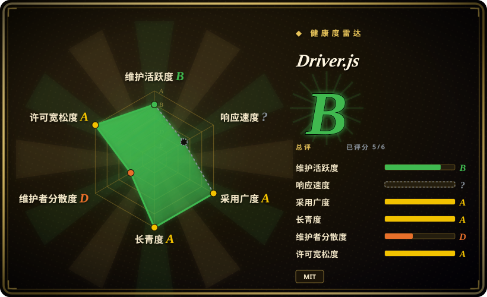
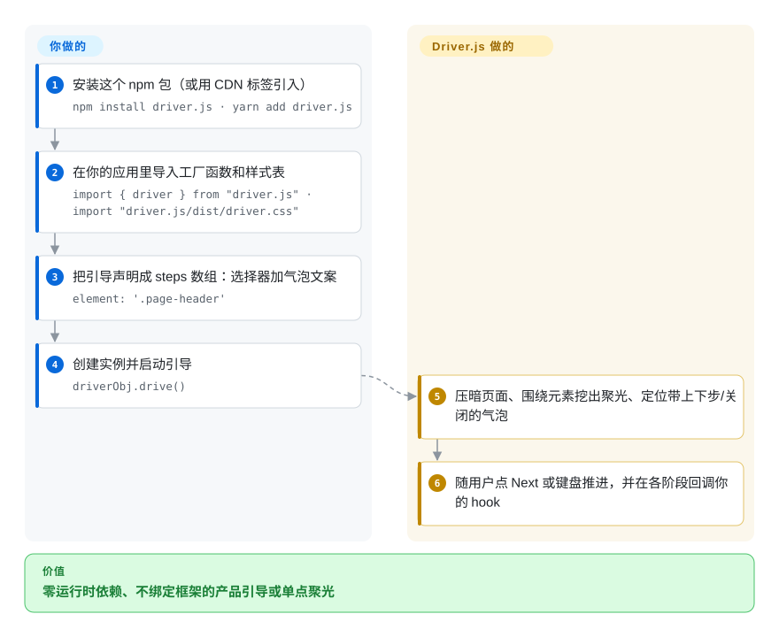

# Driver.js

你上线了一个新功能，却没有用户点开它；新用户第一天在后台里手足无措——可为了“指着页面上几个元素说两句话”就接一整套 onboarding SDK，又太重了。Driver.js 的做法是给页面盖一层压暗的遮罩，在你用 CSS 选择器点名的元素周围挖出聚光，并在旁边钉一个说明气泡，配上上一步/下一步，一步步带着用户走。

## 何时使用

你是某 SaaS 后台的前端工程师，产品想要一个“首次进入”的引导：新用户一进来，先高亮侧边导航，再高亮“新建项目”按钮，然后是设置齿轮——每一步配一个气泡（popover）说明它是干嘛的、一个 Next 按钮，还有一层压暗的背景把其余 UI 淡出焦点。你不想为此引入一个笨重的 onboarding SDK，也不想用一个只能在 React 里跑的 tour 套件，而且这个应用是纯 Vue，局部还夹着一点原生 JS。于是你选了 Driver.js：`npm install driver.js`，导入 `driver`，给它一个步骤数组（`{ element: '#sidebar', popover: { title, description } }`），调一下 `.drive()`，它就渲染出遮罩、每个元素周围的聚光镂空、气泡，以及上一步/下一步/关闭控件——不绑定任何框架，gzip 后约 5KB 量级，零依赖。

你也会在“单点功能高亮”的场景里选它——刚上线一个新按钮、想一次性地把注意力引过去——或者不做多步引导，只用 `driver().highlight({ element, popover })` 以编程方式高亮单个元素。因为它是纯 DOM、框架无关，所以同样能落进 React、Vue、Svelte、Angular 或无框架页面，样式还能通过 CSS 主题化以贴合你的设计系统。

## 怎么用起来

Driver.js 的全部入口就是一个工厂函数加一份样式表。你用 `driver({ steps: [...] })` 建一个实例，每个步骤写一个 CSS 选择器和它的气泡标题/描述，再调 `drive()` 开始：它注入一层全屏压暗遮罩，在当前步骤的元素周围“剪”出一个聚光洞，把气泡相对该元素定位好，并把目标滚动进视口。用户点 Next（或全程用键盘）时，它逐步推进，并触发你挂上的生命周期 hook——分支、校验、中途响应就是靠这个。它替你做的是整个视觉层和步骤状态机；留给你的东西是：决定*什么时候*给*谁*跑引导（它什么都不持久化，“这个用户看过没有”得你自己的代码管）、保证步骤执行时目标元素已经存在（SPA 里要自己等挂载）、以及通过 CSS 做主题。它是纯 DOM、运行时零依赖，所以 React、Vue、Svelte、Angular 或无框架页面都能直接落。

<!-- flow-steps:begin (generated from flows/driver-js.json by tools/flow_card.py — do not edit) -->

流程文字版

1. **你**：安装这个 npm 包（或用 CDN 标签引入） — `npm install driver.js · yarn add driver.js`
2. **你**：在你的应用里导入工厂函数和样式表 — `import { driver } from "driver.js" · import "driver.js/dist/driver.css"`
3. **你**：把引导声明成 steps 数组：选择器加气泡文案 — `element: '.page-header'`
4. **你**：创建实例并启动引导 — `driverObj.drive()`
5. **Driver.js**：压暗页面、围绕元素挖出聚光、定位带上下步/关闭的气泡
6. **Driver.js**：随用户点 Next 或键盘推进，并在各阶段回调你的 hook

**价值**：零运行时依赖、不绑定框架的产品引导或单点聚光

<!-- flow-steps:end -->

## 何时不用

- **你需要的是完整的 onboarding/采用*平台*，而不只是引导。** Driver.js 只画引导；它没有人群分层、没有埋点分析、没有 A/B 定向、没有“只对没做过 X 的用户展示此引导”的逻辑，也没有 checklist、没有 NPS 问卷。要这些，你要的是 Appcues / Userflow / Userpilot（商业产品）——或者自己搭那层状态/feature-flag（比如 Shepherd.js 加上你自己实现的“这个用户看过引导没？”持久化）。Driver.js 只是*渲染*层。
- **SPA 里高度动态 / 异步的 DOM。** 步骤靠选择器锚定元素。如果元素还不存在（路由没挂载、数据还在加载、虚拟列表、模态框正在动画进入），高亮就会指向空或者乱跳。你得自己写定时 / `MutationObserver` 胶水去等元素、在滚动/缩放时重新定位，还要处理引导途中目标被卸载的步骤。[推断]
- **严格的无障碍 / 键盘 / 读屏要求。** 遮罩加聚光式引导是公认的 a11y 雷区（焦点陷阱、注入气泡上的 `aria-*`、键盘导航、reduced-motion）。请对照你的 WCAG 标准核实当前版本的无障碍行为，别假设它已经处理好了。[未验证]
- **你想要的是一套 UI 组件库。** 它不是按钮/菜单/模态框/表单——它只做引导/高亮遮罩。把它和你真正的组件库搭配使用。
- **你需要开箱即用的深度引导分支 / 条件流程。** 复杂的多路径引导（按用户操作分支、跳步、稍后续接）能做，但要靠你自己的代码编排；这个库给的是步骤加一套命令式 API，而不是一个流程引擎。

## 横向对比

| 替代品 | 是否收录 | 我们的评价 | 取舍 |
|---|---|---|---|
| [Shepherd.js](shepherd-js.zh.md) | ✅ | 需要更健壮的开源引导库、更多内置步骤/定位选项和更丰富 API 时，选 Shepherd.js。 | 类似的开源引导库，内置的步骤/定位选项更多、API 更丰富；但更重（用 Floating UI / popper 风格定位），bundle 比 Driver.js 零依赖的内核大。 |
| [Intro.js](intro-js.zh.md) | ✅ | 想用最早的引导库、且能接受开源用法走 AGPL-3.0 或闭源商用需付费授权时，选 Intro.js。 | 最早的引导库；用得很广，但其现代版本是**双协议授权**——商用需要到 introjs.com 购买授权，v2.0.0 以前的版本豁免（其 `license.md`，2026-09-28 抓取）——这是个实打实的锁定/成本考量，而 Driver.js（MIT，个人与商用均免费）没有。 |
| [Reactour](reactour.zh.md) / [react-joyride](react-joyride.zh.md) | ✅ | 需要 React 专属的 hooks 或 JSX 原生引导组件时，选 Reactour / react-joyride。 | React 专属的引导组件（hooks/JSX 原生）；在 React 内 DX 更好，但被框架锁定，对比 Driver.js 框架无关的原生内核。 |
| Appcues / Userflow / Userpilot | 未收录 | 需要商业无代码 onboarding **平台**时，选 Appcues、Userflow 或 Userpilot。 | 商业的无代码 onboarding **平台**——分层、分析、定向、checklist、问卷；不是开源仓库，有持续的 SaaS 订阅成本，但解决的是 product-led-growth，而不只是引导渲染。 |

## 技术栈

- **语言：** TypeScript；2026 年起仓库是 pnpm/turborepo monorepo——库本体在 `packages/driver`，文档站在 `apps/docs`（源码，2026-09-28 抓取）。构建产物发布到 npm；CDN 途径是 IIFE 包（`driver.js@latest/dist/driver.js.iife.js`）加 `dist/driver.css`。
- **渲染：** 纯 DOM + CSS——注入一层 SVG/遮罩做压暗背景与聚光镂空，相对被高亮元素定位一个气泡，并暴露命令式 `driver()` API（`drive()`、`highlight()`、`moveNext()`、`destroy()` 以及生命周期 hook）。
- **Hints（提示点）：** 独立入口 `driver.js/hints`，带自己的 `dist/hints.css` / `hints.iife.js`——在页面上放会脉动的提示点，点击弹出气泡、无遮罩不挡操作；不做引导的用户不会加载它（docs 的 installation/basic-usage 指南，2026-09-28 抓取）。
- **依赖：** 运行时零依赖——这是卖点；定位与遮罩的计算在库内部完成，而不是借助 popper/Floating-UI 这类依赖。
- **主题：** 通过 CSS 变量 / class 覆盖来定制样式，以贴合宿主设计系统。

## 依赖

- **运行时：** 无。一个 `<script>` 标签（CDN/UMD）或 `npm install driver.js` 导入即可；它完全在浏览器端运行，无后端、无服务。
- **构建（应用作者侧）：** 一个能解析该 npm 包的打包器（Vite/webpack/esbuild/Rollup），同时导入它的 JS 和 CSS；可无框架使用，也可嵌入任意框架。
- **浏览器：** 现代常青浏览器；具体的最低/旧版支持以及是否需要 polyfill 取决于版本——请对照你的目标浏览器矩阵核实。[未验证]

## 运维难度

**低——没有东西要运行，但引导是你必须持续保绿的代码。** 没有服务器、数据存储或扩容问题：装机路径二选一——走打包器就 `npm install driver.js`（记得把 `driver.js/dist/driver.css` 和 JS 一起导入，否则遮罩会带着没样式的状态上线）；碰不到构建链就用 CDN 的 IIFE 包（`driver.js@latest/dist/driver.js.iife.js`）。hints 住在第二个入口（`driver.js/hints` 加 `dist/hints.css`），只做引导的应用不会为它多带一个字节的包。后续的开销全在集成侧、且和这个库的模型直接相关：每个步骤就是一个 CSS 选择器加一段气泡文案，所以任何一次改类名的重构都会让某一步无声地脱靶——标准防御是一条选择器回归测试（断言每个 `element` 在渲染出的页面上都能解析）；SPA 挂载要你自己把 `drive()`/`moveNext()` 推迟到目标存在之后（它在每次高亮前后触发的生命周期 hook 就是放这层胶水的地方）；而“这个用户看过没有”得由你自己存储，因为这个库什么都不持久化。

## 健康度与可持续性

- **响应速度**：无法测量——评分窗口内该仓库的 issue/PR 流量太少（雷达该轴保持 `?`）。
- **维护（2026-09）。** 最新 release 1.8.0 发布于 2026-07-17（1.7.0 在 2026-07-13，1.5.0/1.6.0 在 6 月下旬），最后 push 于 2026-07-18——以一波一波的节奏发版，中间有安静期；未归档，但单维护者仓库连续两个多月安静值得留意。GitHub API，2026-09-28。
- **治理 / bus factor。** 仓库 owner 是一个 **`User` 账号，而非组织**——`nilbuild`，即原作者 Kamran Ahmed（`kamranahmedse`）改名后的个人账号。一名贡献者握有约 521 次提交，而紧随其后的贡献者各自只有约 3 次⇒实质上是**单维护者项目——一个实打实的 bus-factor 风险标记**。MIT 授权且零依赖，所以一旦维护停摆，fork 的代价很低，但路线图跟随一个人。[推断]
- **年龄与 Lindy 判断。** 2018-03 创建（约 8 年）且**仍在发版**⇒ 一个**扎实的 Lindy** 信号——一个久经验证、被广泛采用的引导库，而非被炒作的新秀。用年龄 × 仍活跃来看：bus-factor 标记才是对冲风险，年龄本身不是。[推断]
- **采用度与锁定。** 约 26.9k star（26,851，GitHub API 2026-09-28），在 JS 生态里有广泛的真实使用；MIT + 运行时零依赖 = **低锁定**（无私有授权、无 SDK，易于移除或 fork）。对照 Intro.js 的商业授权问题（2026-09-28 查过其 `license.md`）。
- **风险标记。** 单维护者/个人仓库的 bus factor 是主要一项；未发现 relicense 历史或 open-core 收费墙（它就是纯 MIT）。[推断]

## 存疑（未验证）

- [未验证] 约 26.9k GitHub star / 约 1.2k fork（26,851 / 1,203，GitHub API 2026-09-28）——star/fork 数对时间敏感，作为健康度代理并不可靠，仅供参考。
- [未验证] bundle 体积（“约 5KB gzip”）是项目自己的说法（截至 2026-09-28 的 readme 仍如此写），随版本/构建而变——请对照你实际的构建去测量，而不是引用一个固定数字。
- [推断] owner `nilbuild`（User id 4921183）是 `kamranahmedse` 改名后的个人账号；“单维护者”是从贡献者分布（约 521 对约 3）推断的，而非来自某份治理文档。
- [未验证] SPA 时序/动态 DOM 的摩擦，以及当前版本的 a11y/键盘/读屏行为，都是从遮罩式引导库的一般工作方式推断而来——请对照你为具体应用锁定的版本和 WCAG 标准核实。
