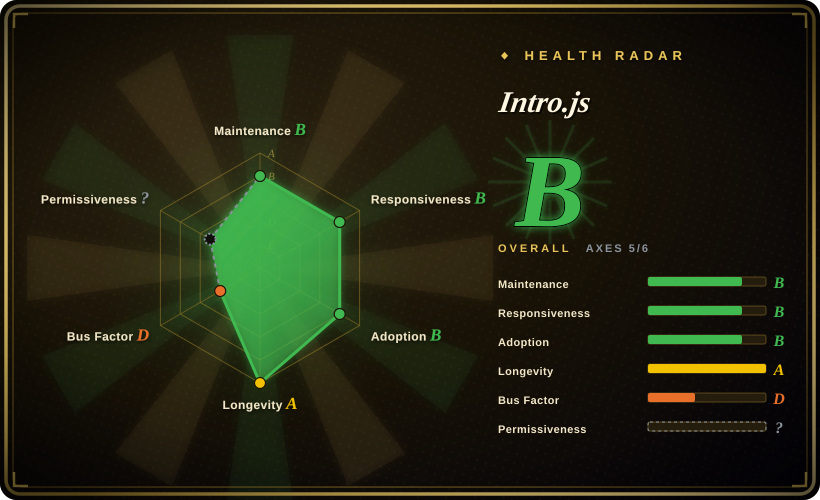
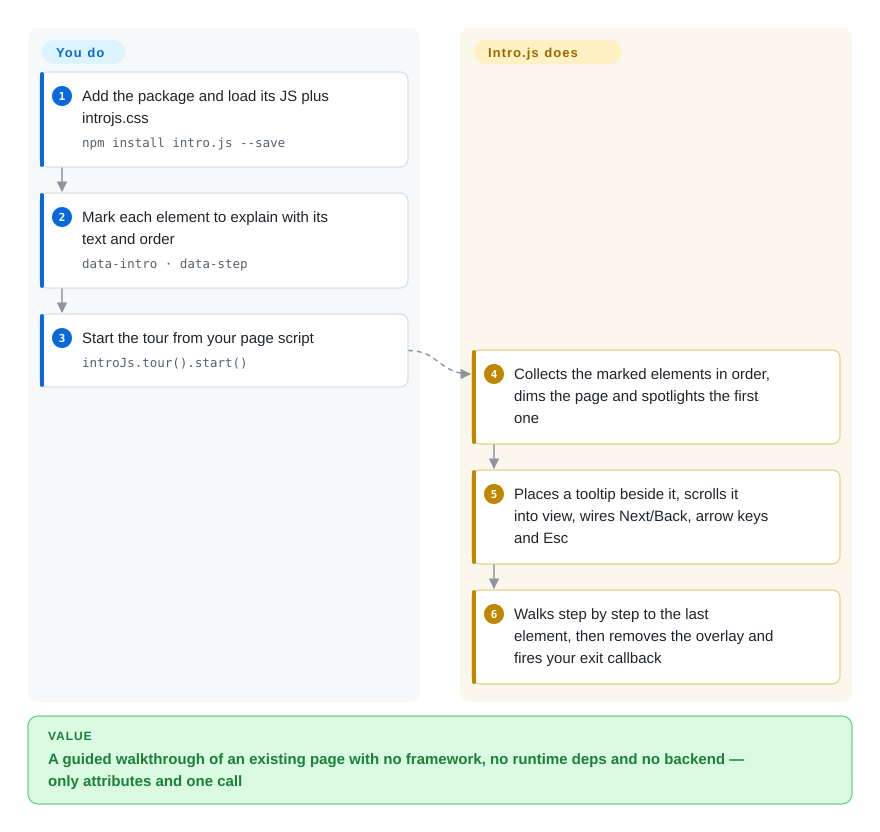

# Intro.js

New users land on your dashboard, stare at forty buttons, and file a support ticket asking where "Create course" is. Intro.js dims the page and walks them through it one highlighted element at a time, driven by a few HTML attributes — but it is AGPL-3.0 with a paid commercial license, and that license is the decisive filter for most teams.

## When to use

You're the frontend developer on an open-source course platform written in plain HTML and vanilla JS — no React, no Vue. New instructors keep asking the same thing in the forum: "where do I grade submissions?" You want a welcome tooltip on the dashboard, a spotlight on the "Create course" button, and a five-step walkthrough of grading, with progress dots and arrow-key navigation, without adding a framework or a backend. You reach for Intro.js: `npm install intro.js` (or a CDN `<script>`), put `data-intro="…"` and `data-step="2"` on the elements, call `introJs.tour().start()`, and it draws the overlay, tooltips and navigation for you. Since v8 it also ships built-in translations (Chinese, Japanese, Russian and others) and light/dark/auto themes, which matters when your learners are not English-first.

You pick it over Driver.js when you want those batteries — step numbering, bullets, a "don't show again" checkbox backed by a cookie, translations — rather than the smallest possible spotlight library, and over react-joyride/Reactour because there is no React to bind to. Because your project is itself AGPL-compatible open source, the license costs you nothing; that condition is what makes Intro.js the right choice here rather than a liability.

## How it works

Intro.js is a client-side script that turns marked-up elements of an existing page into a guided tour. **You** decide what each step says and in which order — either by putting `data-intro` (the text) and `data-step` (the order) attributes on elements, or by passing a `steps` array in JavaScript — and you call `introJs.tour().start()`. **It** does the rest: collects the targets, darkens the page with an overlay (a semi-transparent layer over everything) while cutting a bright "spotlight" around the current element, places a tooltip next to it, scrolls it into view, and wires Next/Back buttons, arrow keys and Esc. Think of it as a museum docent who walks visitors from exhibit to exhibit with a flashlight; you only write the placards. A second mode, `introJs.hint()`, puts small pulsing dots on elements that open a note on click, for help that does not interrupt the user. The old `introJs()` entry point still works in v8 but logs a deprecation warning.

<!-- flow-steps:begin (generated from flows/intro-js.json by tools/flow_card.py — do not edit) -->

Text version of the flow

1. **You**: Add the package and load its JS plus introjs.css — `npm install intro.js --save`
2. **You**: Mark each element to explain with its text and order — `data-intro · data-step`
3. **You**: Start the tour from your page script — `introJs.tour().start()`
4. **Intro.js**: Collects the marked elements in order, dims the page and spotlights the first one
5. **Intro.js**: Places a tooltip beside it, scrolls it into view, wires Next/Back, arrow keys and Esc
6. **Intro.js**: Walks step by step to the last element, then removes the overlay and fires your exit callback

**Value**: A guided walkthrough of an existing page with no framework, no runtime deps and no backend — only attributes and one call

<!-- flow-steps:end -->

## When NOT to use

- **You ship a commercial or closed-source product and won't buy a license — use Driver.js instead of Intro.js, because** Intro.js's open-source license is AGPL-3.0 and the upstream LICENSE states that commercial projects need a paid commercial license (one-time, $9.99–$299.99 per the vendor's pricing as of 2026-10). Driver.js is MIT. Note that **Shepherd.js is no longer a permissive escape hatch**: its current README declares the same AGPL-3.0 + commercial dual license.
- **Your legal team rejects AGPL outright and the vendor license is not an option — use Driver.js (MIT) or React-specific react-joyride/Reactour (MIT) instead, because** buying the license only covers you; tracking which products and seats are licensed is an ongoing process cost those projects do not impose.
- **You need a single spotlight on one element with the smallest possible bundle — use Driver.js instead, because** Intro.js carries tour machinery (bullets, progress bar, hints, i18n, themes) you will not use for a one-off highlight.
- **Your app is a React SPA where targets mount late (lazy routes, virtualized lists, animating modals) — use react-joyride instead, because** Intro.js anchors steps to elements that must already exist in the DOM; it re-positions on resize, but waiting for a not-yet-rendered element is your glue code, whereas react-joyride lives inside React's render cycle.
- **You need segmentation, analytics, A/B targeting, checklists or surveys — use a hosted adoption platform such as Appcues or Userflow instead, because** Intro.js renders tours and hints only; it has no notion of user segments or funnel data.
- **You need branching tours (skip steps by user action, resume next session) — use a hosted flow builder such as Userflow, or put your own state layer on top, because** Intro.js gives you a linear step list plus callbacks (`onBeforeChange`, `onExit` and the like); any branching or cross-page resume is code you orchestrate.
- **You are upgrading from v7 or earlier — budget a migration, because** v8 split the API into `introJs.tour()` and `introJs.hint()`; the old `introJs()` and `addHints()` calls now only log deprecation errors, so hint code silently stops working.

## Comparison

| Alternative | In index | Our verdict | Tradeoff |
|---|---|---|---|
| [Driver.js](driver-js.md) | ✅ | For a commercial product that won't pay for a tour library, pick Driver.js; pick Intro.js when you want built-in step bullets, i18n and "don't show again" and the AGPL/commercial license is acceptable. | Driver.js: MIT, smaller, zero deps, but you assemble progress UI and persistence yourself. Intro.js: more built-in tour UI, but a license you must track. |
| [Shepherd.js](shepherd-js.md) | ✅ | When license is equal (both now AGPL-3.0 + commercial), pick Shepherd.js for Floating UI positioning and richer per-step configuration; pick Intro.js for the attribute-only setup on a static page. | Shepherd: more control over step placement and content, heavier API. Intro.js: zero-config `data-intro` markup, fewer positioning knobs. |
| [react-joyride](react-joyride.md) / [Reactour](reactour.md) | ✅ | In a React app, pick react-joyride or Reactour, because they render steps as React components and follow your components' mount lifecycle; pick Intro.js only for non-React or mixed pages. | React-native integration and MIT license, but framework-locked; Intro.js works on any page but sits outside React's render cycle. |
| Appcues / Userflow / Userpilot | not a repo | When product or growth teams need to author tours without engineers and measure them, pick a hosted platform; Intro.js is the choice when engineers own the tour in code. | Hosted SaaS: no-code authoring, segmentation, analytics, but a recurring subscription and a third-party script. Not a repository. |
| Bootstrap Tour | not indexed | Do not start new work on Bootstrap Tour; it is unmaintained and tied to Bootstrap, so pick Intro.js or Driver.js instead. | Was a Bootstrap-dependent tour plugin; no current maintenance. |

## Tech stack

- **Language:** TypeScript source (`src/`), bundled with Rollup into UMD (`intro.js`) and ESM (`intro.module.js`) builds with bundled type declarations.
- **Rendering:** plain DOM + CSS — injects overlay, helper layer, tooltip and hint elements into the page and positions them against target elements; no virtual DOM, no framework.
- **API:** `introJs.tour()` (step-by-step tour) and `introJs.hint()` (click-to-open hints), configured via `data-*` attributes or an options object; lifecycle callbacks.
- **Theming & i18n:** CSS theme files with built-in light/dark/auto themes and `registerTheme()`; built-in translations selected via a `language` option (v8.5+).
- **Tests:** Jest unit tests, Cypress browser tests, and axe-based accessibility tests (added in v8.4).

## Dependencies

- **Runtime:** none — `package.json` declares no runtime dependencies. Load it from a `<script>` tag (jsDelivr / cdnjs) or `npm install intro.js` and import the JS plus `introjs.css`.
- **Build (for app authors):** any bundler that resolves an npm package and its CSS (Vite, webpack, esbuild, Rollup). Works on framework-free pages or inside React, Vue, Angular or Svelte, but without framework-aware lifecycle.
- **License:** a commercial license from introjs.com if the product is commercial and not AGPL-compliant.

## Ops difficulty

**Low.** It is a browser library, not a service: nothing to deploy, no server, no datastore. The real cost is integration in your own app — keeping step selectors and `data-intro` attributes in sync as the UI changes (rename a class and the tour silently targets nothing), handling late-mounting elements in SPAs, and theming to your design system. The one non-code process cost is the license: if the product is commercial, someone must buy and track the commercial license, which Driver.js (MIT) does not require.

## Health & viability

- **Maintenance (2026-10).** Active but bursty: v8.6.0 shipped 2026-09-21 after v8.4/8.5 in July 2026, following a year-long gap after v8.3.2 (2025-07). The health radar's maintenance and responsiveness axes both read B — the last commit was 17 days before scoring, with activity in 5 of the last 13 weeks; few new issues, answered within hours.
- **Governance / bus factor — the weak axis.** All 2026 commits and release notes come from one contributor (Parvinmh); original author Afshin Mehrabani's `usablica` org owns the repo and the commercial license. Governance scores D (1 active maintainer in the last 12 months). If that person stops, the project likely goes quiet again.
- **Age & Lindy.** Created 2013 (~13.5 years) and still shipping features (themes, i18n, a11y tests) — a strong Lindy prior on *existence*, discounted by the single-maintainer cadence.
- **Adoption.** 798,473 npm downloads in the last month and 1,272 dependent repos (health radar, 2026-10-08); ~23k GitHub stars.
- **Risk flags.** AGPL-3.0 + commercial dual license (the GitHub API reports `NOASSERTION` because LICENSE prepends the commercial terms). The license has been dual since v2.0.0; versions before that are exempt per the LICENSE file.

## Caveats (unverified)

- [未验证] Commercial pricing ($9.99 Starter / $49.99 Business / $299.99 Premium, one-time) was read from introjs.com on 2026-10-08; check terms and seat definitions before budgeting.
- [未验证] Whether a particular use counts as "commercial" under the LICENSE wording is a legal question; the page does not settle it.
- [推断] Late-mounting targets in SPAs need host-side waiting logic; inferred from the step model (selectors resolved at runtime) and not tested against v8.6.
- [未验证] Accessibility: axe-based tests exist since v8.4, but conformance to a specific WCAG level (focus trapping, screen-reader announcements) was not verified.
- [推断] The bus-factor reading (one active maintainer) comes from 2026 commit authors and the health radar's contributor stats, not a governance document.
- [未验证] ~23k GitHub stars as of 2026-10-08; star counts drift.
