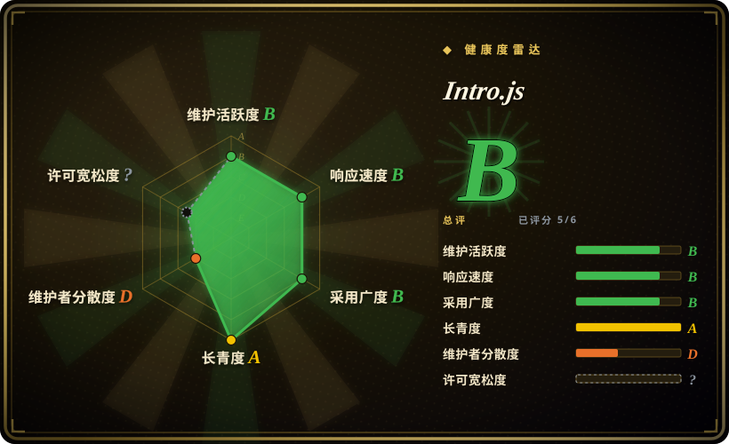
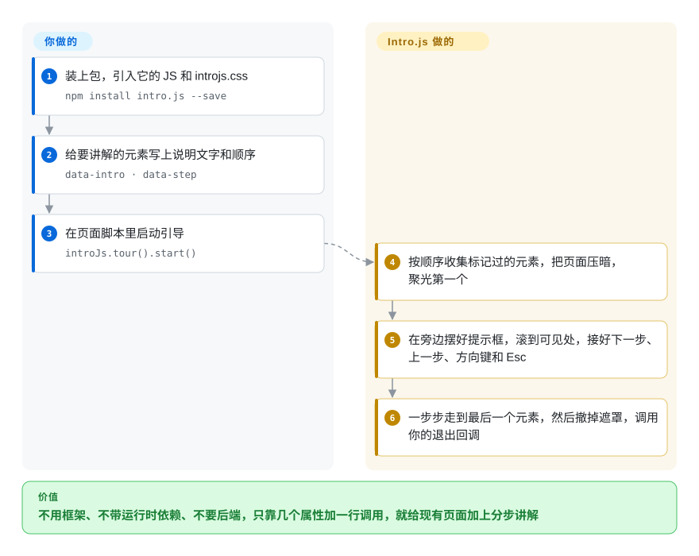

# Intro.js

新用户打开你的后台，面对四十个按钮不知从哪下手，转身就去提工单问“创建课程在哪”。Intro.js 把页面压暗，一次聚光一个元素，带着他们一步步看完，配置只是几个 HTML 属性；但它的开源协议是 AGPL-3.0，商用要另买授权，这一点决定了多数团队选不选它。

## 何时使用

你是一个开源课程平台的前端，站点是原生 HTML 加原生 JS，没有 React 也没有 Vue。新来的讲师在论坛里反复问同一句话：“去哪里批改作业？”你想在仪表盘放一个欢迎提示，给“创建课程”按钮打个聚光，再把批改流程拆成五步讲一遍，带进度点和方向键翻页，而且不想为此引入框架或后端。于是你用 Intro.js：`npm install intro.js`（或者 CDN 的 `<script>`），在元素上写 `data-intro="…"` 和 `data-step="2"`，调用 `introJs.tour().start()`，遮罩、提示框和翻页它都替你画好。v8 起它还自带中文、日文、俄文等多种界面翻译和浅色、深色、跟随系统三套主题，学员不以英语为母语时这很省事。

你不选 Driver.js，是因为你要的是这些现成配件：步骤编号、进度点、靠 cookie 记住的“不再显示”勾选框、多语言，而不是一个最小的聚光库；你不选 react-joyride 或 Reactour，是因为页面里根本没有 React。你的项目本身就是兼容 AGPL 的开源软件，协议对你零成本；正是这个前提让 Intro.js 在这里是正确选择，而不是隐患。

## 怎么用起来

Intro.js 是一段浏览器端脚本，把现有页面上标记过的元素串成一次导览。**你**决定每一步说什么、按什么顺序：要么在元素上写 `data-intro`（说明文字）和 `data-step`（顺序）属性，要么在 JavaScript 里传一个 `steps` 数组，然后调用 `introJs.tour().start()`。**它**负责其余的事：收集这些目标元素，用一层遮罩（盖在整个页面上的半透明层）把页面压暗，同时在当前元素周围挖出一块亮区作为“聚光”，在旁边摆好提示框，把元素滚到可见处，并接好“下一步”“上一步”按钮、方向键和 Esc。可以把它想成博物馆讲解员拿着手电筒带游客逐个看展品，你只负责写展牌。另一种模式 `introJs.hint()` 在元素上放会闪的小圆点，点开才显示说明，适合不打断用户的帮助提示。老的 `introJs()` 入口在 v8 里还能用，但会在控制台打出弃用警告。

<!-- flow-steps:begin (generated from flows/intro-js.json by tools/flow_card.py — do not edit) -->

流程文字版

1. **你**：装上包，引入它的 JS 和 introjs.css — `npm install intro.js --save`
2. **你**：给要讲解的元素写上说明文字和顺序 — `data-intro · data-step`
3. **你**：在页面脚本里启动引导 — `introJs.tour().start()`
4. **Intro.js**：按顺序收集标记过的元素，把页面压暗，聚光第一个
5. **Intro.js**：在旁边摆好提示框，滚到可见处，接好下一步、上一步、方向键和 Esc
6. **Intro.js**：一步步走到最后一个元素，然后撤掉遮罩，调用你的退出回调

**价值**：不用框架、不带运行时依赖、不要后端，只靠几个属性加一行调用，就给现有页面加上分步讲解

<!-- flow-steps:end -->

## 何时不用

- **你做的是商用或闭源产品，又不打算买授权：改用 Driver.js，因为** Intro.js 的开源协议是 AGPL-3.0，上游 LICENSE 写明商业项目需要购买商业授权（据官网 2026-10 的定价，一次性 9.99 到 299.99 美元）。Driver.js 是 MIT。注意 **Shepherd.js 已经不是宽松协议的退路**：它当前的 README 声明的也是 AGPL-3.0 加商业授权的双协议。
- **法务一律不接受 AGPL，买授权也不在选项里：改用 Driver.js（MIT），或在 React 里用 react-joyride、Reactour（MIT），因为**买授权只解决“能不能用”，之后哪些产品、多少席位已授权还得有人一直跟踪，这几个项目没有这笔流程成本。
- **你只要给一个元素打一次聚光，包越小越好：改用 Driver.js，因为** Intro.js 带着整套导览机制（进度点、进度条、hint、多语言、主题），一次性高亮用不上这些。
- **你的应用是 React 单页应用，目标元素挂载得晚（懒加载路由、虚拟列表、正在动画进入的弹窗）：改用 react-joyride，因为** Intro.js 的步骤要锚定在 DOM 里已存在的元素上；窗口缩放时它会重新定位，但等待一个还没渲染出来的元素要你自己写胶水代码，而 react-joyride 跑在 React 的渲染周期里。
- **你需要人群分层、埋点分析、A/B 定向、清单或问卷：改用 Appcues、Userflow 这类托管的用户引导平台，因为** Intro.js 只渲染导览和 hint，没有用户分群和漏斗数据的概念。
- **你需要分支导览（按用户操作跳步、下次登录接着走）：改用 Userflow 这类托管流程编辑器，或者自己在上面搭一层状态，因为** Intro.js 给你的是线性步骤列表加回调（`onBeforeChange`、`onExit` 等），分支和跨页续接都要你自己编排。
- **你正从 v7 或更早版本升级：要预留迁移工作量，因为** v8 把 API 拆成了 `introJs.tour()` 和 `introJs.hint()`，老的 `introJs()`、`addHints()` 调用现在只会打印弃用错误，hint 相关代码会悄悄失效。

## 横向对比

| 替代品 | 是否收录 | 我们的评价 | 取舍 |
|---|---|---|---|
| [Driver.js](driver-js.zh.md) | ✅ | 商用产品又不想为导览库付费，选 Driver.js；想要现成的进度点、多语言和“不再显示”，并且能接受 AGPL 或商业授权，选 Intro.js。 | Driver.js：MIT、更小、零依赖，但进度界面和持久化要自己拼；Intro.js：导览界面更齐全，代价是要跟踪授权。 |
| [Shepherd.js](shepherd-js.zh.md) | ✅ | 两者协议现在相同（都是 AGPL-3.0 加商业授权）时，要基于 Floating UI 的定位和更细的单步配置选 Shepherd.js；只想在静态页面上写属性就跑起来选 Intro.js。 | Shepherd：对步骤位置和内容控制更多，API 更重；Intro.js：`data-intro` 标记零配置，定位可调项更少。 |
| [react-joyride](react-joyride.zh.md) / [Reactour](reactour.zh.md) | ✅ | React 应用里选 react-joyride 或 Reactour，因为它们把步骤渲染成 React 组件，跟着组件挂载周期走；只有非 React 或混合页面才选 Intro.js。 | 与 React 原生集成且是 MIT，但绑死框架；Intro.js 任何页面都能用，却游离在 React 渲染周期之外。 |
| Appcues / Userflow / Userpilot | 非仓库 | 产品或增长团队要不靠工程师自己编导览、还要看数据，选托管平台；导览由工程师在代码里维护时选 Intro.js。 | 托管 SaaS：无代码编辑、分群、分析，但有持续订阅费和第三方脚本。不是仓库。 |
| Bootstrap Tour | 未收录 | 新项目别用 Bootstrap Tour，它已无人维护且绑定 Bootstrap，改选 Intro.js 或 Driver.js。 | 曾是依赖 Bootstrap 的导览插件，目前没有维护。 |

## 技术栈

- **语言：** TypeScript 源码（`src/`），用 Rollup 打成 UMD（`intro.js`）和 ESM（`intro.module.js`）两种构建，附带类型声明。
- **渲染：** 纯 DOM 加 CSS，向页面注入遮罩层、高亮层、提示框和 hint 元素，并相对目标元素定位；没有虚拟 DOM，不依赖框架。
- **API：** `introJs.tour()`（分步导览）和 `introJs.hint()`（点开才显示的提示），用 `data-*` 属性或选项对象配置，另有生命周期回调。
- **主题与多语言：** CSS 主题文件，内置浅色、深色、跟随系统三套主题，可用 `registerTheme()` 注册；内置翻译通过 `language` 选项切换（v8.5 起）。
- **测试：** Jest 单元测试、Cypress 浏览器测试，以及基于 axe 的无障碍测试（v8.4 加入）。

## 依赖

- **运行时：** 无，`package.json` 没有声明任何运行时依赖。用 `<script>` 标签从 jsDelivr 或 cdnjs 加载，或者 `npm install intro.js` 后引入 JS 和 `introjs.css`。
- **构建（应用作者侧）：** 任何能解析 npm 包及其 CSS 的打包器（Vite、webpack、esbuild、Rollup）。可以用在无框架页面，也能塞进 React、Vue、Angular、Svelte，但不感知框架的生命周期。
- **授权：** 产品属于商用且不满足 AGPL 时，需要从 introjs.com 购买商业授权。

## 运维难度

**低。** 它是浏览器端的库，不是服务：没有东西要部署，没有服务器，也没有数据存储。真正的成本在你自己的应用里：UI 一改，步骤选择器和 `data-intro` 属性就得跟着改（改个类名，导览就静悄悄地指向空处），单页应用里还要处理晚挂载的元素，再按你的设计系统调主题。唯一一项代码之外的流程成本是授权：产品是商用的话，得有人去买并跟踪商业授权，Driver.js（MIT）没有这件事。

## 健康度与可持续性

- **维护（2026-10）。** 活跃但一阵一阵的：v8.3.2（2025-07）之后停了一年，2026 年 7 月连发 v8.4、v8.5，2026-09-21 发了 v8.6.0。健康雷达的维护和响应两轴都是 B：打分时最后一次提交在 17 天前，最近 13 周里有 5 周有提交；新 issue 不多，几小时内有回应。
- **治理与 bus factor：最弱的一轴。** 2026 年的提交和发版说明都出自同一位贡献者（Parvinmh）；仓库和商业授权归原作者 Afshin Mehrabani 的 `usablica` 组织。治理轴是 D（12 个月内活跃维护者 1 人）。这个人一停，项目很可能再次沉寂。
- **年龄与 Lindy。** 2013 年创建（约 13.5 年），至今还在加功能（主题、多语言、无障碍测试），在“会不会继续存在”上 Lindy 先验很强，但要按单人维护的节奏打折。
- **采用度。** 最近一个月 npm 下载 798,473 次，1,272 个仓库依赖它（健康雷达，2026-10-08）；GitHub 约 2.3 万 star。
- **风险标记。** AGPL-3.0 加商业授权的双协议（GitHub API 显示 `NOASSERTION`，因为 LICENSE 开头先写了商业条款）。按 LICENSE 原文，v2.0.0 起才是双协议，更早的版本不需要商业授权。

## 存疑（未验证）

- [未验证] 商业授权价格（Starter 9.99 美元、Business 49.99 美元、Premium 299.99 美元，一次性买断）是 2026-10-08 从 introjs.com 读到的；做预算前请核对条款和席位定义。
- [未验证] 某种具体用法算不算 LICENSE 措辞里的“商用”，是法律问题，本页不下结论。
- [推断] 单页应用里晚挂载的目标元素需要宿主侧写等待逻辑；这是从步骤模型（运行时按选择器查找元素）推出来的，没有在 v8.6 上实测。
- [未验证] 无障碍：v8.4 起有基于 axe 的测试，但是否满足某个具体 WCAG 等级（焦点锁定、读屏播报）没有核实。
- [推断] “只有一位活跃维护者”的判断来自 2026 年的提交作者和健康雷达的贡献者统计，没有治理文档可依。
- [未验证] 截至 2026-10-08 约 2.3 万 GitHub star；star 数会变。
