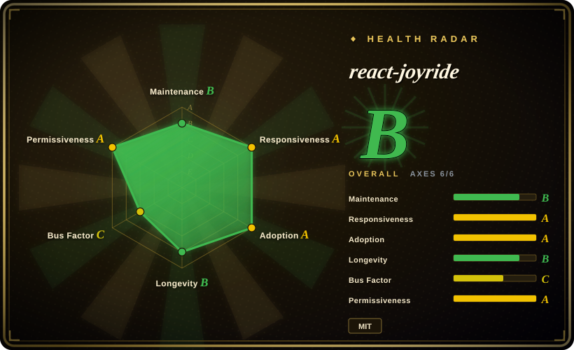
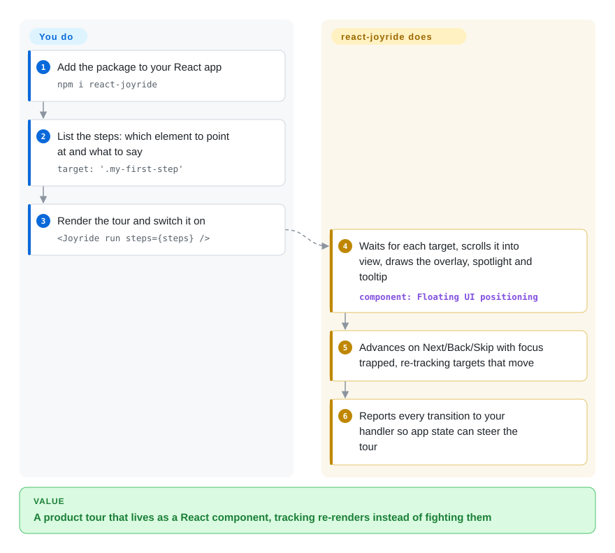

# react-joyride

Your React app ships a new screen and support tickets ask "where is the export button?" — but bolting a vanilla-JS tour library onto React means fighting stale DOM references every time a component re-renders. react-joyride is a React component (or hook) that takes a list of steps — "point at this element, say this" — and renders the dimmed overlay, the spotlight and the tooltip as React portals that follow the element as it moves.

## When to use

You're a frontend engineer on a React or Next.js SaaS app, and product wants a five-step first-run tour: the project switcher, the "New report" button, a filter panel that only mounts after data loads, and so on. You tried a framework-agnostic library and hit the usual React friction — the tour grabbed `document.querySelector('.filters')` before the panel existed, the spotlight stayed where the element *used* to be after a layout shift, and wiring "advance when the user actually opens the modal" meant reaching outside React state. You reach for react-joyride: `npm i react-joyride`, a `steps` array of `{ target, content }`, and `<Joyride run steps={steps} />`. Targets can be CSS selectors, refs or functions; the tour waits for a missing target up to `targetWaitTimeout` before moving on, re-tracks targets that move or scroll, and reports every transition to your `onEvent` handler so you can drive it from your own state ("controlled" mode via `stepIndex`).

The deciding tradeoff against [Driver.js](driver-js.md) and [Shepherd.js](shepherd-js.md) is React-native state and lifecycle versus framework independence: react-joyride is useless outside React, but inside it the tour is a component you render, not an imperative object you keep in sync. Against [Intro.js](intro-js.md) and (since 2024) Shepherd.js, it is also the plain-MIT option — no commercial license to buy for a revenue-generating product.

## How it works

You hand react-joyride a list of steps; it owns everything visual and the step-by-step state machine. Each step names a `target` — a CSS selector, a React ref, or a function that returns the element — plus the `content` to show. When `run` turns true, the tour finds the target (polling briefly if it has not mounted yet), scrolls it into view, draws a dark SVG overlay with a cut-out "spotlight" around it, and positions the tooltip next to it using Floating UI (a small library that keeps a popup attached to an element through scrolling and resizing). Optionally a pulsing "beacon" dot appears first and the tooltip opens only when clicked. As the user clicks Next/Back/Skip it advances, traps keyboard focus inside the tooltip, and emits typed events (`tour:start`, `step:after`, `tour:end`, …) to your `onEvent` callback. What stays yours: deciding *when* and *for whom* to run it (it persists nothing — "has this user finished the tour?" is your storage), keeping step targets stable as the UI changes, and — if steps depend on app state such as an opened modal — switching to controlled mode and advancing `stepIndex` yourself. Since v3 (2026-03) the same engine is exposed as a `useJoyride()` hook returning `controls`, `state` and the `Tour` element, so you can place the start button anywhere.

<!-- flow-steps:begin (generated from flows/react-joyride.json by tools/flow_card.py — do not edit) -->

Text version of the flow

1. **You**: Add the package to your React app — `npm i react-joyride`
2. **You**: List the steps: which element to point at and what to say — `target: '.my-first-step'`
3. **You**: Render the tour and switch it on — `<Joyride run steps={steps} />`
4. **react-joyride**: Waits for each target, scrolls it into view, draws the overlay, spotlight and tooltip — component: `Floating UI positioning`
5. **react-joyride**: Advances on Next/Back/Skip with focus trapped, re-tracking targets that move
6. **react-joyride**: Reports every transition to your handler so app state can steer the tour

**Value**: A product tour that lives as a React component, tracking re-renders instead of fighting them

<!-- flow-steps:end -->

## When NOT to use

- **Your app is not React (or only partly React).** It is a React component with `react`/`react-dom` 16.8–19 as peer dependencies; there is no vanilla entry point. For Vue, Svelte, Angular or server-rendered pages with sprinkles of JS, use [Driver.js](driver-js.md) (MIT, zero dependencies) instead.
- **You are upgrading a v2 codebase and cannot schedule a migration.** v3.0.0 (2026-03-23) changed the default export to a named export, renamed `callback` to `onEvent`, flipped the default of `run` to `false`, and moved many top-level props into an `options` object. An upgrade that skips the migration guide silently stops the tour from starting. Pin `react-joyride@2` until you can run the upstream `react-joyride-migrate` codemod and review what it cannot rewrite.
- **You need a product-adoption platform, not a tour renderer.** No segmentation, no analytics dashboard, no "show only to users who have not done X", no checklists, no persistence. If non-engineers must author and target tours, a hosted platform such as Appcues or Userflow (closed SaaS) fits; if you only need the targeting layer, keep react-joyride and put the "seen" flag in your own user store.
- **Bus factor is a hard requirement.** One maintainer (`gilbarbara`) wrote ~99% of the commits in the last year. MIT makes a fork possible, but if your policy requires a team- or foundation-backed dependency, compare [Driver.js](driver-js.md) (also essentially single-maintainer) and [Reactour](reactour.md) against your own fork budget rather than assuming continuity.
- **You want the smallest possible footprint for a one-off highlight.** react-joyride pulls in Floating UI and several helper packages to handle scrolling, focus and target tracking. For a single "look at this new button" moment, [Driver.js](driver-js.md)'s `highlight()` or a CSS-only pulse is lighter.

## Comparison

| Alternative | In index | Our verdict | Tradeoff |
|---|---|---|---|
| [Driver.js](driver-js.md) | ✅ | For a non-React or mixed-framework app, pick Driver.js; stay with react-joyride when the app is React and you want the tour driven by React state and refs. | Driver.js is framework-free and dependency-free but imperative — you keep a tour object in sync with re-renders yourself; react-joyride is React-only but re-tracks targets and exposes controlled mode. |
| [Reactour](reactour.md) | ✅ | Pick Reactour only if you prefer its context-provider API and accept a slower release cadence; for actively released React tours with typed events and a v3 hook, pick react-joyride. | Both are MIT React-only libraries; Reactour's `@reactour/tour` last published 3.8.0 (2025-05) while react-joyride shipped v3.0–3.2 during 2026. |
| [Shepherd.js](shepherd-js.md) | ✅ | Pick Shepherd.js when one tour must run across React, Vue, Angular and plain pages and you can license it (AGPL-3.0 or paid commercial); otherwise react-joyride avoids the license cost in a React app. | Shepherd has framework wrappers and an org-backed team, but since v14 (2024-09) commercial use requires a paid license; react-joyride is MIT but single-maintainer and React-only. |
| [Intro.js](intro-js.md) | ✅ | Pick Intro.js when you want its long-standing vanilla API and will buy a commercial license (or are AGPL-compatible); in a closed-source React product, react-joyride is the license-free path. | Intro.js is framework-agnostic with a large install base, but AGPL-3.0/commercial dual licensing; react-joyride is MIT with no purchase. |
| Appcues / Userflow | 非仓库 | Choose a hosted onboarding platform when product managers must author, target and measure tours without deploys; choose react-joyride when engineers own the tour in code. | Closed SaaS products, not repositories: no-code authoring, segmentation and analytics in exchange for recurring cost and a third-party script. |

## Tech stack

- **Language:** TypeScript; published to npm as `react-joyride` (v3.2.0, 2026-07-09); pnpm workspace with a Next.js docs/demo site under `website/`.
- **Rendering:** React portals for overlay, beacon, tooltip and loader; the overlay is an SVG path cut-out (v3) rather than a CSS box-shadow.
- **Positioning:** `@floating-ui/react-dom` (replaced Popper/`react-floater` in v3).
- **State:** an internal store read through `useSyncExternalStore`; tour status (`ready → running → finished/skipped`) and per-step lifecycle (`init → beacon → tooltip → complete`) documented in `docs/architecture.md`.
- **Testing:** Vitest unit tests plus Playwright end-to-end tests in the repo.

## Dependencies

- **Peer:** `react` and `react-dom` 16.8 through 19.
- **Runtime npm deps (v3.2.0):** `@floating-ui/react-dom`, `@fastify/deepmerge`, `scroll`, `scrollparent`, `react-innertext`, `use-sync-external-store`, and small helpers from the maintainer (`@gilbarbara/hooks`, `@gilbarbara/deep-equal`, `@gilbarbara/types`, `is-lite`).
- **No services:** client-side only — no backend, datastore or network calls. The README states it is SSR-safe with Next.js, Remix and similar frameworks.

## Ops difficulty

**Low.** Nothing to deploy; it ships inside your bundle. The recurring cost is integration upkeep: step targets break silently when a class or ref is renamed, tours that depend on async data need `before` hooks or controlled mode, and "has this user seen it?" persistence is yours to build. The one non-trivial event is the v2 → v3 migration, which is a code change across every tour definition (a codemod handles most of it).

## Health & viability

- **Maintenance (2026-10):** active in bursts — v3.0.0 (2026-03-23), v3.1.0 (2026-04-29), v3.2.0 (2026-07-09), with commits clustered around releases; no commits since 2026-07-09, so the scorer's maintenance grade rests on its mature-library carve-out. Not archived.
- **Governance / bus factor:** effectively one maintainer, Gil Barbara, on a personal account; the governance axis is C for that reason. A second contributor (`IanVS`) appears historically, but the last year is ~99% one person.
- **Age / Lindy:** created 2015-08, so roughly 11 years old and still shipping major versions — a solid Lindy prior for a UI library. The longevity grade slipped from A to B in this re-score only because ~3 months have passed since the last commit.
- **Adoption:** heavy — 5,605,838 npm downloads in the last month and 2,453 dependent repositories (scorer snapshot, 2026-10-08); adoption moved from B to A in this re-score as downloads rose.
- **Risk flags:** MIT, no relicense, no CLA or paid tier. The main risk is single-maintainer continuity and the v2 → v3 breaking surface for existing users.

## Caveats (unverified)

- [未验证] "~30% smaller bundle than v2" is the upstream README's claim; not measured here.
- [未验证] SSR safety with Next.js/Remix is the upstream claim; not tested in this review.
- [推断] Commits cluster around releases (2026-03 to 2026-07) and the repo was quiet from 2026-07-09 to 2026-10-08; whether that is a normal pause or slowing maintenance is not knowable yet.
- [推断] Reactour's release cadence is judged from the npm `@reactour/tour` publish date (3.8.0, 2025-05-07) and the GitHub repo push date (2026-05); its page has not been re-verified in this pass.
- [未验证] Accessibility (focus trap, keyboard navigation, ARIA) is documented upstream; conformance to a specific WCAG level was not checked.
