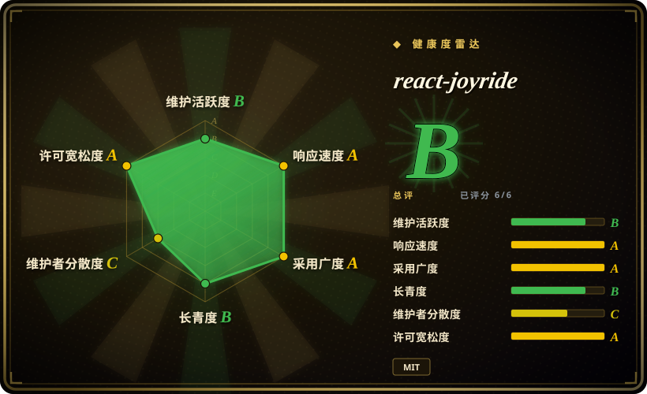
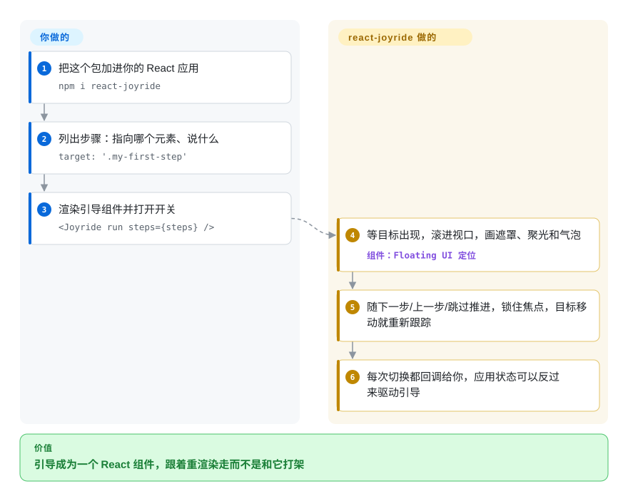

# react-joyride

你的 React 应用上了新页面，客服工单却还在问“导出按钮在哪”；可把一个原生 JS 的引导库硬塞进 React，组件一重渲染它手里的 DOM 引用就失效。react-joyride 是一个 React 组件（也有 hook 版）：你给它一串步骤——“指着这个元素，说这句话”——它用 React portal 画出压暗遮罩、聚光洞和说明气泡，元素挪了位置它也跟着走。

## 何时使用

你是一个 React 或 Next.js SaaS 应用的前端工程师，产品要一个五步的“首次进入”引导：项目切换器、“新建报表”按钮、一个要等数据加载完才挂载的筛选面板，等等。你先试了一个框架无关的库，撞上了 React 里的老问题——引导在面板还不存在时就执行了 `document.querySelector('.filters')`；布局一抖，聚光还停在元素*原来*的位置；想做“用户真的打开弹窗后才进入下一步”，就得绕到 React 状态外面去。于是你选 react-joyride：`npm i react-joyride`，一个 `{ target, content }` 组成的 `steps` 数组，再渲染 `<Joyride run steps={steps} />`。目标可以是 CSS 选择器、ref 或返回元素的函数；目标还没挂载时，它最多等待 `targetWaitTimeout` 毫秒再往下走；目标移动或滚动时会重新跟踪；每一次状态切换都通过 `onEvent` 回调告诉你，你可以用自己的状态来驱动它（传 `stepIndex` 进入“受控”模式）。

和 [Driver.js](driver-js.zh.md)、[Shepherd.js](shepherd-js.zh.md) 相比，决定性的取舍是“贴合 React 的状态与生命周期”还是“不绑定框架”：react-joyride 离开 React 就用不了，但在 React 里，引导是你渲染出来的一个组件，而不是一个要你手动保持同步的命令式对象。和 [Intro.js](intro-js.zh.md) 以及 2024 年之后的 Shepherd.js 相比，它还是纯 MIT 许可——用在赚钱的产品里也不用另买商业授权。

## 怎么用起来

你给 react-joyride 一串步骤，视觉层和逐步推进的状态机都归它管。每个步骤写一个 `target`（CSS 选择器、React ref，或返回元素的函数）和要显示的 `content`。`run` 变成 true 后，它先找到目标（还没挂载就短暂轮询等一会儿），把目标滚进视口，画一层带镂空“聚光洞”的深色 SVG 遮罩，再用 Floating UI（一个让弹出层在滚动、缩放时始终贴着某个元素的小库）把气泡定位到目标旁边。可选地，它会先显示一个闪烁的“信标”圆点，用户点了才弹出气泡。用户点下一步/上一步/跳过时它推进步骤，把键盘焦点锁在气泡里，并向你的 `onEvent` 回调发出带类型的事件（`tour:start`、`step:after`、`tour:end` 等）。留给你的是：决定*什么时候*给*谁*跑引导（它什么都不持久化，“这个用户看完没有”要存在你自己的地方）；界面改动时保持步骤目标稳定；如果某一步依赖应用状态（比如弹窗已打开），切到受控模式，自己推进 `stepIndex`。从 v3（2026-03）起，同一个引擎还以 `useJoyride()` hook 的形式提供，返回 `controls`、`state` 和 `Tour` 元素，开始按钮可以放在任何地方。

<!-- flow-steps:begin (generated from flows/react-joyride.json by tools/flow_card.py — do not edit) -->

流程文字版

1. **你**：把这个包加进你的 React 应用 — `npm i react-joyride`
2. **你**：列出步骤：指向哪个元素、说什么 — `target: '.my-first-step'`
3. **你**：渲染引导组件并打开开关 — `<Joyride run steps={steps} />`
4. **react-joyride**：等目标出现，滚进视口，画遮罩、聚光和气泡 — 组件：`Floating UI 定位`
5. **react-joyride**：随下一步/上一步/跳过推进，锁住焦点，目标移动就重新跟踪
6. **react-joyride**：每次切换都回调给你，应用状态可以反过来驱动引导

**价值**：引导成为一个 React 组件，跟着重渲染走而不是和它打架

<!-- flow-steps:end -->

## 何时不用

- **你的应用不是 React（或只有一部分是）。** 它是一个 React 组件，`react`/`react-dom` 16.8–19 是 peer 依赖，没有原生 JS 入口。Vue、Svelte、Angular 或服务端渲染页面加零星 JS 的场景，改用 [Driver.js](driver-js.zh.md)（MIT，零依赖）。
- **你在维护 v2 代码，又排不出迁移时间。** v3.0.0（2026-03-23）把默认导出改成具名导出，`callback` 改名为 `onEvent`，`run` 的默认值翻成 `false`，大量顶层 prop 挪进了 `options` 对象。不看迁移指南直接升级，引导会悄无声息地不再启动。在能跑上游的 `react-joyride-migrate` codemod 并人工检查它改不了的部分之前，先锁定 `react-joyride@2`。
- **你要的是产品采纳平台，不是引导渲染器。** 它没有用户分群、没有分析看板、没有“只给没做过 X 的用户看”、没有任务清单、也不做持久化。如果要由非工程师来编写和定向投放引导，托管平台如 Appcues、Userflow（闭源 SaaS）更合适；如果只是缺“定向”这一层，就继续用 react-joyride，把“已看过”标记存进你自己的用户数据里。
- **硬性要求总线因子（bus factor）。** 过去一年约 99% 的提交来自一位维护者（`gilbarbara`）。MIT 让 fork 成为可能，但如果你的政策要求团队或基金会背书的依赖，应把 [Driver.js](driver-js.zh.md)（同样基本是个人维护）和 [Reactour](reactour.zh.md) 放在一起，按你自己的 fork 预算来比较，而不是默认它会一直有人维护。
- **你只想要一次性高亮的最小体积。** react-joyride 为了处理滚动、焦点和目标跟踪，会引入 Floating UI 和几个辅助包。如果只是“看看这个新按钮”一次，[Driver.js](driver-js.zh.md) 的 `highlight()` 或纯 CSS 的脉冲动画更轻。

## 横向对比

| 替代品 | 是否收录 | 我们的评价 | 取舍 |
|---|---|---|---|
| [Driver.js](driver-js.zh.md) | 已收录 | 非 React 或多框架混用的应用选 Driver.js；应用是 React、并且希望引导由 React 状态和 ref 驱动时，留在 react-joyride。 | Driver.js 不绑框架、零依赖，但是命令式的——引导对象要你自己跟着重渲染同步；react-joyride 只能用于 React，但会重新跟踪目标并提供受控模式。 |
| [Reactour](reactour.zh.md) | 已收录 | 只有偏好 Reactour 的 context provider 写法、并能接受更慢的发版节奏时才选它；要持续发版、带类型事件和 v3 hook 的 React 引导，选 react-joyride。 | 两者都是 MIT、只用于 React；Reactour 的 `@reactour/tour` 最近一次发布是 3.8.0（2025-05），react-joyride 在 2026 年内连续发了 v3.0–3.2。 |
| [Shepherd.js](shepherd-js.zh.md) | 已收录 | 同一套引导要跨 React、Vue、Angular 和原生页面运行、并且你能接受它的许可（AGPL-3.0 或付费商业授权）时选 Shepherd.js；否则在 React 应用里，react-joyride 省掉许可成本。 | Shepherd 有各框架封装、背后是公司团队，但自 v14（2024-09）起商业使用须购买授权；react-joyride 是 MIT，但只有一位维护者、只支持 React。 |
| [Intro.js](intro-js.zh.md) | 已收录 | 想要它老牌的原生 API、并愿意买商业授权（或项目本身兼容 AGPL）时选 Intro.js；闭源 React 产品里，react-joyride 是不用付许可费的路线。 | Intro.js 框架无关、装机量大，但采用 AGPL-3.0/商业双许可；react-joyride 是 MIT，无需购买。 |
| Appcues / Userflow | 非仓库 | 当产品经理必须在不发版的情况下编写、定向和度量引导时，选托管引导平台；引导由工程师在代码里维护时，选 react-joyride。 | 闭源 SaaS 产品，不是仓库：用持续订阅费和一段第三方脚本，换来无代码编辑、用户分群和分析。 |

## 技术栈

- **语言：** TypeScript；以 `react-joyride` 发布到 npm（v3.2.0，2026-07-09）；pnpm workspace，`website/` 下是 Next.js 文档/演示站。
- **渲染：** 遮罩、信标、气泡和加载器都通过 React portal 渲染；v3 的遮罩是 SVG 路径镂空，不再用 CSS box-shadow。
- **定位：** `@floating-ui/react-dom`（v3 中替换了 Popper/`react-floater`）。
- **状态：** 内部 store，通过 `useSyncExternalStore` 读取；整体状态（`ready → running → finished/skipped`）和单步生命周期（`init → beacon → tooltip → complete`）写在 `docs/architecture.md` 里。
- **测试：** 仓库内有 Vitest 单元测试和 Playwright 端到端测试。

## 依赖

- **Peer 依赖：** `react` 和 `react-dom`，16.8 到 19。
- **运行时 npm 依赖（v3.2.0）：** `@floating-ui/react-dom`、`@fastify/deepmerge`、`scroll`、`scrollparent`、`react-innertext`、`use-sync-external-store`，以及维护者自己的几个小工具包（`@gilbarbara/hooks`、`@gilbarbara/deep-equal`、`@gilbarbara/types`、`is-lite`）。
- **无外部服务：** 纯客户端——没有后端、数据存储或网络请求。README 声称可在 Next.js、Remix 等 SSR 框架里安全使用。

## 运维难度

**低。** 没有东西要部署，它就打包在你的前端产物里。持续的成本在集成维护：class 或 ref 一改名，步骤目标就会无声失效；依赖异步数据的引导需要 `before` hook 或受控模式；“这个用户看过没有”的持久化要你自己做。唯一不小的一次性工作是 v2 → v3 迁移，需要改动每一份引导定义（codemod 能处理大部分）。

## 健康度与可持续性

- **维护（2026-10）：** 阵发式活跃——v3.0.0（2026-03-23）、v3.1.0（2026-04-29）、v3.2.0（2026-07-09），提交集中在发版前后；2026-07-09 之后没有新提交，所以评分器的维护轴是靠“成熟库”豁免拿到的 B。未归档。
- **治理 / 总线因子：** 实际上只有一位维护者 Gil Barbara，挂在个人账号下，治理轴因此是 C。历史上有第二位贡献者（`IanVS`），但近一年约 99% 的提交来自同一人。
- **年龄 / Lindy：** 2015-08 创建，约 11 年，仍在发大版本——对 UI 库来说是不错的 Lindy 先验。本次重算中寿命轴从 A 降到 B，原因只是距最后一次提交已过去约 3 个月。
- **采纳度：** 很高——近一个月 npm 下载 5,605,838 次，依赖它的仓库 2,453 个（评分器快照，2026-10-08）；本次重算中采纳轴随下载量上升从 B 升到 A。
- **风险信号：** MIT，无改许可历史，无 CLA，无付费版。主要风险是单人维护的延续性，以及 v2 → v3 的破坏性改动对存量用户的影响。

## 存疑（未验证）

- [未验证] “比 v2 小约 30%”是上游 README 的说法，这里没有实测。
- [未验证] 在 Next.js/Remix 下的 SSR 安全性是上游声明，本次未实测。
- [推断] 提交集中在 2026-03 到 2026-07 的发版期，2026-07-09 至 2026-10-08 仓库无动静；这是正常停顿还是维护放缓，目前无法判断。
- [推断] Reactour 的发版节奏是根据 npm 上 `@reactour/tour` 的发布日期（3.8.0，2025-05-07）和 GitHub 仓库推送日期（2026-05）判断的；它的页面本轮没有重核。
- [未验证] 上游文档写了无障碍支持（焦点锁定、键盘导航、ARIA），但没有核对具体符合哪一级 WCAG。
