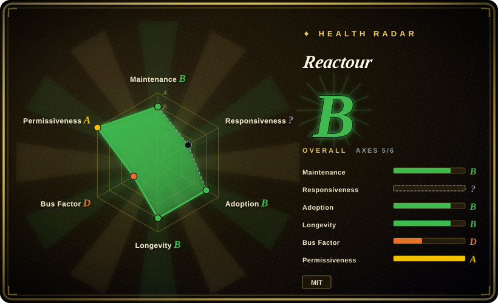
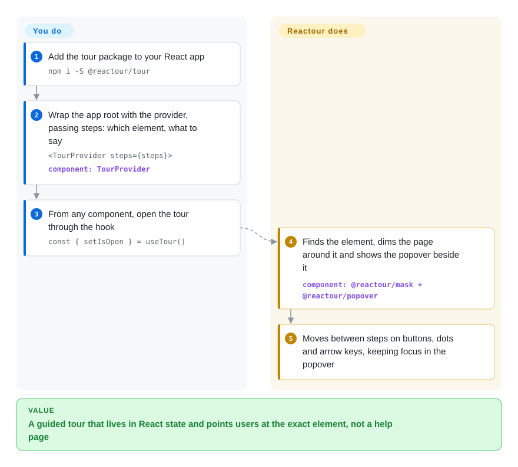

# Reactour

New users land in your React app and never find the button the release was about; a help article does not fix that, pointing at the button does. Reactour wraps your app in a provider that takes a list of "this element, this message" steps, dims everything except one element at a time and shows the message beside it — and any component can start or steer the tour through a hook.

## When to use

You're a frontend engineer on a React admin dashboard, and the last release added bulk editing behind a small toolbar icon. A month later support still gets "how do I edit 50 rows at once?" tickets, and the 2,000-word help page that answers it has a 3% open rate. Product asks for a "Take the tour" item in the help menu that walks through six parts of the screen, one of which only appears after a modal opens. You `npm i -S @reactour/tour`, wrap the app root in `<TourProvider steps={steps}>` with steps like `{ selector: '.bulk-edit', content: 'Select rows, then edit them all here' }`, and in the help-menu component call `const { setIsOpen } = useTour()`. The tour state lives in React context, so the menu, the modal and the page do not need to pass anything to each other; a step's `action` callback can open the modal when the tour arrives there.

Against [react-joyride](react-joyride.md), the other MIT React-only option, the deciding difference is shape rather than features: Reactour is a context provider plus a hook, split into small packages, so you can use `@reactour/mask` or `@reactour/popover` alone for a one-off "look here" highlight without a tour. You accept a slower release cadence for that. Against [Shepherd.js](shepherd-js.md) and [Intro.js](intro-js.md) it is the license-free path for a commercial product; against [Driver.js](driver-js.md) it keeps the tour inside React state instead of an imperative object you keep in sync.

## How it works

Reactour is three small components and one state holder. **It handles the visuals and the step state for you**: when the tour opens, it finds the current step's element by CSS selector (the same `.class` / `#id` syntax as a stylesheet), scrolls it into view, covers the page with an SVG mask (a full-screen dark layer with a transparent hole cut around that element), and positions a popover (a floating card) next to the hole, re-measuring when the window resizes. It moves between steps on Next/Prev clicks, the dot navigation and the arrow and Esc keys, and keeps keyboard focus inside the popover while open. **What stays yours**: writing the step list, keeping those selectors pointing at real elements as the UI changes, deciding when to open the tour (`setIsOpen(true)` from `useTour()`), and remembering whether a user has already seen it — Reactour stores nothing. For content that appears or resizes during a step, you list the selectors to watch in `mutationObservables` / `resizeObservables` so the mask reshapes itself.

<!-- flow-steps:begin (generated from flows/reactour.json by tools/flow_card.py — do not edit) -->

Text version of the flow

1. **You**: Add the tour package to your React app — `npm i -S @reactour/tour`
2. **You**: Wrap the app root with the provider, passing steps: which element, what to say — `<TourProvider steps={steps}>` — component: `TourProvider`
3. **You**: From any component, open the tour through the hook — `const { setIsOpen } = useTour()`
4. **Reactour**: Finds the element, dims the page around it and shows the popover beside it — component: `@reactour/mask + @reactour/popover`
5. **Reactour**: Moves between steps on buttons, dots and arrow keys, keeping focus in the popover

**Value**: A guided tour that lives in React state and points users at the exact element, not a help page

<!-- flow-steps:end -->

## When NOT to use

- **Your app is not React, or mixes frameworks.** Reactour is React-only (peer dependency React 16–19). Use [Driver.js](driver-js.md) for a dependency-free vanilla tour, or [Shepherd.js](shepherd-js.md) if one tour must run across React, Vue and Angular and you can accept its AGPL-3.0/commercial license.
- **You want the more actively released, more widely used React tour.** `@reactour/tour` last published 3.8.0 on 2025-05-07, and the 2026-05 commits (tests, a pnpm migration, one fix) have not shipped to npm yet. [react-joyride](react-joyride.md) shipped v3.0–3.2 during 2026 and has roughly 6.6× the monthly npm downloads, so more answered issues and examples exist for it.
- **You need targeting, "seen it" tracking or analytics.** Reactour persists nothing and knows nothing about users — showing the tour once per account, per plan or after a feature flag is your code. If product managers must author and measure tours without a deploy, a hosted onboarding platform (Appcues, Userflow — not repositories) fits better.
- **You are about to `npm i reactour`.** That is the legacy v1 package, kept on the `v1` branch, which peer-depends on `styled-components` 4/5 and React ≤ 18. It still gets about 290k monthly downloads from old code; for new work install `@reactour/tour` instead.
- **You need org-backed maintenance for a long-lived product.** It is one person's repository (all contributions in the last year are by the author). If that bus factor is unacceptable, Shepherd.js is maintained by a company team — at the cost of its license.

## Comparison

| Alternative | In index | Our verdict | Tradeoff |
|---|---|---|---|
| [react-joyride](react-joyride.md) | ✅ | In a React app, pick react-joyride when you want frequent releases, typed tour events and the larger user base; pick Reactour when you prefer a provider-plus-hook API and reusable mask/popover pieces. | Both MIT and React-only; react-joyride shipped v3.0–v3.2 in 2026 and has about 5.6M monthly downloads, Reactour last published 2025-05 with about 0.85M. |
| [Driver.js](driver-js.md) | ✅ | For a non-React or mixed-framework page, pick Driver.js; stay with Reactour when the tour should live in React context and be opened from any component. | Driver.js is framework-free with zero dependencies but imperative; Reactour depends on React and re-renders with it. |
| [Shepherd.js](shepherd-js.md) | ✅ | Pick Shepherd.js when one tour must span several frameworks and you can license it; in a closed-source React product, Reactour avoids that cost. | Shepherd has framework wrappers and a company team behind it, but commercial use since v14 needs a paid license; Reactour is MIT and single-maintainer. |
| [Intro.js](intro-js.md) | ✅ | Pick Intro.js for a long-standing vanilla API if you are AGPL-compatible or will buy a license; in a commercial React app, Reactour is the free choice. | Intro.js has the most GitHub stars of the group but AGPL-3.0/commercial dual licensing; Reactour is MIT with no purchase. |
| Appcues / Userflow | 非仓库 | Choose a hosted onboarding platform when non-engineers must author, target and measure tours without deploys; choose Reactour when engineers own the tour in code. | Closed SaaS: no-code authoring, segmentation and analytics for a recurring fee and a third-party script in your page. |

## Tech stack

- **Language:** TypeScript, built with `tsup` into ESM + CommonJS bundles with type declarations.
- **Repository layout:** a pnpm monorepo (migrated from Yarn 1 in 2026-05) with `packages/tour`, `packages/mask`, `packages/popover`, `packages/utils`, plus `apps/web` for the docs/demo site.
- **Rendering:** the mask is an SVG overlay with a clipped cut-out; the popover is a positioned element placed beside the highlighted rectangle.
- **Tests:** Vitest suites per package, expanded in 2026-05.

## Dependencies

- **Peer:** `react` 16.x–19.x.
- **Runtime (bundled with `@reactour/tour`):** `@reactour/mask`, `@reactour/popover`, `@reactour/utils`; `utils` pulls in `@rooks/use-mutation-observer` and `resize-observer-polyfill`.
- **No services:** a client-side library — no server, storage or network calls of its own.

## Ops difficulty

**Low.** There is nothing to deploy; it ships inside your frontend bundle. The ongoing cost is in your app: step selectors silently target nothing after someone renames a class, so tours need a smoke test in CI or a manual pass each release; late-mounting or resizing content needs the right `mutationObservables` / `resizeObservables`; and "show once" or per-segment logic needs your own storage. Upgrades are rare and small given the release cadence.

## Health & viability

- **Maintenance (2026-10): B.** Last npm release `@reactour/tour` 3.8.0 on 2025-05-07; the default branch was last touched 2026-05-19 after a burst of test, tooling and bug-fix commits. Alive but bursty, and unreleased work can sit for months. GitHub release tags stopped at 3.0.0 (2022), so watch npm, not the Releases page.
- **Governance: D.** A single maintainer on a personal account: the author has 677 commits, the next contributor 11, and all activity in the last 12 months is theirs. The roadmap is one person's spare time.
- **Longevity: B.** Created 2017-03 (3,492 days, about 9.5 years) and still committed to in 2026 — age and continued activity together give it a reasonable Lindy prior for a small UI library.
- **Adoption: B.** 849,988 npm downloads in the last month for `@reactour/utils`, which every `@reactour/tour` install pulls in (the tour package itself is at about 849k), plus about 290k for the legacy `reactour` package; about 4.1k GitHub stars. Real use, but well behind react-joyride.
- **Risk / license: A.** MIT, no relicensing history. The main risk is the bus factor, not the license.

## Caveats (unverified)

- [未验证] Download counts (about 849k for `@reactour/tour`, 290k for `reactour`, 5.6M for `react-joyride`, 2026-09-05 to 2026-10-04) are from the npm downloads API and include CI and mirror traffic; they indicate scale, not user counts.
- [推断] That the 2026-05 commits are unreleased is inferred from `packages/tour/package.json` still reading 3.8.0 and npm's latest being 3.8.0 (published 2025-05-07); a release may follow at any time.
- [未验证] Focus trapping and keyboard navigation behaviour is taken from the `@reactour/tour` README (`disableFocusLock`, `disableKeyboardNavigation`), not tested in a browser here.
- [未验证] The legacy `reactour` v1 dependency list (`styled-components` 4/5 peer, React ≤ 18) is from npm metadata for 1.19.4; not installed here.
