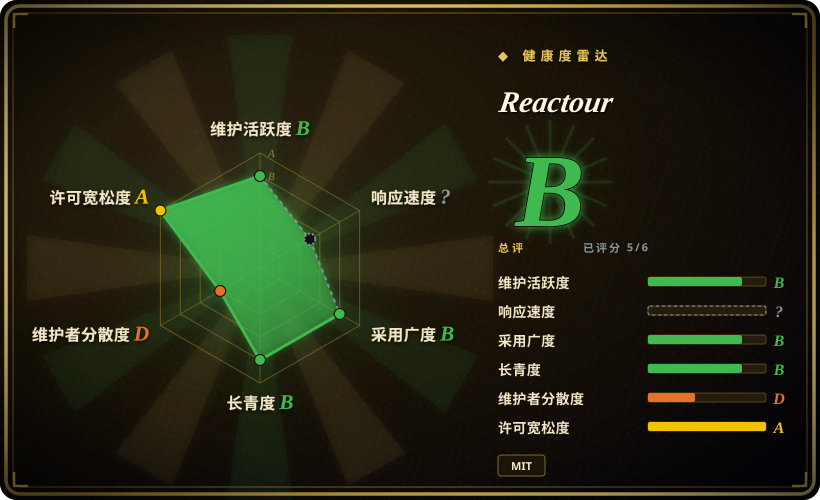
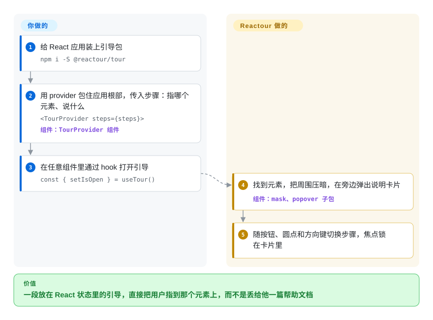

# Reactour

新用户进了你的 React 应用，却怎么也找不到这次版本主打的那个按钮；写帮助文档没用，直接指给他看才有用。Reactour 用一个 provider 包住你的应用，你给它一串“这个元素、这句话”的步骤，它每次只留一个元素亮着、其余全部压暗，并把说明贴在旁边——任何组件都能通过一个 hook 打开或操控这段引导。

## 何时使用

你是一个 React 后台面板的前端工程师，上个版本把批量编辑藏在了工具栏的一个小图标后面。一个月过去，客服还在收“怎么一次改 50 行？”的工单，而回答这个问题的那篇两千字帮助文档打开率只有 3%。产品想在帮助菜单里加一项“跟我走一遍”，带用户看完屏幕上的六个位置，其中一个要等弹窗打开后才出现。你 `npm i -S @reactour/tour`，在应用根部包一层 `<TourProvider steps={steps}>`，步骤写成 `{ selector: '.bulk-edit', content: '先勾选行，再在这里一起改' }` 这样，然后在帮助菜单组件里 `const { setIsOpen } = useTour()`。引导状态放在 React context 里，菜单、弹窗和页面之间不用互相传任何东西；某一步的 `action` 回调可以在引导走到那里时把弹窗打开。

和同为 MIT、只支持 React 的 [react-joyride](react-joyride.zh.md) 相比，决定性差别在形态而不在功能：Reactour 是“一个 context provider 加一个 hook”，并拆成几个小包，所以只想临时高亮一个元素、不需要整段引导时，可以单独用 `@reactour/mask` 或 `@reactour/popover`。代价是发版更慢。和 [Shepherd.js](shepherd-js.zh.md)、[Intro.js](intro-js.zh.md) 相比，它是商业产品里不用买许可证的那条路；和 [Driver.js](driver-js.zh.md) 相比，它让引导留在 React 状态里，而不是一个你要手动保持同步的命令式对象。

## 怎么用起来

Reactour 由三个小组件和一个状态容器组成。**画面和步骤状态它替你管**：引导打开时，它按 CSS 选择器（和样式表里一样的 `.class`、`#id` 写法）找到当前这一步的元素，滚动到可见位置，用一层 SVG 遮罩盖住整页（一张全屏的暗色图层，在该元素周围挖出一个透明的洞），再把一个 popover（浮动卡片）放到洞旁边，窗口尺寸变了就重新测量。点“下一步/上一步”、点圆点导航、按左右方向键或 Esc，它就切换步骤；打开期间键盘焦点被锁在卡片里。**留给你的**：写步骤列表；界面改版时让这些选择器继续指向真实元素；决定什么时候打开引导（用 `useTour()` 拿到的 `setIsOpen(true)`）；记住用户是否已经看过——Reactour 什么都不存。如果某一步里有内容会中途出现或改变尺寸，你要把要盯的选择器写进 `mutationObservables` / `resizeObservables`，遮罩才会跟着重画。

<!-- flow-steps:begin (generated from flows/reactour.json by tools/flow_card.py — do not edit) -->

流程文字版

1. **你**：给 React 应用装上引导包 — `npm i -S @reactour/tour`
2. **你**：用 provider 包住应用根部，传入步骤：指哪个元素、说什么 — `<TourProvider steps={steps}>` — 组件：`TourProvider 组件`
3. **你**：在任意组件里通过 hook 打开引导 — `const { setIsOpen } = useTour()`
4. **Reactour**：找到元素，把周围压暗，在旁边弹出说明卡片 — 组件：`mask、popover 子包`
5. **Reactour**：随按钮、圆点和方向键切换步骤，焦点锁在卡片里

**价值**：一段放在 React 状态里的引导，直接把用户指到那个元素上，而不是丢给他一篇帮助文档

<!-- flow-steps:end -->

## 何时不用

- **你的应用不是 React，或混用多个框架。** Reactour 只支持 React（peer 依赖 React 16–19）。要零依赖的原生引导用 [Driver.js](driver-js.zh.md)；同一段引导要在 React、Vue、Angular 里都能跑、又能接受 AGPL-3.0/商业许可，用 [Shepherd.js](shepherd-js.zh.md)。
- **你想要发版更勤、用户更多的 React 引导库。** `@reactour/tour` 最后一次发布是 2025-05-07 的 3.8.0，2026-05 的那批提交（测试、迁移到 pnpm、一个修复）还没发到 npm。[react-joyride](react-joyride.zh.md) 在 2026 年发了 v3.0–v3.2，月下载量约是它的 6.6 倍，能搜到的已答问题和示例也多得多。
- **你需要人群定向、“看过没有”的记录或数据分析。** Reactour 不存任何东西，也不认识用户——每个账号只弹一次、按套餐弹、按功能开关弹，都得你自己写。如果要让产品经理不发版就能编辑和度量引导，托管的引导平台（Appcues、Userflow，均非仓库）更合适。
- **你正准备 `npm i reactour`。** 那是旧的 v1 包，留在 `v1` 分支上，peer 依赖 `styled-components` 4/5 和 React 18 及以下。旧代码让它每月仍有约 29 万下载；新项目请装 `@reactour/tour`。
- **长期产品需要有组织背书的维护。** 这是一个人的仓库（近一年的贡献全部来自作者本人）。接受不了这种巴士因子，就用由公司团队维护的 Shepherd.js——代价是它的许可证。

## 横向对比

| 替代品 | 是否收录 | 我们的评价 | 取舍 |
|---|---|---|---|
| [react-joyride](react-joyride.zh.md) | ✅ | 在 React 应用里，想要频繁发版、带类型的引导事件和更大的用户群时选 react-joyride；偏好“provider 加 hook”的 API、想复用遮罩和浮层小组件时选 Reactour。 | 两者都是 MIT、只支持 React；react-joyride 在 2026 年发了 v3.0–v3.2，月下载约 560 万，Reactour 最后发布在 2025-05，月下载约 85 万。 |
| [Driver.js](driver-js.zh.md) | ✅ | 页面不是 React 或混用框架时选 Driver.js；希望引导放在 React context 里、任意组件都能打开时，留在 Reactour。 | Driver.js 不依赖任何框架、零依赖，但是命令式的；Reactour 依赖 React，随 React 重渲染。 |
| [Shepherd.js](shepherd-js.zh.md) | ✅ | 一段引导要跨多个框架、且你愿意买许可时选 Shepherd.js；闭源的 React 商业产品里，Reactour 省掉这笔费用。 | Shepherd 有各框架封装，背后是公司团队，但自 v14 起商用要付费许可；Reactour 是 MIT，单人维护。 |
| [Intro.js](intro-js.zh.md) | ✅ | 想要老牌原生 API、且兼容 AGPL 或愿意买许可时选 Intro.js；商业 React 应用里，Reactour 是免费的选择。 | Intro.js 是这组里 GitHub star 最多的，但采用 AGPL-3.0/商业双许可；Reactour 是 MIT，不用购买。 |
| Appcues / Userflow | 非仓库 | 需要非工程师不发版就能编写、定向和度量引导时，选托管引导平台；引导由工程师在代码里维护时，选 Reactour。 | 闭源 SaaS：无代码编辑、人群细分和数据分析，代价是持续付费和页面里多一段第三方脚本。 |

## 技术栈

- **语言：** TypeScript，用 `tsup` 打成 ESM + CommonJS 两种包并附带类型声明。
- **仓库结构：** pnpm monorepo（2026-05 从 Yarn 1 迁过来），含 `packages/tour`、`packages/mask`、`packages/popover`、`packages/utils`，以及文档/演示站 `apps/web`。
- **渲染方式：** 遮罩是一层带裁剪洞口的 SVG；popover 是贴在高亮矩形旁边的定位元素。
- **测试：** 各包都有 Vitest 用例，2026-05 做过一轮扩充。

## 依赖

- **peer 依赖：** `react` 16.x–19.x。
- **运行时（随 `@reactour/tour` 安装）：** `@reactour/mask`、`@reactour/popover`、`@reactour/utils`；其中 `utils` 依赖 `@rooks/use-mutation-observer` 和 `resize-observer-polyfill`。
- **无服务：** 纯前端库——没有服务端、不存数据、自己不发网络请求。

## 运维难度

**低。** 没有东西要部署，它就在你的前端包里。持续成本都在你的应用里：有人改了 class 名，步骤选择器就会悄悄指向空气，所以每次发版都要在 CI 里冒烟测一遍或手动走一遍；会晚挂载或改变尺寸的内容要配好 `mutationObservables` / `resizeObservables`；“只弹一次”或按人群弹的逻辑要自己存状态。按它的发版节奏，升级很少、改动也小。

## 健康度与可持续性

- **维护（2026-10）：B。** npm 上 `@reactour/tour` 最后一次发布是 2025-05-07 的 3.8.0；默认分支最后一次改动在 2026-05-19，之前有一批测试、工具链和修复提交。还活着但是一阵一阵的，没发布的改动可能放好几个月。GitHub 的 release 标签停在 3.0.0（2022），要看 npm，别看 Releases 页面。
- **治理：D。** 个人账号、单一维护者：作者 677 次提交，第二名 11 次，近 12 个月的活动全部是作者本人。路线图取决于一个人的业余时间。
- **长青度：B。** 2017-03 创建（3,492 天，约 9 年半），2026 年仍有提交——年龄加上仍在活动，对一个小型 UI 库来说是不错的 Lindy 先验。
- **采用度：B。** 评分用的 `@reactour/tour` 近一个月下载 849,104 次、有 65 个依赖它的仓库（评分器，2026-10-09），旧的 `reactour` 包另有约 29 万；GitHub 约 4.1k star。有真实用户，但远不及 react-joyride。
- **风险/许可：A。** MIT，没有改许可证的历史。主要风险是巴士因子，不是许可证。

## 存疑（未验证）

- [未验证] 下载量（`@reactour/tour` 约 84.9 万、`reactour` 约 29 万、`react-joyride` 约 560 万，统计区间 2026-09-05 至 2026-10-04）来自 npm 下载量 API，包含 CI 和镜像流量；只说明量级，不等于用户数。
- [推断] “2026-05 的提交尚未发布”依据是 `packages/tour/package.json` 仍写 3.8.0、npm 的 latest 也是 3.8.0（2025-05-07 发布）；随时可能发新版。
- [未验证] 焦点锁定和键盘导航行为取自 `@reactour/tour` 的 README（`disableFocusLock`、`disableKeyboardNavigation`），本次没有在浏览器里实测。
- [未验证] 旧 `reactour` v1 的依赖（peer `styled-components` 4/5、React 18 及以下）取自 npm 上 1.19.4 的元数据，本次没有安装验证。
