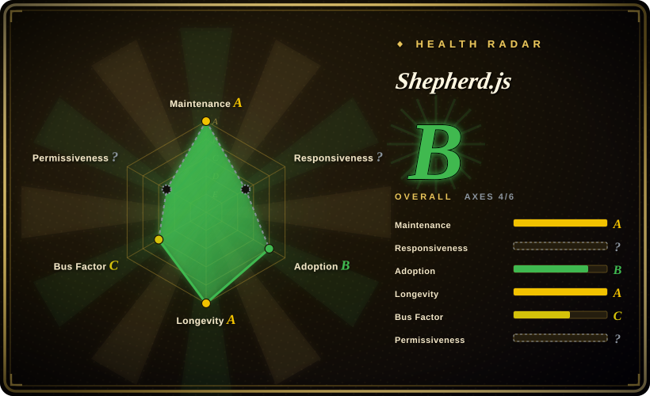
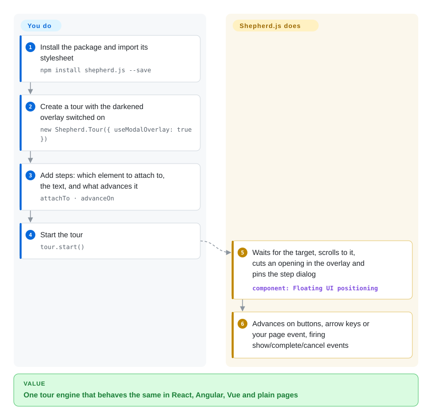

# Shepherd.js

The same onboarding tour has to run in your React app, your Angular admin panel and a plain-HTML marketing page, and every framework-specific tour kit covers only one of them. Shepherd.js is one vanilla-JS tour engine — darken the page, cut a hole around the element, pin a step dialog next to it — with thin wrappers for each framework; note that since 2024 a revenue-generating company needs a paid license to use it.

## When to use

You're a frontend lead at a company whose product is split across stacks: the customer app is React, the admin console is Angular, and the docs site is static HTML. Product wants one consistent walkthrough — "this is the project switcher, click it now", "here is where invoices live" — and wants step 3 to advance only when the user *actually clicks* the "New invoice" button, not when they press Next. You reach for Shepherd.js: `npm install shepherd.js --save`, `new Shepherd.Tour({ useModalOverlay: true })`, then `tour.addStep({ attachTo: { element: '.new-invoice', on: 'bottom' }, advanceOn: { selector: '.new-invoice', event: 'click' } })`. The same tour definition (plain JSON-like objects) runs in all three surfaces through the `react-shepherd`, `angular-shepherd` and `vue-shepherd` wrappers, and `waitForElement` covers targets that render after data loads.

The deciding tradeoff against [Driver.js](driver-js.md) and [react-joyride](react-joyride.md) is richer step semantics plus org-maintained framework wrappers versus licensing: both alternatives are MIT, while Shepherd.js v14+ is AGPL-3.0 for open-source/non-commercial use and requires a purchased commercial license for any revenue-generating company — including internal tools. Choose it when you are an open-source/AGPL project, or when the commercial license is an acceptable line item.

## How it works

Shepherd gives you a `Tour` object; you add steps to it and call `start()`. Each step says which element to attach to (`attachTo` — a selector or element plus a side such as `bottom`), what text and buttons to show, and optionally what page event moves the tour forward (`advanceOn`). When a step is shown, Shepherd optionally waits for the element to appear (`waitForElement`, watching the DOM for changes), scrolls it into view, lays a darkened "modal overlay" over the page with an opening around the target, and places the step dialog next to it using Floating UI (a small library that keeps a popup attached to an element through scrolling and resizing). It handles Next/Back buttons, arrow-key navigation, Esc to exit, and fires events (`show`, `complete`, `cancel`) you can send to your analytics. What stays yours: when and for whom the tour runs, storing whether a user finished it, the step copy and styling (it ships a minimal stylesheet you import), and checking the license before shipping. In React the `react-shepherd` wrapper only exposes the same tour object through context — the engine and its imperative API are identical.

<!-- flow-steps:begin (generated from flows/shepherd-js.json by tools/flow_card.py — do not edit) -->

Text version of the flow

1. **You**: Install the package and import its stylesheet — `npm install shepherd.js --save`
2. **You**: Create a tour with the darkened overlay switched on — `new Shepherd.Tour({ useModalOverlay: true })`
3. **You**: Add steps: which element to attach to, the text, and what advances it — `attachTo · advanceOn`
4. **You**: Start the tour — `tour.start()`
5. **Shepherd.js**: Waits for the target, scrolls to it, cuts an opening in the overlay and pins the step dialog — component: `Floating UI positioning`
6. **Shepherd.js**: Advances on buttons, arrow keys or your page event, firing show/complete/cancel events

**Value**: One tour engine that behaves the same in React, Angular, Vue and plain pages

<!-- flow-steps:end -->

## When NOT to use

- **Your company earns revenue and will not buy a license.** Since v14.0 (2024-09, `LICENSE.md` retrieved 2026-10-08), Shepherd.js is AGPL-3.0 for open-source and non-commercial use, and its license terms require a paid commercial license for commercial products, closed-source use, and even internal dashboards at for-profit companies. If that is a blocker, use [Driver.js](driver-js.md) (MIT, framework-free) or, in a React app, [react-joyride](react-joyride.md) (MIT). Pinning the last MIT release (v13.0.3, 2024-08) is possible but forfeits two years of fixes.
- **You need the smallest bundle for a one-off highlight.** Shepherd depends on `@floating-ui/dom` and `deepmerge-ts`; for a single "look here" spotlight, [Driver.js](driver-js.md) has zero runtime dependencies.
- **Your app is React-only and you want the tour driven by React state.** `react-shepherd` wraps the imperative tour in a context provider; it does not re-render the tour from props. [react-joyride](react-joyride.md) is a React component with a controlled mode and typed events.
- **You need an adoption platform, not a renderer.** There is no segmentation, targeting ("users who haven't done X"), checklists, surveys, or persistence. Shepherd's docs suggest piping its events to your analytics; a hosted platform such as Appcues or Userflow (closed SaaS) does targeting and measurement for non-engineers.
- **You need cross-page tours out of the box.** A tour lives in one page's JavaScript; continuing after a full navigation means saving the step index yourself and restarting the tour on the next page.

## Comparison

| Alternative | In index | Our verdict | Tradeoff |
|---|---|---|---|
| [Driver.js](driver-js.md) | ✅ | For a commercial product that will not buy a tour license, pick Driver.js; pick Shepherd.js when `advanceOn`, `waitForElement` and maintained Angular/Vue/Ember wrappers are worth the license fee. | Driver.js is MIT with zero dependencies but a smaller step model and a single maintainer; Shepherd has richer step options and an org team, paid for with AGPL-or-commercial licensing. |
| [react-joyride](react-joyride.md) | ✅ | In a React-only app, pick react-joyride; pick Shepherd.js only when the same tour must also run outside React. | react-joyride is MIT and re-tracks targets through React state, but is React-only and single-maintainer; Shepherd covers several frameworks through wrappers around one imperative engine. |
| [Intro.js](intro-js.md) | ✅ | Both now need a paid license for commercial use, so choose on API: Intro.js for `data-intro` attributes and its hint mode, Shepherd.js for JS-defined steps with `advanceOn` and Floating UI positioning. | Same AGPL-3.0 + commercial model; Intro.js lets non-JS authors annotate HTML, Shepherd keeps the tour as JavaScript objects and has official framework wrappers. |
| [Reactour](reactour.md) | ✅ | In React with an MIT requirement and a provider-style API, pick Reactour; pick Shepherd.js when you need non-React surfaces and accept its license. | Reactour is MIT and React-only with a slower release cadence; Shepherd is multi-framework and actively released but dual-licensed. |
| Appcues / Userflow | 非仓库 | Choose a hosted onboarding platform when product managers must author, target and measure tours without a deploy; choose Shepherd.js when engineers own tours in code. | Closed SaaS products, not repositories: no-code authoring, segmentation and analytics for a recurring fee and a third-party script. |

## Tech stack

- **Language:** core in JavaScript/TypeScript (`shepherd.js/` directory), React wrapper in TypeScript (`packages/react`), docs site in Astro/Starlight (`docs-src/`); pnpm monorepo.
- **Positioning:** `@floating-ui/dom` (per-step `floatingUIOptions` passthrough).
- **Rendering:** DOM step dialogs plus an SVG modal overlay with an opening around the target; minimal stylesheet at `shepherd.js/dist/css/shepherd.css`.
- **API:** imperative `Shepherd.Tour` with `addStep`, `start`, `next`, `back`, `cancel`, `complete`; step options include `attachTo`, `advanceOn`, `beforeShowPromise`, `showOn`, `waitForElement`, `skipMissingElement`.
- **Wrappers:** `react-shepherd` (in-repo, v7.0.6), `angular-shepherd`, `vue-shepherd` (separate repos under the same org), `ember-shepherd` (maintainer's personal repo).

## Dependencies

- **Runtime npm deps (v15.3.0):** `@floating-ui/dom` and `deepmerge-ts`.
- **React wrapper:** `react`/`react-dom` 18 or 19 as peers.
- **No services:** client-side only — no backend, datastore or network calls from the library.
- **Browsers:** README lists the last two versions of Edge, Firefox, Chrome and Safari.
- **License as a dependency:** a commercial license purchased from shepherdjs.dev for any revenue-generating use; the React wrapper does not exempt you.

## Ops difficulty

**Low technically, medium administratively.** Nothing to deploy — the JS and CSS ship in your bundle. Ongoing work is keeping `attachTo` selectors valid as the UI changes and handling late-mounting targets (`waitForElement` / `beforeShowPromise`). The non-code cost is license compliance: someone must decide whether your use is commercial, buy and track the license, and make sure every app that bundles it is covered.

## Health & viability

- **Maintenance (2026-10):** very active — commits most weeks (fixes to overlay clipping landed 2026-10-07), core v15.3.0 on npm (2026-08-24), React wrapper v7.0.6. Not archived.
- **Responsiveness:** not scored in this re-score — the scorer found no qualifying issue window (it was scored in 2026-09), so the overall grade rests on four scored axes.
- **Governance / bus factor:** owned by Ship Shape, a small consultancy; one maintainer accounts for ~70% of recent commits and the top three for ~95% (governance C). Commercial-license revenue now funds it, which ties the roadmap to one company's business.
- **Age / Lindy:** created 2013-12 — about 13 years old and still releasing, a strong Lindy prior.
- **Adoption:** 1,340,549 npm downloads in the last month (scorer snapshot, 2026-10-08); README lists Drupal core's Tour module and Logseq among users.
- **Risk flags:** relicensed MIT → AGPL-3.0 with a paid commercial tier in 2024-09 (v14); the license terms reach internal tools at for-profit companies. Forks of v13.0.3 remain MIT, but none is indexed here.

## Caveats (unverified)

- [未验证] Commercial license pricing and terms on shepherdjs.dev/pricing were not read; only the repository `LICENSE.md` and docs license page were.
- [未验证] npm lists `react-shepherd` 7.0.6 as AGPL-3.0, while the docs license page calls the wrapper MIT but bound by the core's AGPL; treat the wrapper as AGPL until upstream reconciles them.
- [未验证] Drupal and Logseq usage is the README's claim; not checked against those projects' current code.
- [推断] Cross-page tours need your own persistence — inferred from the absence of any cross-page option in the usage docs.
- [推断] The `@shepherdpro/pro-js` releases (2024-07/08) point to a former hosted "Shepherd Pro" offering; it is no longer in the repo and its status was not checked.
- [未验证] Whether a maintained MIT fork of v13 exists was not checked.
