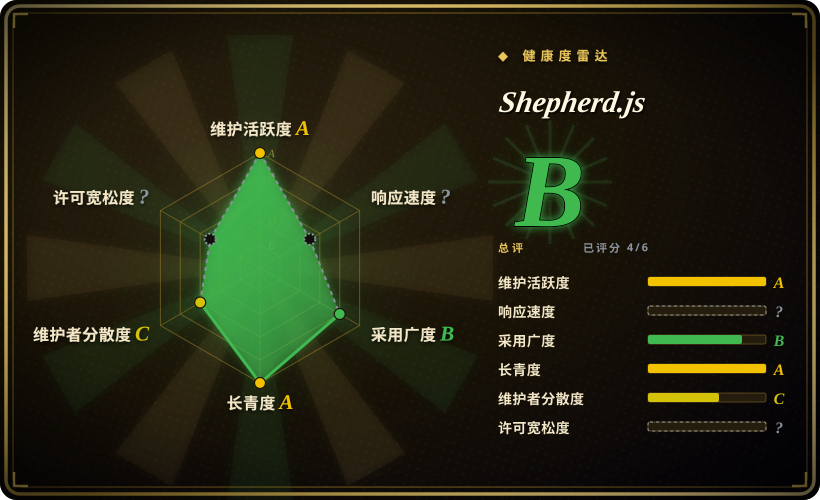
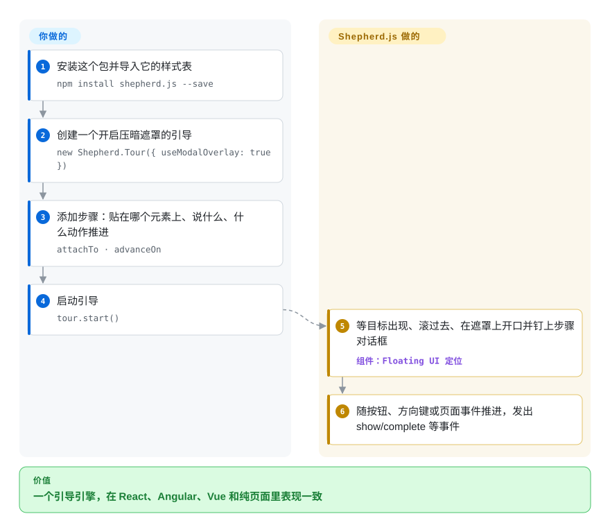

# Shepherd.js

同一套新手引导要同时跑在你的 React 应用、Angular 管理后台和一个纯 HTML 营销页上，而各框架专用的引导组件每个只覆盖其中一处。Shepherd.js 是一个原生 JS 引导引擎——压暗页面、在目标元素周围挖一个洞、把步骤对话框钉在旁边——再给各框架包一层薄封装；但要注意，自 2024 年起，有营收的公司使用它需要购买付费许可。

## 何时使用

你是一家公司的前端负责人，产品分散在几套技术栈上：客户端应用是 React，管理控制台是 Angular，文档站是静态 HTML。产品要一套一致的引导——“这是项目切换器，现在点一下它”“发票在这里”——并且要求第 3 步只有在用户*真的点了*“新建发票”按钮之后才前进，而不是点 Next 就过。于是你选 Shepherd.js：`npm install shepherd.js --save`，`new Shepherd.Tour({ useModalOverlay: true })`，然后 `tour.addStep({ attachTo: { element: '.new-invoice', on: 'bottom' }, advanceOn: { selector: '.new-invoice', event: 'click' } })`。同一份引导定义（普通的类 JSON 对象）通过 `react-shepherd`、`angular-shepherd`、`vue-shepherd` 三个封装跑在三个界面里；数据加载完才渲染的目标，用 `waitForElement` 等它出现。

和 [Driver.js](driver-js.zh.md)、[react-joyride](react-joyride.zh.md) 相比，决定性的取舍是“更丰富的步骤语义加上由公司维护的各框架封装”对“许可成本”：那两个都是 MIT，而 Shepherd.js v14 起对开源/非商业使用是 AGPL-3.0，任何有营收的公司（包括内部工具）都要购买商业许可。你的项目本身开源且兼容 AGPL，或者商业许可费可以接受时，才选它。

## 怎么用起来

Shepherd 给你一个 `Tour` 对象：往里加步骤，再调用 `start()`。每个步骤说明要贴在哪个元素上（`attachTo`——选择器或元素，加上 `bottom` 这类方位）、显示什么文字和按钮，以及可选地由哪个页面事件推动引导前进（`advanceOn`）。显示某一步时，Shepherd 可以先等元素出现（`waitForElement`，监听 DOM 变化），把它滚进视口，在页面上盖一层压暗的“模态遮罩”并在目标周围留出开口，再用 Floating UI（一个让弹出层在滚动、缩放时始终贴着某个元素的小库）把步骤对话框放到目标旁边。它处理上一步/下一步按钮、方向键导航、Esc 退出，并发出事件（`show`、`complete`、`cancel`），你可以把这些事件接到自己的数据分析里。留给你的是：什么时候给谁跑引导、记录用户是否看完、步骤文案和样式（它自带一份极简样式表供你导入），以及上线前确认许可。在 React 里，`react-shepherd` 只是通过 context 把同一个引导对象交给组件——底下的引擎和命令式 API 完全一样。

<!-- flow-steps:begin (generated from flows/shepherd-js.json by tools/flow_card.py — do not edit) -->

流程文字版

1. **你**：安装这个包并导入它的样式表 — `npm install shepherd.js --save`
2. **你**：创建一个开启压暗遮罩的引导 — `new Shepherd.Tour({ useModalOverlay: true })`
3. **你**：添加步骤：贴在哪个元素上、说什么、什么动作推进 — `attachTo · advanceOn`
4. **你**：启动引导 — `tour.start()`
5. **Shepherd.js**：等目标出现、滚过去、在遮罩上开口并钉上步骤对话框 — 组件：`Floating UI 定位`
6. **Shepherd.js**：随按钮、方向键或页面事件推进，发出 show/complete 等事件

**价值**：一个引导引擎，在 React、Angular、Vue 和纯页面里表现一致

<!-- flow-steps:end -->

## 何时不用

- **你的公司有营收，又不打算买许可。** 自 v14.0（2024-09，`LICENSE.md` 于 2026-10-08 读取）起，Shepherd.js 对开源和非商业使用是 AGPL-3.0；按其许可条款，商业产品、闭源使用，乃至营利公司的内部看板，都需要付费商业许可。如果这是硬约束，改用 [Driver.js](driver-js.zh.md)（MIT，不绑框架）；React 应用改用 [react-joyride](react-joyride.zh.md)（MIT）。锁定最后一个 MIT 版本（v13.0.3，2024-08）也行，但会放弃这两年的修复。
- **你只想为一次性高亮付出最小体积。** Shepherd 依赖 `@floating-ui/dom` 和 `deepmerge-ts`；只是“看这里”的单点聚光，[Driver.js](driver-js.zh.md) 运行时零依赖。
- **你的应用只有 React，并希望引导由 React 状态驱动。** `react-shepherd` 只是把命令式的引导对象放进 context provider，不会根据 props 重新渲染引导。[react-joyride](react-joyride.zh.md) 本身就是 React 组件，有受控模式和带类型的事件。
- **你要的是产品采纳平台，不是渲染器。** 它没有用户分群、定向投放（“没做过 X 的用户”）、任务清单、问卷，也不做持久化。Shepherd 的文档建议你把它的事件转发给自己的分析工具；如果要让非工程师来定向和度量，托管平台如 Appcues、Userflow（闭源 SaaS）更合适。
- **你需要开箱即用的跨页面引导。** 一个引导活在一个页面的 JavaScript 里；整页跳转之后要接着走，就得你自己保存步骤序号，在下一页重新启动引导。

## 横向对比

| 替代品 | 是否收录 | 我们的评价 | 取舍 |
|---|---|---|---|
| [Driver.js](driver-js.zh.md) | 已收录 | 商业产品又不打算为引导库买许可时，选 Driver.js；当 `advanceOn`、`waitForElement` 和有人维护的 Angular/Vue/Ember 封装值得这笔许可费时，选 Shepherd.js。 | Driver.js 是 MIT、零依赖，但步骤模型更简单、只有一位维护者；Shepherd 步骤选项更丰富、背后是公司团队，代价是 AGPL 或商业许可。 |
| [react-joyride](react-joyride.zh.md) | 已收录 | 纯 React 应用选 react-joyride；只有同一套引导还要跑在 React 之外时才选 Shepherd.js。 | react-joyride 是 MIT，通过 React 状态重新跟踪目标，但只支持 React、只有一位维护者；Shepherd 用围绕同一个命令式引擎的封装覆盖多个框架。 |
| [Intro.js](intro-js.zh.md) | 已收录 | 两者现在商业使用都要付费许可，所以按 API 来选：想用 `data-intro` 属性和提示（hint）模式选 Intro.js；想用 JS 定义步骤、`advanceOn` 和 Floating UI 定位选 Shepherd.js。 | 同样是 AGPL-3.0 + 商业许可；Intro.js 让不写 JS 的人直接在 HTML 上标注，Shepherd 把引导保持为 JavaScript 对象，并有官方框架封装。 |
| [Reactour](reactour.zh.md) | 已收录 | 在 React 里、要求 MIT、喜欢 provider 式 API，选 Reactour；需要覆盖非 React 界面并接受许可时，选 Shepherd.js。 | Reactour 是 MIT、只支持 React，发版更慢；Shepherd 多框架、发版活跃，但是双许可。 |
| Appcues / Userflow | 非仓库 | 产品经理需要不发版就能编写、定向和度量引导时，选托管引导平台；引导由工程师在代码里维护时，选 Shepherd.js。 | 闭源 SaaS 产品，不是仓库：用持续订阅费和一段第三方脚本，换来无代码编辑、用户分群和分析。 |

## 技术栈

- **语言：** 核心在 `shepherd.js/` 目录，JavaScript/TypeScript；React 封装在 `packages/react`，TypeScript；文档站用 Astro/Starlight（`docs-src/`）；pnpm monorepo。
- **定位：** `@floating-ui/dom`（每一步可通过 `floatingUIOptions` 透传参数）。
- **渲染：** DOM 步骤对话框，加一层在目标周围留开口的 SVG 模态遮罩；极简样式表在 `shepherd.js/dist/css/shepherd.css`。
- **API：** 命令式的 `Shepherd.Tour`，提供 `addStep`、`start`、`next`、`back`、`cancel`、`complete`；步骤选项包括 `attachTo`、`advanceOn`、`beforeShowPromise`、`showOn`、`waitForElement`、`skipMissingElement`。
- **封装：** `react-shepherd`（仓库内，v7.0.6）、`angular-shepherd`、`vue-shepherd`（同组织下的独立仓库）、`ember-shepherd`（维护者个人仓库）。

## 依赖

- **运行时 npm 依赖（v15.3.0）：** `@floating-ui/dom` 和 `deepmerge-ts`。
- **React 封装：** peer 依赖 `react`/`react-dom` 18 或 19。
- **无外部服务：** 纯客户端，库本身没有后端、数据存储或网络请求。
- **浏览器：** README 列出 Edge、Firefox、Chrome、Safari 的最近两个版本。
- **许可也是一种依赖：** 任何有营收的使用都要从 shepherdjs.dev 购买商业许可；用 React 封装也不能豁免。

## 运维难度

**技术上低，管理上中等。** 没有东西要部署——JS 和 CSS 打进你的产物即可。日常工作是 UI 改动时保持 `attachTo` 选择器有效，以及处理晚挂载的目标（`waitForElement` / `beforeShowPromise`）。不写代码的成本在许可合规：得有人判断你的用法算不算商业用途、购买并跟踪许可，并确认每个打包了它的应用都在许可覆盖范围内。

## 健康度与可持续性

- **维护（2026-10）：** 非常活跃——几乎每周都有提交（2026-10-07 刚合入遮罩裁剪的修复），核心包 npm 上是 v15.3.0（2026-08-24），React 封装是 v7.0.6。未归档。
- **响应速度：** 本次重算没有打分——评分器找不到符合条件的 issue 窗口（2026-09 时该轴还有评分），所以整体评级只建立在四个已打分的轴上。
- **治理 / 总线因子：** 归小型咨询公司 Ship Shape 所有；近期约 70% 的提交来自一位维护者，前三位合计约 95%（治理轴 C）。现在由商业许可收入供养，路线图和这一家公司的生意绑在一起。
- **年龄 / Lindy：** 2013-12 创建，约 13 年，仍在发版，Lindy 先验很强。
- **采纳度：** 近一个月 npm 下载 1,340,549 次（评分器快照，2026-10-08）；README 列出 Drupal 核心的 Tour 模块和 Logseq 等使用者。
- **风险信号：** 2024-09（v14）从 MIT 改为 AGPL-3.0 加付费商业许可；许可条款连营利公司的内部工具都覆盖。v13.0.3 的 fork 仍是 MIT，但本索引没有收录任何一个。

## 存疑（未验证）

- [未验证] 没有读 shepherdjs.dev/pricing 上的商业许可价格和条款，只读了仓库的 `LICENSE.md` 和文档里的许可页。
- [未验证] npm 上 `react-shepherd` 7.0.6 标注为 AGPL-3.0，而文档许可页说封装本身是 MIT、但受核心 AGPL 约束；在上游统一说法之前，按 AGPL 对待这个封装。
- [未验证] Drupal 和 Logseq 在用是 README 的说法，没有对照这些项目当前的代码核实。
- [推断] 跨页面引导需要自己做持久化——依据是使用文档里没有任何跨页面选项。
- [推断] `@shepherdpro/pro-js` 的发布记录（2024-07/08）说明曾有一个托管的“Shepherd Pro”产品；它已不在仓库里，现状没有核查。
- [未验证] 没有核查是否存在仍在维护的 v13 MIT fork。
