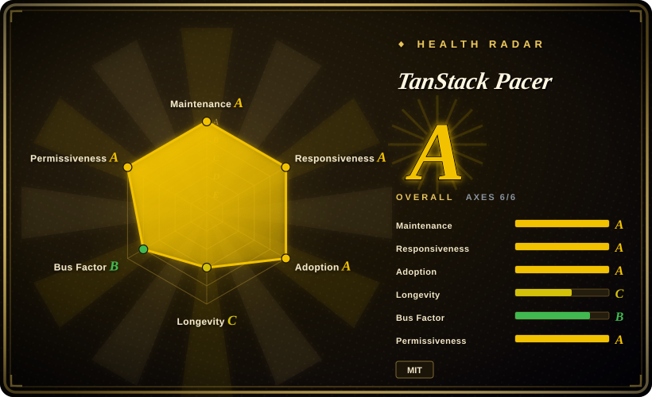
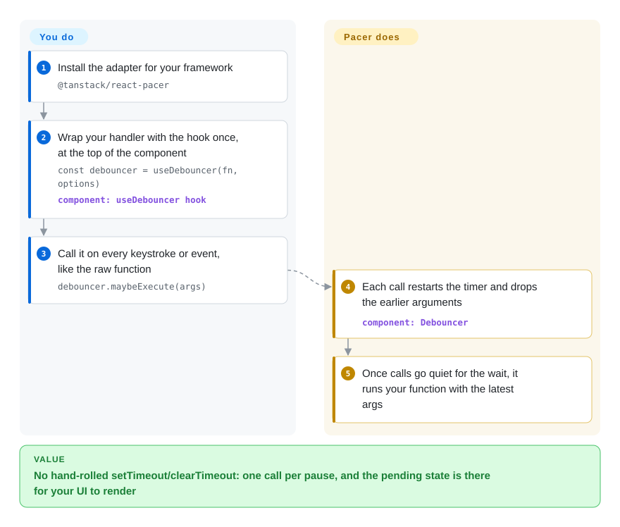

# TanStack Pacer

You type six characters in a search box and the suggestions endpoint is hit six times; your scroll handler runs sixty times a second; a retry loop hammers an API that is already down. TanStack Pacer puts a controller between the event and your function — debounce, throttle, rate-limit, queue or batch — so the call fires when you decide, with typed arguments and pending state your UI can render.

## When to use

You are a React or TypeScript front-end engineer whose app is full of hand-rolled timing: a search input wrapped in a `useEffect` with a `setTimeout`/`clearTimeout` pair you re-create at every call site, an autosave that sometimes fires with the *previous* keystrokes because the closure went stale, a scroll listener that floods analytics even though you only need one update per frame. `lodash.debounce` fixes the timer, but it silently drops your Promise (it returns the debounced function's result, not the async one's), keeps its knobs in untyped options, and exposes nothing about whether a call is still pending — so "Saving…" and the cancel-on-unmount wiring stay your bug.

Reach for Pacer when the timing wrapper itself should be part of the app: `useDebouncer(fn, options)` returns an instance you feed every event (`debouncer.maybeExecute(args)`), it cleans up with the component lifecycle, its state (pending, execution counts) lives in a store you can subscribe to, and you get `cancel()`/`flush()` plus `leading`/`trailing`/`enabled` controls. Pick it over **lodash.debounce** when you need the async variants — the `Async*` classes await your Promise and add retry with backoff and abort-signal support — and over **bottleneck/p-queue** when what you are pacing is UI events in the browser with renderable state, not job throughput in Node. The same five patterns share one API shape across sync/async and four framework adapters, which is the deciding property versus collecting four unrelated micro-libraries.

## How it works

Each utility is a class that wraps your function — `Debouncer`, `Throttler`, `RateLimiter`, `Queuer`, `Batcher`, each with an `Async*` twin — plus a function-style form (`debounce(fn, options)`) and per-framework hooks around them. You do the ordinary part: call the wrapper wherever the event fires, exactly as you'd call the original function. The wrapper does the scheduling part: a debouncer restarts its timer on every call and runs only the latest arguments once activity stops; a throttler keeps a steady pace; a rate limiter accepts calls until a fixed- or sliding-window quota runs out and then rejects; a queuer buffers calls FIFO/LIFO/priority and runs them with your concurrency and expiry settings; a batcher flushes when size, time or a custom condition trips. The bet that separates Pacer from a timer one-liner is observability: every instance keeps its state in TanStack Store (the framework's small reactive signal store), so `isPending` and similar can re-render a component, and the adapter hooks bind that subscription plus cleanup to the component lifecycle. The async variants await your Promise internally through `AsyncRetryer`, which adds retry, abort signals and error/settled callbacks; passing an async function to a *sync* utility does none of that (it is called and ignored). Think of it as a dispatcher with a clipboard rather than a bare `setTimeout`: you can ask who is waiting, force everyone through now (`flush()`), or clear the line (`cancel()`). Runtime dependencies are just `@tanstack/store` and a devtools event client; `@tanstack/pacer-lite` ships the same five utilities with reactivity, adapters and devtools removed for libraries that count every kilobyte.

<!-- flow-steps:begin (generated from flows/tanstack-pacer.json by tools/flow_card.py — do not edit) -->

Text version of the flow

1. **You**: Install the adapter for your framework — `@tanstack/react-pacer`
2. **You**: Wrap your handler with the hook once, at the top of the component — `const debouncer = useDebouncer(fn, options)` — component: `useDebouncer hook`
3. **You**: Call it on every keystroke or event, like the raw function — `debouncer.maybeExecute(args)`
4. **TanStack Pacer**: Each call restarts the timer and drops the earlier arguments — component: `Debouncer`
5. **TanStack Pacer**: Once calls go quiet for the wait, it runs your function with the latest args

**Value**: No hand-rolled setTimeout/clearTimeout: one call per pause, and the pending state is there for your UI to render

<!-- flow-steps:end -->

## When NOT to use

- **If the quota you must enforce protects a server from *all* clients, use backend middleware (`express-rate-limit`) or a Redis-backed counter (`rate-limiter-flexible`) instead of Pacer, because** a client-side limiter only disciplines one browser tab and its state disappears with the user; the project calls itself "mostly a client-side library today" and its `docs/guides/server-rate-limiting.md` was still an empty stub when checked on 2026-09-28.
- **If you need exactly one plain debounce/throttle in untyped JS and nothing else, keep using `lodash.debounce`/`throttle-debounce` instead of Pacer, because** those APIs are frozen and battle-tested, while Pacer is 0.x beta and its overview says "API is still subject to change" — you would adopt a whole store/reactivity model for a timer you already have.
- **If you are coordinating job throughput in Node across workers and processes, use `bottleneck` (it supports distributed/clustering settings) or `p-queue` instead of Pacer, because** Pacer's concurrency and queues are per-instance in-memory — `AsyncQueuer` parallelizes inside one process, not across a fleet.
- **If you are on Vue or Svelte, use `@vueuse/core` (`useDebounceFn`, `useIntervalFn`, …) or Svelte actions instead of Pacer, because** those adapters do not exist yet — the README lists Vue Pacer and Svelte Pacer as "needs a contributor!" (checked 2026-09-28).
- **If you are publishing a byte-conscious npm library, do not take the full core, use its own `@tanstack/pacer-lite` (or a hand-rolled timer) instead, because** the core pulls TanStack Store plus a devtools event client and the reactivity layer Lite exists to avoid.
- **If the queued work must survive a reload or move to the background, a browser queue is the wrong layer — use a real job system ([task-queue](../../task-queue/INDEX.md)) behind an API, because** persistence to local/session storage is documented only for some utilities [未验证] (the claim is README/overview prose; no implementation was read), and nothing ships that survives the tab.

## Comparison

| Alternative | In index | Our verdict | Tradeoff |
| --- | --- | --- | --- |
| lodash.debounce/throttle (`lodash/lodash`) | not indexed | For a single frozen one-liner in untyped code, pick lodash; pick Pacer when you need typed args, async await/retry/abort, and pending state to render. | lodash is mature and tiny per-method; you give up all statefulness and its sync form ignores Promises. Not added in this tab-intake batch. |
| throttle-debounce (`niksy/throttle-debounce`) | not indexed | Pick it when "debounce + throttle, zero deps, tree-shakeable" is the whole requirement; pick Pacer when rate limits, queues and batching must join the same API. | Smallest surface and stable; no async handling, no reactive state, no framework lifecycle hooks. Not added in this tab-intake batch. |
| bottleneck (`SGrondin/bottleneck`) | not indexed | For Node job throughput with priorities, reservoirs and multi-process clustering, pick bottleneck; pick Pacer for in-browser call pacing with UI state. | Distributed-grade job control without a UI model; you build any pending-state rendering and framework integration yourself. Not added in this tab-intake batch. |
| p-queue (`sindresorhus/p-queue`) | not indexed | Pick p-queue when you just need a Promise queue with concurrency/rate-limit options in a script or service; pick Pacer when the same five patterns should also drive React/Solid/Angular components. | Dependency-light and batteries-included for queuing; async-only, no debounce/throttle classes, nothing reactive. Not added in this tab-intake batch. |
| VueUse (`vueuse/vueuse`) | not indexed | On Vue 3, VueUse's `useDebounceFn`/`useThrottleFn`/`useRetry` cover most Pacer hooks natively; pick Pacer only if you also run React/Solid/Preact/Angular and want one API across them. | Huge curated composable set beyond timing; timing coverage is React-less, and patterns like persistent queues live outside it. Not added in this tab-intake batch. |

Pacer sits inside the TanStack ecosystem rather than beside it: the core uses **TanStack Store** for its state and ships a plugin for the **TanStack Devtools** panel — both are companions, not substitutes. Its utilities were extracted from TanStack Query, Router and Form internals plus Tanner Linsley's older [Swimmer](https://github.com/tannerlinsley/swimmer) library, which is the origin story for why the API feels like the rest of TanStack.

## Tech stack

- **TypeScript monorepo** — pnpm workspaces + Nx, Vitest for tests, changesets for per-package versioning (`nx.json`, `vitest.workspace.js`, `.changeset/`, read 2026-09-28).
- **Packages** — core `@tanstack/pacer` v0.22.0, adapters `@tanstack/react-pacer` / `preact-pacer` / `solid-pacer` / `angular-pacer` (each re-exports the core), `@tanstack/pacer-lite` v0.2.2 with no dependencies, and per-adapter `-devtools` plugins.
- **Core runtime deps** — `@tanstack/store ^0.11.1` and `@tanstack/devtools-event-client ^0.5.0`; `react-pacer` adds `@tanstack/react-store` and peers `react/react-dom >=16.8` (read from `packages/*/package.json`).
- **Build targets** — ESM-only, ES2022, Node ≥20 when run in Node.js (docs/installation.md, 2026-09-28); `sideEffects: false` for tree-shaking, with per-utility deep imports.
- **API shapes** — instance classes (`Debouncer`… `AsyncBatcher`, eleven classes in docs/reference/classes), plain functions (`debounce`), option helpers (`debouncerOptions`), framework hooks (`useDebouncer`, `useDebouncedCallback`, `useQueuedState`), and a `PacerProvider` for app-wide defaults (docs/quick-start.md).

## Dependencies

- **Nothing to run:** no database, broker, daemon or hosted service — pure in-process timers and an in-memory store.
- **You bring** the framework peer (React ≥16.8, Solid, Preact, Angular) or just an ES2022 browser/Node ≥20 runtime for the core.
- Optional storage persistence (claimed for rate limiting/queuing) uses the browser's own `localStorage`/`sessionStorage` — no server component.

## Ops difficulty

**Low.** It is an npm dependency in your bundle; there is no deploy, no migration, no background process. The costs are conceptual and upgrade-side: five patterns × sync/async variants and three hook API layers (instance / callback / value-state) take a reading pass through the "Which Pacer Utility Should I Choose?" guide before team-wide use; and because the library is 0.x beta with per-package versions that move independently (`pacer` 0.22.0 vs `react-pacer` 0.23.0), upgrades are pinned-per-package work, not one lockstep bump.

## Health & viability

- **Maintenance (verified 2026-09-28).** Active but decelerating: last push 2026-09-27, 6 commits in the trailing 30 days; 183 GitHub releases with clusters in 2026-03/04/05/08 and none since 2026-08-07. The September work is a build/release modernization (commit `d01174b`, PR #267, landed 2026-09-27), so the release gap plausibly reflects tooling transition rather than abandonment [推断 — inferred from PR titles and dates; no maintainer statement found].
- **Governance / bus factor.** Owned by the TanStack GitHub organization with `.github/CODEOWNERS` routing infra paths to `@TanStack/tanstack-core`; top human contributor KevinVandy (156 commits) with several other named contributors — a team project, not one maintainer's repo.
- **Backing & longevity.** Created 2025-03 (~18 months old) — too young for a Lindy signal on its own. Mitigating: the need is ancient (debounce predates React), the code was extracted from TanStack Query/Router/Form internals, and TanStack's flagship libraries are durable backers; funding runs on GitHub Sponsors plus README partners (Cloudflare, CodeRabbit, Unkey). [推断] The bet is on the TanStack brand, not on demonstrated longevity of this repo.
- **Adoption & ecosystem.** npm last-month downloads for 2026-08-29..09-27: `@tanstack/pacer` 4.11M, `@tanstack/react-pacer` 1.97M, `@tanstack/pacer-lite` 12.87M — against only 777 GitHub stars. The health scorer canonicalized `@tanstack/pacer-lite` and measured 11,746,988 downloads in its window (an earlier snapshot of the same trailing month). [推断] Registry downloads count CI installs and every transitive pull (adapters depend on the core), so they overstate direct human usage; the lite-vs-core gap suggests library-side uptake, but nothing in the repo confirms who depends on it.
- **Risk flags.** MIT from day one (`Copyright (c) 2025 Tanner Linsley`) — no relicense history, no CLA. Beta 0.x means intentional breaking changes; Vue/Svelte adapters are still "needs a contributor"; the server-side story is aspirational (the server-rate-limiting guide page is an empty stub as checked 2026-09-28).

## Caveats (unverified)

- [未验证] Storage persistence to local/session storage for rate-limit/queue utilities is taken from README/overview prose; the implementation was not read and no test was run.
- [未验证] The comparison cells (lodash, throttle-debounce, bottleneck, p-queue, VueUse) rest on those projects' GitHub descriptions plus general knowledge; their repositories were not read in this batch, so feature claims about them are second-hand.
- [未验证] That the sync utilities do not await Promises is the docs' own claim (`which-pacer-utility-should-i-choose` guide), not reproduced here.
- [未验证] Bundle-size claims (tree-shaking, Lite being smaller) were not measured; only `sideEffects: false` in package manifests was read.
- [推断] The post-2026-08 release gap being tooling-related is inferred from the #267 "modernize builds, releases" PR title and dates.
- [推断] The downloads-vs-stars divergence is attributed to CI/transitive installs; npm gives no per-consumer breakdown to prove it.
