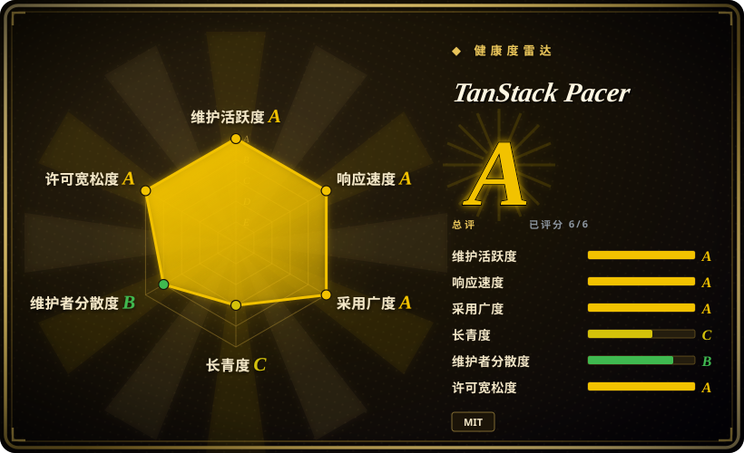
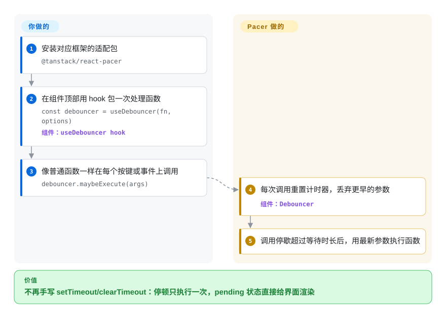

# TanStack Pacer

搜索框里敲六个字符，联想接口就被打六次；滚动处理器每秒跑六十遍；重试循环对着已经宕着的 API 一脚接一脚地踹。TanStack Pacer 在事件和你的函数之间放一个调度者——防抖、节流、限流、排队、批处理——调用什么时候真正执行由你定的规则说了算，参数错了编译期就报错，等待中的状态还能直接渲染进界面。

## 何时使用

你是做 React／TypeScript 前端的，应用里到处是手写的计时套路：搜索框裹在 `useEffect` 里配一对 `setTimeout`／`clearTimeout`，每个调用点重抄一遍；自动保存有时带着*上一轮*的按键就发出去了，因为闭包过期了；滚动监听把埋点冲爆，而你一帧只需要一条。`lodash.debounce` 能修好计时器，但它会悄悄吞掉你返回的 Promise（防抖函数返回的不是异步调用的结果），配置项没有任何类型约束，也完全不告诉你此刻是否还有一次执行在排队——于是“保存中…”的提示和卸载时取消的胶水活还是你的 bug。

当“包一层计时”本身应该成为应用的一部分时，就该想到 Pacer：`useDebouncer(fn, options)` 返回一个实例，每个事件都喂给它（`debouncer.maybeExecute(args)`），它随组件生命周期自动清理；它的状态（是否有执行在等、已执行次数）存在可订阅的 store 里；还自带 `cancel()`／`flush()` 和 `leading`／`trailing`／`enabled` 开关。相比 **lodash.debounce**，你要的是异步变体——`Async*` 类会 await 你的 Promise，并附带退避重试和 AbortSignal 取消；相比 **bottleneck／p-queue**，你节流的是浏览器里的 UI 事件、还要把等待状态渲染出来，而不是 Node 里的作业吞吐。五种模式在同步／异步和四个框架适配层之间共用同一套 API 形状——这一点决定了它是收编四五个互不相干的微库，还是装一个库。

## 怎么用起来

每个工具都是一个包住你函数的类——`Debouncer`、`Throttler`、`RateLimiter`、`Queuer`、`Batcher`，各配一个 `Async*` 分身——外加函数形态（`debounce(fn, options)`）和按框架的 hooks。你只做寻常的那半：事件在哪触发就在哪调用包装器，像调原函数一样。调度是它做的：防抖每次调用重置计时器，只拿最新参数在“安静下来”后跑一次；节流按固定节奏放行；限流在固定或滑动窗口配额用尽前放行、用尽后拒绝；排队按 FIFO／LIFO／优先级缓冲，按你设的并发和过期规则逐个执行；批处理凑满数量、时间或自定义条件才一次性发货。Pacer 区别于一行计时器的押注是可观察性：每个实例把状态存在 TanStack Store（TanStack 那个小型响应式信号 store）里，所以 `isPending` 这类值能让组件重渲染，适配层 hooks 再把订阅和清理绑进组件生命周期。异步变体内部经 `AsyncRetryer` 去 await 你的 Promise，因此附带重试、AbortSignal 和 error／settled 回调；把异步函数交给*同步*工具则完全没有这些（函数照调，Promise 没人管）。可以把它想成一个拿着登记簿的调度员，而不是光一根 `setTimeout`：你能问还有谁在排队，能命令所有人现在通过（`flush()`），也能一声令下清空队伍（`cancel()`）。运行时依赖只有 `@tanstack/store` 加一个 devtools 事件客户端；`@tanstack/pacer-lite` 把同样五个工具去掉响应式、适配层和 devtools 再发一份，给按 KB 计成本的上游库用。

<!-- flow-steps:begin (generated from flows/tanstack-pacer.json by tools/flow_card.py — do not edit) -->

流程文字版

1. **你**：安装对应框架的适配包 — `@tanstack/react-pacer`
2. **你**：在组件顶部用 hook 包一次处理函数 — `const debouncer = useDebouncer(fn, options)` — 组件：`useDebouncer hook`
3. **你**：像普通函数一样在每个按键或事件上调用 — `debouncer.maybeExecute(args)`
4. **TanStack Pacer**：每次调用重置计时器，丢弃更早的参数 — 组件：`Debouncer`
5. **TanStack Pacer**：调用停歇超过等待时长后，用最新参数执行函数

**价值**：不再手写 setTimeout/clearTimeout：停顿只执行一次，pending 状态直接给界面渲染

<!-- flow-steps:end -->

## 何时不用

- **如果你要挡的是所有客户端对服务器的调用，用后端中间件（`express-rate-limit`）或 Redis 计数方案（`rate-limiter-flexible`），别用 Pacer，因为**客户端限流只能管住一个浏览器标签页，用户一关页面状态就没了；项目自述“目前是偏客户端的库”，而其 `docs/guides/server-rate-limiting.md` 在 2026-09-28 核对时仍是空页。
- **如果你只要一个不带动力的防抖／节流一行货、代码又没上类型，继续用 `lodash.debounce`／`throttle-debounce`，别用 Pacer，因为**那些 API 已冻结、身经百战，而 Pacer 还是 0.x beta，官方 overview 明说“API 仍可能变动”——为一个你早就有的计时器引入整套 store／响应式模型不划算。
- **如果你在 Node 里跨 worker、跨进程协调作业吞吐，用 `bottleneck`（支持分布式聚类配置）或 `p-queue`，别用 Pacer，因为**Pacer 的队列和并发是单实例内存态的——`AsyncQueuer` 并行的是一个进程内的任务，不是一个机群。
- **如果你做 Vue 或 Svelte，用 `@vueuse/core`（`useDebounceFn`、`useIntervalFn` 等）或 Svelte actions，别等 Pacer，因为**这两个适配层还不存在——README 把 Vue Pacer 和 Svelte Pacer 标为“needs a contributor!”（2026-09-28 核对）。
- **如果你在发布对体积敏感的上游 npm 库，不要拉完整核心，用同一个仓库的 `@tanstack/pacer-lite`（或自己手写计时器），因为**核心会带上 TanStack Store 和 devtools 事件客户端，而那正是 Lite 版砍掉的响应式层。
- **如果排队的活必须扛住页面刷新、或要挪到后台继续跑，浏览器队列就是错误的层——在 API 后面用真正的作业系统（[task-queue](../../task-queue/INDEX.zh.md)），因为**持久化到 local／session storage 只对部分工具有文档承诺 [未验证]（说法来自 README／overview 的文字，未读实现），没有任何机制保证活计能离开标签页存活）。

## 横向对比

| 替代品 | 是否收录 | 我们的评价 | 取舍 |
| --- | --- | --- | --- |
| lodash.debounce／throttle（`lodash/lodash`） | 未收录 | 只要一个冻结在原地、服务非类型代码的一行工具，选 lodash；要带类型的参数、能 await／重试／中止的异步版和可渲染的 pending 状态，选 Pacer。 | lodash 按方法拆包、成熟且极小；换来的是全无状态，同步版对 Promise 视而不见。本 tab-intake 批次未补页。 |
| throttle-debounce（`niksy/throttle-debounce`） | 未收录 | 当需求就是“防抖＋节流、零依赖、可摇树”时选它；当限流、排队、批处理也要并入同一套 API 时选 Pacer。 | 面积最小、行为稳定；没有异步处理、没有响应式状态、没有框架生命周期钩子。本 tab-intake 批次未补页。 |
| bottleneck（`SGrondin/bottleneck`） | 未收录 | Node 作业吞吐要优先级、蓄水池、跨进程聚类时选 bottleneck；浏览器里给 UI 事件定节奏并渲染状态时选 Pacer。 | 作业控制是分布式级的，但没有 UI 模型；pending 状态的渲染和框架集成都得自己接。本 tab-intake 批次未补页。 |
| p-queue（`sindresorhus/p-queue`） | 未收录 | 脚本或服务里只需要带并发与限速选项的 Promise 队列，选 p-queue；同一套五模式还要驱动 React／Solid／Angular 组件时选 Pacer。 | 依赖少、排队功能齐；只有异步队列，没有防抖节流类，更没有可响应式消费的状态。本 tab-intake 批次未补页。 |
| VueUse（`vueuse/vueuse`） | 未收录 | 在 Vue 3 里，VueUse 的 `useDebounceFn`／`useThrottleFn`／`useRetry` 已覆盖 Pacer 大部分 hooks；只有当你同时跑 React／Solid／Preact／Angular 且想全栈共用一套 API 时才选 Pacer。 | 它带来远超计时需求的大而全组合式函数集；但时间类能力不服务 React，持久队列也不在它管辖内。本 tab-intake 批次未补页。 |

Pacer 长在 TanStack 生态里而不是站在旁边：核心用 **TanStack Store** 存状态，并给 **TanStack Devtools** 面板配了插件——两者是伴侣，不是替代品。它的工具是从 TanStack Query、Router、Form 的内部代码外加 Tanner Linsley 早年的 [Swimmer](https://github.com/tannerlinsley/swimmer) 库里抽出来的——这就是它 API 闻起来和 TanStack 其他家一样的来历。

## 技术栈

- **TypeScript monorepo**——pnpm workspaces＋Nx，测试用 Vitest，按包用 changesets 版本化（`nx.json`、`vitest.workspace.js`、`.changeset/`，2026-09-28 核对）。
- **包结构**——核心 `@tanstack/pacer` v0.22.0；适配层 `@tanstack/react-pacer`／`preact-pacer`／`solid-pacer`／`angular-pacer`（各自重导出核心）；`@tanstack/pacer-lite` v0.2.2 零依赖；每个适配层另有 `-devtools` 插件。
- **核心运行时依赖**——`@tanstack/store ^0.11.1` 和 `@tanstack/devtools-event-client ^0.5.0`；`react-pacer` 再加 `@tanstack/react-store`，peer 为 `react/react-dom >=16.8`（读自 `packages/*/package.json`）。
- **构建目标**——纯 ESM，产物 ES2022，Node.js 里跑要 ≥20（docs/installation.md，2026-09-28）；`sideEffects: false` 保证摇树，每个工具还提供深路径导入。
- **API 形状**——实例类（`Debouncer` 到 `AsyncBatcher`，docs/reference/classes 里共 11 个）、普通函数（`debounce`）、配置助手（`debouncerOptions`）、框架 hooks（`useDebouncer`、`useDebouncedCallback`、`useQueuedState`），以及设全局默认的 `PacerProvider`（docs/quick-start.md）。

## 依赖

- **没有要跑起来的东西：**没有数据库、broker、守护进程或托管服务——纯粹的进程内计时加内存 store。
- **你自带**框架 peer（React ≥16.8、Solid、Preact、Angular），用核心包则只要一个 ES2022 浏览器或 Node ≥20 运行时。
- 可选的存储持久化（只对限流／排队做了文档承诺）用的是浏览器自己的 `localStorage`／`sessionStorage`——没有服务端部件。

## 运维难度

**低。**它是打进你 bundle 的 npm 依赖；没有部署、没有迁移、没有后台进程。成本在概念和升级两端：五种模式×同步／异步两套变体，再加三层 hooks 形状（实例／回调／值-状态），全团队用之前要先读一遍官方“Which Pacer Utility Should I Choose?”指南；而且 0.x beta 各包版本各走各的（`pacer` 0.22.0、`react-pacer` 0.23.0），升级是逐包锁定的活，不是一键齐步走。

## 健康度与可持续性

- **维护状态（2026-09-28 核对）。**活跃但减速：最后推送 2026-09-27，近 30 天 6 个提交；GitHub release 共 183 个，密集在 2026-03／04／05／08，2026-08-07 后没有新版本。九月的工作是构建／发布流水线现代化（提交 `d01174b`，PR #267，2026-09-27 落地），发布空档多半是换工具期间而非弃更 [推断：只依据 PR 标题与日期，未见维护者说明]。
- **治理／巴士因子。**归属 TanStack GitHub 组织，`.github/CODEOWNERS` 把基建路径指到 `@TanStack/tanstack-core`；人类头号贡献者 KevinVandy（156 提交），其后还有多位署名的活跃贡献者——是团队项目，不是一个人的仓库。
- **背书与长寿性。**创建于 2025-03（约 18 个月）——单看年龄构不成 Lindy 信号。减重因素：需求本身古已有之（debounce 早于 React），代码抽自 TanStack Query／Router／Form 的内部实现，而 TanStack 的招牌库都活得久；资金来源是 GitHub Sponsors 加 README 列出的合作伙伴（Cloudflare、CodeRabbit、Unkey）。[推断]这一票押的是 TanStack 招牌，不是本仓库自证的长寿。
- **采用度与生态。**npm 近一月下载（2026-08-29～09-27 窗口）：`@tanstack/pacer` 411 万、`@tanstack/react-pacer` 197 万、`@tanstack/pacer-lite` 1287 万——对比 GitHub 仅 777 star。健康度打分器把 `@tanstack/pacer-lite` 定为规范包，在其窗口内测得 11,746,988 次下载（同一滚动月更早的快照）。[推断]registry 下载数会把 CI 安装和每一次传递依赖拉取都算进去（适配层依赖核心，lite 被上游库引用），因此直接用户规模被高估；lite 高于核心的形态指向库侧集成，但仓库里查不到谁在依赖它。
- **风险信号。**自始 MIT（`Copyright (c) 2025 Tanner Linsley`）——无改许可史，无 CLA。0.x beta 意味着会有意的破坏性变更；Vue／Svelte 适配层仍是“needs a contributor”；服务端故事还停留在愿景（server-rate-limiting 指南页核对时是空壳）。

## 存疑（未验证）

- [未验证]限流／排队工具向 local／session storage 的持久化，取自 README／overview 的文字；未读实现，也没有跑过验证。
- [未验证]横向对比里的 lodash、throttle-debounce、bottleneck、p-queue、VueUse 各格，依据是它们的 GitHub 描述与通识；本批次未读这些仓库，功能说法属二手。
- [未验证]“同步工具不会 await Promise”是官方 `which-pacer-utility-should-i-choose` 指南的说法，本处未做复现。
- [未验证]体积类说法（摇树、Lite 更小）没有实测；只读过包清单里的 `sideEffects: false`。
- [推断]2026-08 之后发布空档归因于构建工具迁移，依据是 PR #267 标题与日期。
- [推断]下载量与 star 数的落差归因于 CI 与传递安装；npm 不提供按来源拆分，无法证实。
