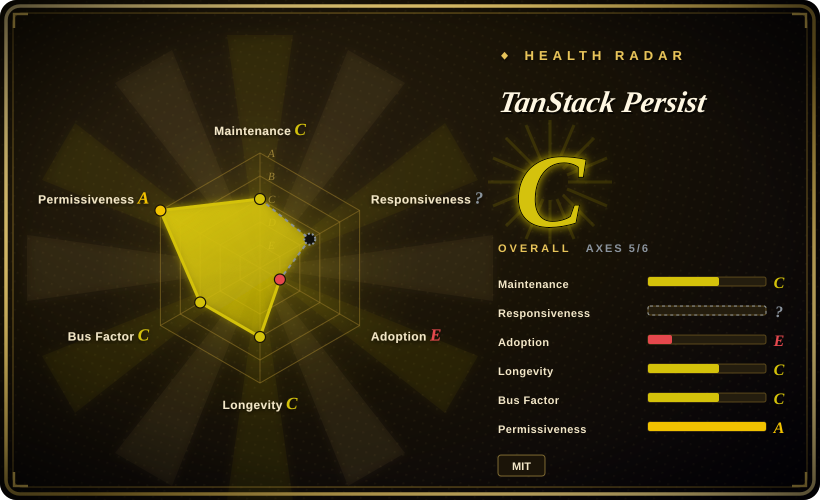
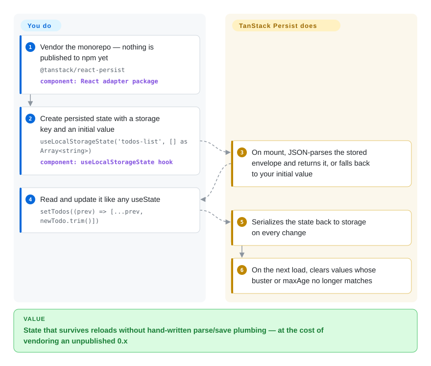

# TanStack Persist

Your dark-mode toggle and half-filled todo list reset on every reload, because hand-wiring localStorage means a `JSON.parse` try/catch, a version check and a stale-value bug per feature; TanStack Persist wraps that whole loop in a `useState`-shaped hook with version busting and expiry built in — but at verification it is an unpublished draft: no npm package, no release, and prose docs partly copy-pasted from a sibling repo. Treat it as a pattern source and watchlist entry until something ships.

## When to use

You ship a React app that already leans on TanStack libraries, and there is a class of small UI state — theme choice, sidebar collapsed, onboarding step, "don't show this again" — that must survive a reload. The pattern you keep re-writing per feature is: read `localStorage` on mount, `try { JSON.parse }` it, decide what to do when last year's shape comes back, `setState`, then stringify and save on every change. TanStack Persist factors exactly that loop into `useLocalStorageState('todos-list', [])`, with the two parts nobody writes well factored out for you: a `buster` string that invalidates stored state when your shape changes, and a `maxAge` that expires it; a `select` option persists only chosen fields, and the underlying `StoragePersister` class is framework-agnostic so non-React code can share the same key.

The honest trigger today: nothing is installable — both packages 404 on npm — so you reach for this only if you are willing to vendor the workspace (or read it as the reference implementation of the pattern) while betting the TanStack ecosystem eventually publishes it. Every published substitute in the Comparison beats it on availability right now; what you'd be buying is API alignment with the TanStack family and built-in discard-on-invalid semantics rather than a mature persistence layer.

## How it works

The core package (`@tanstack/persist`) defines an abstract `Persister` — three methods, `loadState()`, `saveState(state)`, `clearState(useDefaultState?)` — which is the whole contract for any storage medium, and an `AsyncPersister` twin that is currently a placeholder with identical, still-synchronous signatures. The one concrete implementation is `StoragePersister`, targeting the browser's Web Storage (`localStorage` by default, `sessionStorage` optional). You give it a `key`; it wraps your value in an envelope — `{ buster, state, timestamp }` — serialized as JSON by default (the JSDoc suggests swapping in SuperJSON for dates and Maps). On load it validates before returning: a stored `buster` that doesn't match yours, or a `timestamp` older than `maxAge`, deletes the entry and returns nothing — invalidation by discard, not migration. The React adapter is two hooks thick: `useLocalStorageState(key, initialValue)` reads like `useState`; on mount it takes the stored value or your initial one, and on every state change it saves back. The division of labor: you choose the key, initial value and shape; it owns parse/stringify, expiry, version-discard, and `onSaveState`/`onLoadState` error callbacks. What it does *not* do: the hook docstrings promise "syncs it across tabs", but the hook never subscribes to the storage event and the class's handler discards the reloaded value — cross-tab sync is not wired into React state [推断]; there is no IndexedDB persister despite the package description naming it; and `buster` throws old shapes away rather than migrating them.

<!-- flow-steps:begin (generated from flows/tanstack-persist.json by tools/flow_card.py — do not edit) -->

Text version of the flow

1. **You**: Vendor the monorepo — nothing is published to npm yet — `@tanstack/react-persist` — component: `React adapter package`
2. **You**: Create persisted state with a storage key and an initial value — `useLocalStorageState('todos-list', [] as Array<string>)` — component: `useLocalStorageState hook`
3. **TanStack Persist**: On mount, JSON-parses the stored envelope and returns it, or falls back to your initial value
4. **You**: Read and update it like any useState — `setTodos((prev) => [...prev, newTodo.trim()])`
5. **TanStack Persist**: Serializes the state back to storage on every change
6. **TanStack Persist**: On the next load, clears values whose buster or maxAge no longer matches

**Value**: State that survives reloads without hand-written parse/save plumbing — at the cost of vendoring an unpublished 0.x

<!-- flow-steps:end -->

## When NOT to use

- **If you need working state persistence in production this sprint, use Zustand's `persist` middleware instead, because** nothing here installs: `@tanstack/persist` and `@tanstack/react-persist` both 404 on npm (verified 2026-09-28), there is no git release, and the docs site 404s; Zustand persist is published, documented, and adds `version` + `migrate` schema migrations this library doesn't have.
- **If you want plain "useState but in localStorage" for React with working cross-tab sync and SSR safety, use `use-local-storage-state` instead, because** that package ships those properties today, while this repo's cross-tab claim lives in a docstring the implementation doesn't back (see Caveats) and the first render always shows the initial value before the stored one loads.
- **If your data outgrows Web Storage's ~5MB quota or needs IndexedDB/async backends, use localForage or idb-keyval instead, because** `StoragePersister` only targets localStorage/sessionStorage and the `AsyncPersister` is an empty abstract class — the "indexedDB, and more" in the package description has no implementation in the tree.
- **If your stack is Vue, Svelte, Angular or Solid, use your ecosystem's own solution, because** only a React adapter exists; the README marks Solid and Preact "coming soon" and Angular, Svelte and Vue "needs a contributor".
- **If old persisted state must be migrated (renamed fields, reshaped enums) rather than discarded, use Zustand persist's `migrate`, a zod-validated load, or an offline-first database like RxDB, because** `buster` deletes the stored value on mismatch — invalidation here means the user's persisted state resets, by design.
- **If you need live cross-tab state (one tab's edit appearing in another), verify any candidate yourself or use a store with a proven storage-event bridge, because** the subscription methods exist on `StoragePersister` but nothing in the React hook consumes them [推断].

## Comparison

| Alternative | In index | Our verdict | Tradeoff |
| --- | --- | --- | --- |
| Zustand persist middleware (`pmndrs/zustand`) | not indexed | For persistence you can install and ship today with schema versioning, pick Zustand's persist middleware; pick TanStack Persist only as a vendored pattern inside an all-TanStack stack, because Zustand is published and mature while nothing here is on npm. | Zustand persist gives `version` + `migrate`, `partialize`, pluggable storage and a massive user base; you adopt a whole store architecture rather than standalone hooks. Not added in this tab-intake batch. |
| @nanostores/persistent (`nanostores/nanostores`) | not indexed | When persisted state must be shared across several frameworks in a tiny bundle, pick Nanostores' persistent atoms; pick TanStack Persist when staying inside the TanStack ecosystem outweighs having anything published. | Nanostores is published, 1.x-stable with official React/Vue/Svelte/Solid/Preact adapters and a persistent add-on; TanStack Persist promises framework-agnostic persistence but ships one React adapter and zero npm packages. Not added in this tab-intake batch. |
| use-local-storage-state (`astoilkov/use-local-storage-state`) | not indexed | For a plain React hook that is "useState in localStorage" with SSR-safe hydration and demonstrable cross-tab sync, pick use-local-storage-state; pick TanStack Persist when buster/maxAge invalidation semantics matter more than being installable. | use-local-storage-state is a focused, published hook with the two properties this repo claims but doesn't wire up; TanStack Persist adds version/expiry invalidation and a framework-agnostic class at the cost of vendoring. Not added in this tab-intake batch. |
| localForage (`mozilla/localForage`) | not indexed | When the data is bigger than a few kilobytes of preferences — offline collections, cached API payloads — pick localForage, because it gives an async IndexedDB-backed localStorage-style API while TanStack Persist has no async implementation at all. | localForage is a decade-old, widely deployed storage layer (with WebSQL/localStorage fallbacks) but is just storage: no React hooks, no state model; TanStack Persist is hooks and invalidation over the smallest storage only. Not added in this tab-intake batch. |

TanStack Persist is the persistence companion to [TanStack Store](tanstack-store.md) — that page's When NOT to use names persistence as an open gap this repo is meant to close — and sits in the same family as [TanStack Query](../data-fetching/tanstack-query.md) and [TanStack Form](../forms/tanstack-form.md). Those are companions, not substitutes.

## Tech stack

- **TypeScript monorepo** — pnpm workspaces + Nx orchestration, changesets versioning, Vitest tests, `tsdown` builds (ESM + CJS, `sideEffects: false`), Node >= 18.
- **`@tanstack/persist` (core)** — abstract `Persister` / `AsyncPersister` classes, concrete `StoragePersister` for Web Storage, and shared comparison utils (`replaceEqualDeep`, `shallowEqualObjects`, `isFunction`, `isPlainArray`/`isPlainObject`, `parseFunctionOrValue`). Zero runtime dependencies.
- **`@tanstack/react-persist`** — `useStoragePersister`, `useLocalStorageState`, `useSessionStorageState`; re-exports the core; peer dependency `react` >= 16.8.
- **Docs tooling** — generated API reference under `docs/`, one Vite example app (`examples/react/useStorageState`, a todo list) that exercises the hooks.

## Dependencies

- **Runtime:** none for the core package; the React adapter needs `react` / `react-dom` >= 16.8 as peers. Browser Web Storage only — `storage` defaults to `window.localStorage` and is nulled when `window` is undefined (SSR-safe by source reading).
- **No server, no database, no hosted service.**
- **You bring:** exotic-type serialization if needed (SuperJSON suggested in the JSDoc), the `buster`/`maxAge` policy per key — and, today, a vendored copy of the workspace, since nothing is on npm.

## Ops difficulty

**Low to run, high to adopt.** As a library there is nothing to deploy or operate. The cost is all in adoption: you vendor an unpublished monorepo, track a `main` branch whose last commit is 2026-05-13, and read source instead of docs — the prose docs pages (quick-start, adapter guide) are copy-paste from TanStack Pacer and describe the wrong library.

## Health & viability

- **Maintenance (2026-09-28).** Effectively dormant: 11 commits since the repo was created 2025-08-02 — an init, a dependency-upgrade burst in 2025-12, a rename-to-persist burst in 2026-05 — with the last `main` commit 2026-05-13. A docs branch was pushed 2026-09-10 but its PR (#5) was closed unmerged six days later. No release, no tag, no npm publish.
- **Governance / bus factor.** TanStack GitHub org with CODEOWNERS `@TanStack/tanstack-core`, but the implementation footprint is two people (Kevin Van Cott 3 commits, Corbin Crutchley 1) plus an autofix CI bot; two small outside fix PRs were merged in 2025-08. A brand attached to a scaffold, not yet a team effort.
- **Backing & longevity.** GitHub Sponsors (tannerlinsley) like the rest of TanStack. The repo is 14 months old and has never shipped; age × still-active fails on both axes — the Lindy asset here is the TanStack family's track record, not this repo's history.
- **Adoption & ecosystem.** Zero by construction: no published packages means no downloads or dependents; 34 stars, 1 watcher (2026-09-28). In-repo evidence of intent: unit tests for the persister and compare utils, and one example app.
- **Risk flags.** MIT, LICENSE file verified, no relicense history. The sharp ones are quality-of-claims: the package description promises IndexedDB with no implementation; the hook docstrings claim cross-tab sync that isn't wired [推断]; the JSDoc example uses a `stateTransform` option that doesn't exist (it is `select`); and the docs quick-start describes Pacer. None of these are malicious — they are the usual marks of a scaffold stamped from a sibling repo.

## Caveats (unverified)

- [推断] Cross-tab sync is not wired into React state: `useStorageState` never calls `subscribeToStorage()`, and `StoragePersister.handleStorageChange` calls `loadState()` and discards the result — read from source, not reproduced at runtime.
- [推断] `AsyncPersister` is a placeholder: its abstract signatures are identical to `Persister` and still synchronous; no async storage implementation exists in the tree, despite the package description naming IndexedDB.
- [推断] The prose docs (quick-start, React adapter guide) are copy-paste from TanStack Pacer — they describe rate limiting/debouncing and `useDebouncedValue`, which don't exist here; read as scaffold leftover rather than a planned pivot.
- [推断] The repo was renamed from `TanStack/persister`: the old URL redirects, a 2026-05-01 commit says "rename packages to tanstack persist", and the old name lingers in `package.json` repository URLs, README badges and changelog links.
- [未验证] Whether and when the packages reach npm: the changelog's last entry is "fix github url for publishing" (PR #36, 2026-05), but both packages still 404 at verification; no publish timeline is stated anywhere.
- [未验证] The comparison cells for Zustand, Nanostores, use-local-storage-state and localForage rest on their repo metadata, READMEs and npm presence spot-checked 2026-09-28, not on a full reading of those repositories in this batch.
