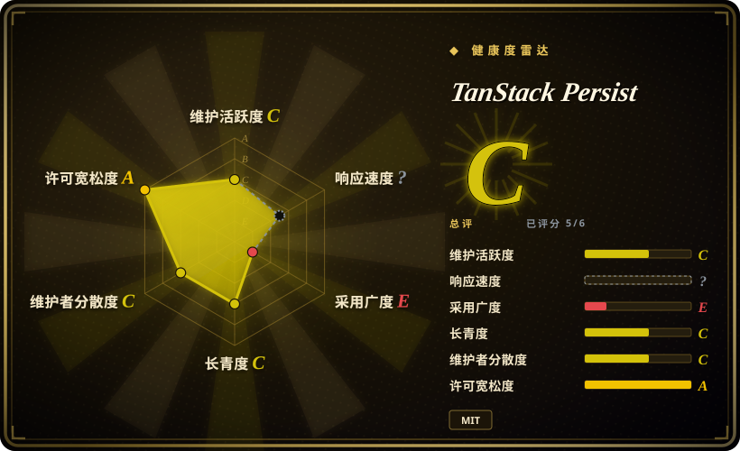
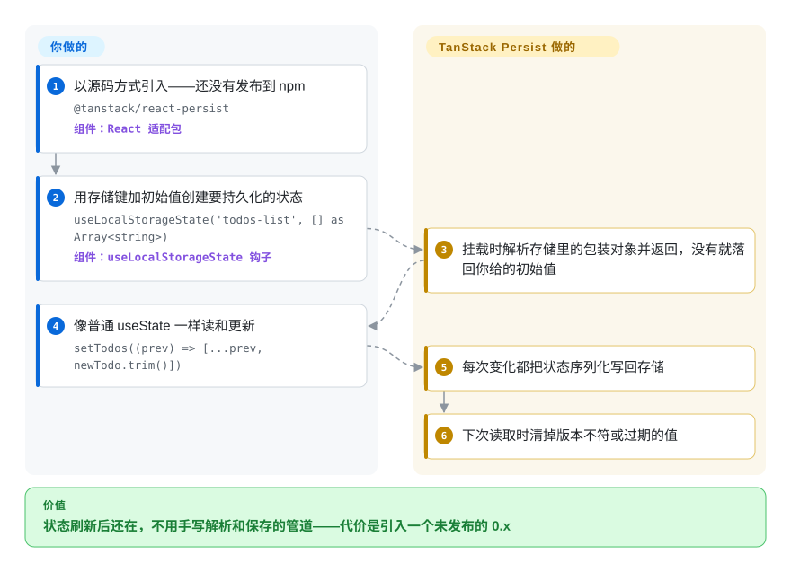

# TanStack Persist

深色模式的开关、填到一半的待办清单，用户一刷新就全没了——因为每次手接 localStorage 都要再写一遍 JSON.parse 的 try/catch、旧数据格式判断和存回去的管道，每个功能各写一份。TanStack Persist 把这整圈循环收进一个长得像 useState 的钩子，版本失效和过期清理都内置——但核验时它还是一份没发布的草稿：npm 上没有包、没有 release，成段的文档还是从兄弟仓库复制来的。在它真正发布之前，把它当模式参考和观察名单条目。

## 何时使用

你的 React 应用已经在用 TanStack 系列库，还有一类小的界面状态——主题选择、侧栏是否折叠、引导走到第几步、「不再提示」——必须扛过页面刷新。你每个功能都在重写同一套流程：挂载时读 localStorage，try 着 JSON.parse，判断去年存的旧格式该怎么办，setState，之后每次变化再序列化存回去。TanStack Persist 把这段循环收成 `useLocalStorageState('todos-list', [])`，并把你总写不好的两件事代劳了：一个 `buster` 字符串在数据形状变化时作废旧值，一个 `maxAge` 让旧值过期；`select` 选项只持久化选中的字段，底层的 `StoragePersister` 类是框架无关的，非 React 代码也能共用同一个键。

今天诚实的触发条件是：什么都没法安装——两个包在 npm 上都是 404——所以只有当你愿意以源码方式引入整个 workspace（或者把它当作这套模式的参考实现来读），并赌 TanStack 生态最终会把它发出去时，才会选它。下表每个已发布的替代品在「今天能不能装」这一项上都赢它；你买的是与 TanStack 家族的 API 对齐，和内置的「无效即丢弃」语义，而不是一个成熟的持久化层。

## 怎么用起来

核心包（`@tanstack/persist`）定义了一个抽象类 `Persister`——三个方法：`loadState()`、`saveState(state)`、`clearState(useDefaultState?)`——这就是任何存储介质要实现的全部契约；另有一个 `AsyncPersister` 孪生类，目前只是占位，签名和同步版完全一样。唯一的具体实现是 `StoragePersister`，面向浏览器的 Web Storage（默认 localStorage，可选 sessionStorage）。你给它一个 `key`；它把值包进一个包装对象——`{ buster, state, timestamp }`——默认用 JSON 序列化（JSDoc 建议日期、Map 这类类型换成 SuperJSON）。读取时先校验再返回：存的 `buster` 和你给的对不上，或者 `timestamp` 超过 `maxAge`，就直接删掉条目、返回空——用丢弃作废，不是迁移。React 适配层只有两个钩子的厚度：`useLocalStorageState(key, initialValue)` 用起来像 useState；挂载时取存储值或你的初始值，之后每次状态变化都存回去。分工是：你定键、初始值和数据形状；它负责解析和序列化、过期、版本丢弃，以及 `onSaveState`／`onLoadState` 出错回调。它*不做*的事：钩子的文档字符串宣称「跨标签页同步」，但钩子从未订阅 storage 事件，类里的处理器也把重新读到的值直接丢弃——跨标签页同步并没有接到 React 状态上 [推断]；包描述里写了 IndexedDB，但树里没有任何 IndexedDB 实现；`buster` 是把旧形状扔掉，而不是迁移。

<!-- flow-steps:begin (generated from flows/tanstack-persist.json by tools/flow_card.py — do not edit) -->

流程文字版

1. **你**：以源码方式引入——还没有发布到 npm — `@tanstack/react-persist` — 组件：`React 适配包`
2. **你**：用存储键加初始值创建要持久化的状态 — `useLocalStorageState('todos-list', [] as Array<string>)` — 组件：`useLocalStorageState 钩子`
3. **TanStack Persist**：挂载时解析存储里的包装对象并返回，没有就落回你给的初始值
4. **你**：像普通 useState 一样读和更新 — `setTodos((prev) => [...prev, newTodo.trim()])`
5. **TanStack Persist**：每次变化都把状态序列化写回存储
6. **TanStack Persist**：下次读取时清掉版本不符或过期的值

**价值**：状态刷新后还在，不用手写解析和保存的管道——代价是引入一个未发布的 0.x

<!-- flow-steps:end -->

## 何时不用

- **如果这个迭代就要在生产里用上能装的状态持久化，改用 Zustand 的 `persist` 中间件，因为**这里什么都装不了：`@tanstack/persist` 和 `@tanstack/react-persist` 在 npm 上都是 404（2026-09-28 核验），没有 git release，文档站也是 404；Zustand persist 已发布、有文档，还多出这个库没有的 `version` 加 `migrate` 式迁移。
- **如果你要的就是 React 版「存进 localStorage 的 useState」，还要跨标签页同步和服务端渲染安全，改用 `use-local-storage-state`，因为**那个包今天就把这些做实了；这里跨标签页的承诺只写在文档字符串里，实现没兑现（见存疑），而且首帧永远先渲染初始值、存储值挂载后才补上。
- **如果数据超出 Web Storage 约 5MB 的配额、或需要 IndexedDB 这类异步后端，改用 localForage 或 idb-keyval，因为**`StoragePersister` 只面向 localStorage／sessionStorage，`AsyncPersister` 是个空的抽象类——包描述里的「indexedDB, and more」在代码树里没有对应实现。
- **如果你的技术栈是 Vue、Svelte、Angular 或 Solid，用你生态自己的方案，因为**这里只有 React 适配层；README 把 Solid 和 Preact 标为「即将到来」，Angular、Svelte、Vue 标的是「需要贡献者」。
- **如果旧持久化数据必须迁移（字段改名、枚举重排）而不是作废，改用 Zustand persist 的 `migrate`、zod 校验式加载，或 RxDB 这类离线优先数据库，因为**`buster` 在不匹配时直接删存储值——这里的失效语义就是「用户的持久化状态归零」，是有意为之。
- **如果需要跨标签页实时同步（一个标签页的修改出现在另一个里），先自己验证候选库，或用有成熟 storage 事件桥接的 store，因为**订阅方法在 `StoragePersister` 类上存在，但 React 钩子里没有任何地方消费它 [推断]。

## 横向对比

| 替代品 | 是否收录 | 我们的评价 | 取舍 |
| --- | --- | --- | --- |
| Zustand persist 中间件（`pmndrs/zustand`） | 未收录 | 今天就要装得上、带 schema 版本化的持久化，选 Zustand 的 persist 中间件；只有整个技术栈都是 TanStack、愿意以源码方式引入时，才考虑 TanStack Persist——Zustand 已发布且成熟，这里什么都没上 npm。 | Zustand persist 给你 `version` 加 `migrate`、`partialize`、可插拔存储和庞大的用户基数；代价是接受一整套 store 架构，而不是独立的钩子。本批次未收录。 |
| @nanostores/persistent（`nanostores/nanostores`） | 未收录 | 持久化状态要跨多个框架共享、包体要小时，选 Nanostores 的 persistent 原子；留在 TanStack 生态比「有东西可装」更重要时，才选 TanStack Persist。 | Nanostores 已发布、1.x 稳定，有 React／Vue／Svelte／Solid／Preact 官方适配和持久化附加包；TanStack Persist 承诺框架无关持久化，实际只交付一个 React 适配层和零个 npm 包。本批次未收录。 |
| use-local-storage-state（`astoilkov/use-local-storage-state`） | 未收录 | 要一个普通的 React 钩子——「存 localStorage 的 useState」，带服务端渲染安全和可验证的跨标签页同步，选 use-local-storage-state；当 buster／maxAge 的失效语义比「能安装」更重要时，才选 TanStack Persist。 | use-local-storage-state 是个专注、已发布的钩子，恰好做实了本仓库宣称却没接线的两个特性；TanStack Persist 多出版本／过期失效和框架无关的类，代价是要以源码引入。本批次未收录。 |
| localForage（`mozilla/localForage`） | 未收录 | 数据不止几 KB 的偏好设置——离线集合、缓存的 API 响应——时选 localForage，因为它给出异步、IndexedDB 后端、localStorage 风格的 API，而 TanStack Persist 完全没有异步实现。 | localForage 是十年历史、部署广泛的存储层（带 WebSQL／localStorage 回退），但它只是存储：没有 React 钩子、没有状态模型；TanStack Persist 是钩子加失效语义，却只覆盖最小的那档存储。本批次未收录。 |

TanStack Persist 是 [TanStack Store](tanstack-store.zh.md) 的持久化伴生库——那一页的「何时不用」明确把持久化列为待补的空缺，本仓库就是来填这个坑的——与 [TanStack Query](../data-fetching/tanstack-query.zh.md)、[TanStack Form](../forms/tanstack-form.zh.md) 同属一个家族。它们是同伴，不是替代品。

## 技术栈

- **TypeScript monorepo**——pnpm workspaces 加 Nx 编排，changesets 版本管理，Vitest 测试，`tsdown` 构建（ESM 加 CJS，`sideEffects: false`），Node >= 18。
- **`@tanstack/persist`（核心）**——抽象类 `Persister`／`AsyncPersister`，面向 Web Storage 的具体实现 `StoragePersister`，以及共享的比较工具（`replaceEqualDeep`、`shallowEqualObjects`、`isFunction`、`isPlainArray`／`isPlainObject`、`parseFunctionOrValue`）。零运行时依赖。
- **`@tanstack/react-persist`**——`useStoragePersister`、`useLocalStorageState`、`useSessionStorageState`；再导出核心包；peer 依赖 `react` >= 16.8。
- **文档工具**——`docs/` 下自动生成的 API 参考，一个 Vite 示例应用（`examples/react/useStorageState`，待办清单）跑了一遍这些钩子。

## 依赖

- **运行时：**核心包零依赖；React 适配层需要 `react`／`react-dom` >= 16.8 作为 peer。只用浏览器 Web Storage——`storage` 默认 `window.localStorage`，`window` 不存在时置空（源码层面服务端渲染安全）。
- **没有服务器、没有数据库、没有托管服务。**
- **你要自己带：**异构类型的序列化（JSDoc 建议 SuperJSON）、每个键的 `buster`／`maxAge` 策略——以及在今天，一份以源码方式引入的 workspace 副本，因为 npm 上什么都没有。

## 运维难度

**跑起来低，采用起来高。**作为库，没有任何要部署、要值守的东西。成本全在采用侧：你要引入一个未发布的 monorepo，盯着一条最后一次提交停在 2026-05-13 的 `main` 分支，并且读源码代替读文档——成段的散文文档（快速开始、适配层指南）是从 TanStack Pacer 复制来的，讲的是另一件库。

## 健康度与可持续性

- **维护（2026-09-28）。**实质上休眠：仓库 2025-08-02 创建以来共 11 次提交——初始化、2025-12 一次依赖升级、2026-05 一次改名到 persist 的集中修改——`main` 最后一次提交是 2026-05-13。2026-09-10 推过一个文档分支，但对应的 PR（#5）六天后被关闭、未合并。没有 release、没有 tag、没有 npm 发布。
- **治理／巴士系数。**TanStack GitHub 组织，CODEOWNERS 是 `@TanStack/tanstack-core`，但实现痕迹只有两个人（Kevin Van Cott 三次提交、Corbin Crutchley 一次）加一个 autofix 机器人；2025-08 合并过两个外部小修 PR。是品牌贴在一个脚手架上，还谈不上团队工程。
- **背书与寿命。**与 TanStack 其余项目一样走 GitHub Sponsors（tannerlinsley）。仓库 14 个月大、从未发布过任何东西；年龄乘以仍然活跃两条都不成立——林迪资产在 TanStack 家族的往绩上，不在这个仓库的历史上。
- **采用与生态。**构造上为零：没有发布过包，就没有下载量、没有依赖方；34 星、1 关注者（2026-09-28）。仓库内的意向证据：persister 和比较工具的单元测试、一个示例应用。
- **风险标记。**MIT，LICENSE 文件已核验，无改许可历史。扎手的是「宣称与事实」这一类：包描述写了 IndexedDB 但没有实现；钩子文档字符串宣称跨标签页同步却没有接线 [推断]；JSDoc 示例用了不存在的 `stateTransform` 选项（实际叫 `select`）；文档快速开始讲的是 Pacer。没有一条是恶意——都是拿兄弟仓库拓出来的脚手架常有的印记。

## 存疑（未验证）

- [推断] 跨标签页同步没有接进 React 状态：`useStorageState` 从不调用 `subscribeToStorage()`，`StoragePersister.handleStorageChange` 调 `loadState()` 后把返回值直接丢弃——读源码得出，未在运行时复现。
- [推断] `AsyncPersister` 是占位类：抽象签名与 `Persister` 完全相同且仍是同步的；代码树里没有任何异步存储实现，尽管包描述写了 IndexedDB。
- [推断] 散文文档（快速开始、React 适配层指南）是从 TanStack Pacer 复制来的——讲的是限流、防抖和 `useDebouncedValue`，这些在本仓库不存在；理解为脚手架残留，而非计划中的转向。
- [推断] 仓库由 `TanStack/persister` 改名而来：旧 URL 会重定向，2026-05-01 有一次提交写着「rename packages to tanstack persist」，旧名字还留在 `package.json` 的 repository 地址、README 徽章和变更日志链接里。
- [未验证] 包是否以及何时上 npm：变更日志最后一条是「fix github url for publishing」（PR #36，2026-05），但核验时两个包仍然 404；没有任何地方给出发布时间表。
- [未验证] Zustand、Nanostores、use-local-storage-state 和 localForage 的对比格，依据是 2026-09-28 抓取的仓库元数据、README 和 npm 存在性抽查，本批次未完整阅读这些仓库。
