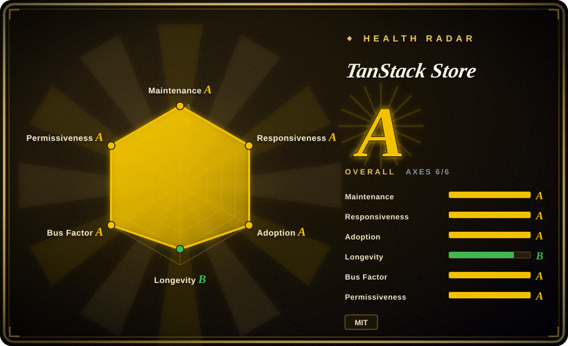
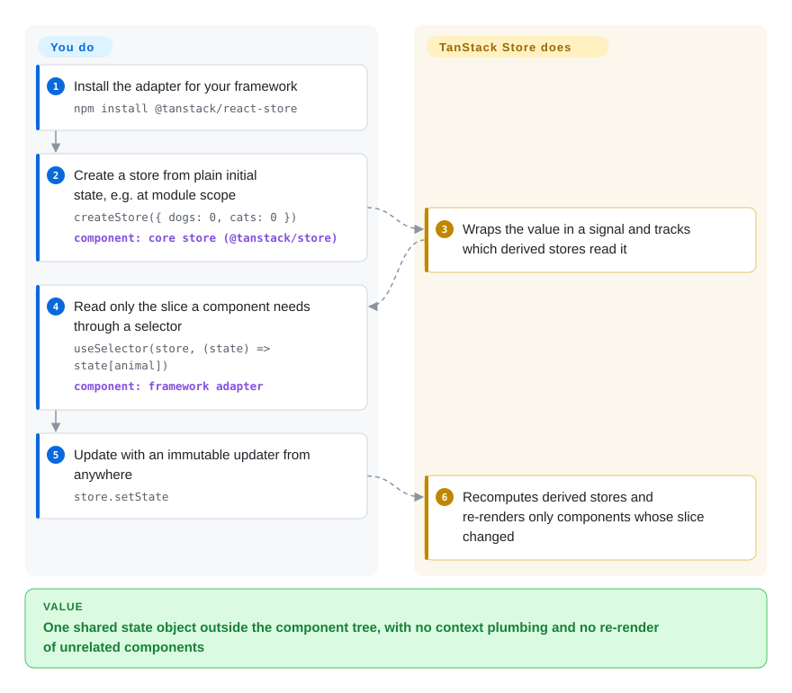

# TanStack Store

A counter in the header and a list in the sidebar need the same piece of state, so you either thread it through props and React context — and every consumer re-renders when anything in that context changes — or you write the same tiny subscribe-and-notify class for the third time, once per framework your team ships. TanStack Store is that class done once: a small signal-based store you create outside any component, with thin adapters that let a React, Vue, Angular, Solid, Svelte, Preact or Lit component read just one slice and re-render only when that slice changes.

## When to use

You maintain a framework-agnostic library — a table engine, a form engine, an editor, a design-system widget kit — and each framework wrapper currently ships its own state glue: a `useState` mirror for React, a `ref()` mirror for Vue, a hand-rolled `EventEmitter` in the core that the wrappers subscribe to, and a bug report that "the Svelte version doesn't update when you call `setPageIndex` twice in a row". You want the core to own one reactive value, with derived values that recompute on their own, and each wrapper to be ten lines that subscribe to a slice.

Reach for TanStack Store here: `createStore(initial)` in the core, `createStore(() => a.state * 2)` for derived values, `batch()` to coalesce updates, and `useSelector(store, selector)` (or the Vue/Angular/Solid/Svelte/Preact/Lit equivalent) in each adapter. This is exactly the job it does inside TanStack's own libraries — `@tanstack/react-router` and `@tanstack/react-form` both depend on `@tanstack/react-store ^0.11.0`. Pick it over **Zustand** when the store must live in framework-neutral code with official adapters for many frameworks; over **Nanostores** when you want the store API TanStack's own packages already use (so a library built on Router or Form shares one runtime); over **@xstate/store** when you want a plain value-plus-updater model rather than events and transitions. For an ordinary React app's global state, see When NOT to use first.

## How it works

The core package (`@tanstack/store`) is a small "signals" implementation — adapted from the `alien-signals` library — where each store is a box holding one value and remembering who has read it. You create a store from a value, or from a function that reads other stores (a *derived* store, which recomputes automatically when its inputs change and is read-only); you change a writable store only through `setState(prev => next)`, returning a new object rather than mutating the old one. Think of it as a spreadsheet: you type into a few input cells, formula cells update themselves, and each reader is told only when the cell it watches actually changes. The framework adapters are the thin part: `useSelector(store, selector)` subscribes a component to the result of your selector and compares it (strict equality by default, a `shallow` helper is provided), so a component watching `state.cats` does not re-render when `state.dogs` changes. What the library does *not* do is anything around the state: no persistence, no devtools panel yet (scaffolding is an open PR, #342), no async data fetching, no middleware stack — you write those, or use a sibling TanStack library.

<!-- flow-steps:begin (generated from flows/tanstack-store.json by tools/flow_card.py — do not edit) -->

Text version of the flow

1. **You**: Install the adapter for your framework — `npm install @tanstack/react-store`
2. **You**: Create a store from plain initial state, e.g. at module scope — `createStore({ dogs: 0, cats: 0 })` — component: `core store (@tanstack/store)`
3. **TanStack Store**: Wraps the value in a signal and tracks which derived stores read it
4. **You**: Read only the slice a component needs through a selector — `useSelector(store, (state) => state[animal])` — component: `framework adapter`
5. **You**: Update with an immutable updater from anywhere — `store.setState`
6. **TanStack Store**: Recomputes derived stores and re-renders only components whose slice changed

**Value**: One shared state object outside the component tree, with no context plumbing and no re-render of unrelated components

<!-- flow-steps:end -->

## When NOT to use

- **If you are choosing global state for a single React app, use Zustand instead, because** Zustand is the same "store outside the tree, select a slice with a hook" model with seven years of history, a stable 5.x API, built-in `persist`, `devtools`, `immer` and `subscribeWithSelector` middleware, and about 63.7M weekly npm downloads (week of 2026-09-21); TanStack Store is still 0.x and ships none of that middleware.
- **If you need state that survives a reload (localStorage, IndexedDB), use Zustand's `persist` or Nanostores' `@nanostores/persistent` instead, because** persistence is an open feature request here (#165, 2025-02) and the community PR that added it (#246) was closed without merging; you would write the load/save subscription yourself.
- **If you cannot absorb breaking changes in a minor release, pin an exact version or pick a 1.x+ library, because** `@tanstack/store` 0.9.0 (2026-02-17) replaced `new Store()` with `createStore()`, removed the `Derived` and `Effect` classes, and 0.9.1 made derived stores read-only; an open PR (#362, 2026-09) would move `@tanstack/react-store` to `1.0.0-alpha` and drop React 16.8/17 support.
- **If you target React Native, verify the adapter yourself or use Zustand / Nanostores, because** the installation docs state the React adapter "is currently only compatible with ReactDOM" and invite a React Native contribution.
- **If you model a workflow with explicit states and events (checkout steps, a wizard, a connection lifecycle), use XState or @xstate/store instead, because** TanStack Store has no events, transitions or guards — only values and updater functions.
- **If your state is mainly server data (lists fetched from an API, cache invalidation after writes), use TanStack Query or TanStack DB instead, because** this store knows nothing about fetching, caching, staleness or retries.
- **If you are on Svelte 5, test `useSelector` with object selections first, because** two open issues (#322, #363, 2026-05 and 2026-09) report `state_proxy_equality_mismatch` warnings and broken identity comparison when a selector returns an object — Svelte's own `$state` runes may be simpler.

## Comparison

| Alternative | In index | Our verdict | Tradeoff |
| --- | --- | --- | --- |
| Zustand (`pmndrs/zustand`) | not indexed | For global client state in a React app, pick Zustand; pick TanStack Store when the store lives in framework-neutral code that several official framework adapters must share. | Zustand gives a stable 5.x API, persist/devtools/immer middleware and by far the largest user base; you give up first-party Vue/Angular/Svelte/Solid/Lit adapters (its core is vanilla, but the hooks are React). Not added in this tab-intake batch. |
| Nanostores (`nanostores/nanostores`) | not indexed | When you want a tiny atom store for many frameworks plus a persistence add-on today, pick Nanostores; pick TanStack Store when you already depend on TanStack Router/Form and want to share their store runtime. | Nanostores is 1.x, sub-1 KB by its README, has React Native and persistence packages, and 11.4M weekly downloads; you give up TanStack's derived-store-from-function API and alignment with the TanStack ecosystem. Not added in this tab-intake batch. |
| Jotai (`pmndrs/jotai`) | not indexed | For React apps whose state is many small, independent pieces composed bottom-up, pick Jotai; pick TanStack Store when the state must be created and updated outside React by non-React code. | Jotai's atoms compose naturally inside React with a large utility ecosystem; it is React-first, so a framework-agnostic core cannot own it. Not added in this tab-intake batch. |
| @xstate/store (`statelyai/xstate`) | not indexed | When updates are better described as named events with typed payloads (and you may later grow into full state machines), pick @xstate/store; pick TanStack Store for a plain value plus updater functions with derived values. | @xstate/store brings event-driven updates, adapters for React/Vue/Angular/Solid/Svelte/Preact and an upgrade path to XState; you pay for more ceremony per update and a much smaller install base (≈169k weekly downloads). Not added in this tab-intake batch. |
| Redux Toolkit (`reduxjs/redux-toolkit`) | not indexed | For a large team that wants one enforced pattern — actions, reducers, middleware, time-travel devtools — pick Redux Toolkit; pick TanStack Store when that ceremony is overhead and you just need a reactive value with selectors. | Redux Toolkit is mature, heavily documented and has first-class devtools and RTK Query; you pay boilerplate and a Redux-shaped architecture. Not added in this tab-intake batch. |

TanStack Store is the substrate of other TanStack libraries: [TanStack Form](../forms/tanstack-form.md) and [TanStack Router](../frameworks/tanstack-router.md) build their state on it, TanStack Pacer and TanStack Devtools sit alongside it, and server data belongs in [TanStack Query](../data-fetching/tanstack-query.md) or [TanStack DB](../data-fetching/tanstack-db.md). Those are companions, not substitutes.

## Tech stack

- **TypeScript** monorepo (pnpm workspaces + Nx, changesets, Vitest, built with tsdown), type-checked against TypeScript 5.6–5.9 in the core package's scripts.
- **`@tanstack/store`** — zero runtime dependencies; a signals core adapted from `stackblitz/alien-signals` (`src/alien.ts`), exposing `createStore`, `createAtom`, `createAsyncAtom`, `batch`, `flush` and a `shallow` comparator. ESM + CJS builds, `sideEffects: false`.
- **Framework adapters** — `react-store`, `preact-store`, `vue-store`, `angular-store`, `solid-store`, `svelte-store`, `lit-store`, `octane-store`, each a thin subscription layer (`useSelector`, `useAtom`, `createStoreContext`, …).

## Dependencies

- **Runtime:** the peer framework only. The React adapter declares `react` / `react-dom` `^16.8 || ^17 || ^18 || ^19` and depends on `use-sync-external-store`; the docs list Vue 2 and 3, Angular 19+, Svelte 5, Lit 3, Preact 10+ and Solid/SolidStart.
- **No server, no database, no hosted service.**
- **You bring:** persistence, devtools, async loading and any middleware-style cross-cutting behaviour.

## Ops difficulty

**Low.** It is an npm dependency with nothing to deploy. The costs are on upgrades and edges:
- 0.x minor releases have broken the API (0.9.0), so pin versions and read changesets before bumping.
- If you also use TanStack Form or Router, your own `@tanstack/store` version should match theirs, or you ship two copies of the runtime and stores created by one will not be the same class as the other's [推断].
- Svelte 5 and React Native are the rough edges (see When NOT to use).

## Health & viability

- **Maintenance (2026-09-28).** Active: last push 2026-09-24, 17 commits between 2026-06-28 and 2026-09-28, per-package releases through 2026-09-24 (`@tanstack/preact-store@0.13.3`); the core has been rewritten on signals within the last year (0.8 performance work in 2025-09/10, the breaking 0.9.0 in 2026-02).
- **Governance / bus factor.** Owned by the TanStack GitHub organization (CODEOWNERS: `@TanStack/tanstack-core`); committers include Corbin Crutchley, Lachlan Collins, Tanner Linsley, Kevin Van Cott and Sheraff, with renovate doing a large share of commits. A small vendor-style core team, not a foundation; funded through GitHub Sponsors and partners (CodeRabbit, Cloudflare per the README).
- **Backing & longevity.** The repo dates from 2023-08-30 (about three years) and has never reached 1.0. The Lindy prior here is TanStack's, not this API's: the store is load-bearing for Router and Form, so it is unlikely to be abandoned, but its public API has been reshaped as recently as 2026-02.
- **Adoption & ecosystem.** About 37.0M weekly downloads for `@tanstack/store` and 35.2M for `@tanstack/react-store` (week of 2026-09-21), and the health scorer counted 110,986,866 `@tanstack/store` downloads in its last-month window, but those numbers are dominated by transitive installs from TanStack Router and Form [推断]; the direct user base is far smaller than the 899 stars and the download count imply side by side. Docs are thin (open issues #299 "Lots of 404s in Reference API pages" and #316 "Missing atom docs").
- **Risk flags.** MIT, no CLA or relicense history found. Main risks: pre-1.0 API churn, a pending major for the React adapter, and missing persistence/devtools compared with established state libraries.

## Caveats (unverified)

- [推断] That most of the ~37M weekly downloads come transitively from TanStack Router/Form is inferred from those packages declaring `@tanstack/react-store ^0.11.0` as a dependency; npm does not break downloads down by dependent.
- [推断] The "two copies of the runtime" risk when your `@tanstack/store` version drifts from the one TanStack Form/Router pull in is inferred from normal npm resolution, not reproduced.
- [未验证] Whether PR #362 (React adapter 1.0.0-alpha, React 18+) merges in its current form, and when, is unknown; it was open on 2026-09-28.
- [未验证] The Svelte 5 `useSelector` problems are taken from issue reports #322 and #363, not reproduced; they may be fixed in a later release.
- [未验证] The React Native limitation is quoted from `docs/installation.md`; whether the adapter works in practice on React Native was not tested.
- [未验证] The comparison cells for Zustand, Nanostores, Jotai, @xstate/store and Redux Toolkit rest on their GitHub metadata, READMEs/source trees and npm downloads, not on a full reading of those repositories in this batch.
