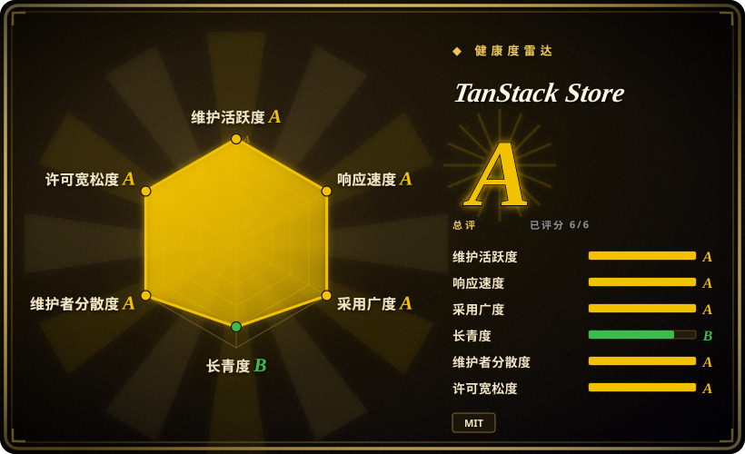
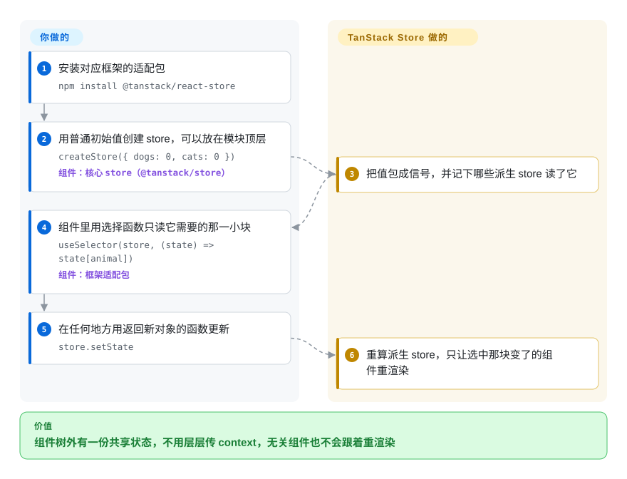

# TanStack Store

顶栏的计数和侧栏的列表要用同一份状态，于是你要么把它沿着 props 和 React context 一路往下传——context 里随便哪个字段一变，所有用到它的组件都跟着重渲染——要么第三次手写同一个“订阅、通知”的小类，团队支持几个框架就写几遍。TanStack Store 把这个小类写好了：在组件外面建一个基于信号的小 store，再用薄薄一层适配包，让 React、Vue、Angular、Solid、Svelte、Preact 或 Lit 组件只读其中一小块，并且只在那一小块变了时才重渲染。

## 何时使用

你在维护一个不绑定框架的库——表格引擎、表单引擎、编辑器、一套设计系统组件——每个框架的封装层各自带着一份状态胶水：React 版用 `useState` 镜像一份，Vue 版用 `ref()` 镜像一份，核心里还有个手写的 `EventEmitter` 让封装层去订阅，然后收到一条 bug：“Svelte 版连续调两次 `setPageIndex` 界面不更新”。你想让核心只持有一份响应式的值，派生值自己重算，每个框架的封装层只剩十来行订阅代码。

这时就该想到 TanStack Store：核心里写 `createStore(initial)`，派生值写 `createStore(() => a.state * 2)`，用 `batch()` 合并多次更新，每个适配层用 `useSelector(store, selector)`（Vue、Angular、Solid、Svelte、Preact、Lit 各有对应写法）。这正是它在 TanStack 自家库里干的活——`@tanstack/react-router` 和 `@tanstack/react-form` 都依赖 `@tanstack/react-store ^0.11.0`。和 **Zustand** 比，选它是因为 store 要放在框架无关的代码里，并且要有多个框架的官方适配；和 **Nanostores** 比，选它是因为你想用 TanStack 自家包已经在用的那套 store（基于 Router 或 Form 的库能共用一份运行时）；和 **@xstate/store** 比，选它是因为你只要“值加更新函数”，不要事件和状态转换。如果只是给一个普通 React 应用管全局状态，先看“何时不用”。

## 怎么用起来

核心包（`@tanstack/store`）是一个小的“信号”实现——改编自 `alien-signals` 这个库——每个 store 就是一个装着一个值的盒子，并且记得谁读过它。你可以用一个值建 store，也可以用一个读取其他 store 的函数来建（这叫*派生* store，输入变了会自动重算，而且只读）；可写的 store 只能通过 `setState(prev => next)` 改，每次返回一个新对象，而不是在旧对象上直接改。可以把它想成电子表格：你只在几个输入格里填数，公式格自己更新，每个看表的人只在他盯着的那一格真变了时才被通知。框架适配包是很薄的那一层：`useSelector(store, selector)` 让组件订阅选择函数的结果并做比较（默认严格相等，另外提供 `shallow` 浅比较），所以只盯着 `state.cats` 的组件不会因为 `state.dogs` 变了而重渲染。这个库不管状态以外的事：没有持久化，还没有 devtools 面板（脚手架是一个未合并的 PR，#342），不负责异步拉数据，也没有中间件——这些要你自己写，或者用 TanStack 的其他兄弟库。

<!-- flow-steps:begin (generated from flows/tanstack-store.json by tools/flow_card.py — do not edit) -->

流程文字版

1. **你**：安装对应框架的适配包 — `npm install @tanstack/react-store`
2. **你**：用普通初始值创建 store，可以放在模块顶层 — `createStore({ dogs: 0, cats: 0 })` — 组件：`核心 store（@tanstack/store）`
3. **TanStack Store**：把值包成信号，并记下哪些派生 store 读了它
4. **你**：组件里用选择函数只读它需要的那一小块 — `useSelector(store, (state) => state[animal])` — 组件：`框架适配包`
5. **你**：在任何地方用返回新对象的函数更新 — `store.setState`
6. **TanStack Store**：重算派生 store，只让选中那块变了的组件重渲染

**价值**：组件树外有一份共享状态，不用层层传 context，无关组件也不会跟着重渲染

<!-- flow-steps:end -->

## 何时不用

- **如果你只是给一个 React 应用选全局状态，用 Zustand，因为**它是同一种“store 放在组件树外、用 hook 选一小块”的模型，已有七年历史，5.x API 稳定，自带 `persist`、`devtools`、`immer`、`subscribeWithSelector` 中间件，周下载约 6370 万（2026-09-21 那一周）；TanStack Store 还在 0.x，这些中间件一个都没有。
- **如果状态要在刷新后保留（localStorage、IndexedDB），用 Zustand 的 `persist` 或 Nanostores 的 `@nanostores/persistent`，因为**持久化在这里还是一个未解决的功能请求（#165，2025-02），社区提交的实现 PR（#246）没有合并就被关掉了，读写存储的订阅逻辑得你自己写。
- **如果你承受不了小版本号里的破坏性变更，锁死精确版本，或者选 1.x 以上的库，因为**`@tanstack/store` 0.9.0（2026-02-17）把 `new Store()` 换成了 `createStore()`，删掉了 `Derived` 和 `Effect` 两个类，0.9.1 又把派生 store 改成只读；一个未合并的 PR（#362，2026-09）打算把 `@tanstack/react-store` 升到 `1.0.0-alpha`，并放弃 React 16.8 和 17。
- **如果目标是 React Native，先自己验证适配包，或者用 Zustand／Nanostores，因为**安装文档明说 React 适配包“目前只兼容 ReactDOM”，并在征集 React Native 的贡献。
- **如果你要表达的是有明确状态和事件的流程（结账步骤、向导、连接生命周期），用 XState 或 @xstate/store，因为**TanStack Store 没有事件、状态转换和守卫，只有值和更新函数。
- **如果状态主要是服务端数据（从接口拉的列表、写入后让缓存失效），用 TanStack Query 或 TanStack DB，因为**这个 store 对拉取、缓存、过期和重试一无所知。
- **如果你在用 Svelte 5，先拿返回对象的选择函数测一下 `useSelector`，因为**两个未关闭的 issue（#322、#363，2026-05 和 2026-09）报告选择函数返回对象时会出现 `state_proxy_equality_mismatch` 警告、身份比较失效——Svelte 自己的 `$state` 可能更省事。

## 横向对比

| 替代品 | 是否收录 | 我们的评价 | 取舍 |
| --- | --- | --- | --- |
| Zustand（`pmndrs/zustand`） | 未收录 | 给 React 应用管客户端全局状态，选 Zustand；store 要放在框架无关的代码里、给多个官方框架适配共用时，选 TanStack Store。 | Zustand 有稳定的 5.x API、persist／devtools／immer 中间件和大得多的用户群；代价是没有官方的 Vue／Angular／Svelte／Solid／Lit 适配（核心是原生 JS，但 hook 只有 React 的）。本批标签收录未连带新增。 |
| Nanostores（`nanostores/nanostores`） | 未收录 | 想要一个支持多框架的极小原子 store，而且现在就要持久化插件，选 Nanostores；已经依赖 TanStack Router／Form、想和它们共用 store 运行时，选 TanStack Store。 | Nanostores 已是 1.x，README 称不到 1 KB，有 React Native 和持久化包，周下载 1140 万；代价是没有 TanStack 那种“用函数建派生 store”的 API，也不和 TanStack 生态对齐。本批标签收录未连带新增。 |
| Jotai（`pmndrs/jotai`） | 未收录 | 在 React 应用里，状态是许多互相独立的小块、自下而上组合时，选 Jotai；状态必须由 React 以外的代码在 React 外面创建和更新时，选 TanStack Store。 | Jotai 的原子在 React 里组合自然、工具生态丰富；它以 React 为先，框架无关的核心没法拥有它。本批标签收录未连带新增。 |
| @xstate/store（`statelyai/xstate`） | 未收录 | 更新更适合描述成带类型载荷的具名事件（以后还可能升级成完整状态机）时，选 @xstate/store；只要“值加更新函数加派生值”时，选 TanStack Store。 | @xstate/store 带来事件驱动的更新、React／Vue／Angular／Solid／Svelte／Preact 适配和通往 XState 的升级路径；代价是每次更新的仪式感更重，装机量也小得多（周下载约 16.9 万）。本批标签收录未连带新增。 |
| Redux Toolkit（`reduxjs/redux-toolkit`） | 未收录 | 大团队想要一套强制统一的模式——action、reducer、中间件、可回放的 devtools——选 Redux Toolkit；这套仪式是负担、只要一个带选择器的响应式值时，选 TanStack Store。 | Redux Toolkit 成熟、文档厚，有一流的 devtools 和 RTK Query；代价是样板代码多、架构被 Redux 的形状绑住。本批标签收录未连带新增。 |

TanStack Store 是其他 TanStack 库的底座：[TanStack Form](../forms/tanstack-form.zh.md) 和 [TanStack Router](../frameworks/tanstack-router.zh.md) 的状态都建在它上面，TanStack Pacer 和 TanStack Devtools 与它并列，服务端数据交给 [TanStack Query](../data-fetching/tanstack-query.zh.md) 或 [TanStack DB](../data-fetching/tanstack-db.zh.md)。它们是搭档，不是替代品。

## 技术栈

- **TypeScript** monorepo（pnpm workspaces + Nx、changesets、Vitest，用 tsdown 构建），核心包的脚本对 TypeScript 5.6–5.9 做类型检查。
- **`@tanstack/store`**——运行时零依赖；信号内核改编自 `stackblitz/alien-signals`（`src/alien.ts`），对外提供 `createStore`、`createAtom`、`createAsyncAtom`、`batch`、`flush` 和 `shallow` 比较函数。同时产出 ESM 和 CJS，`sideEffects: false`。
- **框架适配包**——`react-store`、`preact-store`、`vue-store`、`angular-store`、`solid-store`、`svelte-store`、`lit-store`、`octane-store`，每个都是薄薄的订阅层（`useSelector`、`useAtom`、`createStoreContext` 等）。

## 依赖

- **运行时：**只有对应的框架。React 适配包声明 `react`／`react-dom` `^16.8 || ^17 || ^18 || ^19`，并依赖 `use-sync-external-store`；文档列出 Vue 2 和 3、Angular 19+、Svelte 5、Lit 3、Preact 10+ 以及 Solid／SolidStart。
- **不需要服务器、数据库或托管服务。**
- **需要你自己补：**持久化、devtools、异步加载，以及任何中间件式的横切逻辑。

## 运维难度

**低。**它就是一个 npm 依赖，没有东西要部署。成本在升级和边角：
- 0.x 的小版本号出现过破坏性变更（0.9.0），所以要锁版本，升级前读 changeset。
- 如果同时用 TanStack Form 或 Router，你自己装的 `@tanstack/store` 版本要和它们一致，否则会打进两份运行时，一边建的 store 和另一边的不是同一个类 [推断]。
- Svelte 5 和 React Native 是不平整的边角（见“何时不用”）。

## 健康度与可持续性

- **维护（2026-09-28）。**活跃：最近推送 2026-09-24，2026-06-28 到 2026-09-28 之间 17 次提交，按包发布一直到 2026-09-24（`@tanstack/preact-store@0.13.3`）；核心在过去一年里改写到信号上（2025-09／10 的 0.8 性能改造，2026-02 的破坏性 0.9.0）。
- **治理／巴士因子。**归 TanStack GitHub 组织所有（CODEOWNERS：`@TanStack/tanstack-core`）；提交者有 Corbin Crutchley、Lachlan Collins、Tanner Linsley、Kevin Van Cott、Sheraff 等，renovate 机器人占了很大一部分提交。是一个小型的厂商式核心团队，不是基金会；资金来自 GitHub Sponsors 和 README 里列的合作方（CodeRabbit、Cloudflare）。
- **背书与存续。**仓库建于 2023-08-30（约三年），从没到过 1.0。这里的 Lindy 先验属于 TanStack，而不属于这套 API：Router 和 Form 都压在它身上，所以不太可能被放弃，但它的公开 API 最近在 2026-02 还被改过形状。
- **采用与生态。**`@tanstack/store` 周下载约 3700 万，`@tanstack/react-store` 约 3520 万（2026-09-21 那一周），健康度评分器在最近一个月窗口里数到 `@tanstack/store` 下载 110986866 次，但这些数字大多来自 TanStack Router 和 Form 的间接安装 [推断]；899 个 star 和这个下载量放在一起看就知道，直接使用者少得多。文档偏薄（未关闭的 issue #299“参考 API 页面大量 404”和 #316“缺 atom 文档”）。
- **风险信号。**MIT，没找到 CLA 或改许可证的历史。主要风险：1.0 之前的 API 变动、React 适配包即将到来的大版本，以及和成熟状态库相比缺少持久化和 devtools。

## 存疑（未验证）

- [推断] “约 3700 万周下载大多来自 TanStack Router／Form 的间接安装”，依据是这两个包把 `@tanstack/react-store ^0.11.0` 声明为依赖；npm 不按依赖方拆分下载量。
- [推断] 你的 `@tanstack/store` 版本和 TanStack Form／Router 拉进来的版本不一致时会出现“两份运行时”的风险，是按 npm 的常规解析推出来的，没有复现。
- [未验证] PR #362（React 适配包 1.0.0-alpha、要求 React 18+）会不会按现在的样子合并、什么时候合并，不知道；2026-09-28 时它还开着。
- [未验证] Svelte 5 下 `useSelector` 的问题来自 issue #322 和 #363 的报告，没有复现；之后的版本可能已修复。
- [未验证] React Native 的限制引自 `docs/installation.md`；适配包在 React Native 上实际能不能用，没有测试。
- [未验证] Zustand、Nanostores、Jotai、@xstate/store 和 Redux Toolkit 的对比格依据的是它们的 GitHub 元数据、README／源码目录和 npm 下载量，本批没有完整读这些仓库。
