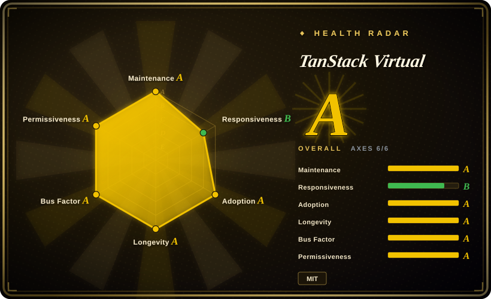
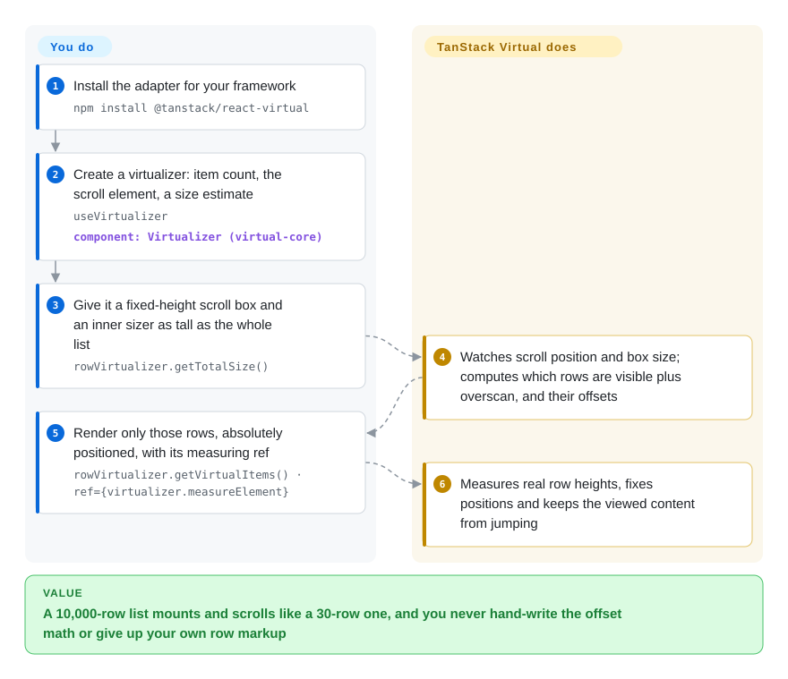

# TanStack Virtual

A list of 10,000 rows (log lines, table rows, chat messages) turns into 10,000 DOM nodes, and the page takes seconds to open and stutters when you scroll. TanStack Virtual works out which rows are actually inside the visible window and gives you only those plus their pixel positions — you render just the few dozen on screen, with your own markup.

## When to use

You are building the part of a React (or Vue, Solid, Svelte, Angular, Lit) app where a list gets long: an audit-log viewer with 50,000 entries, an admin table from TanStack Table, a chat or AI-assistant panel whose history keeps growing. Rendering it naively, the browser's Performance tab shows a multi-second "Recalculate Style" on mount and scrolling drops frames; the design system already owns how a row looks, so a prebuilt `<List>` component with its own markup, CSS and props would have to be fought or wrapped.

Reach for TanStack Virtual here: you keep your own row component, and `useVirtualizer({ count, getScrollElement, estimateSize })` tells you which indexes to render and where (`getVirtualItems()`, `getTotalSize()`), measuring rows of unknown height as they appear. You pick it over **react-window** when rows have unpredictable heights, you are not on React, or you need grids, sticky rows or end-anchored chat behaviour without adopting its components; over **react-virtuoso** / **virtua** when you want no rendered markup at all and one API shared by several frameworks — at the price of writing the container and positioning styles yourself, which those component libraries do for you.

## How it works

The idea is a stage set: the audience (the scrollbar) sees a street of 10,000 houses because you build one tall, empty "sizer" box of the full height, but only the houses in the camera's frame are actually standing. You own the stage: a scroll container with a fixed height and `overflow: auto`, an inner div as tall as `getTotalSize()`, and each visible row placed with `position: absolute` and `transform: translateY(start)`. The library owns the arithmetic: from `count`, your `estimateSize` guess and the container's scroll position and size (watched via scroll events and a `ResizeObserver` — the browser API that reports when an element changes size) it computes the visible range plus a few extra rows (`overscan`) and each row's offset. If you pass its `measureElement` as the row's ref, it reads each rendered row's real height and corrects positions — and, when a row above the viewport changes size, adjusts the scroll so the content you are looking at does not jump. The same `virtual-core` engine sits under thin adapters for React, Vue, Solid, Svelte, Angular, Lit and Marko; a vertical and a horizontal virtualizer together give a grid, and `anchorTo: 'end'` with `followOnAppend` turns the list into a bottom-pinned chat feed that stays put when older history is prepended.

<!-- flow-steps:begin (generated from flows/tanstack-virtual.json by tools/flow_card.py — do not edit) -->

Text version of the flow

1. **You**: Install the adapter for your framework — `npm install @tanstack/react-virtual`
2. **You**: Create a virtualizer: item count, the scroll element, a size estimate — `useVirtualizer` — component: `Virtualizer (virtual-core)`
3. **You**: Give it a fixed-height scroll box and an inner sizer as tall as the whole list — `rowVirtualizer.getTotalSize()`
4. **TanStack Virtual**: Watches scroll position and box size; computes which rows are visible plus overscan, and their offsets
5. **You**: Render only those rows, absolutely positioned, with its measuring ref — `rowVirtualizer.getVirtualItems() · ref={virtualizer.measureElement}`
6. **TanStack Virtual**: Measures real row heights, fixes positions and keeps the viewed content from jumping

**Value**: A 10,000-row list mounts and scrolls like a 30-row one, and you never hand-write the offset math or give up your own row markup

<!-- flow-steps:end -->

## When NOT to use

- **If you want a finished list or chat component rather than a positioning engine, use react-virtuoso (React) or virtua instead of TanStack Virtual, because** TanStack Virtual renders nothing — the docs say it "does not ship with or render any markup or styles" — so the scroll container, the absolute positioning, `data-index` attributes and the measurement ref are all yours to get right, and most open bugs (#1038 scroll-to-top on conditional render, #1076/#924 "Maximum update depth exceeded") come from that wiring.
- **If you need to scroll through millions of rows, use react-virtualized (or a canvas grid) instead, because** the total height is one real DOM element and browsers cap element height: issue #460 (open since 2023) reports that with 1,000,000 rows at 35 px only 958,697 rows are reachable — 35 × 958,697 ≈ 33.5M px, Chrome's limit — and the maintainers have not adopted the scaled-offset technique react-virtualized uses.
- **If your list is a few hundred rows or users rely on browser find (Ctrl+F), in-page anchors or crawlers seeing every row, render plainly (optionally with CSS `content-visibility: auto`) instead, because** any virtualizer removes off-screen rows from the DOM, so they cannot be found, linked or indexed, and you add scroll-restoration and measurement edge cases for no speed gain.
- **If the app is compiled with React Compiler and you expect it to memoize everything, plan for exceptions or test first, because** issue #1119 (open, 2026-01) reports the compiler's lint rule flags `useVirtualizer` as an "incompatible library" and skips memoizing the component that calls it.
- **If your chat UI must be flawless on iOS/desktop Safari today, budget testing time or evaluate Virtuoso's commercial Message List instead, because** end anchoring (`anchorTo: 'end'`, `followOnAppend`) arrived in virtual-core 3.16.0 on 2026-05-25 and its changelog since is still a stream of iOS/Safari scroll-compensation fixes, with open issues such as #1287 (Safari drops the prepend anchor during rubber-band bounce) and #1250 (iOS `scrollToIndex` paints sagged then snaps).
- **If you are on an Angular version below 20, use Angular CDK's virtual scroll instead; if you are on Lit, use the Lit team's `@lit-labs/virtualizer` instead, because** `@tanstack/angular-virtual` 6.x declares `@angular/core >=20.0.0`, and the Lit adapter has open basics-level bugs (#1251 options never re-applied after construction, #1188 dynamic-size demo crashing).
- **If you are on Angular and only need a fixed-row-height list, Angular CDK's `cdk-virtual-scroll-viewport` is already in your dependency tree, because** it is maintained with the framework and needs no extra adapter; reach for TanStack Virtual when you need measured dynamic sizes or the same virtualizer across frameworks.

## Comparison

| Alternative | In index | Our verdict | Tradeoff |
| --- | --- | --- | --- |
| react-window (`bvaughn/react-window`) | not indexed | For a React list or grid with known row heights where you want a ready `<List>`/`<Grid>` component, pick react-window; pick TanStack Virtual when heights are unknown until render, you need chat-style end anchoring, or you are not on React. | react-window gives you components and less wiring, with a 2.x line still released (2.3.3 on 2026-09-22); you are tied to React and to its component API rather than your own markup. Not added in this tab-intake batch. |
| react-virtuoso (`petyosi/react-virtuoso`) | not indexed | When you want a React component that handles variable heights, grouped sticky headers and a table variant with almost no configuration, pick react-virtuoso; pick TanStack Virtual when you need full control of the markup or a non-React framework. | Virtuoso measures and positions for you; you accept its component structure, and its chat-grade Message List package is under a commercial license while the core list is MIT. Not added in this tab-intake batch. |
| virtua (`inokawa/virtua`) | not indexed | If you want a small component-style virtualizer across React, Vue, Solid, Svelte and Angular with zero configuration, pick virtua; pick TanStack Virtual when you want a headless hook and the larger install base. | virtua ships components (less code to write, still v0.x at 0.52.8); TanStack Virtual ships only math and positions, so you write more but control everything. Not added in this tab-intake batch. |
| react-virtualized (`bvaughn/react-virtualized`) | not indexed | Treat it as the fallback for React lists with more rows than the browser's maximum element height, which it handles by scaling offsets; for new code otherwise pick TanStack Virtual, because react-virtualized's last push was 2025-01-20. | You get the million-row scaling and many built-in components (`Table`, `Masonry`, `AutoSizer`) but a large bundle and a codebase that is no longer actively developed. Not added in this tab-intake batch. |
| Angular CDK scrolling (`angular/components`) | not indexed | In an Angular app with fixed-height rows, pick the CDK's `cdk-virtual-scroll-viewport`; pick TanStack Virtual when rows need measuring or you share the virtualizer with other frameworks. | CDK is maintained with Angular itself and needs no adapter; its dynamic-size support is limited compared with measured virtualizers. Not added in this tab-intake batch. |

TanStack Virtual is the virtualization piece of the TanStack family; its own `examples/react/table` pairs it with TanStack Table (`@tanstack/react-table`) for virtualized data-grid rows — a companion, not a substitute.

## Tech stack

- **TypeScript** monorepo (pnpm workspaces + Nx, Changesets for releases), with a Playwright benchmark harness under `benchmarks/` that compares it with virtua, react-virtuoso, react-window v2 and React Aria's `Virtualizer`.
- **`@tanstack/virtual-core`** — the framework-agnostic `Virtualizer` (range calculation, measurement cache, scroll-to logic, end anchoring); declares no runtime dependencies.
- **Framework adapters** — `react-virtual` (React 16.8–19), `vue-virtual`, `solid-virtual`, `svelte-virtual`, `angular-virtual` (6.x, Angular ≥ 20), `lit-virtual`, `marko-virtual`.
- **Browser APIs it relies on** — scroll events, `ResizeObserver`, optionally the native `scrollend` event; an optional recipe pairs it with `@chenglou/pretext` to estimate text-row heights without DOM measurement.

## Dependencies

- **Runtime:** the peer framework only (e.g. `react`/`react-dom ^16.8 || ^17 || ^18 || ^19`, `@angular/core >=20`); `virtual-core` itself has no dependencies.
- **You bring:** the scroll container (fixed height, `overflow: auto`), the row markup and styles, stable item keys (`getItemKey`) for any list whose items are prepended or reordered, and data loading (infinite scroll calls are yours).
- **No server, no service.** It runs in the browser; for SSR you pass `initialRect` / `initialOffset` so the first server render has a size to work with.

## Ops difficulty

**Low** to deploy — an npm dependency in the front-end bundle. The real cost is integration and QA:
- Getting the wiring right: fixed-height scroll parent, absolute positioning, `measureElement` ref plus `data-index` for dynamic sizes; mistakes show up as jumping scroll, blank gaps or render loops.
- Dynamic heights need a sensible `estimateSize`; a bad estimate causes visible correction work while scrolling up (the reason the Pretext recipe exists).
- Chat/streaming layouts need device testing on iOS and Safari; that path has changed patch-by-patch since it shipped in 3.16.0 (2026-05-25).
- Frequent patch releases (several per month); pin versions and read the changelog, since behaviour fixes land in patches.

## Health & viability

- **Maintenance (2026-09-28).** Active: the last release batch was 2026-09-14 (`react-virtual` 3.14.13, `virtual-core` 3.17.11), with releases several times a month over July–September 2026 and a push on 2026-09-21. v3 has been the stable major for years; recent work concentrates on dynamic-size scroll correction and chat anchoring.
- **Governance / bus factor.** Lives in the TanStack GitHub organization (renamed from `tannerlinsley/react-virtual`; the old URL redirects). All-time commits are led by Tanner Linsley (236) and Damian Pieczyński (piecyk, 119); the health scorer counts 34 people committing in the last 12 months, with the top contributor at 38% and the top three at 47% of commits. Many of those are outside contributors landing single fixes, while in 2026 piecyk authors most of the core scroll-correction work — broad contribution, but the hardest code leans on one maintainer. Funding is GitHub Sponsors and commercial partners listed in the README.
- **Backing & longevity.** Repository created 2020-05-08 (about 6.4 years) and still shipping — a good Lindy signal for a front-end utility, strengthened by the TanStack organization, which has kept its libraries alive across React paradigm shifts.
- **Adoption & ecosystem.** About 27.9M weekly npm downloads for `@tanstack/react-virtual` and 33.2M for `@tanstack/virtual-core` (week ending 2026-09-27; the health scorer counted 106,731,273 `virtual-core` downloads in its last-month window), against about 7.6M for react-window, 3.8M for react-virtuoso and 1.2M for virtua over the same week; 118 open issues. Docs cover the API, a chat guide and 12 React examples.
- **Risk flags.** MIT, no CLA or relicense found. Watch items rather than blockers: the open maximum-height limit (#460), React Compiler incompatibility (#1119), and the young end-anchoring code path on Safari/iOS.

## Caveats (unverified)

- [推断] "The hardest code leans on one maintainer" is read from 2026 commit authorship on the default branch; it does not capture review, triage or npm publish rights.
- [推断] npm download counts include CI installs and transitive dependencies (UI kits that bundle the virtualizer), so they overstate direct adoption relative to react-window / Virtuoso.
- [未验证] Performance relative to virtua, react-virtuoso and react-window was not measured: the repository ships the benchmark harness but no committed results (`benchmarks/results/` holds only a sample file), and the harness is authored by the TanStack side.
- [未验证] The claim that react-virtualized handles more rows than the browser height limit rests on issue #460's discussion pointing at its `ScalingCellSizeAndPositionManager`; it was not tested here.
- [未验证] The Angular CDK and `@lit-labs/virtualizer` rows are based on general knowledge of those projects, not on reading their repositories in this batch; the "limited dynamic-size support" remark on CDK is not re-checked against its current release.
- [推断] The 958,697-row ceiling in issue #460 matches Chrome's roughly 33.5M-pixel element-height cap; other browsers have different caps, so the exact ceiling varies.
