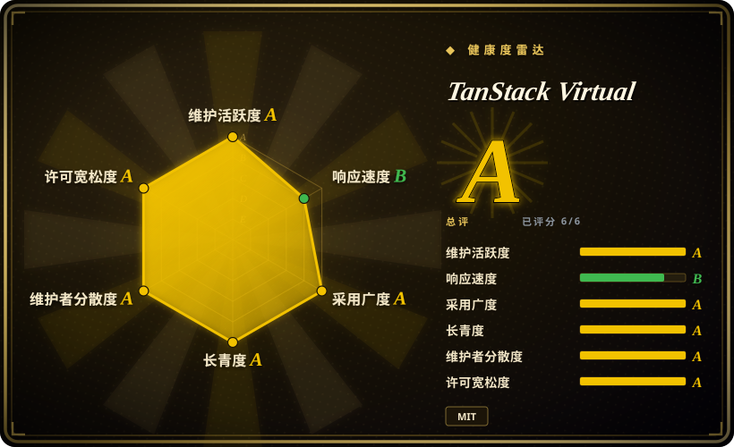
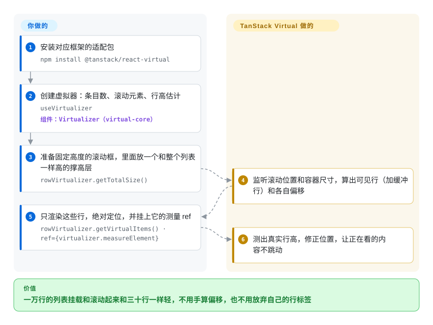

# TanStack Virtual

一万行的列表（日志、表格行、聊天消息）就是一万个 DOM 节点，页面要好几秒才打开，一滚动就卡。TanStack Virtual 只算出当前可视窗口里有哪些行、每行该放在第几像素，你只渲染屏幕上那几十行，标签和样式仍然由你自己写。

## 何时使用

你在做 React（或 Vue、Solid、Svelte、Angular、Lit）应用里列表会变长的那一块：五万条的审计日志查看器、用 TanStack Table 搭的后台表格、历史记录越聊越长的聊天或 AI 助手面板。直接全量渲染，浏览器 Performance 面板里挂载时出现好几秒的“Recalculate Style”，滚动掉帧；而行长什么样早已由设计系统决定，换一个自带标签、CSS 和一堆 props 的现成 `<List>` 组件，只能跟它较劲或者再包一层。

这时候用 TanStack Virtual：行组件还是你自己的，`useVirtualizer({ count, getScrollElement, estimateSize })` 告诉你该渲染哪些下标、放在哪里（`getVirtualItems()`、`getTotalSize()`），高度事先不知道的行会在出现时测量。行高不可预测、不在 React 上、或者需要网格、吸顶行、贴底聊天行为而又不想换成别人的组件时，选它而不是 **react-window**；想要完全不渲染任何标签、几个框架共用一套 API 时，选它而不是 **react-virtuoso**／**virtua**——代价是滚动容器和定位样式要自己写，那两个组件库会替你做好。

## 怎么用起来

可以把它想成拍电影搭布景：观众（滚动条）看到一条有一万栋房子的街，是因为你搭了一个和整条街一样高的空“撑高”盒子，而真正立起来的只有镜头框里那几栋。布景由你搭：一个固定高度、`overflow: auto` 的滚动容器，里面一个高度等于 `getTotalSize()` 的内层 div，每个可见行用 `position: absolute` 加 `transform: translateY(start)` 放到位。算术由它来做：根据 `count`、你给的 `estimateSize` 估计值，以及容器的滚动位置和尺寸（通过滚动事件和 `ResizeObserver`——浏览器在元素尺寸变化时发通知的接口——来监听），算出可见范围外加几行缓冲（`overscan`），以及每行的偏移量。把它的 `measureElement` 当作行的 ref 传进去，它就会读出每个已渲染行的真实高度并修正位置；视口上方某一行变高或变矮时，它还会调整滚动位置，让你正在看的内容不跳。同一个 `virtual-core` 引擎之下接了 React、Vue、Solid、Svelte、Angular、Lit、Marko 的薄适配层；一个纵向加一个横向的虚拟器组合起来就是网格，而 `anchorTo: 'end'` 加 `followOnAppend` 能把列表变成贴底的聊天流，往前插入更早的历史时画面不动。

<!-- flow-steps:begin (generated from flows/tanstack-virtual.json by tools/flow_card.py — do not edit) -->

流程文字版

1. **你**：安装对应框架的适配包 — `npm install @tanstack/react-virtual`
2. **你**：创建虚拟器：条目数、滚动元素、行高估计 — `useVirtualizer` — 组件：`Virtualizer（virtual-core）`
3. **你**：准备固定高度的滚动框，里面放一个和整个列表一样高的撑高层 — `rowVirtualizer.getTotalSize()`
4. **TanStack Virtual**：监听滚动位置和容器尺寸，算出可见行（加缓冲行）和各自偏移
5. **你**：只渲染这些行，绝对定位，并挂上它的测量 ref — `rowVirtualizer.getVirtualItems() · ref={virtualizer.measureElement}`
6. **TanStack Virtual**：测出真实行高，修正位置，让正在看的内容不跳动

**价值**：一万行的列表挂载和滚动起来和三十行一样轻，不用手算偏移，也不用放弃自己的行标签

<!-- flow-steps:end -->

## 何时不用

- **如果你要的是一个现成的列表或聊天组件，而不是一个定位引擎，用 react-virtuoso（React）或 virtua，而不是 TanStack Virtual，因为**它什么都不渲染——文档原话是不附带、也不渲染任何标签和样式——滚动容器、绝对定位、`data-index` 属性和测量 ref 都得你自己接对，而多数未关闭的 bug（#1038 条件渲染时滚回顶部，#1076／#924 “Maximum update depth exceeded”）正出在这些接线上。
- **如果你要在几百万行里滚动，用 react-virtualized（或 canvas 表格），因为**总高度是一个真实的 DOM 元素，而浏览器对元素高度有上限：issue #460（2023 年起一直未关闭）报告 100 万行、每行 35 像素时只能滚到第 958,697 行——35 × 958,697 ≈ 3350 万像素，正是 Chrome 的上限——维护者至今没有采用 react-virtualized 那种按比例缩放偏移的做法。
- **如果列表只有几百行，或者用户依赖浏览器查找（Ctrl+F）、页内锚点，或者需要爬虫看到每一行，直接全量渲染（可配合 CSS `content-visibility: auto`），因为**任何虚拟化都会把屏幕外的行从 DOM 里拿掉，它们无法被查找、链接或收录，你却要多处理滚动恢复和测量的边角问题，换不来速度。
- **如果应用用 React Compiler 编译、指望它把所有东西自动记忆化，先做测试或预留例外，因为** issue #1119（2026-01 起未关闭）报告编译器的 lint 规则把 `useVirtualizer` 标成“incompatible library”，调用它的组件会被跳过记忆化。
- **如果你的聊天界面今天就必须在 iOS／桌面 Safari 上零瑕疵，预留测试时间，或者评估 Virtuoso 的商业版 Message List，因为**贴底模式（`anchorTo: 'end'`、`followOnAppend`）在 2026-05-25 的 virtual-core 3.16.0 才加入，此后 changelog 里一直是 iOS／Safari 的滚动补偿修复，仍有未关闭的 issue，例如 #1287（Safari 回弹时丢掉往前插入的锚点）和 #1250（iOS 上 `scrollToIndex` 先画歪再跳正）。
- **如果你的 Angular 版本低于 20，用 Angular CDK 的虚拟滚动；如果你用 Lit，用 Lit 团队的 `@lit-labs/virtualizer`，因为** `@tanstack/angular-virtual` 6.x 声明需要 `@angular/core >=20.0.0`，而 Lit 适配层还有基础层面的未关闭 bug（#1251 构造之后更新的选项永远不生效，#1188 动态尺寸示例崩溃）。
- **如果你在 Angular 上、只需要固定行高的列表，Angular CDK 的 `cdk-virtual-scroll-viewport` 已经在依赖里了，因为**它随框架一起维护，不需要额外适配层；需要按实际尺寸测量或多框架共用同一个虚拟器时再用 TanStack Virtual。

## 横向对比

| 替代品 | 是否收录 | 我们的评价 | 取舍 |
| --- | --- | --- | --- |
| react-window（`bvaughn/react-window`） | 未收录 | 在 React 里做行高已知的列表或网格、想要现成的 `<List>`／`<Grid>` 组件时，选 react-window；行高要渲染后才知道、需要聊天式贴底、或者不在 React 上时，选 TanStack Virtual。 | react-window 给你组件，接线更少，2.x 仍在发版（2026-09-22 发布 2.3.3）；代价是绑定 React，也要接受它的组件 API 而不是你自己的标签。本批标签收录未一并添加。 |
| react-virtuoso（`petyosi/react-virtuoso`） | 未收录 | 想要一个几乎不用配置就能处理可变行高、分组吸顶和表格变体的 React 组件时，选 react-virtuoso；需要完全掌控标签或用非 React 框架时，选 TanStack Virtual。 | Virtuoso 替你测量和定位；你要接受它的组件结构，而且面向聊天的 Message List 包是商业许可，只有核心列表是 MIT。本批标签收录未一并添加。 |
| virtua（`inokawa/virtua`） | 未收录 | 想要在 React、Vue、Solid、Svelte、Angular 上零配置用一个小巧的组件式虚拟器时，选 virtua；想要无头 hook 和更大的安装基数时，选 TanStack Virtual。 | virtua 提供组件（要写的代码更少，版本仍是 0.x，当前 0.52.8）；TanStack Virtual 只给算术和位置，写得更多但一切可控。本批标签收录未一并添加。 |
| react-virtualized（`bvaughn/react-virtualized`） | 未收录 | 只把它当作 React 里行数超过浏览器元素高度上限时的兜底，它靠按比例缩放偏移来处理；其他新代码选 TanStack Virtual，因为 react-virtualized 最后一次推送是 2025-01-20。 | 你得到百万行级的缩放和一堆内置组件（`Table`、`Masonry`、`AutoSizer`），代价是包体大、代码库已不再积极开发。本批标签收录未一并添加。 |
| Angular CDK scrolling（`angular/components`） | 未收录 | 在 Angular 应用里做固定行高的列表，选 CDK 的 `cdk-virtual-scroll-viewport`；行需要测量、或要和其他框架共用虚拟器时，选 TanStack Virtual。 | CDK 随 Angular 本身维护，不需要适配层；它对动态尺寸的支持不如按实测尺寸工作的虚拟器。本批标签收录未一并添加。 |

TanStack Virtual 是 TanStack 家族里负责虚拟化的那一块；它自己的 `examples/react/table` 就把它和 TanStack Table（`@tanstack/react-table`）搭在一起，给数据表格做行虚拟化——两者是搭档，不是替代品。

## 技术栈

- **TypeScript** monorepo（pnpm workspaces + Nx，用 Changesets 发版），`benchmarks/` 下有一套 Playwright 基准测试工具，把它和 virtua、react-virtuoso、react-window v2、React Aria 的 `Virtualizer` 放在一起比。
- **`@tanstack/virtual-core`**——与框架无关的 `Virtualizer`（可见范围计算、测量缓存、滚动定位逻辑、贴底模式），不声明任何运行时依赖。
- **框架适配层**——`react-virtual`（React 16.8–19）、`vue-virtual`、`solid-virtual`、`svelte-virtual`、`angular-virtual`（6.x，Angular ≥ 20）、`lit-virtual`、`marko-virtual`。
- **依赖的浏览器接口**——滚动事件、`ResizeObserver`，可选原生 `scrollend` 事件；另有一份可选做法，搭配 `@chenglou/pretext` 在不测 DOM 的情况下估算文字行高。

## 依赖

- **运行时：**只有对应框架作为 peer 依赖（例如 `react`／`react-dom ^16.8 || ^17 || ^18 || ^19`，`@angular/core >=20`）；`virtual-core` 本身没有依赖。
- **需要你自己提供：**滚动容器（固定高度、`overflow: auto`）、行的标签和样式、稳定的条目 key（任何会往前插入或重排的列表都要用 `getItemKey`），以及数据加载（无限滚动时的请求由你发）。
- **没有服务端，也没有托管服务。**它在浏览器里运行；做 SSR 时传入 `initialRect`／`initialOffset`，让服务端首屏渲染有尺寸可用。

## 运维难度

**低**——部署上它只是前端包里的一个 npm 依赖。真正的成本在集成和测试：
- 把接线做对：固定高度的滚动父容器、绝对定位、动态尺寸时的 `measureElement` ref 加 `data-index`；做错了表现为滚动跳动、空白缝隙或渲染死循环。
- 动态行高需要一个合理的 `estimateSize`；估得差，向上滚动时就会看到明显的修正抖动（这也是 Pretext 那份做法存在的原因）。
- 聊天／流式输出的布局需要在 iOS 和 Safari 真机上测；这条路径自 3.16.0（2026-05-25）加入以来几乎每个补丁版都在变。
- 补丁版发得很勤（每月好几次）；锁定版本并读 changelog，因为行为修复都在补丁版里落地。

## 健康度与可持续性

- **维护（2026-09-28）。**活跃：最近一批发版在 2026-09-14（`react-virtual` 3.14.13、`virtual-core` 3.17.11），2026 年 7 月到 9 月每月发好几次版，最近一次推送是 2026-09-21。v3 已经是多年的稳定大版本；近期工作集中在动态尺寸的滚动修正和聊天贴底上。
- **治理／巴士系数。**仓库在 TanStack GitHub 组织下（由 `tannerlinsley/react-virtual` 改名而来，旧地址会重定向）。历史提交数最多的是 Tanner Linsley（236）和 Damian Pieczyński（piecyk，119）；健康度评分器统计到过去 12 个月有 34 人提交，排第一的贡献者占 38%，前三名合计 47%。其中很多是外部贡献者各提一两个修复，而 2026 年核心的滚动修正工作大多出自 piecyk——参与面广，但最难的代码压在一位维护者身上。资金来自 GitHub Sponsors 和 README 里列出的商业合作方。
- **背书与寿命。**仓库创建于 2020-05-08（约 6.4 年），至今仍在发版——对一个前端工具来说是不错的 Lindy 信号，TanStack 组织让自家库挺过了 React 多次范式变化，这一点也加分。
- **采用与生态。**截至 2026-09-27 的一周，`@tanstack/react-virtual` 周下载约 2790 万，`@tanstack/virtual-core` 约 3320 万（健康度评分器在其近一个月窗口里统计到 `virtual-core` 下载 106,731,273 次）；同一周 react-window 约 760 万，react-virtuoso 约 380 万，virtua 约 120 万；未关闭 issue 118 个。文档覆盖 API、一份聊天指南和 12 个 React 示例。
- **风险信号。**MIT 许可，没发现 CLA 或改许可证的历史。需要盯着但不构成阻断的：元素最大高度限制（#460，未关闭）、与 React Compiler 不兼容（#1119）、以及 Safari／iOS 上还很年轻的贴底代码路径。

## 存疑（未验证）

- [推断] “最难的代码压在一位维护者身上”是从 2026 年默认分支的提交作者读出来的，没有反映代码评审、issue 分诊或 npm 发布权限的分布。
- [推断] npm 下载量包含 CI 安装和间接依赖（打包了虚拟器的 UI 组件库），因此相对 react-window／Virtuoso 会高估直接采用量。
- [未验证] 与 virtua、react-virtuoso、react-window 的性能对比没有实测：仓库里有基准测试工具，但没有提交结果（`benchmarks/results/` 里只有一个示例文件），而且这套工具由 TanStack 一方编写。
- [未验证] “react-virtualized 能处理超过浏览器高度上限的行数”依据的是 issue #460 讨论里指向它的 `ScalingCellSizeAndPositionManager`，本次没有实测。
- [未验证] Angular CDK 和 `@lit-labs/virtualizer` 相关内容基于对这些项目的一般了解，本批没有阅读它们的仓库；CDK“动态尺寸支持较弱”的说法没有对照其当前版本复核。
- [推断] issue #460 里 958,697 行的上限与 Chrome 约 3350 万像素的元素高度上限吻合；其他浏览器上限不同，具体行数会有差异。
