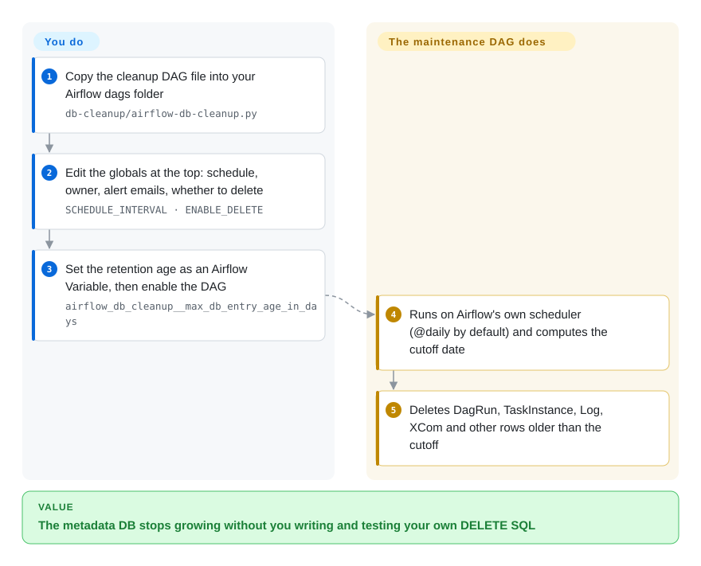

# Airflow Maintenance DAGs

A small collection of ready-made Apache Airflow DAGs that keep an Airflow deployment healthy — clearing old metadata-DB rows, deleting stale task logs, killing zombie tasks, and similar housekeeping you'd otherwise script yourself.

## When to use

You're the data engineer who owns an Apache Airflow cluster, and after a few months it's getting sluggish: the metadata database has ballooned with old DAG runs and task instances, the scheduler is slower, and the workers' disks are filling with task logs nobody reads. You don't want to write and test your own cleanup SQL and log-pruning scripts from scratch and risk deleting the wrong rows. You drop one of this repo's DAGs (e.g. `db-cleanup`, `log-cleanup`, `kill-halted-tasks`) into your `dags/` folder, set a couple of variables (retention age, which tables), and let Airflow itself run the maintenance on a schedule — using the same scheduler, logging, and UI you already operate. Because it's *just DAGs*, there's nothing new to deploy: it rides on your existing Airflow.

You reach for it specifically when you want **proven, copy-in maintenance recipes** instead of reinventing metadata-DB hygiene. It's a pattern library you adapt, not a product you install.

## How it works

There is no installer and no service: each maintenance task is one Python file that *is* an Airflow DAG (a scheduled workflow definition Airflow picks up from its `dags/` folder). **You do** the deployment by hand — copy the file, edit the constants at its top (schedule, owner, alert emails, `ENABLE_DELETE`), create the Variables it reads, and switch the DAG on. **Airflow does the scheduling** as for any other DAG, and the file's own code does the work: `db-cleanup` uses Airflow's ORM models (the Python classes that map to metadata-DB tables) to find rows older than the retention age and delete them; `log-cleanup` deletes old task-log files on disk; `kill-halted-tasks` kills background processes that no longer match a running task in the DB. Note that `db-cleanup` ships with `ENABLE_DELETE = True`, so the first run deletes for real unless you set it to `False` for a log-only dry run. Because the code imports Airflow internals directly, it only works while your Airflow version still has those models — and the repo's last commit is from 2022-10.

<!-- flow-steps:begin (generated from flows/airflow-maintenance-dags.json by tools/flow_card.py — do not edit) -->

Text version of the flow

1. **You**: Copy the cleanup DAG file into your Airflow dags folder — `db-cleanup/airflow-db-cleanup.py`
2. **You**: Edit the globals at the top: schedule, owner, alert emails, whether to delete — `SCHEDULE_INTERVAL · ENABLE_DELETE`
3. **You**: Set the retention age as an Airflow Variable, then enable the DAG — `airflow_db_cleanup__max_db_entry_age_in_days`
4. **Airflow Maintenance DAGs**: Runs on Airflow's own scheduler (@daily by default) and computes the cutoff date
5. **Airflow Maintenance DAGs**: Deletes DagRun, TaskInstance, Log, XCom and other rows older than the cutoff

**Value**: The metadata DB stops growing without you writing and testing your own DELETE SQL

<!-- flow-steps:end -->

## When NOT to use

- **You're not running self-managed Airflow.** On a managed service (MWAA, Cloud Composer, Astronomer) some cleanup is handled for you or restricted; check the platform's own retention controls before bolting these on.
- **Your Airflow version differs from what the DAGs target.** These DAGs reach into Airflow's metadata schema and internals, which **change across major versions** (the 1.x→2.x→3.x migrations changed models). A DAG written for an older version may delete the wrong things or fail — pin and test against *your* version. [推断]
- **You need a vendor-supported, SLA-backed tool.** This is a community repo of scripts, not an officially supported Airflow component; you own the risk of running destructive SQL on your metadata DB.
- **You want guaranteed-current maintenance.** Last default-branch commit 2022-10 with no tagged releases — verify each DAG still matches current Airflow internals before trusting it on a newer cluster.
- **You can't accept destructive operations without review.** These DAGs *delete* DB rows and log files, and `db-cleanup` ships with `ENABLE_DELETE = True` — it deletes on the first run unless you change it. Set it to `False` for a log-only dry run first and back up the metadata DB before enabling deletion.

## Comparison

| Alternative | In index | Our verdict | Tradeoff |
|---|---|---|---|
| [Apache Airflow](airflow.md) built-in `db clean` | ✅ | Prefer Airflow's built-in `db clean` when it covers metadata cleanup; use these DAGs for Airflow-aware gaps such as task-log files or zombie tasks. | Recent Airflow ships an official `airflow db clean` CLI for metadata cleanup — first-party and version-matched; prefer it where available, and use these DAGs for cases it doesn't cover (task-log files, zombies). |
| Hand-rolled cleanup DAGs/scripts | 未收录 | Choose hand-rolled scripts only when your schema and deletion policy need full custom control. | Full control, exactly your schema; but you write, test, and maintain destructive SQL yourself — this repo is the proven starting point. |
| Platform retention (MWAA/Composer settings) | 未收录 | Choose managed-service retention knobs when supported safety matters more than custom cleanup coverage. | Managed services expose their own log/metadata retention knobs; less flexible but supported and safer than custom DELETEs. |
| OS-level logrotate / cron | 未收录 | Choose logrotate or cron for non-Airflow log files, not for metadata pruning or zombie-task cleanup. | Handles log files outside Airflow, but can't safely prune the metadata DB or kill zombie tasks the way an Airflow-aware DAG can. |

## Tech stack

- **Language:** Python — standard Airflow DAG definitions using Airflow operators and (for DB cleanup) SQLAlchemy/metadata-DB access.
- **Form factor:** plain `.py` DAG files you copy into your Airflow `dags/` directory; configured via Airflow Variables.
- **Scope of DAGs (seven, as of 2026-10):** `db-cleanup`, `log-cleanup`, `kill-halted-tasks`, `clear-missing-dags`, `delete-broken-dags`, `backup-configs`, and `sla-miss-report`.

## Dependencies

- **Runtime:** an existing **Apache Airflow** deployment (scheduler, webserver, workers, metadata DB) — this repo adds DAGs to it, nothing standalone.
- **Metadata DB access:** the DB-cleanup DAGs need permission to read/delete from Airflow's metadata database (Postgres/MySQL).
- **Install:** copy the chosen DAG files into your `dags/` folder and set the documented Airflow Variables; no package to `pip install`.

## Ops difficulty

**Low to install, but requires care because it's destructive.** Mechanically it's trivial — copy a `.py` file, set a few Variables, and Airflow schedules it like any other DAG; no new service. The difficulty is *correctness and safety*: you must confirm each DAG matches your Airflow version's metadata schema, run it in dry-run/read-only mode first, back up the metadata DB, and set sane retention windows so you don't delete data you still need. Once validated against your version it's near-zero-maintenance — but a version upgrade is a re-validation trigger, since these DAGs depend on Airflow internals that shift between releases. [推断]

## Health & viability

- **Responsiveness**: Cannot be scored — no_traffic.
- **Maintenance (2026-10).** Last default-branch commit 2022-10-24 (the 2024-06 `pushed_at` is not a default-branch commit); **no tagged releases**. The repo is **coasting/stale** rather than actively developed — useful as reference recipes, but not tracking the latest Airflow versions. Not archived. [推断]
- **Governance / bus factor.** Owned by the **teamclairvoyant** organization (a consultancy) with several contributors; org-owned is better than a solo account, but activity has slowed and there's no foundation governance. [推断]
- **Age & Lindy verdict.** Created 2016-12 (~9 years) — long-lived, but only **partially** Lindy: it's old *and was* widely used, yet the slowing cadence (no commit since 2022-10) tempers the "still-active" half of the test. A useful pattern source more than a maintained product. [推断]
- **Adoption.** ~1.8k stars and broad informal use in the Airflow community as the go-to cleanup recipes; many users vendor and adapt the DAGs into their own repos. [未验证]
- **Risk flags.** Apache-2.0 (permissive). Main flags: destructive operations on the metadata DB, dependence on version-specific Airflow internals, and a slowing maintenance cadence. [推断]

## Caveats (unverified)

- [未验证] ~1.8k stars as of 2026-10 (date-sensitive); no GitHub Releases at check time, so no version number is asserted.
- [推断] The DAGs depend on Airflow's metadata schema/internals, which change across Airflow major versions; compatibility with your specific version must be verified before use.
- [推断] Recent Airflow provides a first-party `airflow db clean` for metadata cleanup; the overlap and whether it supersedes the DB-cleanup DAG depends on your Airflow version — not re-verified here.
- [推断] `db-cleanup` imports `SlaMiss` from `airflow.models`; Airflow 3 dropped the old SLA feature, so the file likely fails to import there without edits — not tested on an Airflow 3 cluster.
- [推断] "Run dry-run and back up first" is standard safety guidance for destructive DB operations, inferred from the DAGs' function, not a measured property of any specific DAG.
