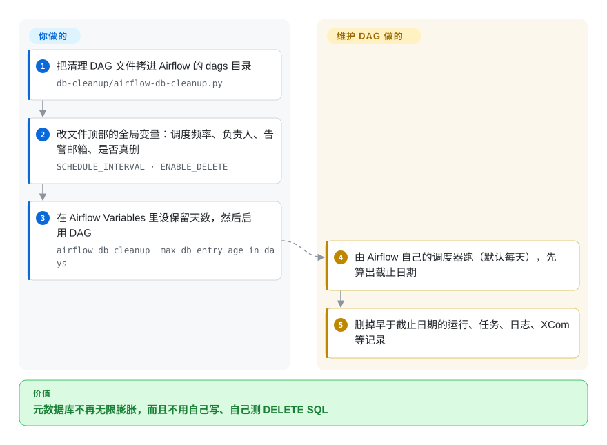

# Airflow Maintenance DAGs

一组现成的 Apache Airflow DAG，用来让 Airflow 部署保持健康——清理元数据库的旧记录、删除陈旧任务日志、清掉僵尸任务，以及其它你本来要自己写脚本做的杂务。

## 何时使用

你是负责一套 Apache Airflow 集群的数据工程师，几个月后它开始迟钝：元数据库被旧的 DAG run 和 task instance 撑大、scheduler 变慢、worker 磁盘被没人看的任务日志塞满。你不想从零写并测试自己的清理 SQL 和日志裁剪脚本，还冒着删错行的风险。你把这个仓库里的某个 DAG（如 `db-cleanup`、`log-cleanup`、`kill-halted-tasks`）放进你的 `dags/` 目录，设几个变量（保留时长、清哪些表），就让 Airflow 自己按调度跑这些维护——用的还是你本就在运维的那套 scheduler、日志和 UI。因为它*只是 DAG*，没有新东西要部署：它搭在你现有的 Airflow 上跑。

你专门选它，是想要**经过验证、拷进去就能用的维护配方**，而不是重新发明元数据库清理这件事。它是你拿来改的模式库，不是你安装的产品。

## 怎么用起来

它没有安装程序，也没有常驻服务：每个维护任务就是一个 Python 文件，这个文件本身就是一个 Airflow DAG（Airflow 从 `dags/` 目录里读取的定时工作流定义）。**部署是你手工做的**——拷文件、改文件顶部的常量（调度频率、负责人、告警邮箱、`ENABLE_DELETE`）、建好它要读的 Variables、在界面上打开这个 DAG。**调度交给 Airflow**，和别的 DAG 一样；干活的是文件里的代码：`db-cleanup` 借 Airflow 的 ORM 模型（对应元数据库各张表的 Python 类）找出超过保留天数的记录并删掉；`log-cleanup` 删磁盘上的旧任务日志；`kill-halted-tasks` 杀掉那些在库里已没有对应运行中任务的后台进程。注意 `db-cleanup` 默认就是 `ENABLE_DELETE = True`，第一次运行就会真删，想先只看日志不删，得手动改成 `False`。代码直接引用 Airflow 内部模型，所以只在你的 Airflow 版本还保留这些模型时才能用——而仓库最后一次提交是 2022-10。

<!-- flow-steps:begin (generated from flows/airflow-maintenance-dags.json by tools/flow_card.py — do not edit) -->

流程文字版

1. **你**：把清理 DAG 文件拷进 Airflow 的 dags 目录 — `db-cleanup/airflow-db-cleanup.py`
2. **你**：改文件顶部的全局变量：调度频率、负责人、告警邮箱、是否真删 — `SCHEDULE_INTERVAL · ENABLE_DELETE`
3. **你**：在 Airflow Variables 里设保留天数，然后启用 DAG — `airflow_db_cleanup__max_db_entry_age_in_days`
4. **Airflow Maintenance DAGs**：由 Airflow 自己的调度器跑（默认每天），先算出截止日期
5. **Airflow Maintenance DAGs**：删掉早于截止日期的运行、任务、日志、XCom 等记录

**价值**：元数据库不再无限膨胀，而且不用自己写、自己测 DELETE SQL

<!-- flow-steps:end -->

## 何时不用

- **你没在跑自管的 Airflow。** 在托管服务（MWAA、Cloud Composer、Astronomer）上，部分清理已替你处理或被限制；在硬塞这些之前，先看平台自己的保留控制。
- **你的 Airflow 版本与这些 DAG 针对的不同。** 这些 DAG 会伸进 Airflow 的元数据 schema 和内部实现，而它们**随大版本变化**（1.x→2.x→3.x 的迁移改了模型）。针对旧版写的 DAG 在新版上可能删错东西或失败——请针对*你的*版本固定并测试。[推断]
- **你需要厂商支持、有 SLA 的工具。** 这是社区的脚本仓库，不是官方支持的 Airflow 组件；在元数据库上跑破坏性 SQL 的风险由你自负。
- **你想要保证与时俱进的维护。** 默认分支最后一次提交在 2022-10，无 tag 发布——在新集群上信任每个 DAG 前，先核实它仍与当前 Airflow 内部实现匹配。
- **你无法接受未经审查的破坏性操作。** 这些 DAG 会*删除* DB 行和日志文件，而且 `db-cleanup` 默认就是 `ENABLE_DELETE = True`——不改的话第一次运行就会真删。先改成 `False` 做只记日志的 dry-run，并在开启删除前备份元数据库。

## 横向对比

| 替代品 | 是否收录 | 我们的评价 | 取舍 |
|---|---|---|---|
| [Apache Airflow](airflow.zh.md) 内置 `db clean` | ✅ | Airflow 内置 `db clean` 覆盖元数据清理时优先用它；这些 DAG 用于任务日志文件或僵尸任务等 Airflow 感知缺口。 | 较新的 Airflow 自带官方 `airflow db clean` CLI 做元数据清理——一等公民且版本匹配；可用处优先用它，这些 DAG 用于它覆盖不到的场景（任务日志文件、僵尸任务）。 |
| 手写清理 DAG/脚本 | 未收录 | 只有你的 schema 和删除策略需要完全自定义控制时，才选手写脚本。 | 完全可控、精确贴合你的 schema；但破坏性 SQL 要你自己写、测、维护——这个仓库是经过验证的起点。 |
| 平台保留策略（MWAA/Composer 设置） | 未收录 | 托管服务支持的安全性比自定义清理覆盖面更重要时，选平台保留旋钮。 | 托管服务暴露自己的日志/元数据保留旋钮；不够灵活但有支持，比自定义 DELETE 更安全。 |
| OS 级 logrotate / cron | 未收录 | 处理 Airflow 之外的日志文件时选 logrotate 或 cron，不要用它们做元数据裁剪或僵尸任务清理。 | 处理 Airflow 之外的日志文件，但无法像 Airflow 感知的 DAG 那样安全裁剪元数据库或清掉僵尸任务。 |

## 技术栈

- **语言：** Python——标准的 Airflow DAG 定义，使用 Airflow operator，并（用于 DB 清理）经 SQLAlchemy/元数据库访问。
- **形态：** 拷进你 Airflow `dags/` 目录的纯 `.py` DAG 文件；通过 Airflow Variable 配置。
- **DAG 范围（截至 2026-10 共七个）：** `db-cleanup`、`log-cleanup`、`kill-halted-tasks`、`clear-missing-dags`、`delete-broken-dags`、`backup-configs`、`sla-miss-report`。

## 依赖

- **运行时：** 一套已有的 **Apache Airflow** 部署（scheduler、webserver、worker、元数据库）——这个仓库往上加 DAG，没有独立组件。
- **元数据库访问：** DB 清理类 DAG 需要读/删 Airflow 元数据库（Postgres/MySQL）的权限。
- **安装：** 把选中的 DAG 文件拷进 `dags/` 目录并设好文档里的 Airflow Variable；没有要 `pip install` 的包。

## 运维难度

**安装很低，但因带破坏性需谨慎。** 机械上很简单——拷一个 `.py` 文件、设几个 Variable，Airflow 就像调度任何 DAG 一样调度它，没有新服务。难点在*正确与安全*：你必须确认每个 DAG 与你 Airflow 版本的元数据 schema 匹配、先以 dry-run/只读模式跑、备份元数据库、并设合理的保留窗口以免删掉仍需要的数据。一旦对你的版本验证通过，它几乎零维护——但版本升级就是一次重新验证的触发点，因为这些 DAG 依赖随版本变动的 Airflow 内部实现。[推断]

## 健康度与可持续性

- **响应速度**：无法计算——no_traffic。
- **维护（2026-10）。** 默认分支最后一次提交在 2022-10-24（2024-06 的 `pushed_at` 不是默认分支提交）；**无 tag 发布**。仓库处于**吃老本/停滞**而非活跃开发——作为参考配方有用，但不跟最新 Airflow 版本。未归档。[推断]
- **治理 / bus factor。** 归 **teamclairvoyant** 组织（一家咨询公司）所有，有数名贡献者；组织所有比 solo 账号好，但活动已放缓，且无基金会治理。[推断]
- **年龄与 Lindy 判断。** 2016-12 创建（约 9 年）——长寿，但只是**部分** Lindy：它既老*又曾*被广泛使用，但放缓的节奏（自 2022-10 无提交）削弱了测试中“仍活跃”那一半。更像一份有用的模式来源，而非在维护的产品。[推断]
- **采用度。** 约 1.8k star，在 Airflow 社区里作为首选清理配方被广泛非正式使用；许多用户把这些 DAG 内置改写进自己的仓库。[未验证]
- **风险标记。** Apache-2.0（宽松）。主要标记：对元数据库的破坏性操作、对版本相关 Airflow 内部实现的依赖，以及放缓的维护节奏。[推断]

## 存疑（未验证）

- [未验证] 截至 2026-10 约 1.8k star（随时间变化）；检查时无 GitHub Releases，故不断言版本号。
- [推断] 这些 DAG 依赖 Airflow 的元数据 schema/内部实现，它们随 Airflow 大版本变化；与你具体版本的兼容性须在使用前核实。
- [推断] 较新的 Airflow 提供一等公民的 `airflow db clean` 做元数据清理；其重叠程度及是否取代 DB 清理 DAG 取决于你的 Airflow 版本——此处未重新核实。
- [推断] `db-cleanup` 从 `airflow.models` 导入 `SlaMiss`；Airflow 3 去掉了旧的 SLA 功能，所以不改代码的话这个文件在 Airflow 3 上大概率导入失败——没有在 Airflow 3 集群上实测。
- [推断] “先 dry-run 并备份”是破坏性 DB 操作的标准安全建议，由 DAG 的功能推断，而非对某个具体 DAG 的实测属性。
