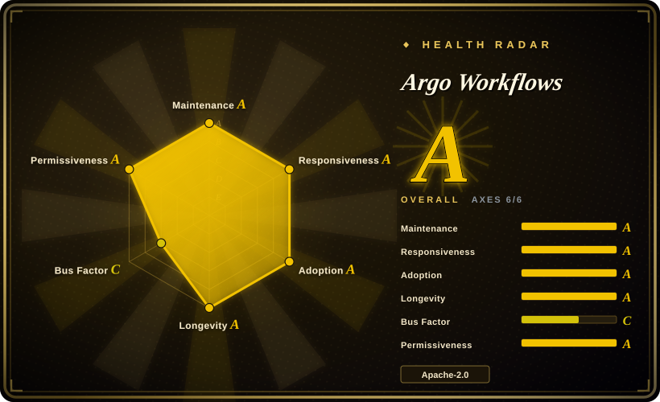
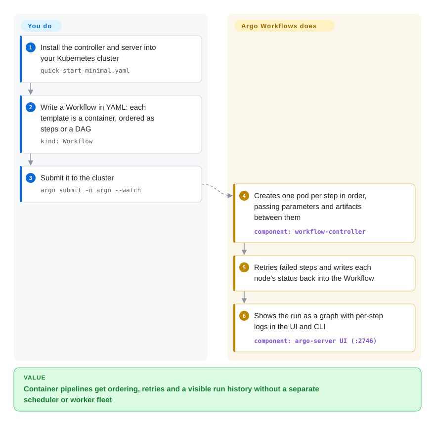

# Argo Workflows

Your batch jobs — a 40-step ML training pipeline, a nightly fan-out over 2,000 files — already run as containers on Kubernetes, but they are stitched together by shell scripts and cron, and when step 31 fails at 3 a.m. nobody can see what ran or rerun just that part. Argo Workflows adds a "Workflow" object to Kubernetes: you write the steps and their order in YAML, and a controller launches each step as its own pod, passes outputs along, retries failures, and shows the whole run in a UI.

## When to use

You're a platform or ML engineer on a team that already runs everything on Kubernetes. Data scientists hand you pipelines — preprocess, train five model variants in parallel on GPU nodes, evaluate, push the winner — and today each one is a Python script that calls `kubectl` in a loop or a CronJob chain where a failed step means rerunning everything. You reach for Argo Workflows: install the controller into the cluster, describe the pipeline as a `Workflow` resource whose templates each name a container image, wire the order as a DAG (`dependencies:`) or sequential `steps`, and `argo submit` it. Each step becomes a pod with the CPU, memory, GPU, node selector and service account you specify; parameters and S3/GCS artifacts flow between steps; failures retry per step; and the UI shows the graph with logs for every node. Python users can author the same YAML through the Hera SDK.

The deciding tradeoff against [Apache Airflow](airflow.md) and [Dagster](dagster.md) is "every step is a Kubernetes pod, declared as a Kubernetes resource" versus "every step is Python code in a scheduler you run": Argo needs no worker pool, no Python runtime in your steps and fits GitOps and Kubernetes RBAC natively, but it has no operator/integration library and no data-asset model — it orchestrates containers, not datasets.

## How it works

Argo Workflows extends Kubernetes with its own resource types — a CRD (Custom Resource Definition, a way to teach the Kubernetes API a new kind of object) called `Workflow`, plus `WorkflowTemplate` and `CronWorkflow`. You write a Workflow in YAML: a list of templates, each either a container to run or a list of other templates in `steps` or `dag` order. A controller running in the cluster watches for new Workflows and, step by step, creates one pod per task, injecting a small helper (the "emissary" executor) that runs alongside your container to collect its outputs, upload artifacts and report exit status. The controller records every step's state back into the Workflow object itself, so `kubectl get workflow` and the Argo UI/CLI show progress, and a failed node can be retried or the run resubmitted. It does the scheduling, ordering, retries, parameter/artifact passing and garbage collection; you supply container images, the YAML, an artifact bucket (S3, GCS, MinIO, Azure Blob…) if steps exchange files, and a SQL database if you want finished runs archived beyond the cluster.

<!-- flow-steps:begin (generated from flows/argo-workflows.json by tools/flow_card.py — do not edit) -->

Text version of the flow

1. **You**: Install the controller and server into your Kubernetes cluster — `quick-start-minimal.yaml`
2. **You**: Write a Workflow in YAML: each template is a container, ordered as steps or a DAG — `kind: Workflow`
3. **You**: Submit it to the cluster — `argo submit -n argo --watch`
4. **Argo Workflows**: Creates one pod per step in order, passing parameters and artifacts between them — component: `workflow-controller`
5. **Argo Workflows**: Retries failed steps and writes each node's status back into the Workflow
6. **Argo Workflows**: Shows the run as a graph with per-step logs in the UI and CLI — component: `argo-server UI (:2746)`

**Value**: Container pipelines get ordering, retries and a visible run history without a separate scheduler or worker fleet

<!-- flow-steps:end -->

## When NOT to use

- **You don't run Kubernetes.** Argo has no standalone mode; the controller, executor and state all live in a cluster. For pipelines on VMs or a laptop, use [Apache Airflow](airflow.md), [Prefect](prefect.md) or [Dagster](dagster.md).
- **Your steps are thousands of tiny, sub-second tasks.** Each step is a pod, so every step pays pod scheduling and container start time, and status for every node is stored in the Workflow object (etcd caps objects at 1 MB; beyond that Argo compresses and then needs a SQL database for "node status offloading"). For high-volume fine-grained tasks, batch them inside one step or use an in-process engine such as [Temporal](temporal.md) or a Python orchestrator.
- **You want data-asset lineage, freshness checks or a library of SaaS integrations.** Argo knows containers and artifacts, not tables. A data team that thinks in "is this table up to date?" is better served by [Dagster](dagster.md); one that needs hundreds of prebuilt connectors by [Apache Airflow](airflow.md)'s provider packages.
- **You need durable, long-running business workflows with signals and human waits.** Argo can suspend and resume, but it is a batch DAG runner. For order-processing or approval flows that live for days and react to external events, use [Temporal](temporal.md).
- **You're on the old Python SDK or deprecated fields.** v4.0 removed the `argo-workflows` PyPI SDK (use Hera instead) and dropped `schedule` in CronWorkflows, `podPriority`, `mutex` and `semaphore`; v4.0.7 changed how outputs of skipped steps resolve. Read `docs/upgrading.md` before moving a v3 cluster.

## Comparison

| Alternative | In index | Our verdict | Tradeoff |
|---|---|---|---|
| [Apache Airflow](airflow.md) | ✅ | When pipelines call many external systems from Python and you want a large operator catalog, pick Airflow; when every step is already a container on Kubernetes, pick Argo Workflows. | Airflow brings provider packages and a Python scheduler you must run with workers and a metadata DB; Argo has no integration library but needs nothing beyond the cluster and uses pods as workers. |
| [Dagster](dagster.md) | ✅ | Pick Dagster when the team reasons about data assets, lineage and freshness; pick Argo Workflows when the unit of work is a container image and data semantics live elsewhere. | Dagster adds an asset graph, typed I/O and local testability but runs its own webserver/daemon; Argo is lower-level and language-agnostic, with no notion of a dataset. |
| [Temporal](temporal.md) | ✅ | For long-lived, event-driven application workflows (payments, approvals), pick Temporal; for batch DAGs of containers, pick Argo Workflows. | Temporal runs workflow code durably in your services with signals and timers; Argo runs short-to-medium batch graphs of pods and records state in Kubernetes. |
| Tekton Pipelines | not indexed | For CI/CD build-test-deploy pipelines on Kubernetes, prefer Tekton; for data/ML batch DAGs with artifacts, loops and a run UI, prefer Argo Workflows. | Both are Kubernetes CRD engines; Tekton is shaped around CI tasks and its own catalog, Argo around general batch DAGs, memoization and archiving. |
| Kubeflow Pipelines | not indexed | If you want an ML-specific layer (experiments, model lineage) on top, use Kubeflow Pipelines, which itself compiles to Argo; use Argo Workflows directly when you only need the engine. | Kubeflow adds ML metadata and a Python DSL at the cost of a much larger install; raw Argo is smaller but leaves experiment tracking to you. |

## Tech stack

- **Language:** Go (controller, server, CLI, executor); UI in TypeScript/React.
- **Kubernetes objects:** CRDs `Workflow`, `WorkflowTemplate`, `ClusterWorkflowTemplate`, `CronWorkflow`, plus task-result objects; v4 ships full-validation CRDs by default.
- **Components:** `workflow-controller` (reconciles Workflows into pods), `argo-server` (REST/gRPC API + UI on port 2746), `argo` CLI, and the `emissary` executor running in every step pod.
- **SDKs:** Hera (Python, recommended since the old SDK was removed in v4.0), plus Java, Go and TypeScript clients.
- **Observability:** Prometheus metrics, OAuth2/OIDC SSO for the UI.

## Dependencies

- **Required:** a Kubernetes cluster and `kubectl`; installed by release manifests (cluster-wide, namespace or managed-namespace install) or the community Helm chart.
- **Artifact repository (optional, common):** S3-compatible (AWS, MinIO, GCS) or Azure Blob, Artifactory, HDFS, HTTP, Git — needed when steps pass files.
- **SQL database (optional):** Postgres ≥ 9.4, MySQL ≥ 5.7.8 or MariaDB ≥ 10.2 for the workflow archive and for offloading node status of very large workflows. The quick-start manifest bundles a Postgres that is not meant for production.
- **Container images:** each step's image must be pullable from the cluster.

## Ops difficulty

**Medium.** If you already operate Kubernetes, installing the controller and server is one manifest or Helm release, and there is no separate worker fleet. The real work is cluster-side: RBAC and service accounts per namespace, an artifact bucket with credentials, pod garbage collection and TTLs so finished pods don't pile up, a production database for archiving, SSO for the UI, and watching controller memory on clusters with many large workflows. Upgrades across minors (v3 → v4) carry documented behavior changes, and you must keep CRDs in step with the controller version.

## Health & viability

- **Maintenance (2026-10):** very active — commits every week of the last quarter, patch releases roughly weekly, with v4.1, v4.0 and v3.7 lines patched in parallel (v4.1.4 / v4.0.12 on 2026-09-18).
- **Governance:** CNCF graduated project under the `argoproj` org (shared with Argo CD, Argo Events, Argo Rollouts); 23 maintainers active in the last 12 months, but the top contributor accounts for 65% of recent commits (top three 77%), hence a C on governance despite foundation backing.
- **Age / Lindy:** created 2017-08, about 9 years old and still shipping major versions — a strong Lindy prior for a Kubernetes-native tool.
- **Adoption:** release-asset downloads (CLI binaries) above 11 million and Homebrew installs place it at A; the README lists 200+ organizations in `USERS.md`, and Kubeflow Pipelines and Metaflow build on it.
- **Risk flags:** Apache-2.0, no relicense; CNCF ownership makes a license change unlikely. The main risk is upgrade churn between minors and the sheer open-issue backlog (1,300+).

## Caveats (unverified)

- [推断] Per-step pod start overhead makes very fine-grained tasks inefficient — follows from the one-pod-per-step design; no benchmark was run here.
- [未验证] "200+ organizations" is the README's count from `USERS.md`; not audited.
- [推断] The top-contributor share (65%) is the health scorer's commit-window statistic and may count bots or merge commits differently from human authorship.
- [未验证] Kubeflow Pipelines' current backend still compiling to Argo Workflows is taken from Argo's README ecosystem list; KFP's own docs were not checked.
- [未验证] Tekton Pipelines' positioning is from general knowledge of the project; its repository was not reread for this page.
