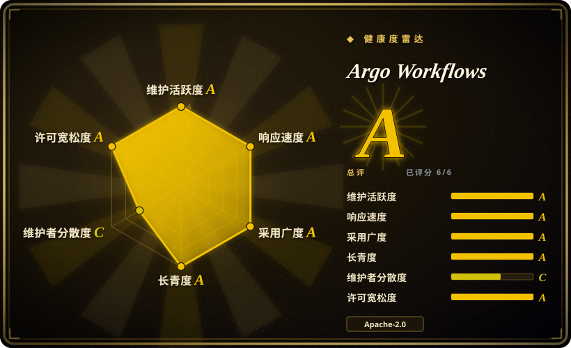
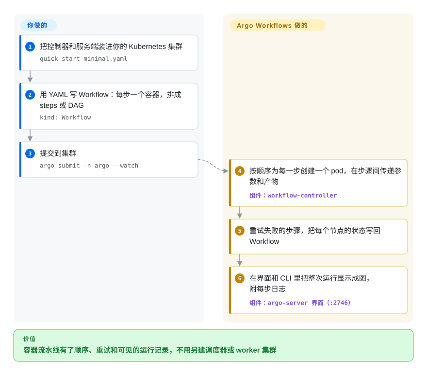

# Argo Workflows

你的批处理任务——一条 40 步的模型训练流水线、每晚对 2000 个文件的并行处理——早就以容器形式跑在 Kubernetes 上，却靠 shell 脚本和 cron 串起来；凌晨三点第 31 步挂了，没人看得清跑过什么，也没法只重跑那一段。Argo Workflows 给 Kubernetes 加了一种叫 “Workflow” 的对象：你用 YAML 写好步骤和先后顺序，控制器把每一步作为单独的 pod 启动，传递上一步的输出，失败自动重试，整次运行在界面上一目了然。

## 何时使用

你是一个所有东西都跑在 Kubernetes 上的团队里的平台或机器学习工程师。数据科学家把流水线交给你——预处理、在 GPU 节点上并行训练五个模型变体、评估、推送最优者——现在每条流水线要么是一个循环调用 `kubectl` 的 Python 脚本，要么是一串 CronJob，某一步失败就得全部重跑。于是你选 Argo Workflows：把控制器装进集群，把流水线写成一个 `Workflow` 资源，每个模板指定一个容器镜像，用 DAG（`dependencies:`）或顺序 `steps` 编排先后，然后 `argo submit`。每一步都变成一个 pod，CPU、内存、GPU、节点选择器和服务账号都按你写的来；参数和 S3/GCS 上的产物（artifact）在步骤间流转；失败按步骤重试；界面上能看到整张图和每个节点的日志。习惯 Python 的人可以通过 Hera SDK 生成同样的 YAML。

和 [Apache Airflow](airflow.zh.md)、[Dagster](dagster.zh.md) 相比，决定性的取舍是“每一步都是 Kubernetes pod、以 Kubernetes 资源声明”对“每一步都是你自己运维的调度器里的 Python 代码”：Argo 不需要 worker 池，步骤里不需要 Python 运行时，天然契合 GitOps 和 Kubernetes RBAC；但它没有算子/集成库，也没有数据资产模型——它编排的是容器，不是数据集。

## 怎么用起来

Argo Workflows 给 Kubernetes 扩展了自己的资源类型——一种叫 `Workflow` 的 CRD（Custom Resource Definition，让 Kubernetes API 认识一种新对象的机制），以及 `WorkflowTemplate`、`CronWorkflow`。你用 YAML 写一个 Workflow：一组模板，每个模板要么是一个要运行的容器，要么是按 `steps` 或 `dag` 顺序排列的其他模板。集群里运行的控制器监听新的 Workflow，逐步为每个任务创建一个 pod，并注入一个小助手（“emissary” 执行器），和你的容器并排运行，负责收集输出、上传产物、上报退出状态。控制器把每一步的状态写回 Workflow 对象本身，所以 `kubectl get workflow` 和 Argo 的界面/CLI 都能看到进度，失败的节点可以重试，整次运行也可以重新提交。调度、排序、重试、参数和产物传递、垃圾回收都归它；你提供容器镜像、YAML、步骤之间要传文件时的产物存储桶（S3、GCS、MinIO、Azure Blob 等），以及如果要把跑完的记录归档到集群之外，再提供一个 SQL 数据库。

<!-- flow-steps:begin (generated from flows/argo-workflows.json by tools/flow_card.py — do not edit) -->

流程文字版

1. **你**：把控制器和服务端装进你的 Kubernetes 集群 — `quick-start-minimal.yaml`
2. **你**：用 YAML 写 Workflow：每步一个容器，排成 steps 或 DAG — `kind: Workflow`
3. **你**：提交到集群 — `argo submit -n argo --watch`
4. **Argo Workflows**：按顺序为每一步创建一个 pod，在步骤间传递参数和产物 — 组件：`workflow-controller`
5. **Argo Workflows**：重试失败的步骤，把每个节点的状态写回 Workflow
6. **Argo Workflows**：在界面和 CLI 里把整次运行显示成图，附每步日志 — 组件：`argo-server 界面（:2746）`

**价值**：容器流水线有了顺序、重试和可见的运行记录，不用另建调度器或 worker 集群

<!-- flow-steps:end -->

## 何时不用

- **你没有 Kubernetes。** Argo 没有独立运行模式，控制器、执行器和状态都在集群里。在虚拟机或笔记本上跑流水线，改用 [Apache Airflow](airflow.zh.md)、[Prefect](prefect.zh.md) 或 [Dagster](dagster.zh.md)。
- **你的步骤是成千上万个亚秒级小任务。** 每一步都是一个 pod，都要付出 pod 调度和容器启动的时间；每个节点的状态都存在 Workflow 对象里（etcd 单个对象上限 1 MB，超出后 Argo 先压缩，再不够就需要 SQL 数据库做“节点状态卸载”）。高频细粒度任务，要么在一个步骤里批量处理，要么用进程内执行的引擎，比如 [Temporal](temporal.zh.md) 或 Python 编排器。
- **你要的是数据资产血缘、新鲜度检查或一堆 SaaS 集成。** Argo 认识的是容器和产物，不是数据表。习惯用“这张表是不是最新的”来思考的数据团队，用 [Dagster](dagster.zh.md) 更顺手；需要几百个现成连接器的，用 [Apache Airflow](airflow.zh.md) 的 provider 包。
- **你需要能持久运行、响应信号和人工等待的业务流程。** Argo 可以暂停和恢复，但它是批处理 DAG 执行器。持续数天、要响应外部事件的订单处理或审批流程，用 [Temporal](temporal.zh.md)。
- **你还在用旧的 Python SDK 或已废弃的字段。** v4.0 移除了 PyPI 上的 `argo-workflows` SDK（改用 Hera），并去掉了 CronWorkflow 里的 `schedule`、`podPriority`、`mutex` 和 `semaphore`；v4.0.7 改变了被跳过步骤的输出如何解析。把 v3 集群升上来之前先读 `docs/upgrading.md`。

## 横向对比

| 替代品 | 是否收录 | 我们的评价 | 取舍 |
|---|---|---|---|
| [Apache Airflow](airflow.zh.md) | 已收录 | 流水线要从 Python 调用大量外部系统、想要庞大的算子目录时，选 Airflow；每一步本来就是 Kubernetes 上的容器时，选 Argo Workflows。 | Airflow 带来 provider 包，但要自己运维 Python 调度器、worker 和元数据库；Argo 没有集成库，但除了集群什么都不用加，pod 就是 worker。 |
| [Dagster](dagster.zh.md) | 已收录 | 团队以数据资产、血缘和新鲜度来思考时，选 Dagster；工作单元是容器镜像、数据语义在别处管理时，选 Argo Workflows。 | Dagster 提供资产图、带类型的输入输出和本地可测性，但要跑它自己的 webserver/daemon；Argo 更底层、与语言无关，没有“数据集”的概念。 |
| [Temporal](temporal.zh.md) | 已收录 | 长期存活、事件驱动的应用流程（支付、审批）选 Temporal；由容器组成的批处理 DAG 选 Argo Workflows。 | Temporal 在你的服务里持久地执行流程代码，支持信号和定时器；Argo 跑的是短到中等时长的 pod 批处理图，状态记在 Kubernetes 里。 |
| Tekton Pipelines | 未收录 | Kubernetes 上的 CI/CD（构建、测试、部署）流水线优先选 Tekton；带产物、循环和运行界面的数据/机器学习批处理 DAG 优先选 Argo Workflows。 | 两者都是 Kubernetes CRD 引擎；Tekton 围绕 CI 任务和自己的任务目录设计，Argo 围绕通用批处理 DAG、记忆化（memoization）和归档设计。 |
| Kubeflow Pipelines | 未收录 | 想在上层要一个面向机器学习的层（实验管理、模型血缘），用 Kubeflow Pipelines，它本身就编译到 Argo 上运行；只需要引擎时直接用 Argo Workflows。 | Kubeflow 增加了机器学习元数据和 Python DSL，代价是大得多的安装量；直接用 Argo 更小，但实验追踪要你自己解决。 |

## 技术栈

- **语言：** Go（控制器、服务端、CLI、执行器）；界面用 TypeScript/React。
- **Kubernetes 对象：** CRD `Workflow`、`WorkflowTemplate`、`ClusterWorkflowTemplate`、`CronWorkflow`，以及任务结果等辅助对象；v4 默认安装带完整校验信息的 CRD。
- **组件：** `workflow-controller`（把 Workflow 调和成 pod）、`argo-server`（REST/gRPC API 和界面，端口 2746）、`argo` CLI，以及每个步骤 pod 里运行的 `emissary` 执行器。
- **SDK：** Hera（Python，v4.0 移除旧 SDK 之后的推荐选择），另有 Java、Go、TypeScript 客户端。
- **可观测性：** Prometheus 指标；界面支持 OAuth2/OIDC 单点登录。

## 依赖

- **必需：** 一个 Kubernetes 集群和 `kubectl`；通过发布清单（整集群安装、单命名空间安装或托管命名空间安装）或社区 Helm chart 安装。
- **产物仓库（可选，但常用）：** 兼容 S3 的存储（AWS、MinIO、GCS）或 Azure Blob、Artifactory、HDFS、HTTP、Git——步骤之间要传文件时需要。
- **SQL 数据库（可选）：** Postgres ≥ 9.4、MySQL ≥ 5.7.8 或 MariaDB ≥ 10.2，用于工作流归档，以及超大工作流的节点状态卸载。快速上手清单里自带一个 Postgres，但不适合生产。
- **容器镜像：** 每一步的镜像都必须能从集群拉取。

## 运维难度

**中等。** 如果你已经在运维 Kubernetes，安装控制器和服务端只是一份清单或一个 Helm release，也不需要单独的 worker 集群。真正的工作在集群侧：每个命名空间的 RBAC 和服务账号、一个带凭据的产物存储桶、pod 垃圾回收和 TTL（不然跑完的 pod 会越堆越多）、用于归档的生产级数据库、界面的单点登录，以及在大工作流很多的集群上盯住控制器内存。跨小版本升级（v3 → v4）有文档列出的行为变化，CRD 也必须和控制器版本保持一致。

## 健康度与可持续性

- **维护（2026-10）：** 非常活跃——最近一个季度每周都有提交，补丁版本大约每周一发，v4.1、v4.0、v3.7 三条线并行打补丁（2026-09-18 发布 v4.1.4 / v4.0.12）。
- **治理：** CNCF 毕业项目，归属 `argoproj` 组织（与 Argo CD、Argo Events、Argo Rollouts 同组织）；近 12 个月有 23 位活跃维护者，但头号贡献者占近期提交的 65%（前三位合计 77%），所以尽管有基金会背书，治理轴仍是 C。
- **年龄 / Lindy：** 2017-08 创建，约 9 年，仍在发大版本——对一个 Kubernetes 原生工具来说是很强的 Lindy 先验。
- **采纳度：** 发布产物（CLI 二进制）下载量超过 1100 万次，加上 Homebrew 安装量，采纳轴为 A；README 称 `USERS.md` 里有 200 多家组织，Kubeflow Pipelines 和 Metaflow 都构建在它之上。
- **风险信号：** Apache-2.0，无改许可历史；CNCF 所有权让改许可的可能性很低。主要风险是小版本之间的升级变动，以及庞大的未关闭 issue 积压（1300 多个）。

## 存疑（未验证）

- [推断] 每一步都要启动 pod，使得极细粒度的任务效率很低——这是从“一步一个 pod”的设计推出来的，本次没有跑基准测试。
- [未验证] “200 多家组织”是 README 根据 `USERS.md` 给出的数字，没有逐一核对。
- [推断] 头号贡献者占比（65%）是健康度评分器在提交窗口上的统计，对机器人账号和合并提交的计算方式可能与人工统计不同。
- [未验证] Kubeflow Pipelines 当前后端仍编译到 Argo Workflows，这一点取自 Argo README 的生态列表，没有查 KFP 自己的文档。
- [未验证] Tekton Pipelines 的定位来自对该项目的一般了解，本页没有重读它的仓库。
