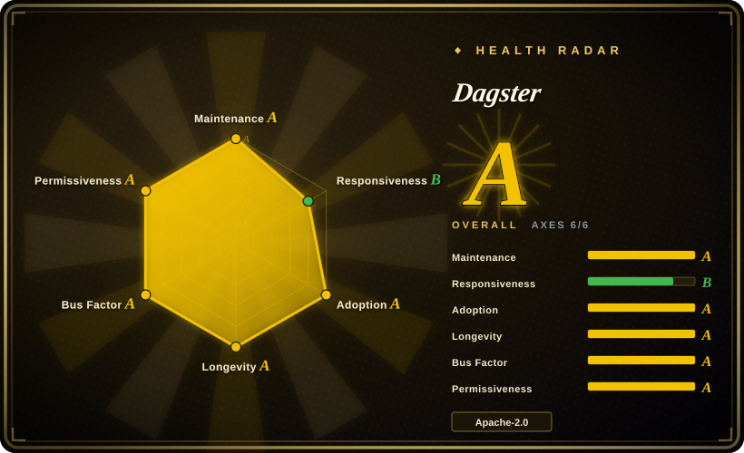
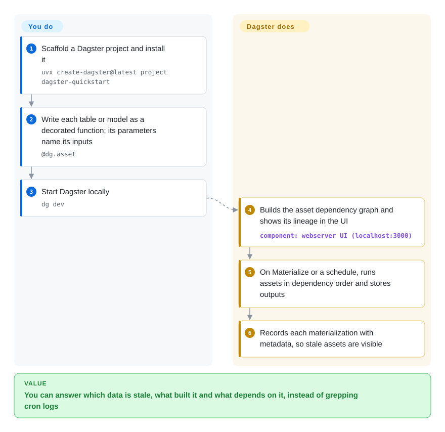

# Dagster

A dashboard shows yesterday's numbers and nobody can say which upstream table was stale, which job last rebuilt it, or what else breaks if you change it — because your scheduler only knows "task 7 ran at 02:00", not what data it produced. Dagster flips the unit: you declare each table, file or model as a Python function (an "asset"), it infers the dependency graph from the function arguments, and it records when each asset was last built, by which run, and whether it is now out of date.

## When to use

You're a data or analytics engineer owning a warehouse pipeline: raw tables land from Fivetran, dbt models transform them, a Python step trains a forecast, and a report reads the result. Today it is a set of cron-scheduled scripts (or Airflow DAGs whose tasks don't say what they write), so when the CFO asks "why is the revenue chart from Tuesday?" you grep logs. You reach for Dagster: each output becomes an `@dg.asset` function whose parameters name the assets it reads, dbt models are imported as assets through `dagster-dbt`, and the web UI shows the whole lineage graph with the last materialization, its metadata and its logs. You develop and unit-test assets locally with `dg dev` before shipping, and schedules or sensors rebuild only what is stale.

The deciding tradeoff against [Apache Airflow](airflow.md) and [Prefect](prefect.md) is "orchestrate data assets with lineage and testability" versus "orchestrate tasks": Dagster's model pays off when the team reasons about tables and their freshness, at the cost of a more opinionated framework and a smaller operator catalog than Airflow's providers. Against [Argo Workflows](argo-workflows.md), Dagster is Python-first and data-aware but needs its own long-running services.

## How it works

You write ordinary Python functions and decorate each with `@dg.asset`; the function's return value *is* the asset (a DataFrame, a table written to a warehouse, a model file), and naming another asset as a parameter declares that this one depends on it. Dagster loads your project's "definitions" (assets, schedules, sensors and resources such as warehouse connections) into a code server, builds the dependency graph, and serves it in a web UI. When you click Materialize, or a schedule or sensor fires, it plans a run in dependency order, launches a run worker (a local process, a container or a Kubernetes pod, depending on configuration), stores each output through an "IO manager" (the pluggable piece that decides where outputs are written and read back from), and records the materialization event with metadata in its own database. You own the transformation code, the resources and where it runs; Dagster owns ordering, retries, the run history, lineage and staleness tracking. In production three services run long-term: the webserver (UI and GraphQL API), the daemon (schedules, sensors, run queue) and one code-location server per project; the hosted Dagster+ product can run the first two for you.

<!-- flow-steps:begin (generated from flows/dagster.json by tools/flow_card.py — do not edit) -->

Text version of the flow

1. **You**: Scaffold a Dagster project and install it — `uvx create-dagster@latest project dagster-quickstart`
2. **You**: Write each table or model as a decorated function; its parameters name its inputs — `@dg.asset`
3. **You**: Start Dagster locally — `dg dev`
4. **Dagster**: Builds the asset dependency graph and shows its lineage in the UI — component: `webserver UI (localhost:3000)`
5. **Dagster**: On Materialize or a schedule, runs assets in dependency order and stores outputs
6. **Dagster**: Records each materialization with metadata, so stale assets are visible

**Value**: You can answer which data is stale, what built it and what depends on it, instead of grepping cron logs

<!-- flow-steps:end -->

## When NOT to use

- **You need a large catalog of ready-made operators for arbitrary systems.** Dagster ships about 70 integration libraries (dbt, Snowflake, AWS, Kubernetes, …), but Airflow's provider ecosystem is broader and its "call system X" tasks need no data model. If most of your jobs are "trigger this API, then that one", use [Apache Airflow](airflow.md).
- **Your workloads are containers on Kubernetes with no data semantics.** If every step is an image and you don't care about tables or lineage, [Argo Workflows](argo-workflows.md) runs DAGs of pods with nothing but the cluster; Dagster would add a webserver, daemon and code servers for little gain.
- **You need long-running, event-driven application workflows.** Dagster is a batch and data-pipeline orchestrator. Payment flows, approvals or anything that waits days for a signal belong in [Temporal](temporal.md).
- **You need RBAC, SSO, audit logs, alerting policies or branch deployments without paying.** In Dagster's docs these are Dagster+ (hosted, commercial) features; the open-source webserver has no built-in login, so self-hosters put it behind their own auth proxy and wire alerts themselves. If those are mandatory and you won't buy Dagster+, weigh [Apache Airflow](airflow.md), whose open-source webserver includes authentication and role-based access.
- **Your team wants a light task runner with minimal concepts.** Assets, ops, jobs, resources, IO managers, code locations and the `dg` CLI form a real learning curve. For "run these Python functions on a schedule with retries", [Prefect](prefect.md) is less to learn.

## Comparison

| Alternative | In index | Our verdict | Tradeoff |
|---|---|---|---|
| [Apache Airflow](airflow.md) | ✅ | Pick Airflow when the work is mostly calling external systems from scheduled tasks and the provider catalog matters; pick Dagster when you need asset lineage, staleness and local testing. | Airflow has the broadest operator ecosystem and built-in webserver auth; Dagster models data assets explicitly and tests them locally, but is more opinionated with fewer integrations. |
| [Prefect](prefect.md) | ✅ | Pick Prefect for lightweight Python task flows with minimal framework; pick Dagster when the outputs are tables and models whose lineage and freshness you must track. | Prefect wraps existing Python with few concepts; Dagster asks you to restructure around assets and returns a lineage graph, catalog and freshness checks. |
| [Argo Workflows](argo-workflows.md) | ✅ | Pick Argo Workflows when every step is a container on Kubernetes and data semantics live elsewhere; pick Dagster when steps are Python and the data graph is the point. | Argo needs only the cluster and is language-agnostic; Dagster runs its own webserver/daemon/code servers but understands assets. |
| [Temporal](temporal.md) | ✅ | Pick Temporal for durable, signal-driven business workflows; pick Dagster for scheduled data pipelines. | Temporal guarantees code execution across failures over days; Dagster schedules batch materializations and tracks data, not long-lived application state. |
| dbt Core | not indexed | Use dbt Core alone when the whole pipeline is SQL in one warehouse; add Dagster when dbt models sit between Python ingestion, ML and reporting steps. | dbt alone needs no orchestrator but only sees SQL models; Dagster imports dbt models as assets and orchestrates them with everything around them. |

## Tech stack

- **Language:** Python (supports 3.10 to 3.14 per PyPI metadata for 1.13.25); UI in TypeScript/React (`js_modules/`).
- **Core packages:** `dagster` (framework), `dagster-webserver` (UI + GraphQL API via `dagster-graphql`), `dagster-dg-cli` (the `dg` project CLI), `create-dagster` (scaffolder), `dagster-pipes` (run external processes and report back).
- **Integrations:** about 70 packages under `python_modules/libraries` — e.g. `dagster-dbt`, `dagster-snowflake`, `dagster-aws`, `dagster-k8s`, `dagster-postgres`, `dagster-celery`, `dagster-airlift` (migrate from Airflow).
- **Storage:** run/event/schedule storage defaults to SQLite; Postgres (or MySQL) storages for production.
- **Execution:** pluggable run launchers and executors — local process, Docker, Kubernetes, Celery, ECS.

## Dependencies

- **Runtime:** Python and your project's packages; locally `dg dev` serves the UI on one machine with the default SQLite storage.
- **Production services:** `dagster-webserver`, `dagster-daemon` (only one replica supported), and a code-location server per project.
- **Database:** a production database (typically Postgres) for run, event-log and schedule storage; the SQLite default is for local use.
- **Compute:** wherever runs launch — the same host, Docker, a Kubernetes cluster (official Helm chart), or ECS.
- **Optional:** Dagster+ (hosted control plane, serverless or hybrid agents) instead of running the webserver and daemon yourself.

## Ops difficulty

**Medium.** Local development is easy (`dg dev`, SQLite, one machine). Self-hosted production means running the webserver, a single daemon, code-location servers, a Postgres database and a run launcher (often the Helm chart on Kubernetes), then handling upgrades on a fast release cadence — 1.13.x patch releases land about weekly — plus adding your own auth in front of the UI. Dagster+ removes the control-plane half of that in exchange for a subscription and sending metadata to a hosted service.

## Health & viability

- **Maintenance (2026-10):** very active — commits every week of the last quarter and 1.13.x releases roughly weekly (1.13.25 on 2026-10-01). Not archived.
- **Governance:** owned by Dagster Labs, the company selling Dagster+; broad contributor base — 89 maintainers active in 12 months, top contributor at about 31% of commits — so day-to-day bus factor is good, while the roadmap is one vendor's.
- **Age / Lindy:** created 2018-04, about 8 years old and still on a steady 1.x line — a solid Lindy prior, though younger than Airflow.
- **Adoption:** 7,886,605 PyPI downloads in the last month (scorer snapshot), strong for a data orchestrator.
- **Responsiveness:** median first response to new issues 68.9 hours (B, 2026-10-09), slower than its commit pace; 2,500+ open issues.
- **Risk flags:** Apache-2.0 with no relicense; the open-core split (alerts, Insights, RBAC/SSO, branch deployments are Dagster+-only in the docs) is the thing to watch if more features move behind it.

## Caveats (unverified)

- [推断] The open-source webserver has no built-in authentication — inferred from authentication/RBAC docs existing only under the Dagster+ section; not tested against a running instance.
- [未验证] The README still says Python 3.9–3.14 while PyPI metadata for 1.13.25 requires ≥3.10; the PyPI value is used here.
- [推断] "About 70 integration libraries" counts directories under `python_modules/libraries`, which includes a few non-integration helpers.
- [未验证] Airflow's open-source webserver authentication and RBAC were not re-verified for this comparison.
- [未验证] dbt Core's positioning is from general knowledge; its repository was not reread for this page.
