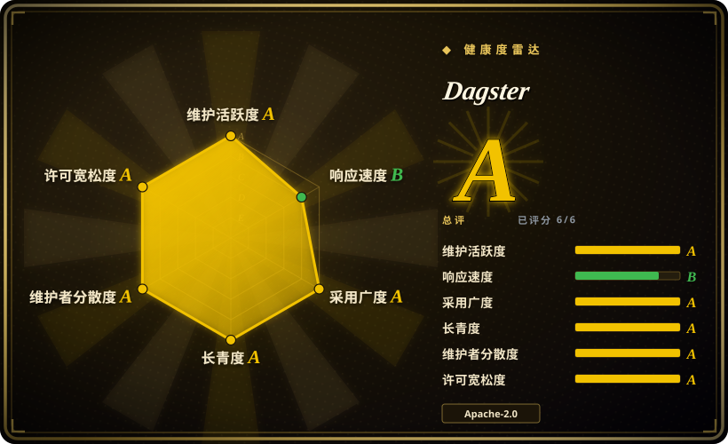
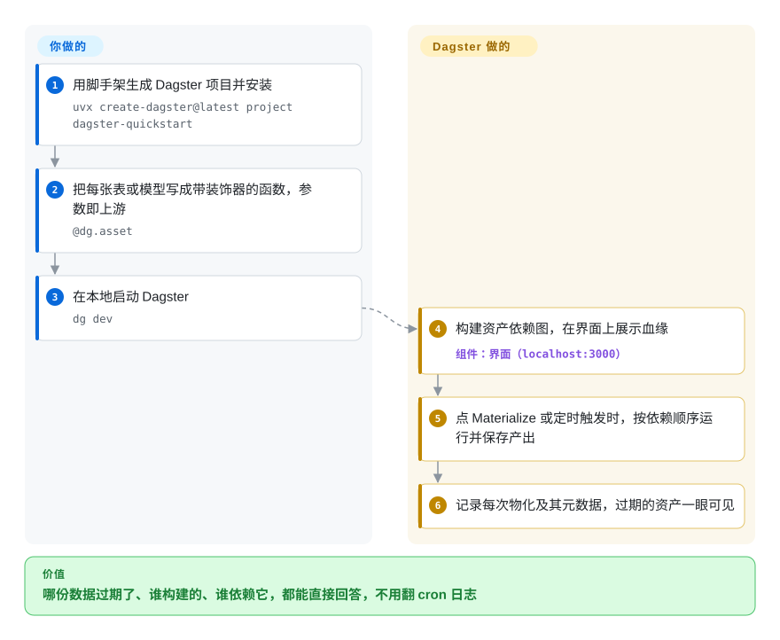

# Dagster

看板上显示的是昨天的数字，可没人说得清是哪张上游表过期了、上次是哪个任务重建的它、改了它还会连带坏掉什么——因为调度器只知道“任务 7 在 02:00 跑过”，不知道它产出了什么数据。Dagster 把单位换了过来：你把每张表、每个文件、每个模型声明成一个 Python 函数（叫“资产”），它从函数参数推出依赖图，并记录每个资产上次在哪次运行里构建、现在是否已经过期。

## 何时使用

你是负责数仓流水线的数据或分析工程师：原始表由 Fivetran 灌进来，dbt 模型做转换，一个 Python 步骤训练预测模型，最后一张报表读取结果。现在它是一组 cron 定时脚本（或者是任务说不清自己写了什么的 Airflow DAG），CFO 一问“营收图怎么还是周二的”，你就只能去翻日志。于是你选 Dagster：每个产出写成一个 `@dg.asset` 函数，参数里写上它要读的资产；dbt 模型通过 `dagster-dbt` 直接导入成资产；网页界面展示整张血缘图，以及每个资产最近一次物化（materialization，即实际构建出来）的元数据和日志。上线前你用 `dg dev` 在本地开发、给资产写单元测试；定时任务或传感器（sensor）只重建过期的部分。

和 [Apache Airflow](airflow.zh.md)、[Prefect](prefect.zh.md) 相比，决定性的取舍是“编排带血缘、可测试的数据资产”对“编排任务”：当团队以表和表的新鲜度来思考时，Dagster 的模型最划算，代价是框架更有主见、算子目录比 Airflow 的 provider 小。和 [Argo Workflows](argo-workflows.zh.md) 相比，Dagster 以 Python 为先、懂数据，但需要运行它自己的常驻服务。

## 怎么用起来

你写普通的 Python 函数，给每个函数加上 `@dg.asset`；函数的返回值*就是*资产（一个 DataFrame、写进数仓的一张表、一个模型文件），在参数里写上另一个资产的名字，就声明了依赖。Dagster 把项目里的“定义”（资产、定时任务、传感器，以及数仓连接这类资源）加载进一个代码服务器，构建依赖图，并在网页界面里展示出来。你点“Materialize”，或者定时任务、传感器触发时，它按依赖顺序规划一次运行，启动一个运行 worker（视配置可以是本地进程、容器或 Kubernetes pod），通过“IO manager”（决定产出写到哪里、再从哪里读回来的可插拔组件）保存每个产出，并把物化事件和元数据记进它自己的数据库。转换代码、资源和运行环境归你；顺序、重试、运行历史、血缘和过期追踪归 Dagster。生产环境里有三个常驻服务：webserver（界面和 GraphQL API）、daemon（定时任务、传感器、运行队列），以及每个项目一个代码位置（code location）服务器；托管版 Dagster+ 可以替你跑前两个。

<!-- flow-steps:begin (generated from flows/dagster.json by tools/flow_card.py — do not edit) -->

流程文字版

1. **你**：用脚手架生成 Dagster 项目并安装 — `uvx create-dagster@latest project dagster-quickstart`
2. **你**：把每张表或模型写成带装饰器的函数，参数即上游 — `@dg.asset`
3. **你**：在本地启动 Dagster — `dg dev`
4. **Dagster**：构建资产依赖图，在界面上展示血缘 — 组件：`界面（localhost:3000）`
5. **Dagster**：点 Materialize 或定时触发时，按依赖顺序运行并保存产出
6. **Dagster**：记录每次物化及其元数据，过期的资产一眼可见

**价值**：哪份数据过期了、谁构建的、谁依赖它，都能直接回答，不用翻 cron 日志

<!-- flow-steps:end -->

## 何时不用

- **你需要面向各种系统的大量现成算子。** Dagster 自带约 70 个集成库（dbt、Snowflake、AWS、Kubernetes 等），但 Airflow 的 provider 生态更广，而且它那种“调用系统 X”的任务不需要任何数据模型。如果你的作业大多是“先调这个 API，再调那个”，用 [Apache Airflow](airflow.zh.md)。
- **你的工作负载是 Kubernetes 上的容器，不涉及数据语义。** 如果每一步都是一个镜像、你也不关心表和血缘，[Argo Workflows](argo-workflows.zh.md) 只靠集群就能跑 pod 组成的 DAG；换成 Dagster 只是多出 webserver、daemon 和代码服务器，收益很小。
- **你需要长期运行、事件驱动的应用流程。** Dagster 是批处理和数据流水线编排器。支付流程、审批，或任何要等几天外部信号的流程，应该交给 [Temporal](temporal.zh.md)。
- **你不付费却要 RBAC、单点登录、审计日志、告警策略或分支部署。** 在 Dagster 文档里这些都是 Dagster+（托管、商业版）的功能；开源 webserver 没有内置登录，自建的人要在前面挂自己的认证代理、自己接告警。如果这些是硬性要求又不打算买 Dagster+，考虑开源 webserver 自带认证和基于角色权限的 [Apache Airflow](airflow.zh.md)。
- **团队只想要概念最少的轻量任务执行器。** 资产、op、job、资源、IO manager、代码位置和 `dg` CLI 加起来，学习曲线是真实存在的。只是“定时跑这些 Python 函数、失败重试”，[Prefect](prefect.zh.md) 要学的东西更少。

## 横向对比

| 替代品 | 是否收录 | 我们的评价 | 取舍 |
|---|---|---|---|
| [Apache Airflow](airflow.zh.md) | 已收录 | 工作主要是定时调用外部系统、provider 目录很重要时，选 Airflow；需要资产血缘、过期追踪和本地测试时，选 Dagster。 | Airflow 算子生态最广、webserver 自带认证；Dagster 显式建模数据资产并能在本地测试，但更有主见、集成更少。 |
| [Prefect](prefect.zh.md) | 已收录 | 只要轻量的 Python 任务流、框架越少越好时，选 Prefect；产出是需要追踪血缘和新鲜度的表和模型时，选 Dagster。 | Prefect 用很少的概念包住现有 Python 代码；Dagster 要你围绕资产重新组织代码，回报是血缘图、资产目录和新鲜度检查。 |
| [Argo Workflows](argo-workflows.zh.md) | 已收录 | 每一步都是 Kubernetes 上的容器、数据语义在别处管理时，选 Argo Workflows；步骤是 Python、数据图本身才是重点时，选 Dagster。 | Argo 只需要集群、与语言无关；Dagster 要运行自己的 webserver/daemon/代码服务器，但理解资产。 |
| [Temporal](temporal.zh.md) | 已收录 | 持久运行、由信号驱动的业务流程选 Temporal；定时运行的数据流水线选 Dagster。 | Temporal 保证代码在故障中跨天持续执行；Dagster 调度批量物化并追踪数据，不管长期存活的应用状态。 |
| dbt Core | 未收录 | 整条流水线都是同一个数仓里的 SQL 时，单用 dbt Core；dbt 模型夹在 Python 采集、机器学习和报表步骤之间时，再加上 Dagster。 | 单用 dbt 不需要编排器，但只看得到 SQL 模型；Dagster 把 dbt 模型导入为资产，和前后的步骤一起编排。 |

## 技术栈

- **语言：** Python（据 PyPI 元数据，1.13.25 支持 3.10 到 3.14）；界面用 TypeScript/React（`js_modules/`）。
- **核心包：** `dagster`（框架）、`dagster-webserver`（界面，GraphQL API 由 `dagster-graphql` 提供）、`dagster-dg-cli`（`dg` 项目命令行）、`create-dagster`（脚手架）、`dagster-pipes`（运行外部进程并回报结果）。
- **集成：** `python_modules/libraries` 下约 70 个包——比如 `dagster-dbt`、`dagster-snowflake`、`dagster-aws`、`dagster-k8s`、`dagster-postgres`、`dagster-celery`、`dagster-airlift`（从 Airflow 迁移）。
- **存储：** 运行、事件、定时任务的存储默认是 SQLite；生产用 Postgres（或 MySQL）存储。
- **执行：** 可插拔的 run launcher 和 executor——本地进程、Docker、Kubernetes、Celery、ECS。

## 依赖

- **运行时：** Python 和你项目自己的包；本地用 `dg dev` 在一台机器上提供界面，存储用默认的 SQLite。
- **生产服务：** `dagster-webserver`、`dagster-daemon`（只支持一个副本），以及每个项目一个代码位置服务器。
- **数据库：** 生产数据库（通常是 Postgres），存运行、事件日志和定时任务；默认的 SQLite 只适合本地。
- **计算资源：** 运行在哪里启动就依赖哪里——同一台机器、Docker、Kubernetes 集群（官方 Helm chart）或 ECS。
- **可选：** 用 Dagster+（托管控制面，serverless 或 hybrid agent）代替自己运行 webserver 和 daemon。

## 运维难度

**中等。** 本地开发很轻松（`dg dev`、SQLite、一台机器）。自建生产环境则要运行 webserver、单个 daemon、代码位置服务器、一个 Postgres 数据库和一个 run launcher（常见做法是在 Kubernetes 上用 Helm chart），还要跟上很快的发版节奏——1.13.x 补丁版大约每周一个——并自己在界面前加认证。Dagster+ 能替你省掉控制面这一半，代价是订阅费，以及把元数据发到托管服务。

## 健康度与可持续性

- **维护（2026-10）：** 非常活跃——最近一个季度每周都有提交，1.13.x 大约每周发一版（2026-10-01 发布 1.13.25）。未归档。
- **治理：** 归 Dagster Labs 所有，这家公司销售 Dagster+；贡献者基础广——近 12 个月有 89 位活跃维护者，头号贡献者约占 31% 的提交——日常层面的总线因子不错，但路线图由一家厂商决定。
- **年龄 / Lindy：** 2018-04 创建，约 8 年，仍在稳定的 1.x 线上——Lindy 先验扎实，只是比 Airflow 年轻。
- **采纳度：** 近一个月 PyPI 下载 7,886,605 次（评分器快照），在数据编排器里很强。
- **响应速度：** 新 issue 首次响应的中位数 68.9 小时（B，2026-10-09），比它的提交节奏慢；未关闭 issue 2500 多个。
- **风险信号：** Apache-2.0，无改许可历史；开放核心（open-core）的划分——文档里告警、Insights、RBAC/单点登录、分支部署都只在 Dagster+ 提供——是要盯的地方，看会不会有更多功能挪到付费那一侧。

## 存疑（未验证）

- [推断] 开源 webserver 没有内置认证——依据是认证/RBAC 文档只出现在 Dagster+ 部分，没有在实际运行的实例上验证。
- [未验证] README 仍写着支持 Python 3.9–3.14，而 1.13.25 的 PyPI 元数据要求 ≥3.10；本页采用 PyPI 的值。
- [推断] “约 70 个集成库”是数 `python_modules/libraries` 下的目录得出的，其中包含少量非集成的辅助包。
- [未验证] 本次对比没有重新核实 Airflow 开源 webserver 的认证和 RBAC。
- [未验证] dbt Core 的定位来自对该项目的一般了解，本页没有重读它的仓库。
