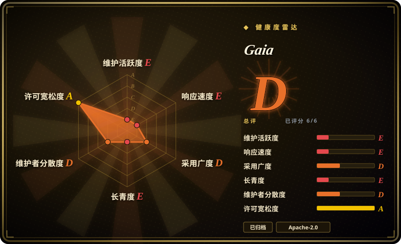
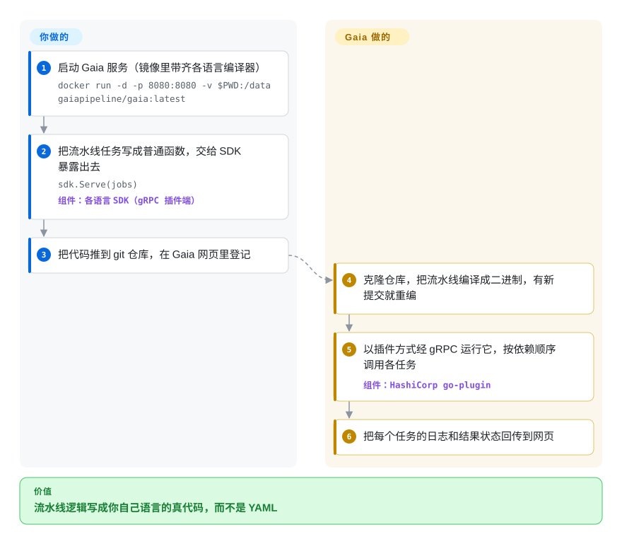

# Gaia

一个自动化/流水线平台，让你用任意编程语言（Go、Python、Java、C++……）构建流水线——把你的代码编译成插件来执行——**现已归档，不再维护**。

## 何时使用

说实话，2026 年你基本*不该*用——仓库已归档。但它历史上的定位是这样：你是平台工程师，想要 CI/CD 风格或通用的自动化流水线，又厌倦了用 YAML 或某种专有 DSL 表达流水线逻辑。Gaia 的卖点是：你用**自己语言写真正的代码**作为流水线 job，针对它的 SDK 编译，Gaia 通过 HashiCorp 的 `go-plugin`（gRPC）机制把它们当插件运行，从而免学新工作流语言就拥有 Web UI、调度、密钥和运行历史。如果你已有一堆 Go/Python 自动化代码，又想要一个服务器来编排并可视化它，Gaia 让你把逻辑留在代码里。

如今这只是一份*只读参考*：若你在研究“流水线即编译插件”这种设计，或评估是否要 fork 它，可以拿来研读，但不该被选来做新的生产工作——见“何时不用”。

## 怎么用起来

Gaia 把任何会说 gRPC 的程序变成一条流水线。**你来写**普通函数（叫“job”），语言可以是 Go、Python、Java、C++、Ruby 或 Node.js，把它们放进一个列表交给该语言 SDK 的 `Serve` 调用——SDK 实现了插件接口，让你的程序能经 gRPC（跑在 HTTP/2 上的二进制远程调用协议）和 Gaia 对话。**剩下的 Gaia 来做**：克隆你的 git 仓库，把流水线编译成可执行文件（开了轮询或 webhook 时，有新提交就重编），通过 HashiCorp 的 go-plugin（Terraform、Vault 用的同一套插件机制）把它作为独立进程的插件启动，按 `DependsOn` 声明的依赖顺序调用各个 job，再把日志和结果回传到网页；状态存在内嵌的 boltDB 文件里，不需要外部数据库。不过这些都已是历史：仓库已归档，归档说明直接让用户去用 Dagger。

<!-- flow-steps:begin (generated from flows/gaia.json by tools/flow_card.py — do not edit) -->

流程文字版

1. **你**：启动 Gaia 服务（镜像里带齐各语言编译器） — `docker run -d -p 8080:8080 -v $PWD:/data gaiapipeline/gaia:latest`
2. **你**：把流水线任务写成普通函数，交给 SDK 暴露出去 — `sdk.Serve(jobs)` — 组件：`各语言 SDK（gRPC 插件端）`
3. **你**：把代码推到 git 仓库，在 Gaia 网页里登记
4. **Gaia**：克隆仓库，把流水线编译成二进制，有新提交就重编
5. **Gaia**：以插件方式经 gRPC 运行它，按依赖顺序调用各任务 — 组件：`HashiCorp go-plugin`
6. **Gaia**：把每个任务的日志和结果状态回传到网页

**价值**：流水线逻辑写成你自己语言的真代码，而不是 YAML

<!-- flow-steps:end -->

## 何时不用

- **任何新的生产部署。** 仓库已**归档**（只读），最后一次发布是 2022-01 的 v0.2.9——没有安全补丁、没有 bug 修复、没有路线图。当作已废弃；它自己的归档说明也让用户改用 Dagger。[推断]
- **你需要一个仍在活跃治理的编排器。** 要定时 DAG 和活的生态，[Apache Airflow](airflow.zh.md)、Dagster 或 Prefect 都是有社区支撑、仍在维护的替代品。
- **你想要低摩擦的声明式流水线。** Gaia 要求把 job 针对其 SDK 编译成插件——比在 CI 系统（GitHub Actions、GitLab CI、Argo Workflows）里写 YAML 更重。
- **你承担不起 fork/维护风险。** 采用一个已归档项目意味着*你*得负责今后所有补丁；只有在想清楚并有 fork 计划时才这么做。
- **你需要它至少达到 pre-1.0 的成熟度。** 它从未到 1.0（最后 tag 为 v0.2.9），停在仍明确属于 pre-stable 的阶段。

## 横向对比

| 替代品 | 是否收录 | 我们的评价 | 取舍 |
|---|---|---|---|
| [Apache Airflow](airflow.zh.md) | ✅ | 新的 DAG 调度工作选 Airflow；Gaia 只适合作为已归档的编译插件设计参考。 | 成熟、仍在活跃维护的 DAG 调度器，生态庞大；是 Python-DAG 模型而非编译插件 job，且未归档——新工作的稳妥默认。 |
| [Argo Workflows](argo-workflows.zh.md) | ✅ | Kubernetes 原生、每步一容器的 YAML 工作流比 Gaia 的插件服务器模型更合适时，选 Argo Workflows。 | Kubernetes 原生、每步一容器的工作流；活跃维护、声明式 YAML，没有“用任意语言把 job 写成插件”的模型。 |
| [Dagster](dagster.zh.md) / [Prefect](prefect.zh.md) | ✅ | 需要维护中的 Python-first 编排时，选 Dagster 或 Prefect，不要接手归档 Gaia fork。 | 现代 Python 优先的编排，开发活跃且有 SaaS 选项；编程模型不同但有人维护——优先于一个已归档项目。 |
| Dagger | 未收录 | 想要 Gaia 当年承诺的东西——用通用编程语言把流水线写成代码——又要项目还活着时，选 Dagger；Gaia 的归档说明点名它作为替代。 | 也是通过各语言 SDK 把流水线写成代码，但每一步在容器里跑，而不是在 Gaia 服务器上跑编译好的 go-plugin 二进制；执行模型不同，但仍在维护。 |
| Jenkins | 未收录 | 问题是带庞大插件生态的 CI/CD，而不是 Gaia 式通用工作流插件时，选 Jenkins。 | 老牌但仍在维护的 CI/CD 服务器，插件生态庞大；用 Groovy/声明式 pipeline 而非编译代码插件。 |
| GitHub Actions / GitLab CI | 未收录 | 绑定 VCS 的托管 YAML pipeline 比自托管流水线服务器更重要时，选托管 CI。 | 托管、YAML 驱动、绑定你 VCS 的 CI/CD；比自托管一台流水线服务器的搭建摩擦低得多。 |

## 技术栈

- **语言：** 服务器/核心用 Go；流水线 *job* 用 Go、Python、Java、C++ 等编写并编译成插件。
- **插件机制：** HashiCorp 的 `go-plugin`，走 gRPC——每条流水线作为 Gaia 服务器调用的进程外插件运行。
- **接口：** Web UI（基于 Vue 的前端）加后端 API，用于触发、查看运行、调度和密钥。
- **持久化：** 内嵌存储保存流水线元数据/运行历史（基础安装无需外部数据库）。

## 依赖

- **运行时：** Gaia 服务器二进制（Go），加上你写流水线 job 所用语言的工具链/SDK（如编译 Go 流水线要 Go）。
- **部署单元：** 单个服务器进程；历史上以 Docker 镜像发布。
- **基础安装严格来说无需外部服务**（元数据放在内嵌存储里），但真实部署仍会想在前面放反向代理/鉴权。

## 运维难度

**中——且主导因素是废弃风险，而非首日搭建。** 拉起它只是一个服务器二进制或 Docker 镜像，很简单；运维分量在于你将在跑**无人维护的软件**：没有上游安全补丁、没有依赖更新，你遇到的任何 bug 都得自己在 fork 里修。编译插件模型还意味着你的运维要为每个流水线 job 包含一个构建步骤，并按语言管理 SDK/工具链。对*新*部署而言，诚实的难度是“高”，因为真正的成本是你继承的维护，而非安装本身。[推断]

## 健康度与可持续性

- **响应速度**：Grade E。
- **维护（2026-06）。** **已归档**——仓库只读。最后发布 v0.2.9 在 2022-01；最后 push 2026-01 与归档/收尾动作相符，而非活跃开发。就实践而言**已废弃**。[推断]
- **治理 / bus factor。** 曾归于 `gaia-pipeline` 组织，但由一个小核心（michelvocks、Skarlso）驱动；项目归档后，实质上**没有活跃维护者或路线图**。[推断]
- **年龄与 Lindy 判断。** 2017-12 创建（约 8 年）但**已归档**⇒ Lindy **不成立**：没有持续活跃的年龄是负面信号，而非正面。一个久弃项目越发*不*值得押注。[推断]
- **采用度。** 约 5.2k star 反映的是过去的关注，但 star 是历史数据，不代表当前用户；自 2022 无发布且带归档标记，可认为社区已转移。[未验证]
- **风险标记。** 归档状态是主导风险。Apache-2.0 许可宽松（允许 fork），但采用即意味着自负今后所有维护。[推断]

## 存疑（未验证）

- [未验证] 据 GitHub 元数据仓库已归档；截至 2026-06 约 5.2k star，最后发布 v0.2.9（2022-01）——数字对时间敏感。
- [推断] “归档=废弃”是由 GitHub 归档标记 + 自 2022 无发布推断；不保证有维护者回归，也不暗示会。
- [未验证] 内部架构（HashiCorp `go-plugin`/gRPC、Vue 前端、内嵌元数据存储）取自项目历史 README/文档，未对当前源码重新核实。
- [未验证] 支持的流水线语言与确切 SDK 面取自项目宣传；做任何 fork 决策前请对照（已冻结的）源码核实。
- [未验证] Dagger 的“每步一个容器”模型和维护状态来自通用认知，本次没有读它的仓库；只读到了归档说明里指向 dagger.io 的那句话（2026-10-08）。
